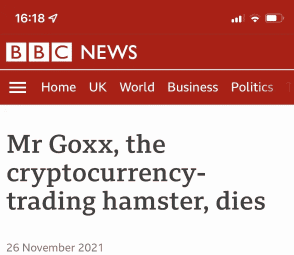
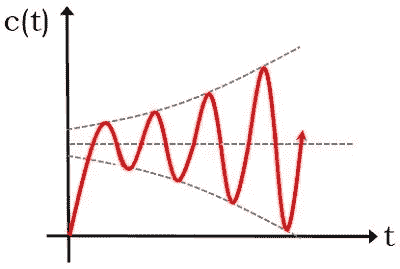
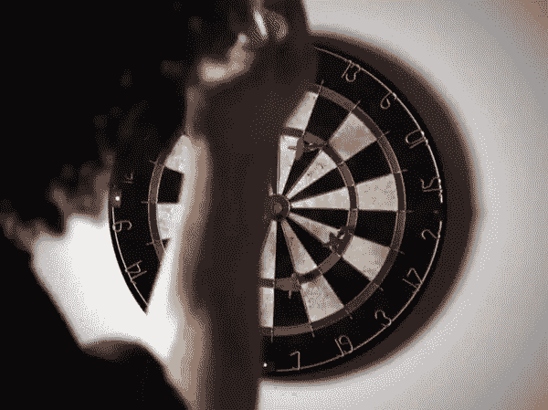
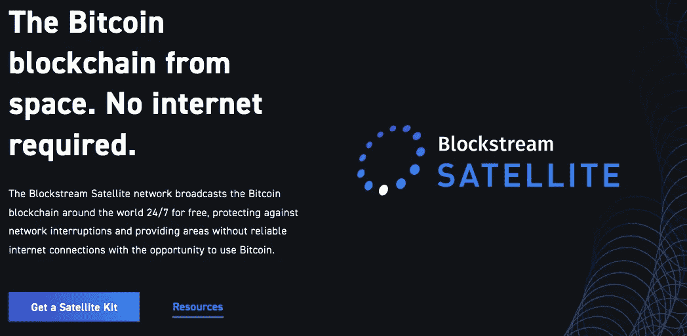

# 比特币系统工程师指南

> 原文：<https://medium.com/coinmonks/a-systems-engineers-guide-to-bitcoin-e8058f1e3597?source=collection_archive---------20----------------------->

我是一名系统工程师。我从事价值数十亿美元的航空航天和基础设施项目。在这个规模上，我们正在考虑广泛的系统性变化。就像在波涛汹涌的大海中，军舰船体的弯曲如何使其雷达碟形天线向导弹靠近几毫米，从而在两者之间产生对准误差，这可能导致其武器系统错过目标。蝴蝶效应的东西。但现在，我认为世界上最大的系统性变化正在区块链科技领域发生。

在我之前的文章中，我概述了区块链是一种全新的财产所有权方式，打破了 5000 年的现状。我认为*这是*真正的宏观变化，但如果我不把我的系统工程的眼睛转向先锋，那我就失职了。所以现在开始:

A tongue-in-cheek “advert” for the Bitcoin subreddit from 2013

神奇的互联网货币。

[贝德福德足球俱乐部(Bedford FC)被数百万比特币收购](https://www.bedfordshirelive.co.uk/news/bedfordshire-news/bitcoin-investor-peter-mccormack-announces-6367920)，成为首个“比特币标准”的足球俱乐部。[比特币是萨尔瓦多的国家货币](https://en.wikipedia.org/wiki/El_Salvador#Presidency_of_Nayib_Bukele_since_2019)，与美元并列。正如我们所说，它正在太空中被开采。职业运动员在其中获得报酬。一个仓鼠投资者的表现超过了沃伦巴菲特，尽管公平地说，巴菲特现在已经比仓鼠活得长。

迈克尔·塞勒(前航空航天系统工程师，现在是比特币的最大持有者之一)指出，虽然互联网创造了像社交媒体这样的创新业务，但它的破坏性力量很大程度上来自于现有事物的数字化。从地图到歌曲到视频，这些在互联网出现之前就已经存在了，但是在将它们传输给用户的过程中存在很大程度的摩擦、不灵活和费用。互联网允许这些都被数字化，无休止地复制，并在一个全球标准的网络上免费提供给用户。

地图自古以来就存在了。我记得我爸的 A-Z 道路地图集，塞在我们家车的杂物箱里。他必须去商店付钱才能买到它，而且它体积庞大，很快就过时了。

谷歌真正做的只是将地图数字化，但它让地图变得更加有用。Spotify，Youtube，Kindle，都是一样的故事。旧思想，数字传输。

这个领域还没有发生，那就是钱。当然，我们有网上购物和银行服务。但是这些仍然在一个受信任的中央政党的旧的模拟系统上运行，在计算机上模拟。人们相信银行会保持交易和持有的诚实记录。没有任何东西可以阻止你的银行篡改你的余额。是政府当局起诉的威胁让他们保持诚实。[老实人](https://www.theguardian.com/business/2021/dec/17/hsbc-fined-64m-failures-anti-laundering-fca)。

我们当中的工程师和物理学家会认为这是一个自然不稳定的系统。就像一个尾部朝前的飞镖，它往往会脱离初始状态，而没有持续的纠正措施，在这种情况下，这是由监管机构(警方、法院系统、FCO 法规、严重欺诈办公室等)的压力提供的。

是的，旧的银行基础设施已经数字化，但英镑本身还没有。你银行的应用程序是数字的，它背后的钱是模拟的。

区块链是一个自然稳定的系统(就像一个正确投掷的飞镖)，即使面对不稳定的力量，它也会回到稳定的轨道。分散的性质和加密意味着它实际上不可能被黑客攻击、控制或禁止。适当的会计被纳入简单的代码，它不需要第三方的干预，监管或执行。

关于加密的话题，这个东西是*强*。宇宙中有多少原子，就有多少 256 位加密密钥组合。对密钥的强力攻击比超新星释放的能量要多得多，需要几万亿年。这种加密理论上是抗量子的。

任何没收硬件的计划似乎都不可行。从北极圈到近地轨道，从德克萨斯州到朝鲜，每一件比特币硬件都必须被查封。一部仍在运行节点的 iPhone 足以让比特币生存下去。

That’s one small step for man…

在所谓的“51%攻击”中劫持网络需要有人获得足够的硬件和能量来压倒现有的全球网络，这被认为超出了北约等国家集团的能力。

所以比特币是真正意义上的数字化货币。原生数字货币。

现在，我不是一个向所有人推荐比特币的人，我也不确定比特币会继续升值，甚至会继续存在。比特币可能会失败，或者像 Napster 或 MySpace 等其他先驱一样，被更好的竞争对手超越。但总体而言，加密货币是一种全新的、自给自足的数字货币形式，我们以前从未见过这样的东西。

因此，如果我们越过所有的炒作和点击诱饵标题，我们可以看到比特币是我们文明的系统性变化。不仅仅是一个迷因。

> 加入 Coinmonks [电报频道](https://t.me/coincodecap)和 [Youtube 频道](https://www.youtube.com/c/coinmonks/videos)了解加密交易和投资

## 另外，阅读

*   [3 商业评论](/coinmonks/3commas-review-an-excellent-crypto-trading-bot-2020-1313a58bec92) | [Pionex 评论](https://coincodecap.com/pionex-review-exchange-with-crypto-trading-bot) | [Coinrule 评论](/coinmonks/coinrule-review-2021-a-beginner-friendly-crypto-trading-bot-daf0504848ba)
*   [莱杰 vs n rave](/coinmonks/ledger-vs-ngrave-zero-7e40f0c1d694)|[莱杰 nano s vs x](/coinmonks/ledger-nano-s-vs-x-battery-hardware-price-storage-59a6663fe3b0) | [币安评论](/coinmonks/binance-review-ee10d3bf3b6e)
*   [Bookmap 评论](https://coincodecap.com/bookmap-review-2021-best-trading-software) | [美国 5 大最佳加密交易所](https://coincodecap.com/crypto-exchange-usa)
*   [如何在 FTX 交易所交易期货](https://coincodecap.com/ftx-futures-trading) | [OKEx vs 币安](https://coincodecap.com/okex-vs-binance)
*   [CoinLoan 评论](https://coincodecap.com/coinloan-review) | [YouHodler 评论](/coinmonks/youhodler-4-easy-ways-to-make-money-98969b9689f2) | [BlockFi 评论](https://coincodecap.com/blockfi-review)
*   [XT.COM 评论](https://coincodecap.com/profittradingapp-for-binance) | [币安评论](https://coincodecap.com/xt-com-review)
*   [SmithBot 评论](https://coincodecap.com/smithbot-review) | [4 款最佳免费开源交易机器人](https://coincodecap.com/free-open-source-trading-bots)
*   [比特币基地僵尸程序](/coinmonks/coinbase-bots-ac6359e897f3) | [AscendEX 审查](/coinmonks/ascendex-review-53e829cf75fa) | [OKEx 交易僵尸程序](/coinmonks/okex-trading-bots-234920f61e60)
*   [如何在印度购买比特币？](/coinmonks/buy-bitcoin-in-india-feb50ddfef94) | [WazirX 评论](/coinmonks/wazirx-review-5c811b074f5b)
*   [CryptoHopper 替代品](/coinmonks/cryptohopper-alternatives-d67287b16d27) | [HitBTC 审查](/coinmonks/hitbtc-review-c5143c5d53c2)
*   [CBET 评论](https://coincodecap.com/cbet-casino-review) | [库科恩 vs 比特币基地](https://coincodecap.com/kucoin-vs-coinbase)
*   [折叠 App 审核](https://coincodecap.com/fold-app-review) | [Kucoin 交易机器人](/coinmonks/kucoin-trading-bot-automate-your-trades-8cf0ca2138e0) | [Probit 审核](https://coincodecap.com/probit-review)
*   [如何匿名购买比特币](https://coincodecap.com/buy-bitcoin-anonymously) | [比特币现金钱包](https://coincodecap.com/bitcoin-cash-wallets)
*   [币安 vs FTX](https://coincodecap.com/binance-vs-ftx) | [最佳(SOL)索拉纳钱包](https://coincodecap.com/solana-wallets)
*   [比诺莫评论](https://coincodecap.com/binomo-review) | [斯多葛派 vs 3Commas vs TradeSanta](https://coincodecap.com/stoic-vs-3commas-vs-tradesanta)
*   [Capital.com 评论](https://coincodecap.com/capital-com-review) | [香港的加密借贷平台](https://coincodecap.com/crypto-lending-hong-kong)
*   [如何在 Uniswap 上交换加密？](https://coincodecap.com/swap-crypto-on-uniswap) | [A-Ads 评论](https://coincodecap.com/a-ads-review)
*   [WazirX vs coin dcx vs bit bns](/coinmonks/wazirx-vs-coindcx-vs-bitbns-149f4f19a2f1)|[block fi vs coin loan vs Nexo](/coinmonks/blockfi-vs-coinloan-vs-nexo-cb624635230d)
*   [本地比特币审核](/coinmonks/localbitcoins-review-6cc001c6ed56) | [加密货币储蓄账户](https://coincodecap.com/cryptocurrency-savings-accounts)