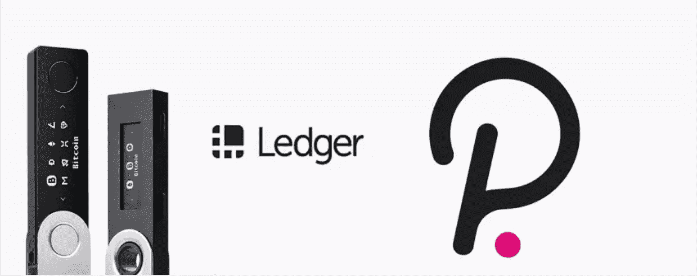

# 两个钱包的故事，Ledger Live 和 Polkadot.js

> 原文：<https://medium.com/coinmonks/a-tale-of-2-wallets-ledger-live-and-polkadot-js-a2da6625e4de?source=collection_archive---------12----------------------->

~dwulf

我在聚会上遇到的一个问题

我已经在莱杰直播上下注了。还可以在 polkadot.js 上选择不同的帐户作为我的控制器帐户吗？

就这一点而言，只要两者使用的种子短语相同，那么，出于所有实际目的，它就是完全相同的帐户。使用实际的硬件分类帐更安全，因为种子短语永远不会离开硬件钱包。

比方说，如果你用一台装有键盘记录器或恶意软件的电脑将种子短语输入 polkadot.js，你就有可能破坏它。然而，如果你用一个分类帐登录，种子短语即使在有恶意软件的设备上也不会暴露。稍微加强安全性，减少对您的钥匙的攻击和危害。

使用 Ledger Live 或 polkadot.js 的区别类似于从浏览器或移动应用程序登录 Twitter。这是同一个账户，你只是用不同的界面与之互动。

使用相同的两个界面来处理相同的事情，同样值得注意的是，在这个例子中，polka.js 提供了所有可用的功能，而 Ledger Live 只允许部分功能，尽管界面更加灵活和用户友好。可以说，在 Ledger Live 上下注更容易，但他们不支持众筹贷款。

理想情况下，你可以使用你的分类账冷钱包作为“隐藏”钱包账户，使用 polkadot.js 浏览器钱包作为你的“控制者”,以提名者的身份下注。你的“隐藏”和“控制者”钱包账户都可以通过 polkadot.js 来管理。

您可以在 polkadot.js 中更改您的控制器帐户，而无需在网络->帐户操作->下取消绑定，然后单击浏览器窗口右侧“停止”旁边的三个点，然后单击“更改控制器帐户”。实际上，建议您不时地更改您的控制器帐户。

## **存储和控制器**

 [## 波尔卡多特密钥波尔卡多特维基

### 公钥和私钥是大多数加密系统的一个重要方面，也是实现…

维基百科](https://wiki.polkadot.network/docs/learn-keys#controller-and-stash-keys) 

## **“控制器”和“存储”键**

当我们谈论“controller”和“stash”键时，我们通常在运行验证器或命名点的上下文中谈论它们，但是它们是对所有用户都有用的概念。这两种密钥都是帐户密钥的类型。它们的区别在于它们的预期用途，而不是潜在的加密差异。所有提到的信息都适用于这些键。当创建新的控制器或隐藏密钥时，帐户密钥支持的所有加密都是可用的选项。

控制器密钥是一个半在线密钥，将由用户直接控制，用于提交手动外部文件。对于验证器或提名器，这意味着控制器键将用于开始或停止验证或提名。控制键应该持有一些点，以支付费用，但他们不应该用来持有巨额款项或生活储蓄。既然会相对频繁的接触网络，就要小心对待，偶尔更换新的。

在大多数情况下，隐藏密钥是一个冷钱包，存在于保险箱中的一张纸上，或者受到硬件安全层的保护。它应该很少(如果有的话)暴露在互联网上或用于提交外部信息。隐藏密钥旨在保存大量资金。它应该被认为是银行的一个储蓄账户，理想情况下只有在紧急情况下才能动用。或者，也许更贴切的比喻是把它想象成埋藏的宝藏，藏在某个随机的小岛上，只有最初藏它的海盗知道。

因为 stash key 是离线保存的，所以必须将其资金绑定到特定的控制器。对于非支出行为，控制者拥有其背后隐藏的资金。例如，在提名、下注或投票时，控制者可以用赌注的重量来表示其偏好。它将永远无法实际移动或要求隐藏密钥中的资金。但是，如果有人获得了您的控制器密钥，他们可能会使用它来进行恶意行为，因此您仍然应该保护它并定期更改它。

## **结论**

创建 polkadot.js 原生钱包时，不要忙于创建 2 个钱包。隐藏和控制器携手合作，为您的安全，这是由设计。相比之下，Cardano，ADA 只指导你创建 1 个钱包，而 Cosmos，Keplr 钱包创建 1 个钱包，但让你轻松下注并立即获得奖励，大约 14%的原子钱包只给 10%，所以自我保管钱包给你最好的切割。

> 加入 Coinmonks [电报频道](https://t.me/coincodecap)和 [Youtube 频道](https://www.youtube.com/c/coinmonks/videos)了解加密交易和投资

## 也阅读

 [## 杠杆代币[多头代币]终极指南

### 杠杆化令牌是具有杠杆化风险敞口的 ERC20 令牌，不考虑保证金、要求、管理…

medium.com](/coinmonks/leveraged-token-3f5257808b22)  [## 最佳加密交易所| 2021 年十大加密货币交易所

### 编辑描述

blog.coincodecap.com](https://blog.coincodecap.com/crypto-exchange)  [## 2021 年最佳加密交换平台| CoinCodeCap

### 编辑描述

blog.coincodecap.com](https://blog.coincodecap.com/best-swap-platforms)  [## 10 大最佳网上赌场[2021] |赢取免费 BTC | CoinCodeCap

### 编辑描述

blog.coincodecap.com](https://blog.coincodecap.com/best-online-casinos)  [## 2021 年最佳加密借贷平台| 6 大比特币借贷平台

### 获得比特币和其他加密货币的最佳贷款利率

medium.com](/coinmonks/top-5-crypto-lending-platforms-in-2020-that-you-need-to-know-a1b675cec3fa)  [## 2021 年 6 大最佳硬件钱包|顶级加密硬件钱包[更新]

### 最好的加密货币硬件钱包是绝对必要的。我们将在 NGRAVE、Ledger Nano X 和…

medium.com](/coinmonks/the-best-cryptocurrency-hardware-wallets-of-2020-e28b1c124069)  [## 2021 年最佳免费加密交易机器人

### 2021 年币安、比特币基地、库币和其他密码交易所的最佳密码交易机器人。四进制，位间隙…

medium.com](/coinmonks/crypto-trading-bot-c2ffce8acb2a)