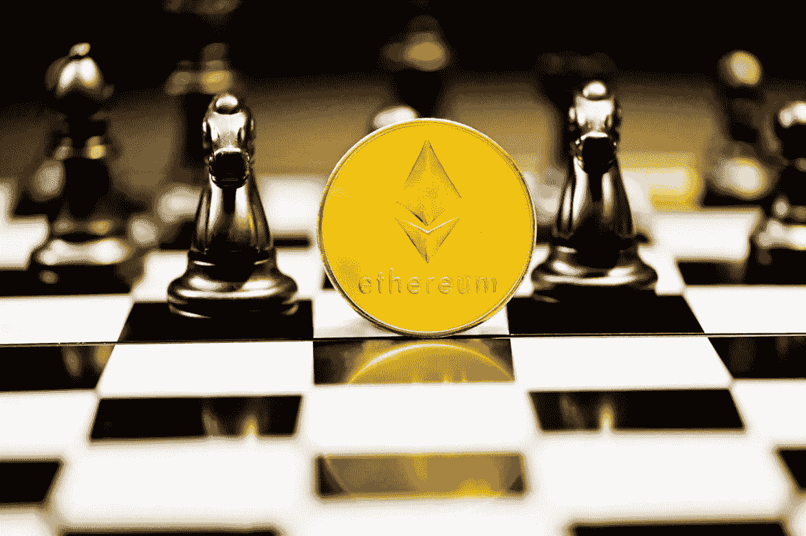

# 一位比特币基地高管调侃 2022 年以太坊大踏步前进

> 原文：<https://medium.com/coinmonks/a-top-coinbase-executive-teases-major-ethereum-strides-in-2022-17f1b7347f73?source=collection_archive---------8----------------------->

Image via [Unsplash.com- Executium](https://images.unsplash.com/photo-1630048421806-adaffaf3f44a?ixlib=rb-1.2.1&ixid=MnwxMjA3fDB8MHxwaG90by1wYWdlfHx8fGVufDB8fHx8&auto=format&fit=crop&w=1172&q=80)

## 据一个交易平台的大人物称，第二大加密公司准备在未来一年进行大动作

2021 年以太坊(ETH) 经历了非常大的一年，[从 1 月 1 日的 737 美元涨到了过去一周的新年前夜的 3700 多美元。除了令人兴奋的价格波动…](https://finance.yahoo.com/quote/ETH-USD/history?period1=1609372800&period2=1641168000&interval=1d&filter=history&frequency=1d&includeAdjustedClose=true)