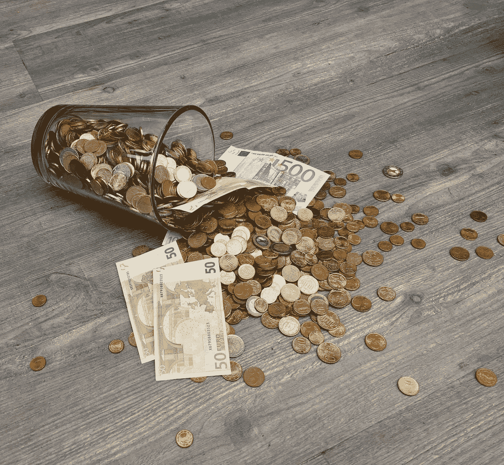

# 一只顶级 TSX 红利成长股给了我 1487 美元的被动收入

> 原文：<https://medium.com/coinmonks/a-top-tsx-dividend-and-growth-stock-gave-me-1-487-in-passive-income-65be64c8c392?source=collection_archive---------22----------------------->

## Motley Fool 的投资者可能已经基本放弃了寻找成长型股票。现在，它可能看起来非常危险，就像 TSX 没有任何好的机会或任何东西可以立即提供。

