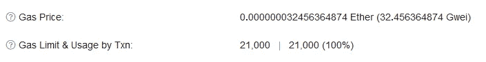

# 真正的初学者指南——以太坊(下)

> 原文：<https://medium.com/coinmonks/a-truly-beginners-guide-ethereum-part-2-39aa1553ba0?source=collection_archive---------48----------------------->

## 煤气煤气煤气。

Photo by [fabio](https://unsplash.com/@fabioha?utm_source=medium&utm_medium=referral) on [Unsplash](https://unsplash.com?utm_source=medium&utm_medium=referral)

在上一部分，我解释了比特币和以太坊的两个主要区别。首先，以太坊使用账户，而不是强迫我们记录个人交易。第二，以太坊允许我们上传整个程序，称为智能合约。在这一部分中，我们将仔细研究智能合约，它们实际存在于何处，以及它们带来的问题。

第一部分可以在这里找到。

# 智能合同

如果你想下载一个像视频游戏或微软 Word 这样的程序，你必须去一个网站，下载，然后安装。只有在完成这些步骤后，你才能使用这个程序。我已经告诉过你程序现在可以存在于以太坊区块链上，但这不意味着*有人*必须下载、安装并运行它吗？是的，事实上*很多人都这样做。*

在我的比特币系列中，我解释了什么是“矿工”。本质上，他们是核实交易是否被允许发生的志愿者，并通过获得少量比特币来获得报酬。我没提到的是，这些矿工彼此都不信任。这不是什么遥远世仇的结果，而是有意为之。基本思想是这样的:如果某个陌生人对交易的有效性说了实话，那么我应该能够对我自己的数据版本执行与他们相同的检查，并得到相同的结果。这就是每个矿工所做的，他们每个人都有自己版本的交易清单(区块链),当有人想进行新的交易时，他们会独立地核实所有交易。如果每个矿工都有相同的记录，没有人撒谎，每个人都会有相同的结果。

对于比特币，我们只跟踪交易，这是相对轻量级的。即便如此，[比特币区块链目前的规模相当大](https://ycharts.com/indicators/bitcoin_blockchain_size)。这意味着每个矿工在开始工作前都要下载整个历史。回到以太坊，在那里我们不再只是跟踪交易，我们面对的现实是，下载整个区块链意味着下载所有程序。当你制作一个程序并上传到以太坊区块链时，每个矿工都会下载它。当每个月的第一天到来时，每个矿工都会运行你的津贴计划。这个孩子只能得到一次报酬，但是每个矿工都会独立管理它，这样他们就可以就它的用途达成一致。

Photo by [Khamkéo Vilaysing](https://unsplash.com/@mahkeo?utm_source=medium&utm_medium=referral) on [Unsplash](https://unsplash.com?utm_source=medium&utm_medium=referral)

## 气体

虽然我们假设的津贴智能合同非常轻量级和简单，但没有什么可以阻止人们创建一个真正庞大的程序。即使没有编程经验，显而易见的是，程序越大，矿工无论何时运行都要做越多的工作。这意味着一个真实的人，用一台真实的电脑，每次你让电脑运行这个庞大的程序时，他都要支付电费，忍受电脑的磨损。

以太坊的创造者们提前知道了这种风险，创造了一种叫做**气体**的东西。以太坊矿工，就像比特币矿工一样，通过处理交易获得固定金额的以太。然而，对矿工来说，我给朋友发几个以太要比让矿工运行这个前面提到的庞大程序容易得多。那么，在这种情况下，矿工应该得到更多的报酬，而导致工作量增加的个人应该为此买单，这就说得通了。这就是气体。

(实际上还有一个更大的风险，叫做停机问题。我以后会写一篇关于这个的文章，但是这个系列太专业了。可以这么说，如果没有天然气，停机问题会让整个以太坊区块链立即关闭。)

作为类比，让我们考虑一个场景，我们想卖一辆车，但我们不能实际交付汽车。如果你能送货上门，300 英里外的人愿意购买。你在网上发现一个陌生人已经在走这条路，只要你付给他们 200 美元，外加所有的油钱，他就愿意走这条路。在这个例子中，我们不想向任何人支付超过约定金额的费用。这意味着我们不想为交付后留在油箱里的*任何*气体买单。买家同意测量油箱里剩余的油量，并把油箱里的油还给你。

这个类比中的气体与以太气的工作原理非常相似。我们要求一个矿工运行我们的程序(交付我们的汽车)。以太网上的每个请求都有一个预定义的“距离”,用气体单位来衡量。例如，一个简单的交易，我送一些乙醚给一个朋友，花费 21，000 个气体单位。将一个程序上传到区块链至少要花费 30，000 个气体单位，但根据程序的大小，费用可能会更高。回到我们的类比，如果买家在 300 英里之外，我们的汽车每加仑完全可以跑 30 英里，我们可以说这次送货将使用正好 10 加仑的汽油。距离越远，需要的功就越多，因此需要的汽油就越多。以太坊也是一样:程序越复杂或沉重，你要付出的就越多。

继续这个类比，我们可以准确地预测我们将向这个送货司机支付多少钱。我们知道这是一个固定的 200 美元，然后是 10 加仑的汽油，无论目前的汽油价格是多少。为简单起见，我们可以说是 2.00 美元/加仑(你能想象一个如此完美的世界吗？).我们可以合理地假设，我们最终将为送货支付 220 美元。但是让我们考虑几个问题场景:

1.  我们算错了距离，实际上只有 270 英里，而不是 300 英里。在这种情况下，油箱里应该还有整整一加仑的油，因为我们已经开了 30 英里了。买方将支付 2 美元作为汽油的补偿。
2.  **我们算错了另一个方向的距离，实际上是 330 英里。**在这种情况下，送货司机距离目的地 30 英里，但随后汽车熄火了。买家收不到车，我们也收不到买家的钱，送货司机免费搭车走完剩下的路，因为他做了我们付钱让他做的事情。这是一次全面的失败，花费了我们 220 美元，还损失了卖车的所有收入。
3.  **我们正确地计算了距离，但是我们没有正确地估计油费。**在这种情况下，我们说汽油是 2 美元。但是如果司机只是觉得这不足以支付油费呢？也许他们认为实际上是 2.10 美元/加仑，他们不想花 200 美元去买汽油。所以他们干脆拒绝送货，我们要么提高价格，要么找另一个愿意接受这个价格的司机。

所有这些场景在以太坊中也是可能的，所以让我们来谈谈会发生什么。在第一个场景中，我们高估了距离。在以太坊，我们要把所有操作的所有燃气费用加起来。记住，我说过上传一个程序要 3 万，但可能更多。我们尽最大努力进行估算，最终我们的津贴智能合同需要 270，000 个天然气单位(加仑)。如果矿商最终只用了 25 万，他们会把 2 万退还给我们！

在第二种情况下，我们低估了。如果一个矿工开始执行我们的津贴计划，但中途没油了，他们就会停止。我们拿不回我们的钱，因为矿工仍然在工作，就像司机一样。然而，这还不足以完成这项工作，因此区块链没有任何变化，我们的孩子没有得到他们的津贴，我们也用完了所有的汽油钱。

在第三种情况下，司机对价格不满意。以太坊也会发生这种情况。与真实世界不同，天然气价格由加油站控制，以太坊天然气价格由用户控制。当您准备发送交易时，您可以选择支付多少汽油费。然后，矿商必须决定他们是否对这个价格满意。如果其他用户愿意为天然气支付更多费用来运行他们自己的智能合同，矿商们将更愿意运行他们自己的合同，而不是你的合同。你可以提高工资，或者等到高薪工作结束后再做。

在上图中，你可以看到以太坊区块链最近一次交易的实际天然气统计数据。在这种情况下，第一行描述了用户愿意支付的天然气价格，第二行我们可以看到预测的用气量，右边是实际用气量。在这种情况下，用户愿意为每气体单位支付 0.0000000032[…]乙醚，他们预测这将花费 21，000 气体单位。我们可以看到它最终使用了 21000 个气体单位。

现在，我们知道智能合同只是生活在区块链上的程序，我们知道我们根据程序的复杂程度支付更多的费用。在这一点上，应该很清楚这是可行的，现在我们可以继续讨论实际的智能合约，而不是我们假设的(也很无聊的)津贴智能合约。

> *加入 Coinmonks* [*电报频道*](https://t.me/coincodecap) *和* [*Youtube 频道*](https://www.youtube.com/c/coinmonks/videos) *了解加密交易和投资*

# 另外，阅读

*   [3 商业评论](/coinmonks/3commas-review-an-excellent-crypto-trading-bot-2020-1313a58bec92) | [Pionex 评论](https://coincodecap.com/pionex-review-exchange-with-crypto-trading-bot) | [Coinrule 评论](/coinmonks/coinrule-review-2021-a-beginner-friendly-crypto-trading-bot-daf0504848ba)
*   [莱杰 vs n 格拉夫](/coinmonks/ledger-vs-ngrave-zero-7e40f0c1d694) | [莱杰纳诺 s vs x](/coinmonks/ledger-nano-s-vs-x-battery-hardware-price-storage-59a6663fe3b0) | [币安评论](/coinmonks/binance-review-ee10d3bf3b6e)
*   [Bybit Exchange 审查](/coinmonks/bybit-exchange-review-dbd570019b71) | [Bityard 审查](https://coincodecap.com/bityard-reivew) | [Jet-Bot 审查](https://coincodecap.com/jet-bot-review)
*   [3 commas vs Cryptohopper](/coinmonks/3commas-vs-pionex-vs-cryptohopper-best-crypto-bot-6a98d2baa203)|[赚取加密利息](/coinmonks/earn-crypto-interest-b10b810fdda3)
*   最好的比特币[硬件钱包](/coinmonks/hardware-wallets-dfa1211730c6) | [BitBox02 回顾](/coinmonks/bitbox02-review-your-swiss-bitcoin-hardware-wallet-c36c88fff29)