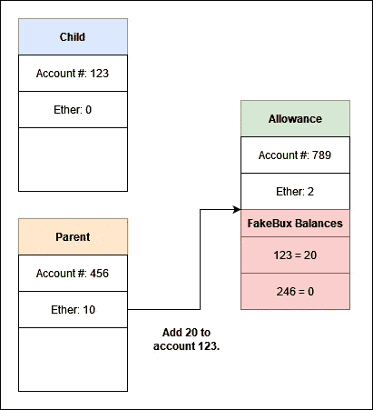
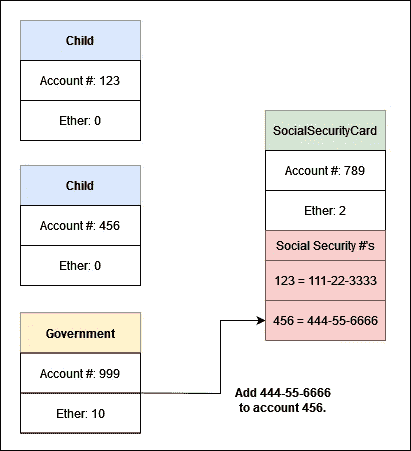
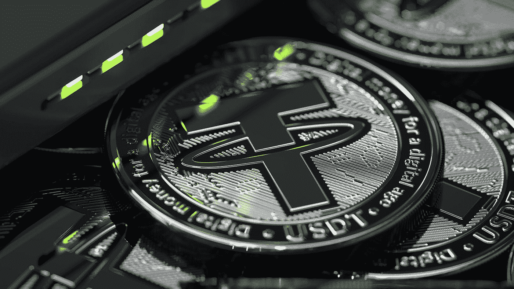

# 真正的初学者指南——以太坊(第三部分)

> 原文：<https://medium.com/coinmonks/a-truly-beginners-guide-ethereum-part-3-a2fc24c1e6e9?source=collection_archive---------32----------------------->

## NFTs 和 Stablecoins 和令牌，哦，我的！

Photo by [Tomasz Frankowski](https://unsplash.com/@sunlifter?utm_source=medium&utm_medium=referral) on [Unsplash](https://unsplash.com?utm_source=medium&utm_medium=referral)

在前两部分([一](/coinmonks/a-truly-beginners-guide-ethereum-part-1-bf2e246d7ae8)、[二](/coinmonks/a-truly-beginners-guide-ethereum-part-2-39aa1553ba0))中，我解释了什么是以太坊，什么是智能合约，以及它们是如何设法在区块链上存在的。现在所有的基础都已经建立，我们终于可以发现区块链技术的这些创新带来了什么。在这最后一部分，我们将讨论 NFT、Stablecoins 和 Tokens。

Photo by [Kvnga](https://unsplash.com/@kvnga?utm_source=medium&utm_medium=referral) on [Unsplash](https://unsplash.com?utm_source=medium&utm_medium=referral)

## 代币

如果你曾经在手机上下载过吃角子老虎机应用程序，你可能没有看到 100 万美元的余额，并假设你实际上是一个百万富翁。你明白这种平衡完全局限于游戏本身。然而，如果你在吃角子老虎机游戏中运气不好，你可能会很快发现自己的余额为 0 美元。许多这样的游戏是免费下载的，但是你可以用*真*钱来购买这个假的 app 钱。当你这样做时，你的银行看到你向游戏开发商购买了一笔钱，但他们不知道你购买了另一笔假的 1，000，000 美元赌场美元。

同样的逻辑也适用于以太坊区块链。以太将会是真正的钱，因为这是矿工对交易收取的费用，也是与你的账户余额直接相关的费用。但就像吃角子老虎机应用程序可以在他们的游戏中放入假币一样，智能合约也可以。记住，智能合约是代码，就像吃角子老虎机游戏一样。

让我们回到我们的津贴情景。回想一下，我们想在每个月的第一天给孩子零花钱。我们已经决定使用以太坊来做这件事，而不是我们必须记住每个月支付它，我们写了一个智能合同来自动支付每个月价值 20 美元的以太。但是，如果我们担心我们的孩子把乙醚卖了换成真正的美元，然后用这些钱在学校买糖果呢？如果我们不使用区块链，一个解决办法是用我们在家印制的假钞支付孩子。让我们称之为“FakeBux ”,我们每个月给孩子 20 个。任何时候孩子想买东西，他们给我们 FakeBux，我们用我们真正的美元为孩子购买。

通过这样做，我们将孩子的钱从更大的经济中分离出来，就像吃角子老虎机游戏一样。在游戏本身中，你的假钱可以做各种各样的事情，但是在游戏之外，它一文不值。同样，只要孩子得到我们的同意，他们就可以买任何他们想要的东西，但是没有我们的同意，这些东西就一文不值。我们可以在智能契约中轻松实现这一点。我们的智能合同不是每月付给孩子价值 20 美元的乙醚，而是将 FakeBux 数增加 20。没有乙醚从智能合约转移到孩子的帐户，相反，智能合约只是跟踪我们的孩子有多少 FakeBux。如果我们的孩子想要购买一些东西，他们会问我们，如果我们认为允许，他们会向智能合同发送一个交易，然后智能合同会将 FakeBux 发送回我们的帐户。然后我们将使用真实的美元为他们购买物品。

在上图中，我们可以看到这种设置。左上方的方框代表我们孩子的账户(标识为账户 123)。下面是我们的帐户 456，最后我们的智能合约是右边的 789。请记住，我们的智能合约是它自己的帐户，但它完全由我们为它编写的代码控制。我们的每个账户都有一个以太余额:child 有 0，因为我们不想让他们有真正的以太，我们有 10，智能合约有 2。如果我们还在支付零用钱，我们可以告诉零用钱合同每个月付给孩子一点零用钱。这将把一部分零花钱转移给孩子。而是在做 FakeBux，在给孩子发工资的时候，在以太坊上给津贴智能合约发一个交易。我们用乙醚来支付费用和汽油，然后一个矿工会运行代码。运行后，津贴智能合同为孩子的账户增加了 20，我们就完成了！这可以在备抵账户的红框中看到。

假设我们有第二个孩子，他们是 246 号账户。这就是为什么我们在智能合约中看到帐户 246 的余额为零。如果第二个孩子大一点，也许一个月能拿到 40 FakeBux，我们可以很容易地跟踪并支付两个孩子不同的金额。它将全部存储在一个智能合同中。整洁！

我们将不得不使用真实的以太网来为交易提供资金，支付费用，并购买天然气，但矿工们根本不关心合同中发生的事情——就像银行不关心或不知道你的虚拟插槽余额一样。只要矿工的工作得到报酬，他们就很高兴。

Photo by [Shubham Dhage](https://unsplash.com/@theshubhamdhage?utm_source=medium&utm_medium=referral) on [Unsplash](https://unsplash.com?utm_source=medium&utm_medium=referral)

## 代币对硬币

我刚才描述的是代币。它们是一种类似以太网或比特币的虚拟货币，但有一个显著的区别:*它们不为在区块链上完成的工作付费。*用于区块链特定任务的加密货币称为硬币。比特币和以太都是硬币，因为矿工通过这种方式获得报酬，而 FakeBux 是一种象征，因为尽管它存在于区块链，但它不用于支付矿工，购买天然气或支付费用。

## NFTs

我在令牌上花了很多时间，这是因为理解什么是令牌使得理解 NFTs 和 stable 变得轻而易举。你看，NFT 代表不可替代代币，我们已经知道代币是什么了。如果某样东西是可替换的，那就意味着它们的价值是一样的。以汽油为例:如果我开你的车一天，在还车之前加满油，汽油的价值没有损失也没有增加，因为我用的汽油和我加满油的没什么不同。汽油是可替代的。相比之下，如果你让我借你的法拉利，我还你一辆小型货车。汽车本身是不可替代的，因为它们都有不同的价值。

*   **可替代商品的例子:**美钞、扑克筹码、可口可乐瓶。
*   **不可替代商品的例子:**艺术家的画作、汽车上的车辆识别号或飞往不同目的地的机票(从纽约飞往迈阿密的机票不能与从纽约飞往意大利的机票互换)。

不可替换的令牌只是一个在某种程度上唯一的令牌，不能被另一个令牌直接替代。FakeBux 是可替换的，因为一个月的 20 个 FakeBux 与另一个月的 20 个 FakeBux 没有区别。NFT 的一个例子可以是社会安全令牌。假设政府在以太坊上有一个名为“SocialSecurityCard”的智能合约。当一个新的人出生时，政府用这个智能合同进行交易，并给你的以太坊地址分配一个社会安全号码，如下图所示。

在这种情况下，每个帐户都有一个令牌(他们的社会安全号),并且没有一个是可互换的。从隐私的角度来看，这是一个可怕的想法。切勿在任何区块链上放置任何个人或机密信息。

你会经常看到 NFT 的作品被当作图片来销售。这是不正确的，而且图像本身是*而不是*NFT。取而代之的是，智能合同至少包含两条信息:照片上传到互联网的网站，以及购买者的账号。任何人购买一幅图像的 NFT，只需付费，就可以在以太坊的一段代码上附上自己的账号，就像前面例子中账号被附加到社会保险号上一样。

Photo by [DrawKit Illustrations](https://unsplash.com/@drawkit?utm_source=medium&utm_medium=referral) on [Unsplash](https://unsplash.com?utm_source=medium&utm_medium=referral)

## 稳定的硬币

回想一下津贴的例子，我们的孩子有 20 个 FakeBux，他们可以兑换这些来买东西。换句话说，我们将把他们的 FakeBux 兑换成美元(或者你在自己国家使用的任何货币)。但是，假设我们的孩子非常善于储蓄，并且在他们的整个童年中没有花掉任何一点钱。突然，在他们满 18 岁的前一天，他们要求把所有的 FakeBux 兑换成美元。他们攒了 10，000 法郎，这意味着我们欠他们 10，000 美元。*嗯哦*。

我们应该确保我们拥有的美元至少和我们未发行的 FakeBux 一样多，这就是 stablecoins 的工作方式。你将向一家公司支付真实的美元，他们将这些美元存在银行账户中。作为回报，他们会在自己的智能合约中，将准确的稳定币金额添加到你的账户中。这本身并不是很有用，但是如果很多很多人开始购买这种稳定币，它可能会变得有用。

想象一下 FakeBux 被我们孩子学校的所有孩子使用，而不仅仅是我们的孩子。我们的孩子想要糖果，但知道我们不会让他们买。然而，他们有一个朋友比利，比利的父母不在乎他吃什么，所以他们每天都把他的整个午餐盒装满糖果。比利非常想要一辆新自行车，但是他没有足够的 FakeBux 来买一辆，所以他决定开始用他的糖果交换其他孩子的 FakeBux。孩子们向 FakeBux 智能合同发送命令，将他们的 FakeBux 发送到 Billy 的地址，作为回报，Billy 给孩子们糖果。

我们创造了 FakeBux 来阻止他们购买糖果，但是因为一个糖果来源现在很乐意接受 FakeBux，所以我们的计划被挫败了。成功的 stablecoins 已经设法让足够多的人接受他们，他们现在扮演了一个类似于假设的 FakeBux 的角色。如果加密货币交易所知道他们可以将稳定币兑换成美元，他们会很乐意接受稳定币来换取比特币或以太币。在那一点上它和现金一样好。

但是这有什么意义呢？我们说“和现金一样好用”，那为什么不用现金呢？现金有一个主要问题:*它与中央银行结构有关。*如果你用现金购买比特币，银行知道你刚刚在加密货币上花了钱。卖掉比特币换成美元，然后买以太？银行现在也知道了。更不用说税收、监管、监督等等。都和现金有关。但是 stablecoins 几乎没有这些功能，它只允许你从一个点进入。通过使用 stablecoin，你可以用现金购买一次加密货币，然后在没有人知道、跟踪或征税的情况下使用 stable coin 购买比特币。如果你决定拥有以太，你可以卖掉你的比特币换成稳定币，然后用稳定币购买以太。银行或政府对此一无所知，也没有向你征税。最后，在一天结束时，您有信心可以将这些稳定的积分 1 比 1 兑换成美元。

Photo by [Wil Stewart](https://unsplash.com/@wilstewart3?utm_source=medium&utm_medium=referral) on [Unsplash](https://unsplash.com?utm_source=medium&utm_medium=referral)

在这一点上，现在应该很清楚这些创新是如何相互关联的。它们实际上都是不同风格的智能合约，它们本身只是一个程序。这显然是以太坊的一个非常高层次的概述，但在未来我会更深入地探究一些更精细的细节。这些主题包括:当稳定的内容没有得到支持时会发生什么？当智能合同有缺陷时会发生什么？当你购买 NFT 时，你实际上买的是什么？以太坊天然气价格飙升时会发生什么？

> 加入 Coinmonks [电报频道](https://t.me/coincodecap)和 [Youtube 频道](https://www.youtube.com/c/coinmonks/videos)了解加密交易和投资

# 另外，阅读

*   [Bookmap 点评](https://coincodecap.com/bookmap-review-2021-best-trading-software) | [美国 5 大最佳加密交易所](https://coincodecap.com/crypto-exchange-usa)
*   最佳加密[硬件钱包](/coinmonks/hardware-wallets-dfa1211730c6) | [Bitbns 评论](/coinmonks/bitbns-review-38256a07e161)
*   [新加坡十大最佳加密交易所](https://coincodecap.com/crypto-exchange-in-singapore) | [购买 AXS](https://coincodecap.com/buy-axs-token)
*   [红狗赌场评论](https://coincodecap.com/red-dog-casino-review) | [Swyftx 评论](https://coincodecap.com/swyftx-review) | [CoinGate 评论](https://coincodecap.com/coingate-review)
*   [投资印度的最佳密码](https://coincodecap.com/best-crypto-to-invest-in-india-in-2021)|[WazirX P2P](https://coincodecap.com/wazirx-p2p)|[Hi Dollar Review](https://coincodecap.com/hi-dollar-review)
*   [加拿大最佳加密交易机器人](https://coincodecap.com/5-best-crypto-trading-bots-in-canada) | [库币评论](https://coincodecap.com/kucoin-review)