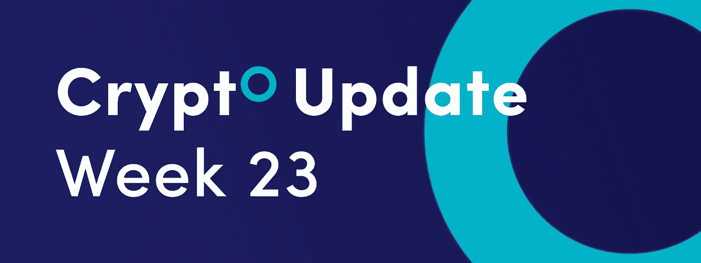
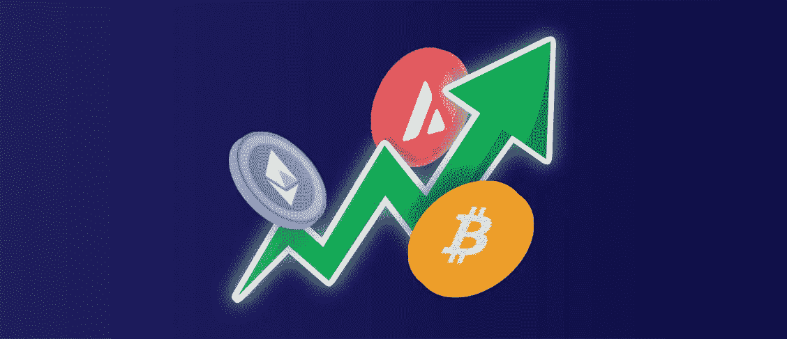

# 一种在加密交易中使用 RSI 的独特方式，更多信息请见本周的加密更新。

> 原文：<https://medium.com/coinmonks/a-unique-way-to-use-the-rsi-in-crypto-trading-and-more-in-this-weeks-crypto-update-5bae58bd5abc?source=collection_archive---------36----------------------->

*   这种罕见的锯齿形模式解释了索拉纳抛售何时结束
*   ChainLink 遵循 10 周的高到高周期
*   在加密交易中使用 RSI 的独特方法

## 这种罕见的锯齿形模式解释了索拉纳抛售何时结束

根据艾略特波浪分析，[索拉纳(SOL)](https://solana.com/nl) 抛售正以巨大的之字形模式展开。加密货币在从 2021 年 11 月的历史高点开始的周期中显示出不完全的熊市序列，这需要更多的下行空间。

# 索拉纳之字形图案

之字形图案由 3 个大波浪组成，可以细分为 5-3-5 个内波浪结构。目前的观点认为，从 2021 年 11 月的峰值到 2022 年 1 月的低点的下跌是一个 5 波脉冲结构，标记为 a 波。

B 波的回调表现为一个常规的平坦，具有三波结构，以 2022 年 4 月的高点结束。从 B 浪的波峰往下，目前 C 浪在进行中，运行的是不完整的 5 浪序列。

短期来看，第三波正在进行中，一旦结束，我们可以看到第四波的反弹和另一波下跌，以完成更大的第三波的五波序列。

C 浪和随后从 2021 年 11 月的峰值开始的整个抛售可以在 32 美元到 10 美元之间结束，这是 A 浪相对于 b 浪峰值的 0.618 和 0.786 斐波纳契扩展水平。

# 之字形图案解释

之字形模式是三种基本的艾略特波浪模式之一，另外两种是冲动型和扁平型。它最适合 A-B-C 矫正波结构。该模式可以是三波脉冲或三波校正结构。在这两种情况下，模式由 3 个大波浪组成，这 3 个波浪可以细分为 5–3–5 个内波结构。

# 索拉纳的价格历史

sola(SOL)是部署去中心化财务(DeFi)解决方案的最有前途的区块链之一。

加密货币从 2021 年 3 月开始创下一系列新高，并在 2021 年 11 月创下 258 美元的历史新高。然后，加密货币开始了大规模抛售，看起来像一个之字形结构。

# 展望未来

在撰写本文时，加密货币的交易价格为 27.24 美元，我们的短期观点是看跌。我们期待在第三波五浪序列的最后一段出现新的低点。

一旦第三波结束，我们可以看到第四波的修正性反弹，这很可能在 32 美元阻力区附近结束。从那里开始，第五波可以结束从 2021 年 11 月峰值开始的整个抛售。

## ChainLink 遵循 10 周的高到高周期

ChainLink (LINK)有望连续第二周上涨，但本轮反弹正进入一个时间窗口，我们可以预计顶部将形成。ChainLink 似乎遵循 10 周的高到高周期；至少，自 2021 年年中以来，加密货币一直在这么做。

# 链接 10 周周期

金融市场的周期性使得预测下一个高峰或低谷最有可能发生的时间成为可能。然而，我们必须明白，周期从来都不是精确的，但是它们给出了一个资产季节性趋势的粗略估计。

在这方面，林克的 10 周高点到高点周期实际上是 9 -11 周的范围。

从 2021 年 9 月峰值算起，到 2021 年 11 月确立下一个峰值，已经过去了 9 周。下一个链接峰值比前一个峰值发展了 9 周。最后一次峰值出现在 11 周后的 2022 年 3 月。

从 2022 年 3 月的峰值算起，我们已经进入第 10 周，所以我们就在我们可以预期顶部形成的时间窗口附近。通常，根据道氏理论，在熊市中，反弹可以持续 3 周到 3 个月。

因此，下周可能是上涨的第三周，也可能是从前一个峰值算起的第 11 周。

# 技术水平

从技术角度来看，我们仍在 10 美元的心理数字下方交易，但我们正在反弹至 7.2 美元的多年支撑位。随机交叉信号可以标记顶部，就像之前的峰值一样。

## 在加密交易中使用 RSI 的独特方法

相对强弱指数(RSI)不仅是一个流行的动量振荡器，也是一个非常通用的指标。一旦你理解了 RSI 指标的力量以及如何正确使用它，你就会知道什么时候是进场和出场的最佳时机。

# RSI 趋势线设置

使用 RSI 振荡指标有许多不同的方法，但在加密货币交易中使用它的一个独特方法是 RSI 趋势线设置。这种方法意味着用趋势线代替价格。

RSI 趋势线策略将帮助你找到领先信号。

# 如何绘制 RSI 趋势线

RSI 趋势线是通过连接振荡指标本身的至少两个波峰或波谷绘制的。RSI 趋势线是在上升趋势中，通过连接振荡指标本身的更高的低点而形成的。相反，在下跌趋势中，RSI 趋势线是通过连接较低的波动高点绘制的。

当 RSI 趋势线被打破时，交易机会就出现了。当 RSI 改变方向时，这是一个领先信号，有可能导致加密价格的重大变动。

# RSI 趋势线示例

这是一个比特币/USDT 市场 RSI 趋势线突破的例子。

RSI 趋势线突破是一个强有力的领先指标。如果你在趋势方向交易加密货币，你可以使用 RSI 趋势线突破作为退出交易的触发点。相反，如果你逆势交易，RSI 趋势线的突破可能是进场交易的好时机。

在上面的例子中，RSI 趋势线的突破是一个很好的迹象，表明普遍的下降趋势正在结束，新的上升趋势正在进行。

RSI 趋势线的突破也给了我们在哪里设置止损的想法。止损应该放在 RSI 趋势线的另一边，这样如果 RSI 趋势线反方向破了，你就知道你的交易错了，可以退出交易。

一句话:RSI 趋势线方法被用来衡量当前趋势何时结束，新的趋势何时开始。

订阅我们的媒体每周博客和更新。
在[推特上关注我们](https://twitter.com/cryptohopper) | [脸书](https://www.facebook.com/cryptohopper)|[Reddit](https://www.reddit.com/r/CryptoHopper/)|[insta gram](https://www.instagram.com/cryptohopper/?hl=nl)

在 [Cryptohopper](https://www.cryptohopper.com/) 开始交易！

> 加入 Coinmonks [电报频道](https://t.me/coincodecap)和 [Youtube 频道](https://www.youtube.com/c/coinmonks/videos)了解加密交易和投资

# 另外，阅读

*   [印度的加密交易所](/coinmonks/bitcoin-exchange-in-india-7f1fe79715c9) | [比特币储蓄账户](/coinmonks/bitcoin-savings-account-e65b13f92451)
*   [OKEx vs KuCoin](https://coincodecap.com/okex-kucoin) | [摄氏替代品](https://coincodecap.com/celsius-alternatives) | [如何购买 VeChain](https://coincodecap.com/buy-vechain)
*   [币安期货交易](https://coincodecap.com/binance-futures-trading)|[3 commas vs Mudrex vs eToro](https://coincodecap.com/mudrex-3commas-etoro)
*   [如何购买 Monero](https://coincodecap.com/buy-monero) | [IDEX 评论](https://coincodecap.com/idex-review) | [BitKan 交易机器人](https://coincodecap.com/bitkan-trading-bot)
*   [CoinDCX 评论](/coinmonks/coindcx-review-8444db3621a2) | [加密保证金交易交易所](https://coincodecap.com/crypto-margin-trading-exchanges)