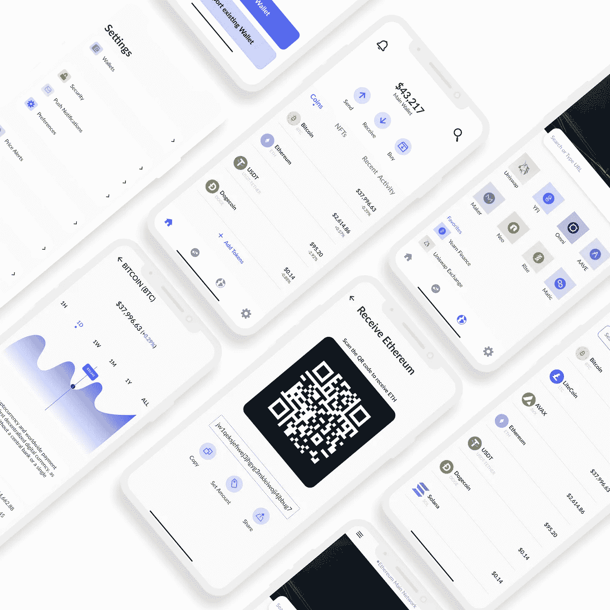

# 分散加密钱包应用——NULO 钱包的 UX 案例研究

> 原文：<https://medium.com/coinmonks/a-ux-case-study-for-a-decentralized-crypto-wallet-application-nulo-wallet-391b358819d1?source=collection_archive---------5----------------------->

角色:用户研究员、UI 设计师、UX 作家

时间框架:5 周

# **简介**

随着世界快速接受区块链技术的概念和加密货币的使用，对分散兑换(DEX)钱包的需求变得非常必要。然而，大多数钱包都有令人困惑的用户体验，这促使我设计了这个。这种设计的主要目的是使 DEX 钱包更容易使用，并改善 DEX 钱包的用户体验，因此对加密货币没有任何概念的普通用户也是如此。该应用还旨在为首次用户提供更好、更清晰的入职体验。

# **UX 设计流程**

我应用设计思维在整个过程中分 5 个阶段解决问题；

Design Thinking Process

1.  **感同身受**——感同身受用户。这个阶段允许我把自己放在用户的想法中，以便了解他们的痛点和需求。为了实现这一点，我采访了两类用户(专业密码交易员和普通钱包用户)。我询问了他们使用 DEX 钱包的体验以及使用时面临的问题。这让我发现:

a.DEX 钱包通常不是用户友好的，因此对尝试使用该应用的新手来说往往非常吓人。

b.用户抱怨为了某些目的不得不使用几个加密应用程序。

c.用户希望他们有一个单一的应用程序，允许他们在日常交易活动中轻松管理他们的加密资产，而不是必须在多个应用程序之间切换。

**2。定义**——根据移情阶段收集的信息，我为这个钱包设定了目标；即设计一个简单易用的多功能钱包应用程序，帮助加密交易者交换、发送、接收或购买加密资产。在这个阶段，我也定义了我在为谁解决问题——新手，因为大多数 DEX 平台不能满足对加密货币和区块链整体概念不熟悉的人的需求。

**3。Ideate —** 这个阶段需要大量的思考和头脑风暴，以便提出问题的解决方案。经过几次头脑风暴，我想出了几个主意。

a.我创建了几个入职界面，让新手轻松进入应用程序，并让用户知道应用程序提供了什么服务。

b.我提供了一个选项，让用户拥有多个钱包，这样他们就可以在这个应用程序中存储多个硬币和数字资产，从而消除了在两个或更多应用程序之间切换的需要。

c.我根据市场分析创建了市场图表，以帮助交易者做出明智的决定，而不必在几个加密应用程序之间切换。

d.我还创建了一个内置浏览器 dApp。

**4。原型** —

这个阶段涉及到我对之前发现的问题提出实际的设计解决方案。这些解决方案是通过设计高保真原型实现的，其目标如下:

a.在入职屏幕上设计信息丰富、简洁明了的文本，让密码行业的新手和老用户对 DEX 钱包能为他们提供什么有一个好的想法。

b.为用户创建一种更简单、压力更小的方式来存储多种硬币和数字资产，并拥有内置的浏览器 dApp，从而通过这些功能推动转换。

c.通过创建市场图表来减少交易者亏损的机会，这将有助于交易者在开始交易前做出明智的决定。

## 排版和颜色

我创建了一个设计系统，其中包含了我将要用来构建高保真原型的元素。

Typography and Colors

**入职屏幕**

入门屏幕是带用户浏览应用程序核心功能的屏幕，并为新手提供有关加密基础的信息，这解决了新手第一次使用加密钱包时感到迷失的问题。

Onboarding Screens

## **钱包创建&种子短语屏幕**

新用户需要完成一系列步骤来创建新的 wallet，其中包括生成种子短语或选择导入现有 wallet 以供再次使用的用户使用。用户被要求键入他们的种子短语。这旨在确保他们将它写在安全的地方。用户也要明白，如果他们暴露或丢失了他们的种子短语，他们可能会失去所有的资产。

Seed Phrase

**简约美观的主屏幕**

**发送硬币、接收硬币和交换硬币屏幕**

Send, Receive and Swap Coins

**市场图表和图形**

我设计了市场图表来帮助交易者根据他们的市场分析做出明智的决定，而不必在几个加密应用程序之间切换。

Market Graphs and Analysis

**内置的 dApp 浏览器**

我设计了一个内置的 Web3 浏览器，允许用户访问分散的 Web 和 dApps，集成加密货币并提供更快的浏览速度，同时关注用户隐私。

Web3 Browser

**设置屏幕**

Settings Screen

**更多模型**

Mockups

**用户测试**

下一步是与用户一起对原型进行测试，以确定导航、易用性方面的任何困惑，并可能对现有产品进行更多迭代。

在这一阶段，80%的受访用户认为该产品易于操作，总体而言，对于密码行业的新手来说，用户体验良好。

**结论**

区块链和加密货币有如此多的用例，为了让人们接受这项新技术，产品具有良好的 UX 是必不可少的。在这个项目阶段，我学到了很多东西，做了很多研究，我的心灵对区块链的可能性敞开了大门。我真的很喜欢这个过程，因为我试图在好的设计和区块链之间架起一座桥梁。

感谢您通读我的案例研究。

如果你想和我一起工作，或者喜欢定制设计，请通过 allenyakndara@gmail.com[联系我](http://allenyakndara@gmail.com)

> *加入 Coinmonks* [*电报频道*](https://t.me/coincodecap) *和* [*Youtube 频道*](https://www.youtube.com/c/coinmonks/videos) *了解加密交易和投资*

# 另外，阅读

*   [有哪些交易信号？](https://coincodecap.com/trading-signal) | [Bitstamp vs 比特币基地](https://coincodecap.com/bitstamp-coinbase) | [买索拉纳](https://coincodecap.com/buy-solana)
*   [ProfitFarmers 回顾](https://coincodecap.com/profitfarmers-review) | [如何使用 Cornix Trading Bot](https://coincodecap.com/cornix-trading-bot)
*   [十大最佳加密货币博客](https://coincodecap.com/best-cryptocurrency-blogs) | [YouHodler 评论](https://coincodecap.com/youhodler-review)
*   [my constant Review](https://coincodecap.com/myconstant-review)|[8 款最佳摇摆交易机器人](https://coincodecap.com/best-swing-trading-bots)
*   [MXC 交易所评论](/coinmonks/mxc-exchange-review-3af0ec1cba8c) | [Pionex vs 币安](https://coincodecap.com/pionex-vs-binance) | [Pionex 套利机器人](https://coincodecap.com/pionex-arbitrage-bot)
*   [我的密码交易经验](/coinmonks/my-experience-with-crypto-copy-trading-d6feb2ce3ac5) | [《比特币基地评论》](/coinmonks/coinbase-review-6ef4e0f56064)