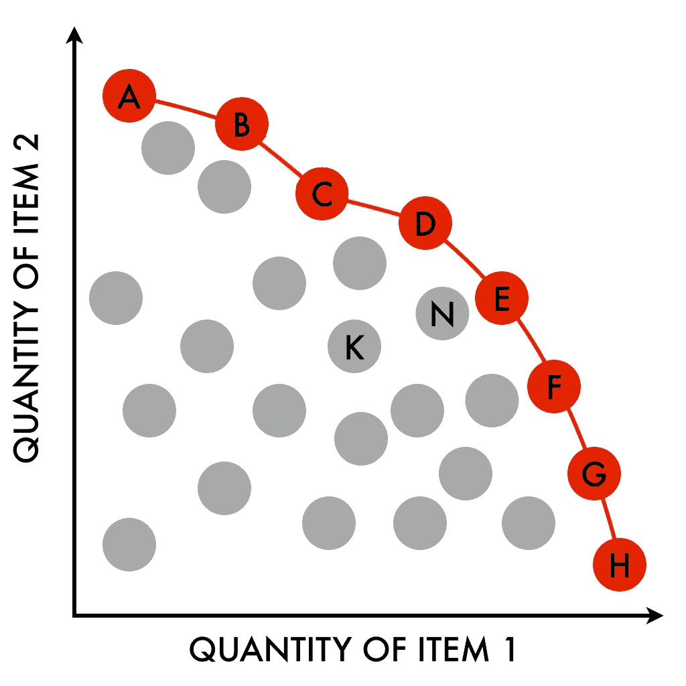

# 效率的网络 3 故事——帕累托的趣事

> 原文：<https://medium.com/coinmonks/a-web3-story-of-efficiency-paretos-funtier-78932781f613?source=collection_archive---------56----------------------->

# 什么是帕累托边界？

想象你又是一名大学生。你会如何选择你的职业？你希望工作在多大程度上符合你的激情？你想牺牲这些激情来赚更多的钱吗？更进一步，你会为了一份高薪工作而放弃部分大学经历吗？在你未来的职业生涯中，你会为了最高的报酬而拼命工作吗？

在大多数职业中，个人将面临乐趣和金钱之间的权衡。以投资银行家为例，这是大学毕业后薪酬最高的工作之一。许多专业人士认为这种职业道路是最艰苦、最有压力、最累人的职业之一。但是，个人还是因为付出而去做。

帕累托效率是一个描述这种相同的权衡的概念，在这种情况下，没有一种特定偏好可以在不降低另一种偏好的成本的情况下得到改善。这些效率的集合被称为帕累托边界，并被表示为图形曲线，每个轴被定义为这些类别。

Pareto’s Efficiency Frontier

# Web3 和更有趣的

在大卫·霍夫曼和瑞安·西恩·亚当斯的播客《无银行》中，他们请来了《不无聊》的作者帕奇·麦考密克，他们讨论了 web3 空间如何扩大了这一帕累托边界，创造了更有趣的帕累托。以前，在许多行业中，在尽情娱乐的同时赚钱是很少见的。然而，鉴于 web3 空间的社会性质、对创新的关注以及对金融的影响，个人可以在从事令人兴奋、有趣和社会工作的同时达到高收入水平。

Dao 在这一扩张中发挥了相当大的作用。通过为独特的社区提供个人目标、抱负和兴趣，DAOs 已经成为个人享受美好时光、产生积极影响和结识新朋友的孵化器。

# 现实

新冠肺炎的影响使许多人失业，无法谋生。这时，寻找机会的人去了 crypto，因为这是一个有利可图的快速解决失业问题的方法。然而，无论是交易、采矿、咨询还是开发，web3 空间提供了许多机会，最终使许多人无法立即回到传统的工作岗位。

现在，随着就业市场有所恢复，仍然有一些人以某种方式或形式追求 web3 的抱负。到目前为止，个人有无限的机会进入这个 web3 空间，并从新行业的开放中获益。

这篇关于帕累托有趣的文章的想法可以在无银行播客[这里](http://podcast.banklesshq.com/112-into-the-funtier-packy-mccormick)找到。

# 有问题吗？我们保持联系吧！

[网站](https://www.stevenarellano.me/)[Linkedin](https://www.linkedin.com/in/stevenjarellano/)[Github](https://github.com/stevenarellano)

> 加入 Coinmonks [电报频道](https://t.me/coincodecap)和 [Youtube 频道](https://www.youtube.com/c/coinmonks/videos)了解加密交易和投资

# 另外，阅读

*   [美国最佳加密交易机器人](https://coincodecap.com/crypto-trading-bots-in-the-us) | [经常性回顾](https://coincodecap.com/changelly-review)
*   [在印度利用加密套利赚取被动收入](https://coincodecap.com/crypto-arbitrage-in-india)
*   [Godex.io 审核](/coinmonks/godex-io-review-7366086519fb) | [邀请审核](/coinmonks/invity-review-70f3030c0502) | [BitForex 审核](https://coincodecap.com/bitforex-review)
*   [最佳比特币保证金交易](/coinmonks/bitcoin-margin-trading-exchange-bcbfcbf7b8e3) | [萝莉点评](/coinmonks/lolli-review-e6ddc7895ad8) | [比特币保证金交易](https://coincodecap.com/bityard-margin-trading)
*   创造并出售你的第一个 NFT | [密码交易机器人](https://coincodecap.com/best-crypto-trading-bots)