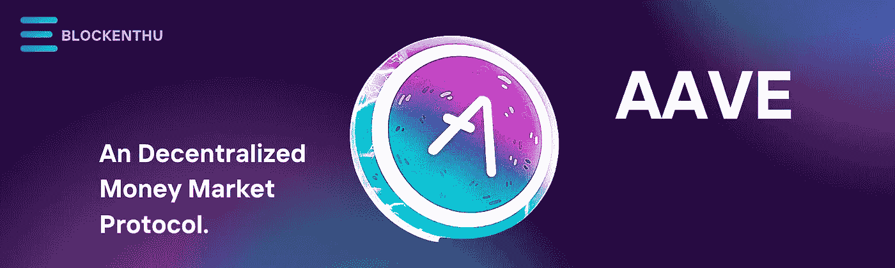
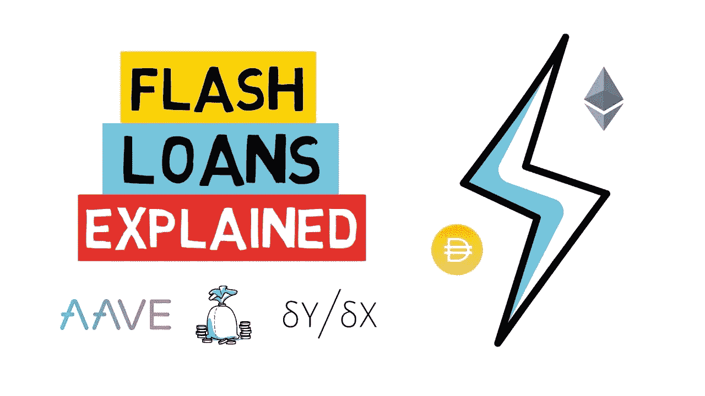

# AAVE

> 原文：<https://medium.com/coinmonks/aave-19e6de46e257?source=collection_archive---------44----------------------->

***一个去中心化的货币市场协议。***

# **简介**

AAVE 是几个有前途的 DeFi 加密货币之一，它是一个分散的借贷系统，允许用户在不使用中间人的情况下借出、借入加密资产并赚取利息。运行在以太坊区块链上的 Aave 是一个智能合约系统，允许这些资产由运行其软件的分布式计算机网络控制。

这意味着 Aave 消费者不必依赖某个机构或个人来管理他们的资产。他们只需要相信**代码会像预期的那样运行**。其核心是，Aave 程序允许用户创建借贷池，他们可以借出或借入各种加密货币，包括 ETH、BAT 和 MANA。

Aave 中的借款人，就像以太坊上其他分散式借贷系统中的借款人一样，在借款前必须提交抵押品。此外，他们只能借入他们所存抵押品的金额。借款人以 aToken 的形式获得资金，ATO ken 与另一项资产的价值挂钩。然后，这种令牌被编码，允许贷方赚取存款利息。

例如，借款人可以在 DAI 中提交抵押品，在 ETH 中借款。这使得借款人可以在不真正持有加密货币的情况下获得对几种加密货币的敞口。Aave 还可能引入新的服务，如快速贷款和其他类型的债务和信贷发行，这些服务利用了区块链独特的设计品质。该协议本身利用了 DAO，即分散自治组织。也就是说，它是由拥有 AAVE 代币并投票的个人来经营和管理的。

# **AAVE 的故事:埃思伦德**

**ETHLend，** Aave 的历史可以追溯到 2017 年。ETHLend 于 2017 年 11 月由 Stani Kulechov 和一个工程师团队作为初始硬币发行(ICO)推出。这个概念是通过允许用户发布贷款请求和要约，允许用户互相借出和借入比特币。

虽然 ETHLend 是一个新概念，但一旦 2018 年熊市开始，该网络及其令牌 Lend 就失去了牵引力。该平台的主要缺点是流动性不足，以及难以将贷款请求与发行联系起来。

因此，在 2018 年和 2019 年的疲软市场中， **ETHLend 团队改进了其产品，在 2020 年初推出了 Aave。**

Kulechov 在一个播客上说熊市是 ETHLend 遇到的最好的事情之一。这是指他和他的团队有机会重塑去中心化加密货币借贷的概念，从而创造了 Aave。

# **Aave 上的贷款工作原理**

传统上，你必须去银行或其他有大量流动现金的金融机构获得贷款。然而，你仍然必须提供抵押品。在力求免费的 DeFi 系统中，其他加密货币代币也是可以接受的。因此，对于一笔 500 美元的加密贷款，你需要在另一枚硬币中投入更多，例如，如果你想借 500 美元的 ETH，那么你需要用 500 美元的 USDC 或 USDT 作为抵押。一旦代币化，投资者可以购买(或作为抵押品持有)这些代币，其行为类似于债券，并获得投资回报。

**借加密货币有什么意义？**

虽然购买或出售加密货币通常更有利，但在某些情况下，借用加密货币可能会有用。**套利**就是最明显的一个。如果你发现一个代币在几个交易所以不同的价格交易，你可以通过在一个地方购买，在另一个地方出售来获利。然而，由于扣除交易费用和差价后，差异通常很小，所以你需要大量的加密货币才能获得有意义的利润。Aave 率先使用了闪贷，即客户在不提供担保的情况下借入比特币，用它来购买和出售一件商品，然后在同一笔交易中退还原始金额，同时收取佣金。

# **闪贷？**

闪贷是 Aave 平台独一无二的功能。以太坊的运作方式使这些非证券化产品变得可行(Aave 建立在以太坊区块链网络之上)。

快速贷款是自动化的、快速执行的贷款，必须在一次以太坊交易中偿还。如果本金和利息没有在该时间范围内偿还，贷款实质上被撤销，交易从区块链中删除，就像它从未发生过一样。

# **AAVE 创始人**

**Stani Kulechov** 建立了 Aave 及其前身 ETHLend。他对当时以太坊上缺乏贷款应用感到失望，他的想法是在去中心化金融存在之前设计的。

Kulechov 是一位连续创业者，他在青少年时期学习法律并开始编程。他是区块链技术的早期用户。首席执行官表示，他想将 ETHLend 更名为 Aave，这样公司可以提供比 Ether lending 更多的服务。

根据 Kulechov 的说法，Aave 的主要目标市场是那些已经参与加密货币生态系统的人。

# **AAVE 硬币令牌组学**

因为每次系统收费时都会消耗代币，所以流通与锁定在一个 ave 上的总量相关。2017 年 11 月，**进行了首次硬币发行(ICO ),通过以每枚 0.0162 美元的价格出售 10 亿枚 AAVE 代币，筹集了 1620 万美元。当时，创始人和项目获得了 23%的 AAVE 代币。**代币目前市值排名第 42 位。在 2022 年 5 月 27 日撰写本文时，AAVE 代币的交易价格为 94.21 美元(7308.52 印度卢比)，市值为 13 亿美元，流通中的 AAVE 硬币为 130 亿枚。

AAVE 硬币是建立在 ERC-20 标准的基础上的，旨在抑制通货紧缩。在 DeFi 协议短缺的情况下，标桩代币将被用作抵押品作为最后的选择**。**

# **结束语**

例如，Aave 和 Compound 是去中心化的货币市场，为更开放、更容易进入的金融体系铺平了道路。Aave 是一项有趣的 DeFi 计划，它使加密货币用户能够透明地获得现金和服务。

AAVE 代币是另一个令人兴奋的发展。它的持有者有能力影响 Aave 协议的变更。它还保护协议免受黑天鹅情况的影响。

# 加入我们，轻松进入 WEB 3.0

> *我们的社区*

# WHATSAPP

 [## BLOCKENTHU

### WhatsApp 群邀请

chat.whatsapp.com](https://chat.whatsapp.com/FTKme4XzkOU73ZDv99Oatj) 

# 电报

 [## ⚡·布洛克登胡·⚡

### 可以马上查看并加入@blockenthu。

t.me](https://t.me/blockenthu) 

# 商务化人际关系网

 [## Blockenthu | LinkedIn

### LinkedIn 上有 564 名粉丝。“面向大众的 Web 3.0 福利”加密和区块链| BlockEnthu 是社区…

www.linkedin.com](https://www.linkedin.com/company/blockenthu/) 

# INSTAGRAM

[https://www.instagram.com/blockenthu/](https://www.instagram.com/blockenthu/)

使用印度最安全的外汇货币

 [## CoinDCX -加密交易所|购买、出售和交易比特币和顶级替代币

### CoinDCX 是印度最大、最安全的加密货币交易所，在这里你可以买卖比特币和其他…

coindcx.com](https://coindcx.com/) 

# blockenthu # ETH # BTC # coincxpathbreaker #比特币#以太坊#多边形# aave #复利#借#贷#onchain

> 加入 Coinmonks [电报频道](https://t.me/coincodecap)和 [Youtube 频道](https://www.youtube.com/c/coinmonks/videos)了解加密交易和投资

# 另外，阅读

*   [3 商业评论](/coinmonks/3commas-review-an-excellent-crypto-trading-bot-2020-1313a58bec92) | [Pionex 评论](https://coincodecap.com/pionex-review-exchange-with-crypto-trading-bot) | [Coinrule 评论](/coinmonks/coinrule-review-2021-a-beginner-friendly-crypto-trading-bot-daf0504848ba)
*   [莱杰 vs Ngrave](/coinmonks/ledger-vs-ngrave-zero-7e40f0c1d694) | [莱杰 nano s vs x](/coinmonks/ledger-nano-s-vs-x-battery-hardware-price-storage-59a6663fe3b0) | [币安评论](/coinmonks/binance-review-ee10d3bf3b6e)
*   [Bybit Exchange 评论](/coinmonks/bybit-exchange-review-dbd570019b71) | [Bityard 评论](https://coincodecap.com/bityard-reivew) | [Jet-Bot 评论](https://coincodecap.com/jet-bot-review)
*   [3 commas vs crypto hopper](/coinmonks/3commas-vs-pionex-vs-cryptohopper-best-crypto-bot-6a98d2baa203)|[赚取加密利息](/coinmonks/earn-crypto-interest-b10b810fdda3)
*   最好的比特币[硬件钱包](/coinmonks/hardware-wallets-dfa1211730c6) | [BitBox02 回顾](/coinmonks/bitbox02-review-your-swiss-bitcoin-hardware-wallet-c36c88fff29)
*   [BlockFi vs 摄氏](/coinmonks/blockfi-vs-celsius-vs-hodlnaut-8a1cc8c26630) | [Hodlnaut 点评](/coinmonks/hodlnaut-review-best-way-to-hodl-is-to-earn-interest-on-your-bitcoin-6658a8c19edf) | [KuCoin 点评](https://coincodecap.com/kucoin-review)