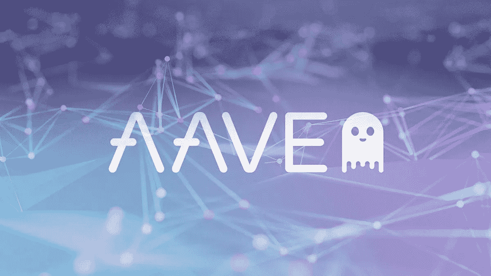

# Aave | Aave 令牌| Aave 定义| Aave 工作结构|顶级定义令牌 2022

> 原文：<https://medium.com/coinmonks/aave-aave-token-aave-defi-aave-working-structure-top-defi-tokens-2022-6c3bc9531cab?source=collection_archive---------38----------------------->

# 一个音频令牌

分散金融(DeFi)是一种基于分布式分类账的新金融系统，类似于加密货币中使用的分类账。该系统将货币、金融产品和金融服务的权力从银行和机构下放。在传统的中央银行系统中，你的钱由银行和金融公司保管，它们的首要目标是赚钱。

在金融体系中，为各方之间的资金流动提供便利的第三方比比皆是，每一方都为自己的服务收取费用。这可能会为许多欺诈、错误和骗局的实施打开方便之门。因此，当 2008 年全球经济陷入瘫痪时，Satoshi Yakamoto 提出了一篇论文，描述了去中心化货币和金融体系的概念和技术层面。这种货币被称为比特币。

跟随脚步，大家一直在尝试发展去中心化的金融生态系统。其中一个领域是分散的货币市场部门。货币市场随着时间的推移不断演变，但其基本结构基本保持不变。借款人利用货币市场获得短期贷款(通常少于一年)以借入一种货币(如美元)，同时以另一种货币(如欧元)或资产(如房地产)作为抵押。如果借款人未能偿还贷款，抵押品必须被拍卖，以使贷款人完整。

否则，在债务清偿后，抵押品将返还给借款人。由于 DeFi 生态系统的出现，Aave 和 CREAM 等去中心化货币市场协议使用户只需通过互联网连接就可以借入和借出他们的链上加密货币(和令牌化资产)。

一种这样的 DeFi 系统是 Aave。在这篇文章中，我们将读到更多关于 [Aave](https://aave.com/) ，它的背景，以及它的系统的最大亮点。

# 关于 Aave:Aave DeFi 的概述和背景

Aave 是一种分散式金融(DeFi)技术，通常也被称为分散式货币市场，它允许人们在不通过集中式中间人的情况下借贷加密货币。在更名为 Aave 之前，该产品曾被称为 ETHLend。这两个品牌都是由来自芬兰的法律系学生 Stani Kulechov 领导的团队开发的。

该公司以前被称为 ETHLend，在 2017 年举行的首次硬币发行(ICO)中筹集了 1620 万美元，它已经出售了 10 亿单位的 AAVE 加密货币，以前被称为 Lend。

ETHLend 与 Aave 的不同之处在于，它试图在点对点的基础上撮合贷款人和借款人，而不是汇集资金。ETHLend 于 2018 年更名为 Aave(芬兰语意为“幽灵”)，成为 Aave 的子公司。借出加密货币转换为 AAVE，1 AAVE 等于 100 借出代币，使 AAVE 的总量达到 1800 万。

处理巨额交易的交易台、专注于区块链游戏的游戏工作室和支付系统是 DeFi 更名时披露的其他产品和服务之一。

# Aave 的最大亮点及其工作结构

此外，Aave 是一个智能合同解决方案，允许这些资产由运行其软件的广泛的计算机网络来处理。它运行在以太坊区块链。Aave 网络上的所有代币都使用以太坊的区块链技术来处理交易；这些令牌被称为 ERC20 令牌。

Aave 网络用户必须将虚拟资产存入“流动性池”，协议可以用它来借出资金。Aave 本身就是一个分散的自治组织(DAO)。因此，它是由拥有 AAVE 代币并通过投票表达意见的人来管理和统治的。

这意味着 Aave 用户不必将他们的资金委托给特定的机构或个人。他们只需要相信代码会按预期运行。

Aave 软件的核心是允许用户创建借贷池，他们可以借出或借入 17 种不同的加密货币，包括 ETH、BAT 和 MANA。在获得贷款之前，Aave 的借款人必须提供抵押品。此外，他们只被允许借用他们已公布的抵押品的价值。他们放贷时获得利息，借钱时支付利息。借款人以代币的形式获得资金，代币是一种与另一种资产价值挂钩的特定代币。然后，这种硬币被编码，这样储户就可以从他们的钱中赚取利息。

# Aave 的最大竞争对手或替代产品:

# 化合物:

该化合物是一种基于以太坊的 DeFi 借贷机制，其功能类似于虚拟货币市场。在 TVL DeFi 协议排名中，Compound 以 105.7 亿美元的总价值排名第五。

当你开始把你的钱投入到复利，你可以分散你的投资组合。作为交换，该协议将继续给你利息，只要你保持你的钱。但是，如果你想把钱放在别的地方，你可以向协议借钱。自然，你将是从协议的流动资金池借钱支付复利的人。复利平台由 COMP 币提供动力。因此，它是一个社区驱动的加密项目，具有社区决策权。

# 中国注册资产管理公司金融

个人、机构和协议可以使用 C.R.E.A.M. Finance(一种分散式贷款协议)获得金融服务。这是一个无许可、开源、区块链不可知的协议，为以太坊、币安智能链、Polygon 和 Fantom 上的用户提供服务，作为渴望金融生态系统的一部分。以被动方式持有 ETH 或 BTC 的用户可以将其资产存入 C.R.E.A.M .以获得利息，与典型的储蓄账户相当。

CREAM 是一种基于以太坊的点对点借贷机制。因为奶油是建立在以太坊区块链上的，它给予奶油代币，可以保存在任何以太坊钱包中，为任何人提供采矿奖励。CREAM 上的额外资产，如$CRV 和$YFI，使其有别于复合金融。

*原载于*[*https://financialanswers . in*](https://financialanswers.in/aave-token/)*2022 年 4 月 17 日*

> *加入 Coinmonks* [*电报频道*](https://t.me/coincodecap) *和* [*Youtube 频道*](https://www.youtube.com/c/coinmonks/videos) *了解加密交易和投资*

# 另外，阅读

*   [3 商业评论](/coinmonks/3commas-review-an-excellent-crypto-trading-bot-2020-1313a58bec92) | [Pionex 评论](https://coincodecap.com/pionex-review-exchange-with-crypto-trading-bot) | [Coinrule 评论](/coinmonks/coinrule-review-2021-a-beginner-friendly-crypto-trading-bot-daf0504848ba)
*   [莱杰 vs n rave](/coinmonks/ledger-vs-ngrave-zero-7e40f0c1d694)|[莱杰 nano s vs x](/coinmonks/ledger-nano-s-vs-x-battery-hardware-price-storage-59a6663fe3b0) | [币安评论](/coinmonks/binance-review-ee10d3bf3b6e)
*   [Bybit Exchange 审查](/coinmonks/bybit-exchange-review-dbd570019b71) | [Bityard 审查](https://coincodecap.com/bityard-reivew) | [Jet-Bot 审查](https://coincodecap.com/jet-bot-review)
*   [3 commas vs crypto hopper](/coinmonks/3commas-vs-pionex-vs-cryptohopper-best-crypto-bot-6a98d2baa203)|[赚取加密利息](/coinmonks/earn-crypto-interest-b10b810fdda3)
*   最好的比特币[硬件钱包](/coinmonks/hardware-wallets-dfa1211730c6) | [BitBox02 回顾](/coinmonks/bitbox02-review-your-swiss-bitcoin-hardware-wallet-c36c88fff29)
*   [BlockFi vs 摄氏](/coinmonks/blockfi-vs-celsius-vs-hodlnaut-8a1cc8c26630) | [Hodlnaut 点评](/coinmonks/hodlnaut-review-best-way-to-hodl-is-to-earn-interest-on-your-bitcoin-6658a8c19edf) | [KuCoin 点评](https://coincodecap.com/kucoin-review)