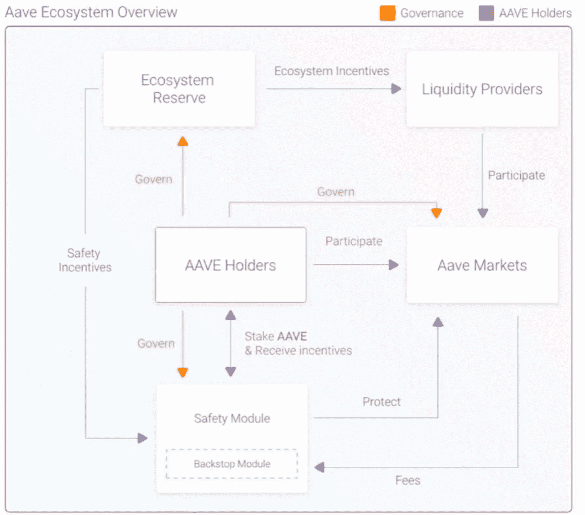

# 2022 年的 AAVE

> 原文：<https://medium.com/coinmonks/aave-for-2022-b88599c95fcb?source=collection_archive---------6----------------------->

## 看看 AAVE &为什么你应该关注它

*披露*

*   *这些都不是理财建议*

AAVE

**此作品涵盖:**

*   AAVE 是什么
*   Aave 如何工作
*   为什么闪贷不只是昙花一现
*   符号组学
*   扩张努力

**简介**

多样化是企业(和协议)如何进化以生存，并希望它们能够长期繁荣。

对于一个企业来说，在他们的市场重点领域获得高收入是很自然的，但这并不总是可持续的。不可避免地，新的业务会出现并蚕食市场份额，对于加密领域的项目来说也是如此。

**护城河**是一个企业/项目/协议保持竞争优势的能力，以保护其长期利润和竞争对手的市场份额。随着时间的推移，可以建立护城河，但这也可能被侵蚀。创新有助于在许多领域实现持久的护城河，并保持竞争力。

当在市场的其他领域执行先发优势时，利用他们在运营中建立的信任和信心的现任者可以工作得很好。此外，有一个可识别的品牌名称可以帮助机上用户在时机成熟时更加流畅。

距离 2020 年的 DeFi 夏季已经过去了将近 2 年，这个空间里的一切都变得如此之快，感觉像是过了一辈子。

一个时代，诞生了蓝筹 DeFi 协议，如化合物，AAVE，向往，曲线可能没有优于价格方面像其他 DeFi 项目在最近几个月。这可能是由于出现了不同的区块链和类似的协议。然而，连锁活动和 TVL 的数据却不这么认为。

蓝筹股可以利用他们在“现场时间”的经验，利用他们的品牌名称、人才库和资金来投资和拓展未来。

Token Terminal

AAVE 一直在幕后工作，它开始扩大其长期努力&也许引入新的收入来源。从上面可以看出，收入并不是 DeFi 最喜欢的协议之一。

这篇文章强调了 Aave 如何进行长期思考，以及机构投资者如何参与其中。

# **什么是 AAVE？**

AAVE 是 DeFis 最接近银行的协议之一。支持非托管借贷的货币市场系统。该项目的标志叫做$AAVE，奖励用户对其协议进行奖励和治理。

AAVE 是市场上最著名和最成熟的 DeFi 加密协议之一。当你想到贷款时，你会想到 AAVE。作为一个项目，他们为产品创新做出了贡献，并不断寻求扩张。

# **Aave 是如何工作的？**

在传统的借贷系统中——在银行内部，贷方与借方相匹配。银行充当中间人，管理这一切。然而，在 AAVE，该协议通过智能合同实现了自动贷款，省去了这个中间人。

对于 AAVE 进程来说，贷款人将他们的密码存入流动性池。这些流动性池是资金池，使存款人能够从他们的存款中赚取利息，这些存款将从流动性池中借出。

任何将代币存入资金池从而“提供流动性”的人都会收到新的代币。(“a”代表“Aave”)例如，如果你将戴存入流动资金池，你将得到阿岱作为回报。

作为阿托肯的持有者，你将获得平台闪贷的一部分，以及这些阿托肯的利息。

借款人支付利率。然而，这取决于流动性池中资产的可用性。这意味着利率根据需求和供给水平而波动。更高的利率被用来激励贷款人存更多的钱&在更低的利率下，资产供给很高。

在传统的银行系统中，发放的贷款是没有抵押的。然而，在 AAVE，贷款通常被过度抵押，这意味着用户需要存入价值高于他们所借金额的抵押品。

抵押品代表作为担保的东西；在这种情况下，如果出现违约，crypto 将一直保留到贷款偿还。因为它是不稳定的，所以它在加密市场上被实施。

因此，如果抵押品价值低于担保金额，AAVE 会采取预防措施进行清算。

# 闪贷不只是昙花一现

Volume still continues to grow, source Dune Analytics, @austin.

## **什么是闪贷？**

AAVE 是第一个实施一种称为“闪贷”的贷款的 DeFi 协议，这种贷款可以立即发放和结算。这些贷款不需要预先担保，而且几乎是立即发生的
；本质上，它们是速射贷款。

用户利用区块链的这一特点，在新的一批交易完成后的时间内发放贷款；这些发生在每个块内，然后被网络接受。

在以太坊，这将是在 13 秒内，因为这是它的块时间。因此，在 AAVE，利用快速贷款意味着它发生在 13 秒内。

Not a flash in the pan

闪贷总额接近 100 亿美元。

## **快速贷款如何运作**

借款人可以从 AAVE 申请资金，接收资金，然后在交易中部署借入的资金，然后用同一个块偿还贷款，这是单块多步交易的一部分。用户必须偿还这些资金，通常在同一区块内收取 0.09%的费用。如果借款人不这样做，整个交易被取消，因此没有资金被借走。

AAVE 不承担风险，借款人也不承担风险。

## **你为什么会使用闪付贷款？**

闪贷使不同的加密货币能够自动互换，从而产生交易利润。因此，借款人使用快速贷款来利用交易机会和许多潜在的未来应用。

它们目前用于:

*   套利(有计划地利用单个区块内不同指数之间的价格低效率)
*   抵押品互换(在不偿还贷款的情况下替换基础贷款中的抵押品)
*   自我清偿(可以认为是不触发应税事件的 DeFi 再融资)，

**有好处，但也有坏处**

毫无疑问，闪贷有很高的需求水平，但是由于闪贷仍然是一种非常新的技术，它们仍然容易被恶意利用——过去被用于对以太坊上的借贷系统进行黑客式攻击，在某些情况下窃取数十万到数百万美元的加密数据。

# **AAVEs 从 V1 转移到 V2**

AAVE upgraded in 2020

十二月从 V1 到 V2，它的采用真的开始了。V1 仍然活跃，目前持有约 1.64 亿美元，但 V2 目前有 100 多亿美元。下面列出了对 V2 的一些升级。

*   气效率和交易成本的高度优化。
*   债务令牌化。借款人的债务现在用代币来表示。
*   快速贷款 V2。Aave 更新了闪贷功能，增加了各种附加功能:抵押品交易，
*   抵押品偿还、保证金交易、债务互换和保证金存款。
*   抵押品交易:通过使用闪贷，用户可以交换他们的抵押品。
*   抵押品偿还:用户可以交换协议中存放的一个或多个资产，用它们来偿还全部或部分债务。
*   信用委托:Aave 允许委托人(存款人)在协议中存放资金，同时将他们的信用委托给其他用户。这使得贷方能够赚取额外的收益，而借方能够发放抵押不足的贷款。这通常出现在双方有坚定信念的机构中。

# **扩张力度**

Source Aave Website

AAVE 不仅在 TVL，而且在跨国连锁店也在持续增长。AAVE 可在多个连锁店买到，并希望在未来扩张。除了以太坊，还在多边形和雪崩上。另外两个以太坊虚拟机兼容链。这可能意味着未来会有更多的 EVM 兼容链上的传输。如果是这样的话，这可能有助于对 AAVE 及其代币的需求增长，以及对 dApp 本身的更广泛使用。

AAVE 在其他连锁店已经取得了巨大的成功，所以 AAVE 很可能会考虑变得更加多元化。

在 AVAX 上，它取得了巨大的成功，目前积累了最高的 TVL 数字，这通常表明对该协议的需求/兴趣。在 Polygon 上也是一样——AAVE 也代表了最广泛的 TVL 协议。

Source: The Block

尽管 TVL 并不完美，但它是对协议感兴趣的典型标志；用户愿意将他们的资产存入一个项目，并且有这样做的信念。这可以表示对协议的整体兴趣的度量。

# **显著的积极贡献者**

AAVE 在这个领域拥有一些最优秀、最知名的投资者，他们从一开始就为其提供资金。这些投资者现在是利益相关者，在积极参与《议定书》方面拥有相当大的利益。

通常，如果已建立的加密本地公司进行了投资，这是一个积极的迹象，因为这些参与者将拥有严肃的资源和审查程序，从法律背景到调查项目潜力的资源，这可能是一个好项目的贡献指标之一。用一个额外的理由帮助一个投资者或上市公司是自信的。

最重要的是，整合，下面的一些利益相关者为 AAVE 注入了信心，因为他们得到了生态系统的信任。

# **利益相关方&应用**

Source AaveWebsite

# **令牌组学**

AAVE Docs

AAVE DOCS

代币是$AAVE，是一种 ERC20 代币，发行总额为 16，000，000 AAVE。13，000，000 AAVE 分配给用户，而剩余的 3，000，000 AAVE 分配给生态系统的储备。

**主要使用案例:**

*   治理。AAVE 可用于创建和批准 AIP (AAVE 改进建议)。这将用于生态系统保护区，以启动协议、AAVE 市场治理和安全激励措施。
*   锁定安全模块作为保险。(确保协议安全并获得奖励)

AAVE Docs

## **治理**

在激励机制的推动下，这被称为多级治理。该协议本身使用一个称为 Aave DAO 的分散自治组织(DAO)。

过去，只有 Aave 开发团队可以提交提案。直到 2020 年 12 月治理的更新版本被激活

AAVE 代币提供了一种将投票权分配给 AVE 用户的方式。作为一个用户，你可以通过持有 AAVE 代币和/或 STK ave(staked AAVE)来参与这个项目的治理过程。持有硬币的人以链上治理的形式参与平台的运营决策。

AAVE 用户还拥有分配给每个令牌持有者的双重投票权。所有代币持有者都可以分别委托他们的投票权和提案权。换句话说，如果 AAVE 持有者将其提案权委托给另一个机构群体成员，则在提案提交审议时，他仍然可以行使投票权。

**提交治理提案的流程**

*   在社区论坛上征求意见(ARC)。
*   然后可以通过 Github forking 发布和提交一个改进建议(AIP)
*   AIP 存储库。一旦被审查，该提议将被启用用于链上治理。
*   获得所需的投票门槛，AIP 必须获得更多的赞成票才能实施。

## **打桩**

这是一种确保协议安全的方法。AAVE 令牌持有者受到激励，将令牌锁定在一个名为安全模块(SM)的基于智能合约的组件中，并可以获得约 7%的回报。

AAVE 持有者将他们的代币存放在 SM 中。作为回报，他们将获得一个可以在底层网络中自由移动的令牌化位置。

作为交换，在流动性危机/协议严重赤字的情况下，他们持有的 AAVE 代币可能会被大幅削减。

这些风险可能由智能合同风险、清算风险、Oracle 故障风险触发。指标和数据

> **资产分配 80%给用户，20%给团队。**
> 
> **完全稀释估值 2，525，997，362 美元锁定总价值(TVL)12，817，928，126 美元**
> 
> **完全稀释估值/ TVL 比率 0.2**
> 
> **市值/ TVL 比率 0.17**
> 
> **总共有 1600 万$AAVE 代币，目前有 13，522，398 枚，其余归创始团队所有。**
> 
> ***数据来自币壁虎***

Has Second-Highest TVL in lending Sector / Source: The Block Source: The Block

贷款存款已从峰值水平大幅下降。

可能的原因:

*   没有吸引力的收益，用户存款在其他地方有更大的收益
*   对 AAVE 尚未建立的其他连锁店的需求。所以，最终使用替代品。

Source: Dune Analytics @datanuf

贷款价值比(LTV)是贷款与抵押品价值的比率。这是衡量贷款余额相对于担保资产价值的指标。

贷款价值比率下降

Source: Dune Analytics @datanuf

贷款与抵押品的比例现在更高，最近几周约为 33-36%。而一年前这一比例为 10%至 16%。

这可能是以下情况的征兆:

*   抵押品的价值由于熊市和贷款的比例而减少。加密资产的价格波动；当价格上升时，贷款价值比下降。当价格下跌时，贷款价值比上升。
*   用户对从 AAVE 借更多的钱更有信心(在 AAVE 更广泛的接受和信任)，所以想要更高比例的贷款。

# **团队**

Source: AAVE Website

AAVE 的优势不仅仅在于它创新，还在于它的团队有足够的经验来推动这种创新。它的团队不仅在密码领域，而且在传统金融和技术领域都非常有经验。

## **AAVE 的优势要点**

*   知名的蓝筹 DeFi 项目**声誉卓著**
*   **强大的团队**在加密、交易和技术方面经验丰富。
*   关于**安全性，** AAVE 是受到最多审计和监管的平台之一；已经通过 Bits、Open Zeppelin Diligence、CertiK、PeckShield、Certora 和 SigmaPrime 进行了审计。AAVE 提供活跃的臭虫奖金，它的程序和管理使它比其他硬币更少被列出。
*   **独特的英国银行牌照**是其超越一些竞争对手的真正优势。AAVE 创始人透露，该团队正在打造一款移动钱包——这连同其银行牌照一起，使其与比特币基地 Revolut &等金融科技公司展开直接竞争。这将有助于搭载更多的用户，不仅是 AAVE 的用户，还有 DeFi 的用户，使其更加主流化。
*   **创新产品**:未来两个值得注意的发展将为 AAVE 创造宣传和更多需求，因为该协议期待进入新的行业大事件，这将推动情绪和采用。这些项目是分散的社交媒体平台或社交图，称为 Lens Protocol Ventures，一旦直播将有助于增加项目的吸引力，并可能导致更多用户想要投资 AAVE。
*   高 TVL 地价格。TVL 的增长速度逐渐超过了对该资产的需求。表明用户对使用项目的功能更感兴趣，而不是受其价格的影响。由于 TVL 的增长伴随着价格的增长是很常见的，如果从这个角度来看，这个不合适的指标应该有所保留。你会希望看到不依赖于资产价格的变化。

Token Terminal

# **系统性&协议风险**

根据 DeFI Pulse 的说法，为了消除安全担忧，它进行了整个加密领域中最智能的合同审计之一，大约有 13 次智能合同审计。这些审计会仔细阅读代码库，看看是否有任何潜在的问题或错误会使其易受攻击。GCC 的批准将是其被接受的积极原因。

另一方面，快速贷款可能带来被坏人利用的风险。为了客户和用户之间的信任，值得考虑风险，考虑是否要列出它们的负面影响。

AAVE 也有可能出现流动性危机。这将带来加密中尚未出现的风险。

## **密码&法规& KYC &反洗钱**

*关于*反洗钱或隐私问题，由于市场范围广阔且不受监管，加密领域总是存在一定程度的风险。然而，最近 AAVE 推出了符合法规的 DeFi 平台

AAVE Arc 的 DeFi first 发行，这是一种获准的贷款和流动性服务，帮助机构参与符合监管要求的 DeFi。这是第一个分散化的产品，是吸引机构参与者遵守 DeFi 法规的一种方式。

与 Fireblocks 等公司的显著合作增强了人们的信心，因为它是一家机构数字资产托管公司。

新的资金池使白名单上的机构能够作为流动性供应商和借款人参与 DeFi。

Aave Arc 的用户必须执行尽职调查程序，例如了解您的客户/反洗钱(KYC/反洗钱)以获得访问权限。

**Fireblocks** 还充当 Aave Arc 的白名单代理，确保其他希望加入许可池的机构执行 KYC/反洗钱要求。

**证券化**，一家发行令牌化证券的技术提供商，正在将其身份验证系统引入分散金融(DeFi)。它还受到证券交易委员会(SEC)的监管，并持有美国经纪交易商和替代交易系统(ATS)许可证，向 DeFi lending platform Aave 提出了其了解客户(KYC)解决方案。

## **大型机构客户介入的行动？**

在 AAVE 弧上成为一个有限合伙人，一个贷款人，甚至一个借款人。积极参与该协议可能意味着更好的贷款利率或赌注利息回报以及为未来建立的关系，这意味着获得他们正在研究的新举措，使一家机构在竞争中保持领先地位。

拥有一些在治理中投票的 AAVE 令牌有助于更好地长期发展和扩展协议。

# **结束语**

Aave 是管理最完善的加密项目之一。

Aave 不断创新，保持领先竞争对手一步，当价格横向波动时，TVL 上涨就是证明。

创新是好事，因为随着时间的推移，公司往往会失去他们的护城河，这同样适用于加密协议。创新有助于增加用户的护城河，但也多样化。这正是 AAVE 通过其移动应用程序、社交媒体倡议和 AAVE Arc 正在做的事情。

分散治理运行良好，社区和论坛活跃。这种透明性很好地概述了协议是如何管理的，以及它如何响应其用户群，并将其与用户群的激励结合起来。

唯一的安全担忧是，如果协议的结构管理不当，可能会出现快速贷款的滥用和流动性危机。

不过，总的来说，该项目未来看起来很有希望上市。