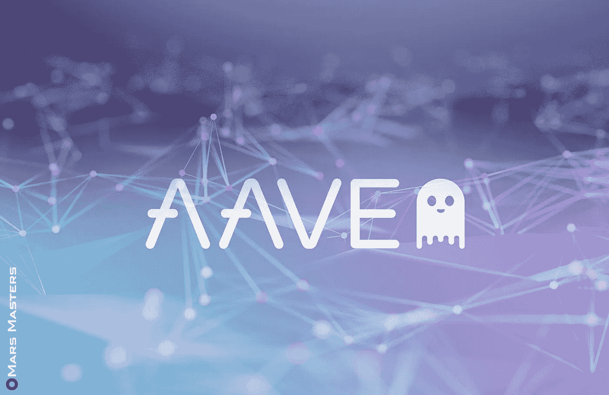

# 2022–2025 年的价格预测

> 原文：<https://medium.com/coinmonks/aave-price-prediction-2022-2025-62c922c48f41?source=collection_archive---------38----------------------->

Source photo [aave — Bing images](https://www.bing.com/images/search?view=detailV2&ccid=803Dxm%2bR&id=7D55FA12434A391EDA92854EC0DB1D2206255239&thid=OIP.803Dxm-Rbvybu7Wwv4drQwHaE0&mediaurl=https%3a%2f%2fmarsmasters.com%2fwp-content%2fuploads%2f2020%2f12%2f30DFK110-web.jpg&cdnurl=https%3a%2f%2fth.bing.com%2fth%2fid%2fR.f34dc3c66f916efc9bbbb5b0bf876b43%3frik%3dOVIlBiId28BOhQ%26pid%3dImgRaw%26r%3d0&exph=1080&expw=1662&q=aave&simid=608000952342813438&FORM=IRPRST&ck=51DA1CA0477449B18E3613DC6733F403&selectedIndex=1&ajaxhist=0&ajaxserp=0)

## AAVE 到底是什么？

如果你想借出或借入一种加密货币，你可以利用 AAVE，一种开源的、分散的、非托管的令牌。将资产存入预先建立的流动性池可能会给贷款人带来可观的利率。通过使用加密货币作为担保，仍然有可能获得即时现金预付款。