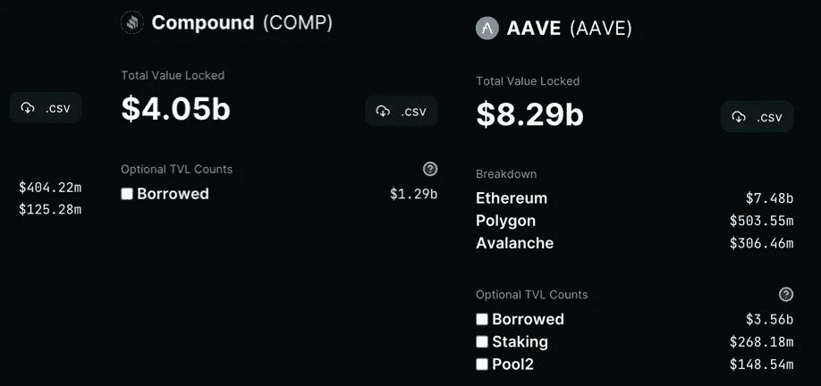
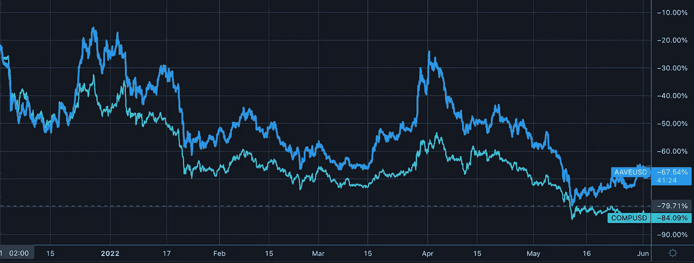
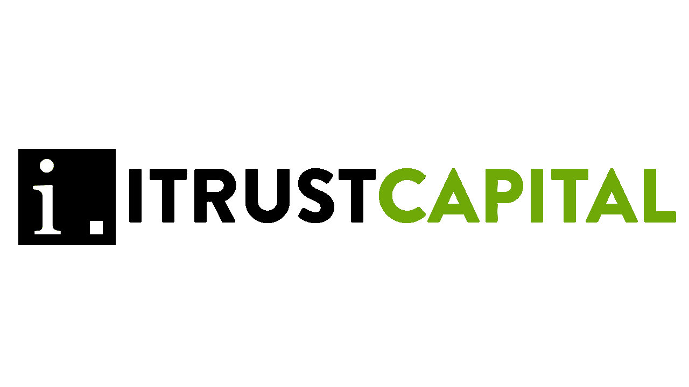

# Aave 与 Compound

> 原文：<https://medium.com/coinmonks/aave-vs-compound-b739ff09eec?source=collection_archive---------73----------------------->

# 内容(4 分钟阅读):

*   ⚔️ **Aave vs. Compound**
*   什么是 Aave？
*   什么是复合？
*   TVL 差异(总值锁定)
*   其他重大差异
*   令牌性能
*   结论
*   👀雷达下
*   🏖️个人退休帐户，避税帐户
*   🛠️就业科
*   📰基督教青年会
*   🙏🏻感激…
*   💸优惠券

# ⚔️ Aave 对化合物

[Aave](http://aave.com/) 和 [Compound](http://compound.finance/) 之间有很多不同，但最重要的是它们提供的服务、它们的 TVL(总价值锁定)、易用性以及它们的融资方式。

这两个协议都是去中心化的，非托管的，建立在以太坊区块链上，被认为是 DeFi 蓝筹。两者都是 2017 年推出的。

# 什么是 Aave？

Aave 是一个总部位于伦敦的借贷协议，用户可以作为存款人或借款人参与其中。根据 [Aave 网站](http://aave.com/)，存款人向市场提供流动性以赚取被动收入，而借款人能够以超额抵押(永久)或不足抵押(一整块流动性)的方式借款。

Aave 原名 ETHLend，其大部分资金[来自 2017 年的 ICO(首次发行硬币),约 1620 万美元](https://www.gemini.com/prices/aave)。

为了与 Aave 互动，您只需存入您喜欢的资产和金额。存入后会根据市场借贷需求获得被动收益。此外，存款资产允许您通过将存款资产用作抵押品来借款。你通过存款获得的任何利息都有助于抵消你通过借款积累的利息。

# 什么是复合？

Compound 也是在 2017 年创建的，从一开始就在加密领域受到好评。在推出后的短短 5 天内，红利券的价值翻了一番。

总部位于旧金山，其地理位置使该公司能够轻松快速地接触到风险投资者，其大部分初始资金来自风险投资者。此外，它还可以直接访问比特币基地，这是美国最大的购买、销售和存储加密货币的平台，也是在湾区创建的。比特币基地很早就将这种复合令牌上市，让它面对成千上万新的潜在投资者，让它能够在初始阶段筹集更多资金。

# TVL 差异(总值锁定)

这些平台之间的 TVL(锁定的总价值)存在很大差异。根据[aave.com](http://aave.com/)的数据，在撰写本文时，Aave 是 TVL 最大的公司，总收入为 150 亿美元。根据他们在[的主页](https://compound.finance/)，Compound 在 TVL 注册了 53 亿美元。我们看到 [DeFiLlama](http://defillama.com/) 有不同的数字。

# 其他重大差异

在本文中的两个借出协议之间，需要记住一些非常重要的区别。

*   Aave 和 Compound 在以太坊链上运行，但 Aave 提供对其他链的支持，如 Avalanche、Fantom 和 Harmony。复合仅与以太坊兼容。
*   以上也意味着 Aave 对更稳定的硬币和更多代币的支持。
*   Avalanche 用户可以将 USDT 押在支付较低天然气费用上，他们似乎正在扩大连锁选择，以便继续向他们的客户提供较低的费用。
*   Compound 不提供[快速贷款](https://www.defipulse.com/projects/aave)(必须在同一区块内偿还的借款交易)，Aave 提供。
*   在 Aave 上，借款的借款抵押比率[是 80%,这意味着你可以借入你的抵押资产价值的 80%。(即存款 100 美元，可以贷%80)。在撰写本文时，复利为 66%。](https://coinmarketcap.com/alexandria/article/how-does-aave-work)

# 令牌性能

随着熊市进入第六个月，我们看到这两种代币的表现都遭受了巨大的损失。在过去的 6 个月里，Aave 已经下跌了 67.5%，而 Compound 的市值也损失了 84.1%。客观来看，在同一时期的 6 个月内，整个加密市场的价值已经损失了 42%。

# 结论

这两个借出协议在大小、各自兼容的链以及令牌性能方面表现出很大的差异。Aave 一直致力于通过扩大其平台中可用代币和稳定硬币的数量来吸引新用户和其他连锁店的用户。Aave 似乎也更强大和稳定，而 Compound 更容易使用，因为它们的菜单更简单。

协议每天都在变化，有宏观和微观的力量可以改变与任何平台相关的回报和风险。为了避免或最大限度地减少损失，建议您始终进行尽职调查。

## [连同 iCapital](https://itrustcapital.com/referral100?utm_source=partner&utm_medium=youtube&utm_campaign=partner637&oid=10&affid=637)

加密货币是这些天每个人都在谈论的东西之一。有各种不同的交易所进行加密交易……但是很多人没有意识到他们在税费上损失了多少。

[iTrustCapital](https://itrustcapital.com/referral100?utm_source=partner&utm_medium=youtube&utm_campaign=partner637&oid=10&affid=637) 允许其客户通过个人退休账户或个人退休账户投资 crypto，而不必担心税收或费用。

IRA 是避税账户，这意味着**你所有的加密交易都是免税的，甚至可以随着时间的推移免税增长。**

没有隐藏的费用。[要了解更多信息，请点击此处并开通免费账户。](https://itrustcapital.com/referral100?utm_source=partner&utm_medium=youtube&utm_campaign=partner637&oid=10&affid=637)

[分享 Yaro 的技术& WebX 简讯](https://yarocelis.substack.com/?utm_source=substack&utm_medium=email&utm_content=share&action=share)

# 👀雷达下

*   [Waves (WAVES)](http://waves.tech/) — Waves 是一个面向 Web 3.0 应用和分散解决方案的开放区块链协议和开发工具集，旨在提高 IT 系统的安全性、可靠性和速度。它让任何人都可以开发自己的应用，促进了区块链的广泛应用。
*   [Synthetix 网络令牌(SNX)](http://synthetix.io/) —由 Kain Warwick 和 Synthetix 基金会创立的分散式合成资产发行协议。最初，它在 2017 年 9 月首次推出时被称为 Havven。在种子期和代币销售期间，它通过向投资者出售 6000 万枚 HAV 代币，成功筹集了 3000 万美元。2018 年末，该平台扩大了视野，更名为 Synthetix。如今，该平台是去中心化金融(DeFi)领域最大的去中心化衍生品交易所，截至 2020 年 11 月，其锁定的总价值(TVL)高达 7 亿美元。
*   [氦(HNT)](http://helium.com/) —氦是一个由物理区块链供电的分散式机器网络。这个网络是由网关创建的，它们同时也是我们网络中的矿工。这些网关运营商可以根据他们提供的覆盖范围以及从连接到他们网关的机器上获得的交易费来赚取代币。

## 🛠️就业版块——我们将与[the defident . io](http://thedefiant.io/)一起为您带来。

挑战性工作:

我们推出了挑战性的工作！

# 📰基督教青年会

*   [比特币制造者应该担心拜登的能源团队吗？](https://nlwcrypto.libsyn.com/should-bitcoiners-be-worried-about-bidens-energy-team)
*   [在市场波动加剧的情况下，澳大利亚首批加密 ETF 反应冷淡](https://cryptopotato.com/australias-first-crypto-etfs-received-lukewarm-receptions-amid-rising-market-volatility/)
*   “秘密冬天”过后，双子座裁员 10%交易所专注于关键产品
*   [FTX 加密交易所继日本国内收购后在日本推出](https://blockworks.co/crypto-exchange-ftx-launches-in-japan-following-domestic-acquisition/)
*   [OpenSea“内幕交易”可以看到贴有证券标签的 NFT:前 SEC 律师](https://cointelegraph.com/news/opensea-insider-trading-case-see-nfts-labeled-securities-former-sec-lawyer)
*   [秘境聊天泄露暴露重生计划内部混乱](https://beincrypto.com/secret-terra-chat-leak-exposes-internal-chaos-rebirth-plans/)
*   [随着加拿大现货比特币(BTC)交易所交易基金看到 AUM 总量上升，投资者买入该指数](https://www.cryptoglobe.com/latest/2022/06/investors-buy-the-dip-as-canadian-spot-bitcoin-btc-etf-sees-total-aum-rise/)
*   [Crypto.com 获得临时批准在迪拜开设加密交易所](https://blockworks.co/crypto-com-secures-provisional-approval-to-open-crypto-exchange-in-dubai/)
*   [Chipotle 开始接受加密支付，包括$SHIB 和$DOGE](https://www.cryptoglobe.com/latest/2022/06/chipotle-starts-accepting-crypto-payments-including-in-shib-and-doge/)
*   约翰尼·德普赢得对艾梅柏·希尔德的诽谤诉讼后，NFTs 激增
*   [以太坊价格低于 2000 美元的 3 个原因](https://cointelegraph.com/news/3-reasons-why-ethereum-price-is-pinned-below-2-000)

> 加入 Coinmonks [电报频道](https://t.me/coincodecap)和 [Youtube 频道](https://www.youtube.com/c/coinmonks/videos)了解加密交易和投资

# 另外，阅读

*   [Blockfi vs 比特币基地](https://coincodecap.com/blockfi-vs-coinbase) | [BitKan 点评](https://coincodecap.com/bitkan-review) | [Bexplus 点评](https://coincodecap.com/bexplus-review)
*   [南非的加密交易所](https://coincodecap.com/crypto-exchanges-in-south-africa) | [BitMEX 加密信号](https://coincodecap.com/bitmex-crypto-signals)
*   [MoonXBT 副本交易](https://coincodecap.com/moonxbt-copy-trading) | [阿联酋的加密钱包](https://coincodecap.com/crypto-wallets-in-uae)
*   [雷米塔诺评论](https://coincodecap.com/remitano-review)|[1 英寸协议指南](https://coincodecap.com/1inch)
*   [iTop VPN 审查](https://coincodecap.com/itop-vpn-review) | [曼陀罗交易所审查](https://coincodecap.com/mandala-exchange-review)
*   [40 个最佳电报频道](https://coincodecap.com/best-telegram-channels) | [喜美元评论](https://coincodecap.com/hi-dollar-review)