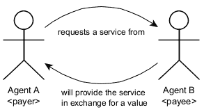

# 使用智能合同解决可靠价值转移问题的 ABC 模型—第 1 部分

> 原文：<https://medium.com/coinmonks/abc-model-for-reliable-value-transfer-problem-using-smart-contracts-part-1-44273600eb7e?source=collection_archive---------95----------------------->

在本文中，我们将讨论两个人需要建立简单的资产交换交易时出现的典型问题，这可能包括一个人需要提供服务并要求其他人提供服务以换取价格的情况。当一个潜在的付款人需要一项服务时，其费用可能要预先支付，这就带来了在没有收益的情况下损失金钱的风险。另一方面，如果服务提供商首先执行任务(因此付款将在交付和验证后提供)，则存在无法获得付款的风险。我们将讨论智能合约的解决方案，该解决方案引入了第三方同意元素，以合并验证、有效性、认证和独立机制，从而在付款人和收款人之间发生冲突时产生费用解决方案。

# 概观

*   首先，我们将讨论在两个部分之间提供单一服务的问题。
*   在讨论了一个简单的解决方案之后，我们将讨论这个解决方案的一些变化，这些变化可能会解决问题的大部分。
*   由此我们将得出项目的需求。通常我不会看到许多发布了需求的区块链项目，我希望他们能正确地完成它，如果我不编写至少一套高水平的需求来指导开发，我的安全关键开发年不会让我安宁。
*   由于在这种情况下，我是自己的客户，所以我不会费心编写 SDLC 可交付成果(SDD、SDS、SDP、STP、ICDs 等)，但我会做一些关于设计约束的笔记
*   实现和讨论将在第 2 部分进行，一些需求可能会改变，以允许更好的内部解决方案

# 问题是

假设有两个代理人，A 和 B，其中 AgentA 希望 AgentB 提供一项服务(或出售一项资产)以换取一个价格(见图)。不涉及潜在的道德不公正，为什么一个承诺会被打破，让我们假设一个代理人可以简单地死亡。至少有一种最坏的情况会发生:

## [1] AgentA 预先支付 AgentB。如果 AgentB 死亡:

1.  将不会提供该服务
2.  服务可能只提供了一部分，或者交付的解决方案不完整
3.  提供的服务可能与约定的不一致
4.  该服务可能会出现严重程度较高的故障

在所有这些情况下，钱都将丢失，对 AgentA (AgentB 死了，对吗？).

## [2] AgentB 正在按约定工作，并将在期限内完成任务。如果 AgentA 死了，资金将不会被发送。

在这种情况下，AgentB 会浪费时间和精力。时间不可能恢复(金钱也不可能，在这种情况下，因为 AgentA 死了)。

# 解决方案 1:简单的第三方

解决上述问题最简单的方法是在谈判中引入另一个元素，一个双方都信任的新人 AgentC。余额可以预先发送给 AgentC，以便为 AgentA 携带，或者保留给 AgentB。然而，明显不受控制的情况可能发生:AgentC 也可能死亡。所以:

1.  AgentA 不想将钱发送给 AgentC，因为 AgentC 可能会死亡(即使 AgentA 和 AgentB 按照约定做了所有事情，钱也不会被发送，如果 AgentA 仍然必须发送钱来支付借方，那么 AgentA 将会失败)
2.  AgentB 不希望 AgentC 在他完成服务时持有他的钱，因为 AgentC 可能会死亡(即使 AgentA 和 AgentB 按约定做了所有事情，钱也不会发出，如果不得不原谅未结的借方，AgentB 将会损失)

因此，AgentA 和 AgentB 一致认为，尽管他们都尊重 AgentC 是一个可信任的人，但因为命运是不可控制的，所以 AgentC 可能是一个可靠但不那么可靠的人，也许把钱寄给 AgentC 是没有意义的。

# 解决方案 2:否认权威和所有权

我们将使用的解决方案将拥有在需要时执行转账的权力，但将使用户免于将钱转给第三方。我们仍然会保留代理人，但是钱很快就会被转移到。相反，资金将被转移到一个锁定的容器中，而 AgentC 只被赋予解锁容器的权力，因此余额可能最终在交易结束时被转移到 AgentB。此外，由于最坏的情况是不可预料的，所以假设第三方不应该在非最坏的情况下采取行动，以尽量减少各方的努力。在这种情况下，冲突的存在将是 AgentC 行动的唯一触发因素。

理论上，这种方法仍然不能完全解决转移冲突问题，因为(AgentC 和 AgentA)或(AgentC 和 AgentB)在最坏的情况下也会死亡。我们不会在这里描述第二个问题，但只是提一下，严格地说，我们应该将其建模为一个随机过程，考虑代理死亡的分布概率，并且预期的可靠性将考虑可用调节节点(代理“C”)的数量，以支持来自先前节点的故障。然而，这不是今天的问题。

在实践中，第三个参与者的单独存在将大大增加系统的可靠性，我们还可以包括另一个作为冗余(我们在安全关键的实时系统中经常这样做)。我们将保持简单的三个代理，但解决方案可能会扩展到更多的代理与某些设施，我个人会包括一些相互排除条款，以确保调节部分的独立性。

现在可以从上述观察中提取一些要求。

# 系统规格和高级需求

[注释]代理定义

1.  存款代理人:雇佣人员，向服务提供商支付执行任务的费用
2.  服务提供商代理:任务的执行者
3.  冲突代理:在存款代理和服务提供商代理之间发生冲突时，负责危机管理批准

系统应允许存款用户使用以下功能:

1.  要为服务提供商代理定义接收钱包，请执行以下操作
2.  批准接收钱包的任意转账，仅限于发送的余额。在这种情况下，钱将自动转移到接收钱包

系统应允许服务提供商代理提供以下功能:

1.  [注释]取款功能由存款代理或冲突代理触发，因此服务提供商代理不需要采取任何行动来接收余额
2.  放弃继续执行任务的兴趣。在这种情况下，余额将自动转移回存款钱包

关于冲突:

1.  [余额被锁定]存款用户发送余额后，只有在冲突通知后得到冲突代理的批准，系统才允许将金额退回给原始用户
2.  Corolary:为了服务提供商代理或冲突代理的利益，存款所有者无权提取存款
3.  [冲突后解锁]
4.  如果冲突代理人做出有利于存款代理人的判决，则移交批准应将存款余额返还给来源(也称为存款代理人的钱包)
5.  如果冲突代理人做出有利于服务提供商代理人的判决，付款批准人应将存款余额转移到 destin(也称为服务提供商代理人的钱包)
6.  系统应允许存款代理或服务提供商代理提出冲突请求

事件信号:系统应在以下情况下发出信号:

1.  发生存款
2.  批准发生
3.  出现冲突请求

# 设计约束和注释

1.  为简单起见，系统任务将基于单个契约，这意味着每次需要任务时，都必须部署新的智能契约。
2.  在这种情况下，合同所有者将承担冲突代理的角色
3.  更好的解决方案是封装工厂模式，当需要新任务时，第二个智能契约(工厂)将在内部处理新智能契约的部署，指向新的契约处理程序，所有管理都将从上层契约完成。我们暂时不会实现这一点。
4.  像往常一样，任何改变区块链元素的操作都会产生天然气费用，包括冲突代理的批准
5.  为了降低或最大限度地减少天然气成本并允许进一步的可扩展性，将选择多边形或 Avalance 链来部署智能合同
6.  现在，我们将使用默认的传递函数来处理传递，所以首先，除了断言验证，我们不会包含任何特殊的处理。

— -

暂时就这样了。在下一篇文章中，我们将讨论实现方面。希望你喜欢，请评论如果你有一些建议(或无论如何，请评论如果你有什么酷的话要说)。

顺便说一下，项目可交付成果、最终版本要求和一般工件将在我的 Gitbook 上的 [ABC 可靠支付](https://www.blogger.com/blog/post/edit/6767650651074740066/1446408259196303961?hl=en#)部分发布。

减压阀。

如果你想支持像这样的直接发布，请发送一些 ERC-20 令牌到**0x FB 46 af 21 e 74 af 3 e 44411 c 00 f 7617 b 397204 c 6 aff**

> 加入 Coinmonks [电报频道](https://t.me/coincodecap)和 [Youtube 频道](https://www.youtube.com/c/coinmonks/videos)了解加密交易和投资

# 另外，阅读

*   [如何开始通过加密贷款赚取被动收入](https://coincodecap.com/passive-income-crypto-lending)
*   [BigONE 交易所评论](/coinmonks/bigone-exchange-review-64705d85a1d4) | [电网交易机器人](https://coincodecap.com/grid-trading)
*   [氹欞侊贸易评论](https://coincodecap.com/anny-trade-review) | [CoinSpot 评论](https://coincodecap.com/coinspot-review)
*   [新加坡十大最佳加密交易所](https://coincodecap.com/crypto-exchange-in-singapore) | [购买 AXS](https://coincodecap.com/buy-axs-token)
*   [投资印度的最佳加密软件](https://coincodecap.com/best-crypto-to-invest-in-india-in-2021) | [WazirX P2P](https://coincodecap.com/wazirx-p2p)
*   [7 个最佳零费用加密交易平台](https://coincodecap.com/zero-fee-crypto-exchanges)