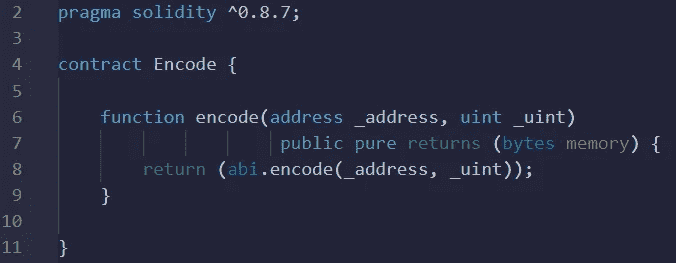
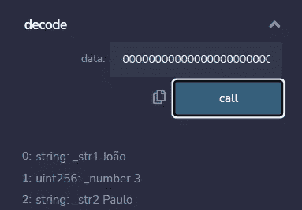

# 使用可靠性 ABI 编码和解码

> 原文：<https://medium.com/coinmonks/abi-encode-and-decode-using-solidity-2d372a03e110?source=collection_archive---------1----------------------->


智能契约基本上由状态变量和函数组成。一些函数是私有的，只能从契约内部访问，但是许多函数是公共的，可以从契约外部访问。也就是说，应用程序(和人员)可以向契约发送数据，也可以从契约中检索数据。

要向契约发送数据，我们需要以契约可以读取的方式发送数据。也就是说，它们需要被编码。以太坊虚拟机(EVM)的实现定义了如何执行这种编码的规则。规范的细节可以在这里找到[。](https://docs.soliditylang.org/en/v0.8.13/abi-spec.html)

在本文中，我们将学习一些编码规则，以及如何使用 solidity 来编码和解码必须作为函数参数发送的数据。

# 使用 abi.encode()编码函数的参数

Solidity 有一个名为 **abi** 的全局变量，它有一个编码方法，所以我们可以用它来编码任何函数的参数。让我们从一个简单的例子开始。假设我们有以下函数

```
function myFunction(address _myAddress, uint _myNumber)...
```

我们只对函数的参数编码感兴趣，即一个地址和一个整数。我们可以使用 remix 创建一个函数来实现这个功能。



部署这个契约，调用函数 **encode(…)** ，使用以下地址和无符号整数的值:(0x 5b 38 da 6a 701 c 568545 DCF CB 03 fcb 875 f 56 bed DC 4，127)，我们得到结果

```
0x0000000000000000000000005b38da6a701c568545dcfcb03fcb875f56beddc4000000000000000000000000000000000000000000000000000000000000007f
```

对结果的快速分析表明，它有 64 个字节。这是因为编码是以 32 字节的倍数进行的:

```
0000000000000000000000005b38da6a701c568545dcfcb03fcb875f56beddc4
000000000000000000000000000000000000000000000000000000000000007f
```

前 32 个字节包含地址(20 个字节)，其他 32 个字节包含整数 7f。编码总是十六进制，十六进制的 7f 是 127。

# 使用 abi.decode()解码函数的参数

现在让我们用实度来解码一个函数的参数。请注意，没有必要标识我们正在处理的函数，因为它的签名将在编码的参数之前。让问题变得复杂一点，让我们使用动态变量作为参数。

让我们使用下面的契约来解码一个值元组:string、uint 和 string。

```
contract Encode {function encode(string memory _string1, uint _uint, string memory _string2) public pure returns (bytes memory) {
        return (abi.encode(_string1, _uint, _string2));
    }function decode(bytes memory data) public pure returns (string memory _str1, uint _number, string memory _str2) {
        (_str1, _number, _str2) = abi.decode(data, (string, uint, string));            
    }}
```

部署，然后用以下参数调用函数**encode(…)**(joo，3，Paulo)，我们得到以下返回:

```
0x0000000000000000000000000000000000000000000000000000000000000060000000000000000000000000000000000000000000000000000000000000000300000000000000000000000000000000000000000000000000000000000000a000000000000000000000000000000000000000000000000000000000000000054a6fc3a36f00000000000000000000000000000000000000000000000000000000000000000000000000000000000000000000000000000000000000000000055061756c6f000000000000000000000000000000000000000000000000000000
```

你可能会期望返回 96 字节(3 x 32)，因为我们有 3 个变量。但是，3 个变量中有 2 个是动态的，动态变量的编码就没那么简单了。让我把上面的值分成 32 字节的数据块。

```
0000000000000000000000000000000000000000000000000000000000000060
0000000000000000000000000000000000000000000000000000000000000003
00000000000000000000000000000000000000000000000000000000000000a0
0000000000000000000000000000000000000000000000000000000000000005
4a6fc3a36f000000000000000000000000000000000000000000000000000000
0000000000000000000000000000000000000000000000000000000000000005
5061756c6f000000000000000000000000000000000000000000000000000000
```

我将快速解释一下在字符串的情况下编码是如何完成的。第一行引用第一个变量，第二行引用第二个变量，第三行引用第三个变量。因为第二个变量的类型是 value，所以我们可以在第二行中直接检索它的值 *3* 。

在变量类型*字符串*的情况下，包含在第一行中的数据是关于第一个字符串的信息。本例中，数据十六进制为 *60* ，十进制为 *96* 。但这意味着什么呢？这意味着关于第一个字符串的信息是在从数据开始的 96 个字节之后找到的。

在 92 个字节之后，32 个字节的块有一个数字:5。这是字符串占用的字节数，从下一行开始，utf-8 编码: *4a6fc3a36f。从十六进制转换到 UTF-8，我们检索到单词‘joo’(碰巧是我的名字)。*

按照相同的模式，可以检索 a0 字节之后的第三个字符串，也就是从数据开始处算起的 160 字节之后。它说它也有 5 个字节，它的值是 *5061756c6f，*UTF 8 编码的‘Paulo’(也是我的名字，真巧！).

既然你已经看到了如何手动操作，让我们看看如何通过 solidity 来操作。使用我们在契约中编写的函数**decode(bytes memory data)**，可以检索编码信息:



其他库也可以用来对变量进行编码和解码，比如 [**web3.eth.abi**](https://web3js.readthedocs.io/en/v1.7.1/web3-eth-abi.html) 。目前也有一个在线网站可以用于此，[abi.hashex.org/](http://abi.hashex.org/)。

**感谢阅读！**

> 加入 Coinmonks [电报频道](https://t.me/coincodecap)和 [Youtube 频道](https://www.youtube.com/c/coinmonks/videos)了解加密交易和投资

# 另外，阅读

*   [Bybit vs 币安](https://coincodecap.com/bybit-binance-moonxbt)|[stealth x 回顾](/coinmonks/stealthex-review-396c67309988) | [Probit 回顾](https://coincodecap.com/probit-review)
*   [顶级付费加密货币和区块链课程](https://coincodecap.com/blockchain-courses)
*   [CBET 回顾](https://coincodecap.com/cbet-casino-review) | [库币 vs 比特币基地](https://coincodecap.com/kucoin-vs-coinbase) | [拜比特 vs 比特币基地](https://coincodecap.com/bybit-vs-coinbase)
*   [如何在加拿大购买加密货币？](https://coincodecap.com/how-to-buy-cryptocurrency-in-canada)
*   [百无聊赖的猿游艇俱乐部(BAYC)评论](https://coincodecap.com/bored-ape-yacht-club-bayc-review)