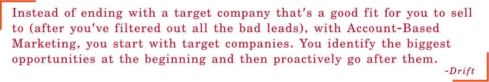
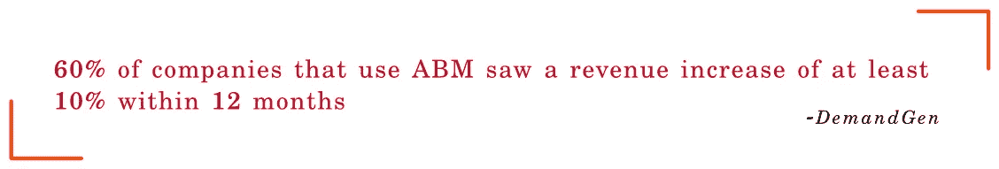
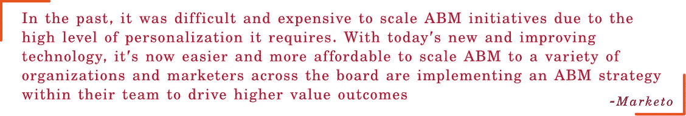
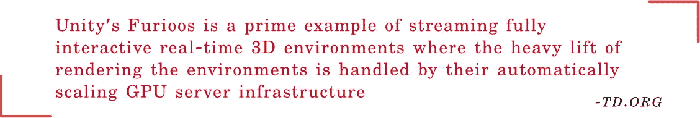

# 元宇宙神奇世界中的客户营销

> 原文：<https://medium.com/coinmonks/abm-in-metaverse-a7e7362c28ec?source=collection_archive---------25----------------------->

探索在神奇的元宇宙世界开展基于账户的营销活动的迷人假设可能性。

Marketing in Metaverse | Image Source: Freepik

至于埃隆·马斯克，我不会在这篇文章的任何地方提到《冰雪奇缘》和《预备玩家一号》，也不会使用“旅行箱”这个词。

尽管元宇宙元素的一些初始版本是裹着尿布到处爬，玩具嘎嘎作响，把 FOMO 交给投资者，主要的元宇宙元素和特征仍然在子宫里。硅谷寡头的首席执行官们给了元宇宙 10 年的时间让它振作起来，扶着墙走下去。

在某种程度上，在这个阶段讨论元宇宙的市场营销是没有意义的，因为我们不知道它将采取什么形式。即使是谷歌搜索结果前 20 名的“元宇宙营销”也只是泛泛而谈，没有太多细节。

当我在为薄荷酸辣酱削洋葱时，偶然发现了探索“元宇宙营销”的想法，我的计划是报道“元宇宙的 SaaS 营销”我很有野心，不是吗？

当我编辑“Web 3.0——它对世界上 99%的人意味着什么”时，这个计划突然被放弃了。’。我犯了一个错误，试图插入 Web 3.0 的每个方面，这最终使这篇文章变得难以理解。

我的愿景是寻找一个小而深的元宇宙市场，这让我想到了基于客户的营销，然后，所有的东西都到位了。我们要分析的很多东西都是假设的，但让我们把它们留给开发商，从营销人员的角度来看待元宇宙。

# 基于客户的营销

过去 10 年，市场营销，尤其是在 SaaS 世界，已经从一个小小的休眠卵成长为一只雄伟的、长着宽大翅膀、会喷火的巨龙。在今天实践的技术中，基于帐户的营销(ABM)在顶端有一个独特的位置。

为什么？

Why Account-based Marketing?

**目标少:**

没有预先计划的目标受众名单，SaaS 的营销人员就不必频繁地开展大规模活动。他们不是挖泥船，不会去吸收任何迎面而来的东西。他们是精确的执行者，拥有经过充分研究和记录的客户档案。约翰·威克夫妇有一个目标名单，他们会全力以赴地追捕他们。他们同样关心吸引潜在目标以及远离错误的客户，因为这可能会削弱他们的增长。

由于 SaaS 营销人员需要关注的目标较少，基于客户的营销完全符合这一模式。

**高票性质:**

SaaS 不是一个冲动购买者。这将涉及一个漫长的销售周期。营销人员无法利用目标受众的前额叶皮层来提升销售周期。这个过程背后有很多东西，而且由于它的高价地位，少数高管会参与同意出售。

因为它的高门票性质，营销人员有一个清晰的想法，谁在一个组织的目标。他们可以直接使用 Gandiva，即 ABM，而不是浪费箭囊中的其他箭。

**规模化个性化:**

为他们的公司获得 SaaS 解决方案的人不是新手，市场营销人员可以迷恋色彩丰富的文字和视觉效果。决策者了解营销是如何运作的，当他们嗅到一般的营销材料而没有任何实质内容时，他们只会关上大门，寻找有价值的替代品。为了处理大规模的个性化营销，SaaS 的营销人员依靠基于账户的营销。

不用说，基于客户的营销会给你带来最高的投资回报。

理论上，ABM 听起来很简单。但是要获得收益，组织必须拥有多层次和多接触的策略。销售和营销团队应该携手合作，向目标客户展示他们组织的最佳表现。

那么，元宇宙如何帮助营销人员让他们基于客户的营销活动更加耀眼呢？

# 元宇宙基于客户的营销

就像强制性的政府身份证明一样，每个人都有 YouTube 频道、Instagram 账户、网站和登陆页面。他们都在争夺自己的关注份额，而我们每一秒钟都被创意所淹没。

这让营销人员的工作变得紧张而富有挑战性。他们必须超越预期，抓住目标受众的注意力。

营销人员使桥接和登录页面无缝工作，以防止溢出，并确保销售线索进入销售周期的下一阶段。一旦目标出现在桥梁页面上(这意味着鱼钩起作用了)，营销人员就控制了叙述。(这就是为什么网站缩小到登陆页面，以缩小访问者的关注范围)

在非元世界中，我们(营销人员)只能控制到此为止。剩下的就看目标客户是否愿意打电话购买 SaaS 的产品了。我们通过电子邮件、图像和视频发布相关营销材料，与现实世界中的潜在目标进行互动。我们的材料只是生态系统的一部分。

**但是元宇宙给这个故事增加了一个额外的元素:一个互动的三维虚拟生态系统。我们的目标会在这个我们创造的虚拟生态系统中，与我们创造的材料互动。**

它将叙事的控制权进一步转移到营销人员一边。你将决定这个互动的虚拟生态系统将会是什么样的，并创建一个个性化的生态系统，在元宇宙开展基于账户的营销活动。

我们来分解一下它是如何被创造出来的，能做些什么。

挖掘潜在目标(可能是一个人或一群人)的个性化元素来吸引他们的注意力是 ABM 活动的第一步，即找出他们的兴趣所在，并说那种语言&展示那个世界。

有了元宇宙，你可以根据他们的兴趣创造虚拟世界。

Account-Based Marketing in Metaverse | Image Source: Pexels

如果目标是一个足球人，创建一个虚拟的足球世界。这会让他们处于舒适区，注意你要说的话。

让他们从足球更衣室进入虚拟世界。让弗格森(或他们最喜欢的经理)欢迎你的目标进入元宇宙。带他们去克里斯蒂亚诺·罗纳尔多和里奥·梅西(或任何他们喜欢的足球运动员)练习罚球和运球的场地。让他们在虚拟的 360°世界里漫游。让他们运球。巧妙地将您的副本放在目标可以互动、阅读、观看和采取下一步行动的地方。虚拟世界可以定制和个性化，以适应每个人的口味。

如果你不是足球爱好者，我们也可以讨论不同的场景。你可以创造霍格沃茨，让赫敏·格兰杰解释你的产品能做什么，以及它与格兰芬多大厅的替代品有什么不同。把他们传送到罗丝·布卡特避难的木板上，让杰克·道森告诉他们为什么要抓住一个绝好的机会，不像他那样。你的创造力是无限的。这些只是冰山一角的例子，创作者可以为他们的想法疯狂。

Creating magical worlds in Metaverse | Image Source: Pixabay

这就像为你的每一个目标制作一个个性化的广告。

构建个性化的虚拟世界听起来可能复杂且耗时。一开始，会是这样的。此外，3D 世界已经走了这么远，我们已经有丰富的材料可用。资产可以从外部来源购买，或者在一段时间后，公司可以建立自己的资产库。

即使在今天，上面提到的场景也可以通过我们的虚拟现实实现。但输出的质量不会令人身临其境和叹为观止。即使是备受赞誉的 Roblox 和分散式土地也不够令人印象深刻。不过，不会太久。各大公司正致力于软件和硬件技术，以使输出更真实、更具沉浸感。

# 元宇宙，神话

Metaverse, the Myth | Image Source: da-kuk, Getty Images

对许多人来说，元宇宙仍然是一个神话。上面讨论的营销潜力听起来似乎只是那些有多余现金的人才能用得完。就像许多其他被炒作的项目一样，元宇宙可能会被搁置。

我想不是这样的。

扎克伯格对元宇宙统治下的一切的构想可能不会成真，但 AR/VR 耳机有可能像我们的智能手机和笔记本电脑一样成为一种必不可少的设备。元宇宙将成为人们一天中一小时左右用来工作、放松或逃避现实的渠道。(它甚至可能从电视上继承了“白痴盒子”的绰号)

我们才刚刚开始。一旦元宇宙周围的炒作尘埃落定，控制权将落入创作者手中，他们可以通过精确的规划和执行来创造出令人惊叹的预算虚拟生态系统，从而取得巨大的成果。

为 SaaS 组织创造虚拟世界听起来可能是虚构的。曾几何时，文案和视频制作都外包给代理公司。如今，几乎每个人都有自己的内部团队来制作令人惊叹的素材。很快，我们可以期待 3D 设计师、排版师和主管(一些公司已经这样做了)加入内容团队，为元宇宙构建虚拟世界。

**如果你是从某一页偷的，那就是抄袭；如果你从多种渠道获得，那就是研究**😀

*   维基百科——TD.ORG
    ——元宇宙([https://www . TD . org/ATD-blog/What-is-the-元宇宙-我们在哪里，我们去哪里](https://www.td.org/atd-blog/what-is-the-metaverse-where-we-are-and-where-were-headed))什么是 Metaverse——布鲁克斯·卡纳维西
    ——今日美国——迈克·斯奈德&布雷特·莫利纳
    ——安卓权威——卡尔文·万克赫德
    ——亚洲生活方式——什么是 Metaverse
    ——Appinventiv([https://appinventiv.com/blog/what-is-metaverse/](https://appinventiv.com/blog/what-is-metaverse/))——苏迪普·斯里瓦

如果你喜欢这篇文章，一定要和你的朋友分享。让他们思考&对元宇宙感到困惑。

> 加入 Coinmonks [电报频道](https://t.me/coincodecap)和 [Youtube 频道](https://www.youtube.com/c/coinmonks/videos)了解加密交易和投资

# 另外，阅读

*   [最佳期货交易信号](https://coincodecap.com/futures-trading-signals) | [流动性交易所评论](https://coincodecap.com/liquid-exchange-review)
*   [火币的加密交易信号](https://coincodecap.com/huobi-crypto-trading-signals) | [Swapzone 审查](/coinmonks/swapzone-review-crypto-exchange-data-aggregator-e0ad78e55ed7)
*   最佳[密码交易机器人](https://coincodecap.com/best-crypto-trading-bots) | [购买索拉纳](https://coincodecap.com/buy-solana) | [矩阵导出评论](https://coincodecap.com/matrixport-review)
*   [Coldcard 评论](https://coincodecap.com/coldcard-review) | [BOXtradEX 评论](https://coincodecap.com/boxtradex-review)|[uni swap 指南](https://coincodecap.com/uniswap)
*   [比特币基地评论](/coinmonks/coinbase-review-6ef4e0f56064) | [德里比特评论](/coinmonks/deribit-review-options-fees-apis-and-testnet-2ca16c4bbdb2) | [FTX 评论](/coinmonks/ftx-crypto-exchange-review-53664ac1198f)
*   [n ave 零点回顾](/coinmonks/ngrave-zero-review-c465cf8307fc) | [Phemex 回顾](/coinmonks/phemex-review-4cfba0b49e28) | [PrimeXBT 回顾](/coinmonks/primexbt-review-88e0815be858)
*   最佳[区块链分析](https://bitquery.io/blog/best-blockchain-analysis-tools-and-software)工具| [赚比特币](/coinmonks/earn-bitcoin-6e8bd3c592d9)
*   [Cloudbet 赌场评论](https://coincodecap.com/cloudbet-casino-review) | [点火赌场评论](https://coincodecap.com/ignition-casino-review)
*   [加密套利](/coinmonks/crypto-arbitrage-guide-how-to-make-money-as-a-beginner-62bfe5c868f6)指南| [如何做空比特币](/coinmonks/how-to-short-bitcoin-568a2d0b4ae5)