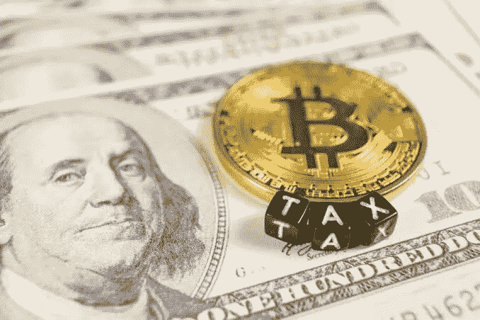
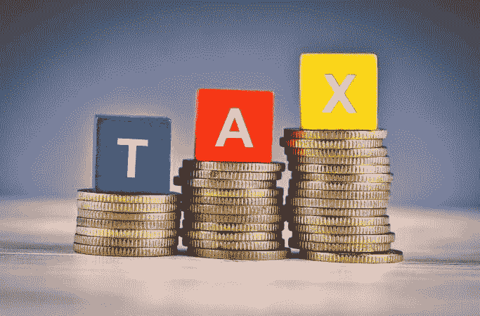

# 关于加密货币税，你需要知道的一切，在美国。

> 原文：<https://medium.com/coinmonks/about-cryptocurrency-taxes-in-the-united-states-3d19c9847d49?source=collection_archive---------40----------------------->

储存你用现金购买的**加密货币，并在没有交易的情况下安全保存，不需要支付加密税，因为没有资本收益或损失。**

**[**比特币**](https://www.bityard.com/account/register?ru=AebNkR&f=Medium) 是加密货币的祖辈，也是区块链技术的第一次正式运作。鉴于此，这是一项天生的颠覆性技术。正如区块链技术瓦解了传统的计数技术一样，比特币通过成功维持一种去中心化但安全的数字货币结果，在金融科技和货币领域取得了巨大进展。**

**[**比特币**](https://www.bityard.com/account/register?ru=AebNkR&f=Medium) 不需要银行这样的中心化机构作为其骨干。更确切地说，密码加密系统充当了组织和证实交易所需的权威。比特币矿工给他们的电脑分配开源算法的工作部分，这有助于组织和证实交易。作为对他们辛勤工作的回报，这个优秀的机构按照矿工的汗水比例向他们支付比特币报酬**

**矿工也可以将比特币兑换成美元等法定货币，或者直接用来购买商品和服务。**

**比特币和美国政府有着耐人寻味的关系。鉴于比特币标志性的波动性及其与不义者的表面联系，更不用说官员们肯定会对将金融控制权和金融政策拱手让给基本上是一种算法和那些证实交易的东西感到焦虑(如果真的会到那一步的话)，政府对主流接受这种货币感到不安是有道理的。**

# **税收、加密货币:**

**船长分享比特币交易的时刻是透明的。政府观察到历史上使用比特币的非法请求交易激增。交易所现在对比特币交易商规定了反洗钱条件，以避免激怒控制者。**

**然而，对比特币交易商来说，最大的变化是征税。**

**虽然控制者、央行行长和民事法官对如何对比特币进行分类有不同意见，但他们都认为应该对比特币进行测试。绝大多数国家也对加密货币征税。**

# **逃避秘密税似乎正在上升**

****

**无节制地将法定货币转换为 [**加密货币**](https://www.bityard.com/account/register?ru=AebNkR&f=Medium) 的交易必须支付一个数字。 [**国税局**](https://www.irs.gov/) 的“不信任骨头”站让该机构中的一些人对交易的合法性产生了怀疑，并有兴趣对实际操作这些交易的人进行背景调查。**

**逃避加密税似乎正在上升，人们试图逃避支付，人们不知道他们是否有义务支付加密税。许多人认为他们可以免除支付加密税，因为他们是这样一种免税。**

**豁免最初是为了允许处置一项资产和购买另一项类似资产的交易，而不会因第一项资产的交易而产生资本收益责任。**

# **加密货币税申报指南**

**事实并非如此，因为美国国税局已经发布了新的计算和加密税形式的指导方针，简化了税表和规则，涉及以前时代未说明的交易现在是否应该与 2020 年的税报告结合在一起。**

**在 2018 年之前，大量加密交易未被报道。许多加密交易所并没有保留所有的交易信息。人们的借口是，如果一种形式的加密货币被交易为现金价值，它也必须被计算在内。**

**带有大量加密货币印记的加密投资者和冒险富豪将受到严密审查。尤其是 5 个月后的报税。明智的做法是咨询值班律师或特定的会计师，以检查追溯到以前的任何风险敞口。**

**如果有人承认来自美国国税局的一封信，由他们转给那些知道或故意逃避秘密税款的拖欠者。不要担心，提交一份修改后的纳税申报表可能会有所帮助，因为这是一笔应得的罚款，不管罚款有多高，都比坐牢要好。**

# **加密货币实际上可以用来征税吗？**

## **用加密货币换取现金**

**包括实现你的加密税财产的收入或损失。**

## **用现有加密货币购买另一种加密货币**

**当在类似的加密货币之间转换时，使用比特币购买以太坊被视为对比特币的处置**

# **通过挖掘输入加密货币**

**包括比特币、以太坊经典以及主要的任何形式的虚拟货币。设置陷阱的硬币应该兑换成美元的价格。该数量将基于特定日期骨头的价值。**

# **为商品或服务付款**

**使用 [**加密货币**](https://www.bityard.com/account/register?ru=AebNkR&f=Medium) 在餐馆购买食物、衣服、杂货、公共交通支付等。记住，销售总额的价值应该用美元的兑换率来记录。**

****你可能感兴趣的其他文章:****

**— [**区块链技术**](/bityard/the-blockchain-technology-3f7385ad55d4)**

**— [**产量耕作解释**](/@BitYard/yield-farming-explained-3e9d07fbf409)**

**__________________________**

**比特码交换:[**BitYard.com**](https://www.bityard.com/account/register?ru=AebNkR&f=Medium)**

**客户支持:**Support @ bityard . exchange****

**业务请求:levi@bityard.exchange**

**比特码电报社区**

**BitYard 新闻和事件—[https://t.me/BITYARDNEWS](https://t.me/BITYARDNEWS)**

**英语—[https://t.me/BityardEnglish](https://t.me/BityardEnglish)**

**越南语—[https://t.me/BitYardVietNamChat](https://t.me/BitYardVietNamChat)**

**印度尼西亚语—[https://t.me/bityardindonesia](https://t.me/bityardindonesia)**

**菲律宾—[https://t.me/BityardPhilippines](https://t.me/BityardPhilippines)**

****BitYard 官方社交媒体****

**YouTube—[https://www.youtube.com/c/BityardOfficial/](https://www.youtube.com/c/BityardOfficial/)**

**https://www.facebook.com/Bityardofficial 脸书**

**推特—[https://twitter.com/Bityard_Global](https://twitter.com/Bityard_Global)**

**中等—[https://medium.com/BitYard](https://medium.com/bityard)**

****平台 BitYard 入驻****

**coin codex—[https://coincodex.com/exchange/bityard](https://coincodex.com/exchange/bityard)**

**辣椒粉—[https://coinpaprika.com/exchanges/bityard/](https://coinpaprika.com/exchanges/bityard/)**

**https://cryptoadventure.com/discover/exchanges**

> ***加入 Coinmonks* [*电报频道*](https://t.me/coincodecap) *和* [*Youtube 频道*](https://www.youtube.com/c/coinmonks/videos) *了解加密交易和投资***

# **另外，阅读**

*   **[在印度利用加密套利赚取被动收入](https://coincodecap.com/crypto-arbitrage-in-india)**
*   **[德国最佳加密交易所](https://coincodecap.com/crypto-exchanges-in-germany) | [WazirX P2P](https://coincodecap.com/wazirx-p2p)**
*   **[如何购买 Monero](https://coincodecap.com/buy-monero) | [IDEX 评论](https://coincodecap.com/idex-review) | [BitKan 交易机器人](https://coincodecap.com/bitkan-trading-bot)**
*   **[加拿大最佳加密交易机器人](https://coincodecap.com/5-best-crypto-trading-bots-in-canada) | [赌注加密](https://coincodecap.com/staking-crypto)**
*   **[如何在印度购买比特币？](/coinmonks/buy-bitcoin-in-india-feb50ddfef94) | [瓦济克斯审查](/coinmonks/wazirx-review-5c811b074f5b)**
*   **[最佳网上赌场](https://coincodecap.com/best-online-casinos) | [硬件钱包](/coinmonks/hardware-wallets-dfa1211730c6) | [Jet-Bot 评论](https://coincodecap.com/jet-bot-review)**
*   **[如何在 WazirX 上购买柴犬(SHIB)币？](https://coincodecap.com/buy-shiba-wazirx)**
*   **[比特币主根](https://coincodecap.com/bitcoin-taproot) | [排名前 6 的比特币信用卡](/coinmonks/bitcoin-credit-card-bc8ab6f377c6)**
*   **[最佳免费加密信号](https://coincodecap.com/free-crypto-signals) | [YoBit 评论](/coinmonks/yobit-review-175464162c62) | [Bitbns 评论](/coinmonks/bitbns-review-38256a07e161)**
*   **【Huobi 的加密交易信号 | [BitMEX 评论](https://coincodecap.com/bitmex-review)**
*   **[7 个最佳零费用密码交易平台](https://coincodecap.com/zero-fee-crypto-exchanges) | [购买流量令牌](https://coincodecap.com/buy-flow-token)**