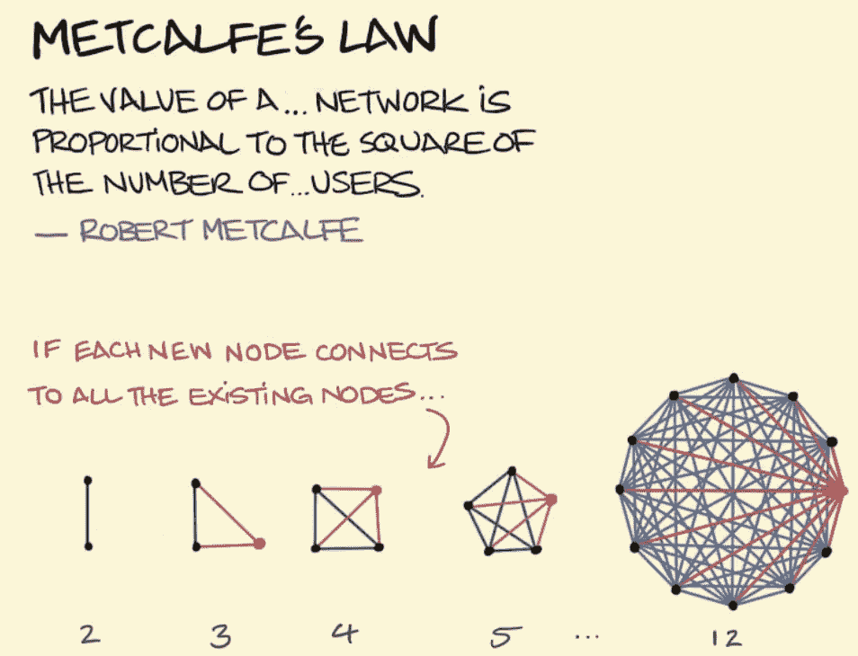
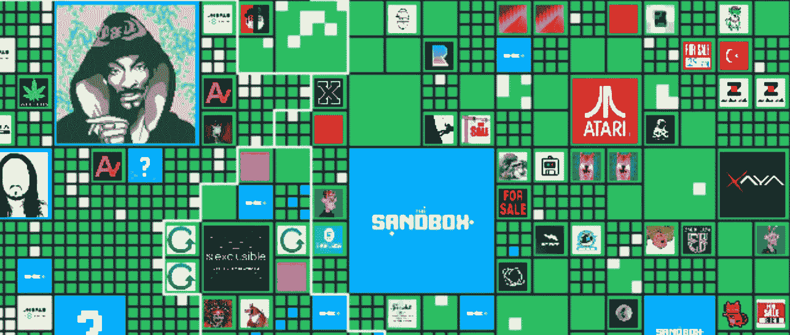

# 关于数字房地产

> 原文：<https://medium.com/coinmonks/about-digital-real-estate-24918764f11a?source=collection_archive---------34----------------------->

数字不代表假。

尽管反对现实世界和虚拟世界让人感觉很自然，但它们可能只是现实世界的两个共存层面。

Taken from unsplash.com

整个 web3 行业惊人的创新速度使得保持创新和项目的更新变得非常困难。

更不用说从根本上理解它们，把握它们的颠覆性潜力，想象明天的世界。

但有一点是肯定的:公司、风投、资产管理公司和个人投资者在著名的所谓元宇宙中看到了很多价值。

让我们找出原因。

## 你知道的比你想象的多

如果我告诉你，在过去二十年的大部分时间里，你一直在与数字房地产打交道，会怎么样？

首先，通过域名。

> URL 只不过是一个网站的地址，因此是一个数字空间。

就像在实体房地产中一样，人们猜测地址，知道他们能够以更高的价格出租或出售给那些对所述空间有更大效用的人。

著名的”。com“在一段时间内是王，但你可以让整个企业购买”。xyz“，”。io”或其他时髦的域名。

通过[ENS——以太坊域名服务](https://ens.domains/)，一个新的域名行业诞生了，这种服务允许你购买一个“域名”。eth”域，可以链接到钱包。

其次，互联网广告。

广告业本身就是一种房地产业务。

购买或租赁数字空间，其价值来自不同的标准。例如，空间提供的可见性或者将产品与空间所有者的形象相关联的价值。

赞助是后者的一个很好的例子，公司付费在你的网站、视频和在线活动中进行数字化展示，因为他们看到了将自己的形象与你的形象联系起来并接触到你的受众的价值。

## **新零件**

区块链的出现，更准确地说是 NFT 技术的出现，创造了这种识别数字资产的新能力，从而使它们变得有价值。

现在，这些资产可以很容易地被拥有、交易和验证，一个关于数字存在的全新视角正在成熟。

虚拟和增强现实等其他技术进步也是等式的一部分。

把你的虚拟土地想象成一个网站，但是是一个非常酷的网站。

尽管如此，元宇宙并不是万能的，区块链技术也是如此。

但如果你能想到一个网站对公司有用的方式，那么像元宇宙这样的数字空间也有可能增加价值。

## **棘手的部分**

[https://www.finyear.com/Bitcoin-Bears-vs-Bulls_a41994.html](https://www.finyear.com/Bitcoin-Bears-vs-Bulls_a41994.html)

估值是一场噩梦。

当市场看到像元宇宙这样的机会时，波动性就会失去控制，投机泡沫就会继续增长。

但这并不意味着兴奋背后没有支持它的东西。炒作不是你的朋友，但它可能是一个很好的指标。

理解这种炒作的一个更好的方法是试图发现促使公司和个人花费数十亿美元进入数字空间的因素。

## 稀缺

最常见的价值驱动因素:越少人能接触到某样东西，它的价值就越大。

在物理世界中，这完全说得通。

但是一旦你进入数字领域，它就变得反直觉了。

> “你可以截图 NFT”|“你可以创建你自己的元宇宙”“分散的土地太广阔了，人们只会迁移到其他地方”。

如果稀缺性是唯一的组成部分，那么在数字世界中估值将是不可能的。

如果我们推出一个总供应量为 1 的新代币，稀缺性是最大的，但如果没有办法用它交换任何东西，拥有这个唯一的代币就没有价值。

有些 NFT 实际上是 1:1 的令牌，但它们并不是孤立的。他们实际上是更大经济的一部分。

这就把我们带到了第二个也可能是最重要的价值驱动因素:网络。

## 网络效应

在一个开源软件和分叉的世界里，你如何评价两个相同的区块链或元诗句？

梅特卡夫定律因区块链的指数增长而变得非常流行，也就是分散式网络。

[https://sketchplanations.com/metcalfes-law](https://sketchplanations.com/metcalfes-law)

在某种程度上，网络效应是先行者优势背后的价值。

## 其他价值元素

除了稀缺性和网络效应，有用性和潜在投资回报率是数字资产价值的主要驱动因素。

此外，人类的行为是衡量什么是重要的重要指标；例如，为什么城市和购物中心会存在？

因为以物理或数字方式聚合实用程序是有价值的。

从消费者的角度来看，在一个地方完成所有的差事更容易。不仅仅是因为实际原因，还因为你会从不同的产品和服务中获得灵感。

对卖家来说，身处消费者所在的地方就有了竞争优势。但不仅如此，你还可以创造协同效应，从直接观察你的竞争对手中学到一切。

## **戴上眼镜**

> 同样我们不应该通过现在的知识来判断过去的想法，我们不应该专注于今天的效用来判断明天的价值。

在争论比特币作为货币的用途时，用它买咖啡的争论应该是最不需要涉及的。

这个想法很熟悉，所以听起来合乎逻辑，但比特币解决了其他问题。

类似地，通过问我们自己是否会花几个小时面对一个巨大的虚拟现实来判断元宇宙的想法是不相关的。

## 让我们试着从过去的教训中吸取教训。

[https://unsplash.com/@jplenio](https://unsplash.com/@jplenio)

商学院每个学期都会教授很多著名的商业错误。

就像柯达未能理解数码摄影将如何成为世界新标准一样。

当英特尔的首席执行官拒绝为 iPhone 开发优化的处理器，并且未能预见它将如何席卷全球。现在苹果用他们的 M1 芯片和 arm 架构打败了它。

或者是大片的股东拒绝购买网飞，并签署了他们的末日。

所有这些决定的根本原因是没有考虑到明天的世界可能与今天的世界大不相同。

## **睡前故事**

让我们试着想象一个可能代表正在发生的事情的快速场景:

在耐克收购了 RTFKT studios、多个分散的地块，并在将他们的整个客户体验游戏化并为他们的产品增加了实用性之后，他们的市场覆盖面增加了十倍。

愿意保持竞争力的阿迪达斯和锐步迅速跟进。行业中的每个竞争对手都是如此。

新的参与者进入了市场，像 Animoca Brands 和宇迦实验室创造了新的时尚潮流，使世界充满了 NFT。

奢侈品牌、视频游戏、电影，以及任何能尽快赶上创新的东西都是如此。

但不仅仅如此，SaaS 公司还利用这种传言购买土地用于营销目的。很快，他们就在各自的地块上开发了有趣的互动体验。

在他们旁边的不是别人，正是史努比·道格，他像凯利·斯雷特一样乘着元宇宙的浪潮，为在线娱乐创造了新的标准。带着音乐产业的一大块。

[https://www.sandbox.game/en/map/?liteMap&currentX=1514&currentY=948&zoom=1](https://www.sandbox.game/en/map/?liteMap&currentX=1514&currentY=948&zoom=1)

现在，特斯拉隆重登场，厌倦了被电动汽车夺走市场份额的整个汽车市场也加入了这场游戏。

你明白了…

但不仅如此，由于所有的大牌都将流量带到了元宇宙，其他服务也感受到了不通过数字方式享受二手流量的机会成本。

所以他们开始购买土地。

现代化的律师服务、设计师、开发商以及所有对利用这些虚拟土地的网络效应感兴趣的人都有理由入股。

但是你猜怎么着，土地是稀缺的。

所以价值暴涨。

即使这在这一点上是纯粹的猜测，因为技术还远没有达到我们所认为的元宇宙应该达到的程度。

然而，人们正在为即将到来的事情做准备。

要了解世界是如何为这场革命做准备的，请阅读这些专门处理数字资产纠纷的[瑞士律师](https://www.lexology.com/library/detail.aspx?g=ce5402bf-1b77-4c55-b698-810366680740)。

## **值得一游的 metaverses】**

如果一张图片可以胜过千言万语，那么网站或元宇宙呢？

你自己去参观一下，想知道明天会是什么样子:

*   [分权](https://decentraland.org/)
*   [沙盒](https://www.sandbox.game/en/)
*   [索姆空间](https://somniumspace.com/)

参观[正体](https://orthoverse.io/)，传承最具讽刺意味的教育和诚实的元宇宙。

但是还有: [Meta](https://www.youtube.com/watch?v=gElfIo6uw4g) ，[亚马逊](https://www.cnbc.com/2022/03/15/amazon-launches-metaverse-like-game-to-train-people-how-to-use-aws.html)， [Nvidia](https://www.youtube.com/watch?v=fEm99cwca2k) ，[微软](https://www.youtube.com/watch?v=Qw6UCwCt4bE)，[索尼穿越史诗游戏](https://www.business2community.com/nft-news/sony-invests-in-epic-games-metaverse-02467984) …都来了。

一如既往，时间会证明一切。

感谢您的阅读。

> 加入 Coinmonks [电报频道](https://t.me/coincodecap)和 [Youtube 频道](https://www.youtube.com/c/coinmonks/videos)了解加密交易和投资

# 另外，阅读

*   [5 款最佳加密交易终端](https://coincodecap.com/crypto-trading-terminals) | [最佳 DeFi 应用](https://coincodecap.com/best-defi-apps)
*   [最佳网上赌场](https://coincodecap.com/best-online-casinos) | [币安评论](/coinmonks/binance-review-ee10d3bf3b6e) | [BitMEX 评论](https://coincodecap.com/bitmex-review)
*   [麻雀交换评论](https://coincodecap.com/sparrow-exchange-review) | [纳什交换评论](https://coincodecap.com/nash-exchange-review)
*   [美国最佳加密交易机器人](https://coincodecap.com/crypto-trading-bots-in-the-us) | [经常性评论](https://coincodecap.com/changelly-review)
*   [在印度利用加密套利赚取被动收入](https://coincodecap.com/crypto-arbitrage-in-india)