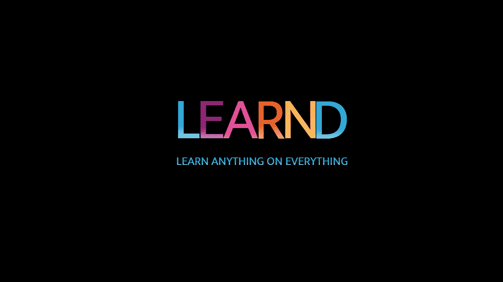
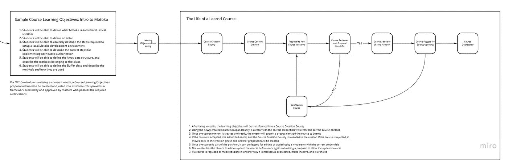
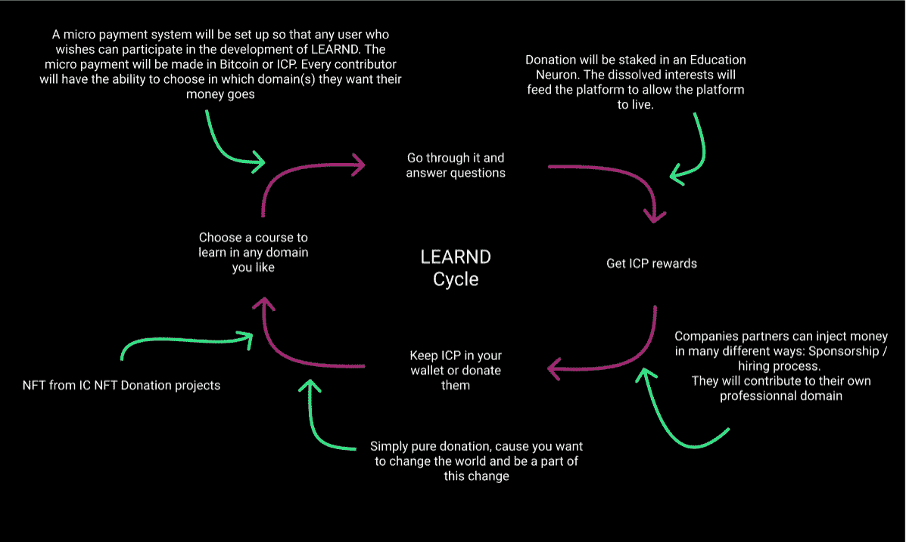

# 关于学习:学习任何东西

> 原文：<https://medium.com/coinmonks/about-learnd-learn-anything-on-everything-94814b5f408b?source=collection_archive---------43----------------------->

LEARND 是一个在互联网计算机上运行的社区驱动的教育平台。

我们希望提供一种新的学习和激励方式，使用加密资产，使用社交网络进行社区投票，奖励学习者和教师。

有偿学习是这个概念的要点。但是你可以看到 LEARND 可以为教育做些什么，并且重塑了我们对教育的看法。

LEARND 是一个长期项目。我们相信时间、工作、耐心和社区是完成我们的旅程的主要力量，通过使用区块链技术和环境来永远改变教育。

这不仅仅是一个路线图，而是整个 LEARND 概念。

所以，慢慢来，把这个网站放到你的收藏夹里，随时回来！

# 学习者

## 学习任何东西，学习者将能够参加课程，完成模块…

学习者将能够参加课程、完成模块、学习路径，还能以 [NFT 的形式获得认证。因此，It](http://NFT.It) 将通过与 ICP 价格挂钩的 LEARND 和 tokens 获得报酬。但是也可以直接接收 ICP。

用户将可以访问他选择的学科的所有词汇。他将有机会进入一个现场虚拟课堂，因为有帮助机器人，然后将能够分享他的知识或在这个课堂上遇到的问题，这将遵循相同的培训。用户将能够在他的个人资料页面上看到他的进展，将能够搁置他感兴趣的课程，并看到已完成的课程。

他将能够用照片和用户名个性化他的个人资料。他还可以通过提交问题来参与测试的创建。学习者最终将能够使用搜索过滤器更具体地搜索课程、特定领域、报酬金额或特定教师。

# 教师

## 教什么都行:老师可以给学生上课…

教师将能够在该平台上免费授课，并与用户一样获得报酬。他将能够建立自己的追随者基础，并从他的学生那里获得学习方面的提示。课程水平越高，老师的报酬就越高。

他们将可以访问自己的个人资料页面，并能够跟踪自己开发的课程、模块、学习路径或证书的进度。他可以进入老师的房间，这样他就可以与其他老师互动，寻求帮助、建议或对他的工作进行评论。

一门课程的结构如下:5 页，每页的末尾有一个问题，期末考试有 10 个问题。目前，该应用程序支持文本和图像。视频当然会随后出现[。为了创建一个完整的课程，教师需要提交 20 个问题来帮助创建一个题库，以防止机器人作弊。](http://later.To)

## 如何成为一名学习者和教师:任何人都可以创造自己的课程…

任何人都可以使用一个工具创建自己的课程、模块、学习路径或证书:社区内容创建系统。每个人都可以使用这个工具，它看起来很像一个博客(中型)网站。

每个创建者将能够广告它以获得足够的资金来操作他的证书(参见下面“令牌组学”下关于令牌组学的条款)。基于内容的质量、可靠性、有用性和难度的众筹，在有限的时间内获得资金。如果获得资金，内容将提交给 LEARND 团队进行验证。如果通过验证，创建者将被授予第一个内容创建者徽章(可以是 NFT？！).有不同的徽章可供选择:初级——中级——专家，这将允许每个创作者在他们选择的领域创造他们的电子声誉。并将能够自称成为一名教师。

如果没有获得资金，创作者将被拒绝张贴其内容。然后，他可以转向社区，在他们的帮助下再次试试运气。在一起，我们更强大！！

# 社区

## 社区驱动，社区将发挥核心作用

该社区将发挥核心作用，由用户、教师、普通游客甚至捐赠者和储户组成。

社区将是平台开发的基础，因为它将被要求就课程、模块、学习路径或证书的整合与否进行投票。流程如下:

LearndLifeCycle

将通过投票做出决定，每个投票人的权重或多或少取决于他们对平台的参与和投资程度。

例如:拥有多个 NFT 证书的用户将比一个简单的访问者拥有更多的投票权。一个对证书贡献很少的教授将比一个参与很多的教授拥有更少的投票权。参与式民主制度建立在平台内，是其运作的核心。

# 伙伴关系

## 学院:学术伙伴关系，创建伙伴关系的第一种方式

建立伙伴关系的第一种方式是，联系希望将课程、模块、学习路径或证书放到网上的大学或学校。然后他们将能够把工作交给他们的老师，或者号召学习者和老师们一起创建他们的课程。

学习者学习具有更大内在价值的认证课程的能力将允许他们获得更多代币。

与学术机构的伙伴关系可以是财务上的、战略上的，或者仅仅是知识共享。

学习者也可以通过 LEARND 申请这些学校和大学的选择。

# 公司

## 公司伙伴关系:LEARND 将能够改变自己

LEARND 将能够把自己转变成一个招聘平台。事实上，公司将能够要求 learn 创建一门课程、一个模块、一条学习路径或一张 NFT 证书，以证明所寻求的技能。

公司也将能够使用搜索过滤器来找到符合他们研究的学习者。

然后，学员将有机会申请职位，同时在一个平台上证明自己的能力。

## Distrikt 和其他 IC Dapps

LEARND 将能够与 IC Distrikt 上的社交网络合作。

不同的地区将能够在他们的社区创建的课程、模块、学习路径或证书上会面并测试他们的技能。

最终，learn 希望与其他 IC 结构建立合作关系，如 ToniqLabs，用于将 NFTs 认证集成到 learn 中。

与门户网站互动的可能性，以便教师提供流式课程。以及沿路的许多其他人。

适度可以由 Modclub 完成

可能性是无限的…

# 经济和奖励

## ICP 奖励:奖励学习者和教师

将有可能向 LEARND 平台捐款，以奖励学习者和教师。以及开发人员。

这些捐赠的一部分将被堆积在一个专门用于教育的神经元中。被化解的利益会反哺平台，让平台活下去。

将建立一个小额支付系统，以便任何用户都可以参与 LEARND 的开发。小额支付将以比特币或 ICP 支付。

LEARND token 将在平台内创建一种货币，并且只能在平台内使用，即给予 LEARND token 用于小费或其他用途。它可以通过 ICP 进行交换，但不能在代币交换平台上转售。

learndProcess

奖励价格也将与比较方案的价格挂钩。为了避免过多的资金外流，这些凭证将有一个固定的价格。

由此产生的课程、模块和学习路径将根据[证书的价值给予比例奖励。As](http://certificate.As) 以及按证书通过次数计算的递减补偿。

然后将有一个定义的次数，证书可以通过[。在此递减结束时，将从社区请求新的证书请求。](http://passed.At)

例如:给定主题的证书将获得 1 ICP 的 ICP 量。如果该证书有两条学习路径，每条路径将获得 0.5 ICP。如果每个课程包含 2 个模块，每个模块将分配 0.25 ICP。

如果每个模块包含 2 门课程，每门课程将分配 0.125 ICP。最后，每门课程有 1 次完整的测试，每次测试将向学习者支付 0.0625 ICP(前提是学习者有 100%的正确答案)。

从一开始，将给出可用证书的数量。此外，在本例中，该证书共授予 10 个 ICP，将有 10 名学员有可能获得该证书。

对于教师的报酬，将是同样的事情。将预先定义 ICP 的最大数量。

仍然根据上面给出的例子，参与证书开发的教授将能够声称获得 1 ICP，只要他创建所有的证书。否则，如果他编写或创建了包括测试在内的整个课程，他可能会获得 0.125ICP

除此之外，教授将能够获得 LEARND 代币作为小费，他可以将这些代币转换为 ICP 或给社区，或者给一个他喜欢为未来证书付费的域。

# NFT 证书/ NFT 学习证书:NFT 的选择

其他选择，基于与比较方案奖励相同的系统。

LEARND 将与真实合法的 NFT 项目合作。例如:完成整个项目的学员可以获得 10 张 NFT 证书。一个是学习者。每一个 NFT 索取和给予的东西都可以作为转口港在市场上出售。

## 和

成功完成证书课程者将获得 NFT 学习证书。

这些学习证书将是工作/知识/技能的证明，可以展示给世界上的其他人，尤其是招聘的公司。

最终，learn 希望与其他 IC 结构建立合作关系，如 ToniqLabs，用于将 NFTs 认证集成到 learn 中。

谁来管理这些美丽的烂摊子？未来学习者和员工！！

# 将来的

## 学习和赞助:在未来，教育赞助

将来，根据合作关系的不同，可以用 LEARND tokens 或 ICP 来交换商品或服务。看到甚至能够从将要成为学习和合作伙伴的公司购买/接收购物优惠券。

示例:一家运动纺织品公司决定投资教育，并选择 LEARND。该公司没有为那些毁掉我们生活和屏幕的广告买单，而是出资创建了一个体育商业证书。

这家公司花的钱将支付给学生和老师。但这家运动纺织品公司将有权向所有通过证书或甚至一个或另一个模块的人提供优惠券或产品作为回报。

。原则上，证书的数量总是有限的。10 合作公司提供的体育商业证书，有可能将其奖励用于所提供的产品本身。想象一下，在你热爱的领域中，有你特别喜欢的品牌…

公司的选择最初将由 LEARND 团队做出。然后，此后，社区将能够投票决定是否让一家公司成为平台的合作伙伴。

其他特征会浮现，耐心点！

# 创始人

你可以叫我查理。我是一名初级网页开发人员。住在法国远离城市的乡村。

我是一个理想主义者，通过参与自然和自给自足的项目来建立一个受人尊敬的生活。

我坚信地球上的每个人都有一份礼物，可以与全世界分享，让世界变得更美好。我相信人与人之间的教育，通过语言、艺术、文化和各种形式传递知识。

我希望有一天 LEARND 会给这个世界带来每个人都应该得到的良好教育。而不是成为某些人的特权。

当无知消亡时，深刻的变化就会到来。你能帮我杀死那个“无知”吗？

# 想法和希望

希望将真实带入虚拟，并为人们提供帮助，通过学习和知识的传播，他们将能够看到自己的真实生活朝着正确的方向发展。

如果你喜欢这一切，你可以通过与你周围的人交谈并参与它的发展来支持 LEARND。

LEARND 急需寻找一名开发人员。这个项目是一个长期项目。5 到 10 年。

我们相信教育是地球上每个人不可剥夺的权利，我们将努力让所有人都享有这一权利。不管需要多长时间。

**链接:**

网站

https://learnd.dedn.eu/

地区

【https://az5sd-cqaaa-aaaae-aaarq-cai.ic0.app/u/CharlieWaff 

DSCVR

[https://h5aet-waaaa-aaaab-qaamq-cai.raw.ic0.app/p/learnd](https://h5aet-waaaa-aaaab-qaamq-cai.raw.ic0.app/p/learnd)

推特

[https://twitter.com/LEARNDTEAM](https://twitter.com/LEARNDTEAM)

不调和

 [## 加入 LEARND 和 Discord 服务器！

### 在 Discord 上查看 LEARND 社区-与 382 名其他成员一起闲逛，享受免费的语音和文本聊天。

不和谐. gg](https://discord.gg/q3bqxZ5gcR) 

> 加入 Coinmonks [电报频道](https://t.me/coincodecap)和 [Youtube 频道](https://www.youtube.com/c/coinmonks/videos)了解加密交易和投资

# 另外，阅读

*   [CoinDCX 评论](/coinmonks/coindcx-review-8444db3621a2) | [加密保证金交易交易所](https://coincodecap.com/crypto-margin-trading-exchanges)
*   [红狗赌场评论](https://coincodecap.com/red-dog-casino-review) | [Swyftx 评论](https://coincodecap.com/swyftx-review) | [CoinGate 评论](https://coincodecap.com/coingate-review)
*   [Bookmap 点评](https://coincodecap.com/bookmap-review-2021-best-trading-software) | [美国 5 大最佳加密交易所](https://coincodecap.com/crypto-exchange-usa)
*   [如何在 FTX 交易所交易期货](https://coincodecap.com/ftx-futures-trading) | [OKEx vs 币安](https://coincodecap.com/okex-vs-binance)
*   [CoinLoan 评论](https://coincodecap.com/coinloan-review) | [YouHodler 评论](/coinmonks/youhodler-4-easy-ways-to-make-money-98969b9689f2) | [BlockFi 评论](https://coincodecap.com/blockfi-review)
*   [XT.COM 评论](https://coincodecap.com/profittradingapp-for-binance)币安评论 |