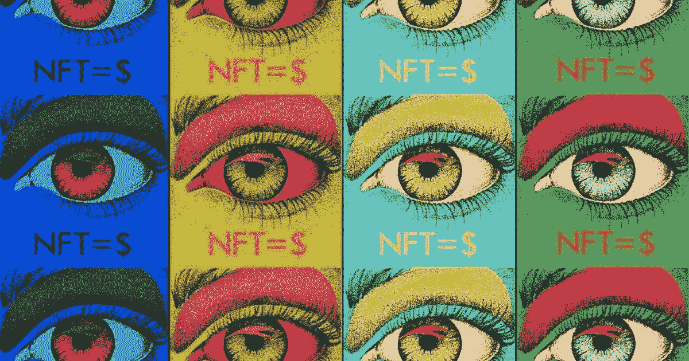

# 关于卡尔达诺的代币

> 原文：<https://medium.com/coinmonks/about-tokens-on-cardano-9eb0ce1e4124?source=collection_archive---------4----------------------->

Cardano 允许发行令牌和编写分散的应用程序。阿达币和代币有什么区别？不同的代币可以有什么市场价值，为什么？要让代币长期保值，需要做些什么？持有代币有什么风险？让我们在本文中对此进行探讨。

# TLDR

*   阿达币是由卡尔达诺协议发行的。代币可以是…