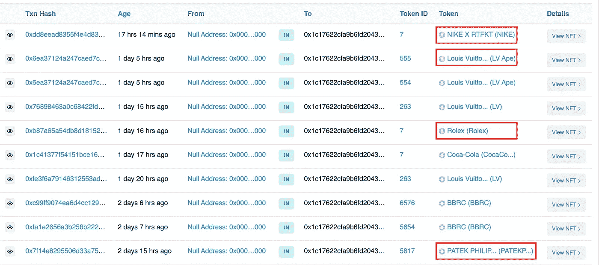

# 关于观鲸

> 原文：<https://medium.com/coinmonks/about-whale-watching-d2bc70c06b3f?source=collection_archive---------37----------------------->

公开区块链最酷的一点是，你可以观察投资者做什么，并从中学习。

[https://unsplash.com/](https://unsplash.com/)

是什么造就了鲸鱼，这在很大程度上取决于你问的是谁。

鲸鱼的定义并不重要，很大程度上取决于你观看鲸鱼的目的。

鲸鱼有钱，有影响力，可能还有很好的关系网。也就是说他们可能接触到有用的信息。

开始可能会令人困惑，所以这里有一个循序渐进的指导来开始你的旅程。

## **入门**

有不同种类的工具用来观察鲸鱼。

*   扫描
*   分析软件(免费或免费)
*   观鲸账户
*   你妈的照片

**扫描**

这些是所有工具中最基本的，它们允许你探索区块链上的每一个动作。

每个区块链都有自己的:[以太坊](https://etherscan.io/)，[索拉纳](https://solscan.io/)，[雪崩](https://explorer.avax.network/)，[泰佐斯](https://tzstats.com/)，[卡斯珀](https://cspr.live/)等。

[https://etherscan.io/](https://etherscan.io/)

这些网站可以让你看到区块链上的每一笔交易。

从那以后，唯一的限制就是你的创造力和耐心，以及技术的技术限制。

观鲸的方式可以根据你的目标而有所不同。

不要列出不同的用例，让我们只举一个例子，然后从那里开始。

## 让我们开始吧

例如，我想看看那些拥有大量金恩硬币的人是怎么回事。

我们首先打开 Coingecko 来获取我们需要的信息。

[https://www.coingecko.com/fr/pi%C3%A8ces/enjin-coin](https://www.coingecko.com/fr/pi%C3%A8ces/enjin-coin)

在那里，您可以复制合同地址并将其插入以太网扫描，或者只需单击以太网扫描按钮。

[https://etherscan.io/token/0xf629cbd94d3791c9250152bd8dfbdf380e2a3b9c](https://etherscan.io/token/0xf629cbd94d3791c9250152bd8dfbdf380e2a3b9c)

从这里，你可以决定看看转会去了解发生了什么，或者持有人，如果你正在寻找和我们一样的信息。

当然,“分析”标签有助于寻找趋势。

一旦你到了持有者部分，就该开始导航了。

就在第 50 个位置，我们找到了一个有趣的固定器，我们的观鲸活动开始了。

[https://etherscan.io/token/0xf629cbd94d3791c9250152bd8dfbdf380e2a3b9c](https://etherscan.io/token/0xf629cbd94d3791c9250152bd8dfbdf380e2a3b9c)

它有价值近 200 万美元的金恩硬币，这使我们认为这可能是一个有趣的钱包。

所以让我们开始吧。

[https://etherscan.io/token/0xf629cbd94d3791c9250152bd8dfbdf380e2a3b9c?a=0x1c17622cfa9b6fd2043a76dfc39a5b5a109aa708](https://etherscan.io/token/0xf629cbd94d3791c9250152bd8dfbdf380e2a3b9c?a=0x1c17622cfa9b6fd2043a76dfc39a5b5a109aa708)

一旦我们上了他的地址，我们可以看到一些有趣的事实:

*   最后一笔交易是在几小时前完成的，所以它们是活跃的
*   他们有进有出的交易，这似乎是有机的
*   金额通常看起来很大

现在让我们更好地了解他的资产。为此，我们点击上图左上角的他的地址。

观鲸越来越好了。整个钱包差不多值 2800 万美元。

我们可以通过点击右下角的钱包图标来更好地查看所拥有的资产。

[https://etherscan.io/tokenholdings?a=0x1c17622cfa9b6fd2043a76dfc39a5b5a109aa708](https://etherscan.io/tokenholdings?a=0x1c17622cfa9b6fd2043a76dfc39a5b5a109aa708)

现在我们可以看看前 10 大持仓。例如，我们第一次看到 Ankr 网络，看看这个项目可能会很有趣。

这肯定不是财务建议，稍后我们会看到这种数据如何被用来对付我们。

例如，你可以查看他最近的交易，找出一些有用的信息。

[https://etherscan.io/address/0x1c17622cfa9b6fd2043a76dfc39a5b5a109aa708#tokentxns](https://etherscan.io/address/0x1c17622cfa9b6fd2043a76dfc39a5b5a109aa708#tokentxns)

看起来他们目前看好柴犬，他可能会在晚些时候转售它们，如果这个信息引起你的共鸣，你可以继续关注——尽管是 NFA。

我们也可以去看看他的 NFT 收藏，我们可能会在那里发现一些有趣的东西。

[https://etherscan.io/address/0x1c17622cfa9b6fd2043a76dfc39a5b5a109aa708](https://etherscan.io/address/0x1c17622cfa9b6fd2043a76dfc39a5b5a109aa708)

为此，我们前往“Erc721”选项卡，我们也可以尝试“Erc1155”选项卡。

[https://etherscan.io/address/0x1c17622cfa9b6fd2043a76dfc39a5b5a109aa708#tokentxnsErc721](https://etherscan.io/address/0x1c17622cfa9b6fd2043a76dfc39a5b5a109aa708#tokentxnsErc721)

在这里我们可以看到一些很酷的收藏。似乎他们今天早些时候铸造了一个耐克 x RTFKT NFT。

之后，我们使用右边的“查看 NFT”按钮来查看 NFTs。也许我们发现了一个好的 NFT 交易者，可以激励我们。

[https://etherscan.io/nft/0x856eeb57101bd6aa76c6d97b74c399997ca07aaa/7](https://etherscan.io/nft/0x856eeb57101bd6aa76c6d97b74c399997ca07aaa/7)

可惜这些 NFT 好像都是假的。

正如我们之前所说的，观鲸可能会被用来对付你。

向不情愿的地址空投代币是一种常见的做法，希望观鲸者抓住这个机会，试图购买。

如果我们发现了一个很酷的 NFT 收藏，我们会继续检查交易，行为模式或任何其他有用的信息，如链接地址等。

你明白了。

正如我们所见，你可以从探索区块链中获得不同种类的信息:

*   市场上发生了什么，鲸鱼是买还是卖
*   鲸鱼还拿着什么硬币
*   鲸鱼对什么新项目感兴趣
*   项目的令牌分配有多分散

[https://etherscan.io/token/tokenholderchart/0xf629cbd94d3791c9250152bd8dfbdf380e2a3b9c](https://etherscan.io/token/tokenholderchart/0xf629cbd94d3791c9250152bd8dfbdf380e2a3b9c)

例如，在这里我们可以看到金恩代币在持有者中的分布。很多最大的持有者是交易所，通过智能合约定义协议和鲸鱼。

## **替代品**

除了自己寻找信息，你还可以关注专门观察鲸鱼的 Twitter 账户来获取市场信息。

这里有一些推特账号可以帮你做到这一点:

*   [鲸鱼警报](https://twitter.com/whale_alert)
*   [NFT 鲸鱼警报](https://mobile.twitter.com/nftwhalealert)
*   [还有著名的鲸表 WA](https://twitter.com/whalewatchwa)

如果你想要的不仅仅是 Twitter 账户，或者你想要专业的信息来对冲市场风险，你应该考虑一些链上分析服务提供商，举几个例子:

*   [链条分析](https://www.chainalysis.com/)
*   [南森](https://www.nansen.ai/)
*   [CryptoQuant](https://cryptoquant.com/asset/btc/chart/exchange-flows)
*   [玻璃节点](https://glassnode.com/)

## **最后的想法**

不管目标是什么，能够做一些链上分析会变得非常方便。

crypto 的日益流行是不可否认的，它可能是一项值得努力的技能。

最好的学习方法是尝试和这些不同的区块链探险家一起玩耍。

链上分析应被视为第三种分析。根据基本面和技术面的分析。单独来看，这些分析方法可能会遗漏一些重要信息。

考虑将它们结合使用，使你的猜测更准确。

记住，这绝不是财务建议，最重要的是，要警惕鲸鱼，因为它们知道自己被监视着。

感谢您的阅读，

保重。

## **奖金**

这是维塔利克·布特林自己的钱包。

剧透:容纳 32 万 ETH。

> *加入 Coinmonks* [*电报频道*](https://t.me/coincodecap) *和* [*Youtube 频道*](https://www.youtube.com/c/coinmonks/videos) *了解加密交易和投资*

# 另外，阅读

*   [3 商业评论](/coinmonks/3commas-review-an-excellent-crypto-trading-bot-2020-1313a58bec92) | [Pionex 评论](https://coincodecap.com/pionex-review-exchange-with-crypto-trading-bot) | [Coinrule 评论](/coinmonks/coinrule-review-2021-a-beginner-friendly-crypto-trading-bot-daf0504848ba)
*   [莱杰 vs n rave](/coinmonks/ledger-vs-ngrave-zero-7e40f0c1d694)|[莱杰 nano s vs x](/coinmonks/ledger-nano-s-vs-x-battery-hardware-price-storage-59a6663fe3b0) | [币安评论](/coinmonks/binance-review-ee10d3bf3b6e)
*   [Bybit Exchange 审查](/coinmonks/bybit-exchange-review-dbd570019b71) | [Bityard 审查](https://coincodecap.com/bityard-reivew) | [Jet-Bot 审查](https://coincodecap.com/jet-bot-review)
*   [3 commas vs crypto hopper](/coinmonks/3commas-vs-pionex-vs-cryptohopper-best-crypto-bot-6a98d2baa203)|[赚取加密利息](/coinmonks/earn-crypto-interest-b10b810fdda3)
*   最好的比特币[硬件钱包](/coinmonks/hardware-wallets-dfa1211730c6) | [BitBox02 回顾](/coinmonks/bitbox02-review-your-swiss-bitcoin-hardware-wallet-c36c88fff29)
*   [BlockFi vs 摄氏](/coinmonks/blockfi-vs-celsius-vs-hodlnaut-8a1cc8c26630) | [Hodlnaut 点评](/coinmonks/hodlnaut-review-best-way-to-hodl-is-to-earn-interest-on-your-bitcoin-6658a8c19edf) | [KuCoin 点评](https://coincodecap.com/kucoin-review)