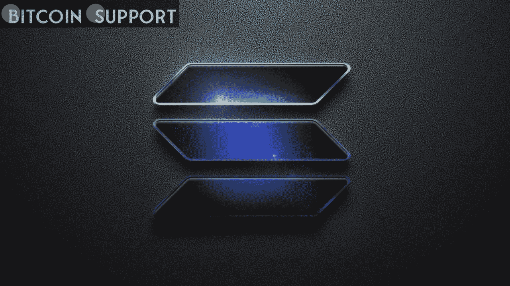

# AC 米兰提供 NFT 系列，Magic Eden 现在接受索拉纳项目的代币，等等

> 原文：<https://medium.com/coinmonks/ac-milan-offers-an-nft-collection-magic-eden-now-takes-tokens-from-solana-projects-and-more-c80a9c713284?source=collection_archive---------76----------------------->

AC 米兰表示，NFT 募捐所得将用于支持俱乐部慈善机构米兰基金会的工作。意大利职业足球俱乐部 AC 米兰将与 BitMEX 加密货币交易所联合推出首个不可伪造代币(NFT)项目，收益将惠及该俱乐部的慈善机构米兰基金会(Fondazione Milan)。

限量版收藏将包括 75，817 NFT，这是该俱乐部主场圣西罗球场的容量，还将包含丹麦战地摄影师 Jan Grarup 去年 12 月在南苏丹拍摄大面积洪水时发现的一件球衣的 3D 图像。

BitMEX 与 AC 米兰联手支持该计划，为首批 10，000 个预购者提供交易折扣和“其他额外津贴”。BitMEX 还将通过收购“大量”的 NFTs 向米兰基金会捐赠。根据新闻稿，这笔资金将用于支持该俱乐部在全球范围内的慈善事业，尤其是正在持续的乌克兰危机和联合国儿童基金会在南苏丹的一个项目。魔法伊甸园现在将接受来自德戈斯和奥洛里·区块链项目的硬币。据 DappRadar 报道，sola(SOL)NFTs 销量最大的市场 Magic Eden 已经表示，它将在未来几周内开始接受 sola NFT 两个著名项目的代币:DeGods DUST 和 Aurory 的 AURY。

market place 最初在 3 月下旬暗示将纳入 DUST coin，并在 3 月 31 日发推称，“brb integrating $ DUST。”4 月 1 日，一条标签为“$AURY”的推文描绘了一幅魔法伊甸园主题酒吧的图画。

[https://twitter.com/MagicEden/status/1509953696427220996](https://twitter.com/MagicEden/status/1509953696427220996)

根据 Magic Eden 自己的数据，DeGods 是最近 30 天交易量最大的藏品，交易总额为 307121 索尔，约合 3380 万美元。根据 DappRadar 的数据，Aurory 在索拉纳 NFT 项目的总销售额中排名第三，创下了 7950 万美元的历史记录。继 OpenSea 宣布将合并 Solana，使两个平台直接对抗之后，加入代币可能是该平台将自己打造成 Solana 的本土 NFT 市场的最新举措。据报道，该平台的内容和营销负责人黄美英表示，该平台有兴趣整合其他“蓝筹”NFT 收藏的代币。

**索拉纳 NFT 的销量正在增加。**

索拉纳 NFT 出现巨量飙升；根据分析公司 CryptoSlam 的数据，在过去 24 小时内，索拉纳区块链的 NFT 销售额超过了 920 万美元，增长了 51.5%。继 OpenSea 声明将整合区块链之后，Solana NFTs 的交易量出现下降。从 3 月 30 日 OpenSea 宣布 Solana 整合到 4 月 6 日整合上线的前一天，交易量暴跌了 34.4%。以太坊(ETH)仍然是最受 NFTs 欢迎的网络，在过去的 24 小时内销售额达到 4940 万美元。

**其他有用信息**

星巴克宣布进入 NFT 市场，首席执行官霍华德·舒尔茨声称该公司将“在今年年底前的某个时候进入 NFT 市场”由汤姆·布拉迪共同创建的 NFT 平台 Autograph 宣布与 ESPN 达成一项多年协议，将制作一部名为《竞技场上的男人:汤姆·布拉迪》的纪录片，记录这位 NFL 传奇人物的职业生涯。

**免责声明:以上为作者观点，不应视为投资建议。读者应该自己做研究。**

> 加入 Coinmonks [电报频道](https://t.me/coincodecap)和 [Youtube 频道](https://www.youtube.com/c/coinmonks/videos)了解加密交易和投资

# 另外，阅读

*   [如何在 FTX 交易所交易期货](https://coincodecap.com/ftx-futures-trading) | [OKEx vs 币安](https://coincodecap.com/okex-vs-binance)
*   [OKEx vs KuCoin](https://coincodecap.com/okex-kucoin) | [摄氏替代品](https://coincodecap.com/celsius-alternatives) | [如何购买 VeChain](https://coincodecap.com/buy-vechain)
*   [ProfitFarmers 点评](https://coincodecap.com/profitfarmers-review) | [如何使用 Cornix Trading Bot](https://coincodecap.com/cornix-trading-bot)
*   [如何匿名购买比特币](https://coincodecap.com/buy-bitcoin-anonymously) | [比特币现金钱包](https://coincodecap.com/bitcoin-cash-wallets)
*   [瓦济里克斯 NFT 评论](https://coincodecap.com/wazirx-nft-review)|[Bitsgap vs Pionex](https://coincodecap.com/bitsgap-vs-pionex)|[坦吉姆评论](https://coincodecap.com/tangem-wallet-review)