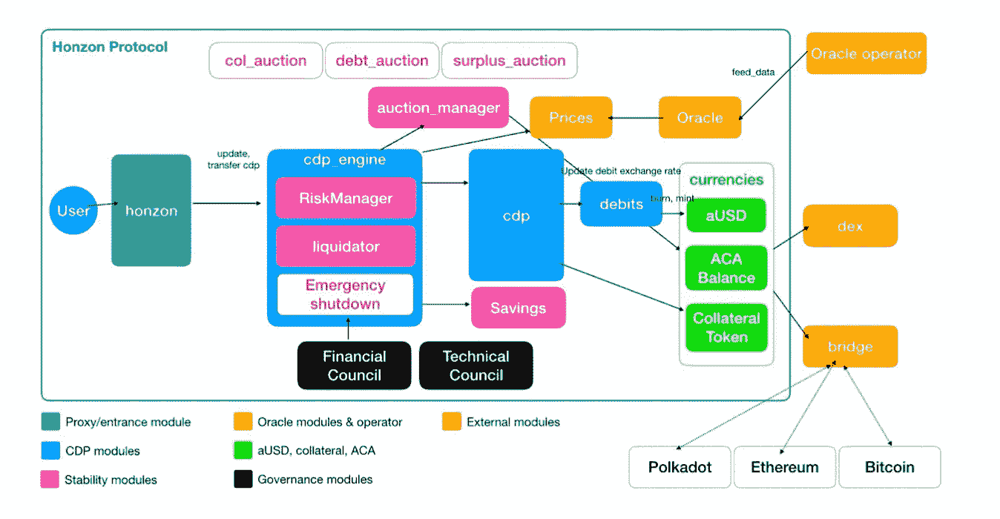

# 阿卡拉，分解碎片

> 原文：<https://medium.com/coinmonks/acala-breaking-down-the-bits-e44da0431120?source=collection_archive---------18----------------------->

~dwulf

好吧，所以机器运行平稳，大量生产 ACA 令牌作为对为平台提供实用程序的奖励，到目前为止，只有点 LCDOT 和澳大利亚-LCDOT 启用。

我认为 ACA-aUSD 是下一个流动性对，可能是另一个自举，启动池中的初始流动性，然后贡献硬币/代币。

**什么管用。**

aUSD 铸造，使用抵押品，在我的情况下，DOT，字面上铸造资本的想法让我震惊，aUSD 是一种内置的稳定硬币，与 Acala 一起使用是整个过程中最有趣的事情之一。一旦铸造出来，人们可以用它来为澳元对提供流动性。ACA -aUSD 是下一对。

您可以交换其他硬币/代币，并将这些硬币/代币用于流动性池，这将产生本地 ACA 硬币/代币。

您可以铸造澳元硬币/代币，使用 DOT 或 LCDOT 作为抵押品，并使用澳元购买所提供的流动性池中的更大股份，并产生更大比例的流动性回报。

**正在筹划什么。**

标桩点。我在本地 Polkadot.js 钱包上下注的一个大问题是 120 点的最小值和 28 天的冷却期。Acala 将改变这一现状。在我写这篇文章的时候，它仍然是一个正在进行中的工作，但是我渴望它能很快实现。这将给你的网点更多的选择，而不仅仅是抵押品。

XCM 的双向高速公路也仍在建设中。Acala 目前允许通过单向门进入其网络，但一旦 XCM 成为可能，双向转移将成为现实。

**我的想法**

唉，我是有偏见的，因为我对阿卡拉生态系统进行了大量投资。但我要说，我当然不会失望。在大众贷款拍卖之前，我已经跟踪 Acala 一年多了，并且已经很好地了解了他们的区块链产品。

我将公正地判断这些问题，但这些问题为数不多，而且正在解决中。阿卡拉(和另一条副链区块链)是一条波尔卡多特副链的公开拍卖赢家。与可笑的首次发行硬币(ICO)相比，这一点很重要。

赢得 parachain 拍卖的团队与他们的项目绑定在一起，投资者永远不会失去他们的钱，因为这些钱在租赁期结束时会被赎回(以及所有其他奖励)，所以有一种促使项目成功的内在激励。

Acala 是第一个获胜者，到目前为止，它的进展非常稳定。

XCM 双向转移是它的头号优先事项，但这主要是由 Gavin Wood 博士的团队在 Parity 处理的，所以它有点脱离 Acala 的手。但这不应妨碍贡献，因为所有其他的副链都受到同样的限制。

赌注也是一件大事，能够克服 120 点和 28 天的冷却期是通过算法赚取更多的点，而不是购买和需要一个菲亚特桥，以便通过传统的菲亚特是一个熊，与澳元稳定铸币，这有所帮助。

**我的阿卡拉愿望清单**

一个时髦的移动应用程序会把它放在最上面。在他们解决了具体问题后，一个在 Acala 上协调个人资产的时尚移动应用程序将是最佳选择。

**结论:**

Acala 有一个不错的价格，买入 ACA 是对 Acala 未来的一个强有力的胜利赌注。如果你是在大众贷款期间进入的，那么恭喜你，你已经投资了一个你控制的字面意义上的银行系统。

如果你仍处于观望状态，请注意，要有选择性。我对 Acala 和 Astar 都有投资，但对其他公司的投资较少。我非常希望 Nodle 赢得 parachain 插槽，仅次于 Astar，Nodle 是我的第三大投资。

DeFi，Acala(检查)

智能合同，Astar(检查)

物联网，节点(检查)

我们可以起飞了！

> *加入 Coinmonks* [*电报频道*](https://t.me/coincodecap) *和* [*Youtube 频道*](https://www.youtube.com/c/coinmonks/videos) *了解加密交易和投资*

# 另外，阅读

*   [有哪些交易信号？](https://coincodecap.com/trading-signal) | [Bitstamp vs 比特币基地](https://coincodecap.com/bitstamp-coinbase) | [买索拉纳](https://coincodecap.com/buy-solana)
*   [ProfitFarmers 回顾](https://coincodecap.com/profitfarmers-review) | [如何使用 Cornix Trading Bot](https://coincodecap.com/cornix-trading-bot)
*   [十大最佳加密货币博客](https://coincodecap.com/best-cryptocurrency-blogs) | [YouHodler 评论](https://coincodecap.com/youhodler-review)
*   [my constant Review](https://coincodecap.com/myconstant-review)|[8 款最佳摇摆交易机器人](https://coincodecap.com/best-swing-trading-bots)
*   [MXC 交易所评论](/coinmonks/mxc-exchange-review-3af0ec1cba8c) | [Pionex vs 币安](https://coincodecap.com/pionex-vs-binance) | [Pionex 套利机器人](https://coincodecap.com/pionex-arbitrage-bot)
*   [我的密码交易经验](/coinmonks/my-experience-with-crypto-copy-trading-d6feb2ce3ac5) | [比特币基地评论](/coinmonks/coinbase-review-6ef4e0f56064)
*   [CoinFLEX 评论](https://coincodecap.com/coinflex-review) | [AEX 交易所评论](https://coincodecap.com/aex-exchange-review) | [UPbit 评论](https://coincodecap.com/upbit-review)
*   [AscendEx 保证金交易](https://coincodecap.com/ascendex-margin-trading) | [Bitfinex 赌注](https://coincodecap.com/bitfinex-staking) | [bitFlyer 点评](https://coincodecap.com/bitflyer-review)