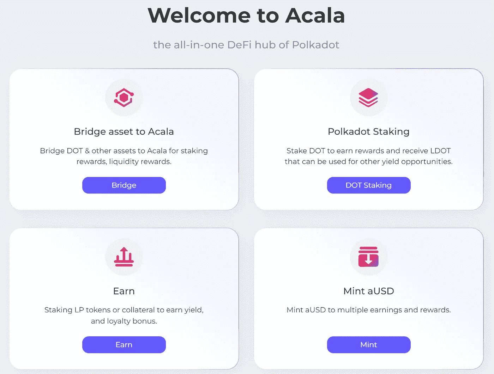
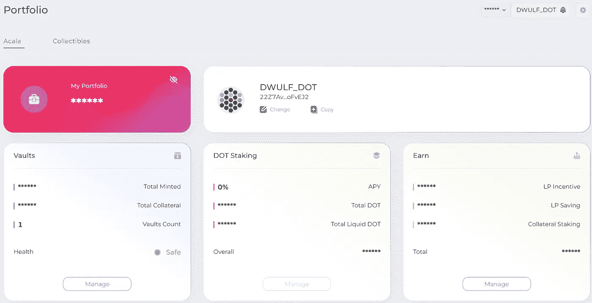
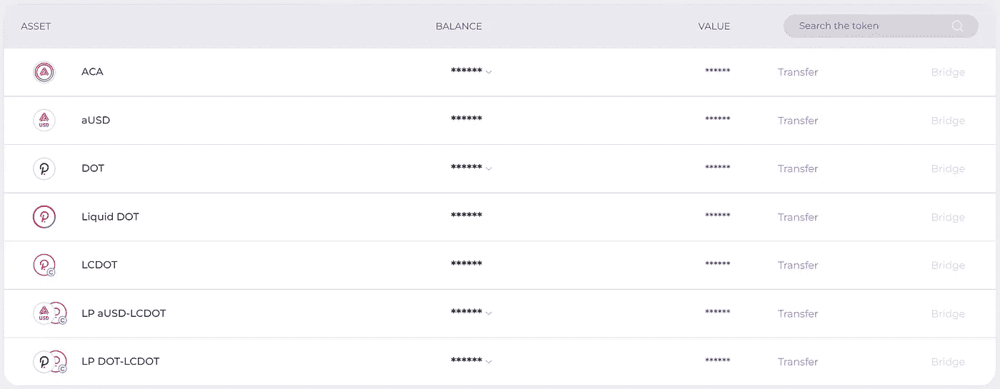

# Acala:货币工具

> 原文：<https://medium.com/coinmonks/acala-currency-tools-e634ab38e198?source=collection_archive---------20----------------------->

~dwulf

好了，我已经在 Acala 的布局中四处打探，大多数功能现在都是活跃的或即将上线。

在 XCM 被清理出阿卡拉生态系统之前，这是一张单程票，所以进入阿卡拉时要小心。第一个流动性自举对是点 LCDOT，进行得很好，我声称 LP 令牌奖励，没有问题。

下一个引导是 aUSD-LCDOT，我使用了 minting 选项，并将我新创建的 aUSD 提交给 liquidty 对。

下一个我觉得是 ACA-DOT。

**我的想法**

到目前为止，一切都没有太大的麻烦。网络界面很好，很直观。当这些工具发挥最大作用时，我怀疑事情会进展得更快。到目前为止我都很喜欢。

配对和流动性代币正在产生 ACA 奖励，我试图掌握界面的诀窍，以找到一种好方法，在移动平台上的应用程序中实现这一点，或者通过一个简单的浏览器在一个较小的移动设备上实现。

# **投资组合**

它很干净，显示了所有的细节。有 3 个领域的利益，你的跳马，你的点赌注，你的收入

金库是您铸造澳元稳定硬币的地方，对我来说，我有 DOT 作为我的抵押品来做这件事，我必须铸造澳元来参与澳元-LCDOT 流动性对并提供澳元硬币/代币。

我目前创造的澳元是超额抵押，这意味着我支持的比我创造的多，一个安全的比率。

点赌注将是阿卡拉的一件事，我很高兴。波尔卡多特的 120 点最小值和 28 天冷却期是一个真正的婊子。

赚取仅仅是，为交易对 LCDOT 点和澳大利亚 LCDOT 提供流动性，赚取你的 ACA 奖励，利率年利率因贡献者和流动性池的大小而异。但是嘿，免费 ACA。

**LCDOT-DOT 和澳大利亚-LCDOT**

这些是启用的流动性池，目前，在撰写本文时，还应该有 aUSD-ACA。因此，我要铸造一些更多的澳大利亚元，以参与该池也。

# **阿卡拉币**

所以 ACA 是 Acala 的主要硬币/代币，商业价格约为 1.74 美元/ACA(在撰写本文时)，高于 ADA 约 1.20 美元/ADA，低于 Polygon 的 MATIC 约 2.00 美元/MATIC。这是一笔非常可观的资产，随着 EVM+的开发和 XCM 的启用，这一资产将会进一步增长。

当然，澳元将始终等于 1.00 美元兑 1 澳元，这是一个稳定的硬币，将使记账更容易。

当然，我们还有 DOT，它暂时是来自 Polkadot 的单程旅行令牌。XCM 需要支持双向传输。我完全有信心它将很快启用。

我在流动性池中使用 LCDOT(当然)，但我希望在租赁期内以折扣价购买更多的 LCDOT，以清空我的投资，并在旅程结束时获得一些溢价。

**结论**

总而言之，Acala 做得很好，我期待着在 Acala 平台上构建先进的工具。他们对波尔卡多特的副链有两年的租约，他们赢得了第一次拍卖，获得了第一个位置。一切正常。

我也持有 Astar 的大量股份，深入 EVM 和 WASM 将巩固我对 Polkadot 和以太坊区块链生态系统的理解。我最近使用 Cosmos 和 Sifchain 的经验以及我对 Polkadot Composable 的贡献给了我敏锐的洞察力，我期待着使用 Acala 和 Astar 解决方案完成 GreenwitchDAO。

> 加入 Coinmonks [电报频道](https://t.me/coincodecap)和 [Youtube 频道](https://www.youtube.com/c/coinmonks/videos)了解加密交易和投资

## 也阅读

 [## 杠杆代币[多头代币]终极指南

### 杠杆化令牌是具有杠杆化风险敞口的 ERC20 令牌，不考虑保证金、要求、管理…

medium.com](/coinmonks/leveraged-token-3f5257808b22)  [## 最佳加密交易所| 2022 年十大加密货币交易所| CoinCodeCap

### 哪一个是最好的加密交换？在本文中，我们将根据多种加密货币列出 10 大加密货币交易所

coincodecap.com](https://coincodecap.com/crypto-exchange)  [## 2022 年最佳加密交换平台| CoinCodeCap

### 随着时间的推移，我们大多数人将转向 dex 以获得更好的安全性和隐私。因此。在这里，我们将讨论…

coincodecap.com](https://coincodecap.com/best-swap-platforms)  [## 加密交易机器人——19 款最佳免费加密交易机器人

### 2022 年币安、比特币基地、库币和其他密码交易所的最佳密码交易机器人。四进制，位间隙…

medium.com](/coinmonks/crypto-trading-bot-c2ffce8acb2a)  [## 最佳 4 个加密交易信号电报通道

### 这是乏味的找到正确的加密交易信号提供商。因此，在本文中，我们将讨论最好的…

medium.com](/coinmonks/best-crypto-signals-telegram-5785cdbc4b2b)  [## Bitsgap 评论-交易机器人加密信号和套利 2022

### 这篇文章的重点是 Bitsgap 审查，这是一个最终的交易解决方案，并提供交易机器人，信号…

coincodecap.com](https://coincodecap.com/bitsgap-review)  [## 40 个最佳电报频道，用于加密、电影、表演和演讲| CoinCodeCap

### 免费下载所有电影。德国免费加密信号。下载讲座。CoinCodeCap 经典，网飞电影等。是……

coincodecap.com](https://coincodecap.com/best-telegram-channels)