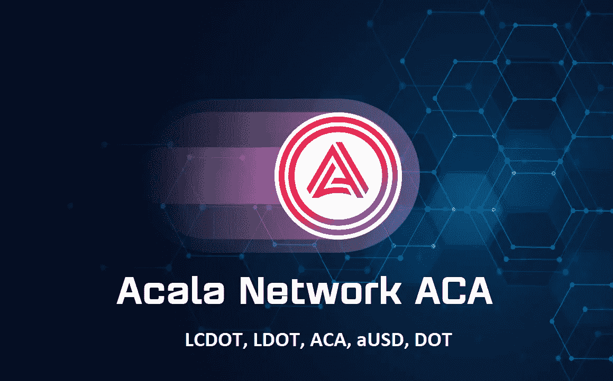

# 阿卡拉:LCDOT、LDOT、ACA、澳大利亚和 DOT。流动策略

> 原文：<https://medium.com/coinmonks/acala-lcdot-ldot-aca-ausd-and-dot-liquid-strategies-ec640cb1ade8?source=collection_archive---------1----------------------->

~dwulf

Acala 正在为其产品打开舞台。由于 Polkadot.js wallet 上的本地赌注负担着大额赌注参与要求，最低 120 点和 28 天的冷静期，平均 15%的奖励。我突然想到，有更好的方式，更灵活和财务灵活，进入阿卡拉流动性池。

不是赌注，而是有助于流动性池。什么是流动性池？

**流动性池如何运作？**

Acala 的流动性池是一种智能合约，可以被认为是锁定在该智能合约中的一批加密货币资产，可用于 Acala 平台上的交易所、贷款和其他应用。流动性由 LCDOT、LDOT、ACA、aUSD 和 DOT 提供。那是贡献给池子的。

**Acala 流动性池如何赚钱？**

Acala 流动性提供商通常通过两种方式赚钱。流动性提供者从他们提供流动性的 DeFi 平台的交易中赚取费用。交易费用按比例分配给参与该池的所有 Acala 流动性提供商，因此您下注的加密资产越多，您赚取的费用就越多。

**你会在 Acala 流动性池中赔钱吗？**

如果复合代币价格上涨，用户在流动性池中持有的价值可能会上升，从而产生利润的幻觉。然而，与简单地购买并持有出资金额的押记资产相比，用户仍可能遭受损失。

硬币/代币价格的下降会影响价值(但不会影响硬币/代币的数量)。

# **选择武器**

首先，LCDOT、LDOT、ACA、澳元和 DOT 是阿卡拉目前的硬币/代币。当他们致力于使 XCM 启用时，单向通道被启用用于点转移到阿卡拉生态系统中。

对 LCDOT、LDOT、ACA、aUSD 和 DOT 的详细分类是合适的。

**圆点**

井点是 Polkadot 的(第 0 层)硬币/令牌，在 Polkadot 平台上具有用于下注、投票等的效用。具有很强的商业价格。

**阿卡拉的 LCDOT 是什么？**

流动性众筹贷款点(LCDOT)代表 Acala 众筹贷款点贡献的基础点流动性。

LCDOT 是一种液体(未锁定)令牌，可在 Acala 的 DeFi hub 上使用。它有一个未确定的商业价格(假定在众包贷款租赁开始时等于 DOT，在租赁中间贴现，在租赁结束时与 DOT 价格匹配)

**阿卡拉的液体圆点 LDOT 是什么？**

LDOT 是可替换的硬币/代币，而 LCDOT 是该硬币/代币的代表。LDOT 可以交易，用于支付，例如作为抵押品来产生澳元稳定币。

作为 DOT 的衍生产品，LDOT 将在不损害或竞争网络安全的情况下提取其剩余价值。与此同时，它为利益证明(PoS)网络令牌的其他使用情形释放了大量流动性。

**ACA 是什么？**

阿卡拉的本地硬币/代币，用于加油，可用于流动性池。它目前的商业价格与 ADA 和 MATIC 相当。

**什么是 aUSD？**

阿卡拉稳定的硬币与美元的商业价值挂钩。这是 Acala 项目流动资金的主要部分。aUSD 足够稳定，可以支付工资，或者买一杯咖啡。

# **贸易对**

LCDOT /交通部

我把剩余的资金转移出去，用我所有的 LCDOT 来启动流动资金池。

在我写这篇文章的时候，Acala 正在推出这些特性。

**结论**

所有这一切的现实是，Acala 平台上的用户将拥有 DeFi 工具来产生被动收入，当工具为 aUSD 或围绕 aUSD 构建时，能够像银行一样操作您的财富。

它是 Greenwitch DAO 的基石，由于我们能够通过 Acala 的 API 适应更复杂的交易机器人和命令，这将是向最佳商业解决方案的一大飞跃。

> 加入 Coinmonks [电报频道](https://t.me/coincodecap)和 [Youtube 频道](https://www.youtube.com/c/coinmonks/videos)了解加密交易和投资

## 也阅读

 [## 杠杆代币[多头代币]终极指南

### 杠杆化令牌是具有杠杆化风险敞口的 ERC20 令牌，不考虑保证金、要求、管理…

medium.com](/coinmonks/leveraged-token-3f5257808b22)  [## 最佳加密交易所| 2022 年十大加密货币交易所| CoinCodeCap

### 哪一个是最好的加密交换？在本文中，我们将根据多种加密货币列出 10 大加密货币交易所

coincodecap.com](https://coincodecap.com/crypto-exchange)  [## 2022 年 2 月值得关注的三大游戏代币| CoinCodeCap

### 排名前 3 位的游戏也占交易总量的 85%以上。Defi 王国、Axie Infinity 和 Pegaxy…

coincodecap.com](https://coincodecap.com/top-3-gaming-tokens-to-look-out-for-in-february-2022)  [## 2022 年最佳加密交换平台| CoinCodeCap

### 随着时间的推移，我们大多数人将转向 dex 以获得更好的安全性和隐私。因此。在这里，我们将讨论…

coincodecap.com](https://coincodecap.com/best-swap-platforms)  [## 2022 年最佳加密和比特币赌场(美国批准，存款奖励)

### 接收、支付和赚取加密货币| |有各种各样的最佳在线赌场可供选择，有可能…

coincodecap.com](https://coincodecap.com/best-online-casinos)  [## 2021 年最佳加密借贷平台| 6 大比特币借贷平台

### 获得比特币和其他加密货币的最佳贷款利率

medium.com](/coinmonks/top-5-crypto-lending-platforms-in-2020-that-you-need-to-know-a1b675cec3fa)  [## 2021 年 6 大最佳硬件钱包|顶级加密硬件钱包[更新]

### 最好的加密货币硬件钱包是绝对必要的。我们将在 NGRAVE、Ledger Nano X 和…

medium.com](/coinmonks/the-best-cryptocurrency-hardware-wallets-of-2020-e28b1c124069)  [## 加密交易机器人——19 款最佳免费加密交易机器人

### 2022 年币安、比特币基地、库币和其他密码交易所的最佳密码交易机器人。四进制，位间隙…

medium.com](/coinmonks/crypto-trading-bot-c2ffce8acb2a)  [## 最佳 4 个加密交易信号电报通道

### 这是乏味的找到正确的加密交易信号提供商。因此，在本文中，我们将讨论最好的…

medium.com](/coinmonks/best-crypto-signals-telegram-5785cdbc4b2b)