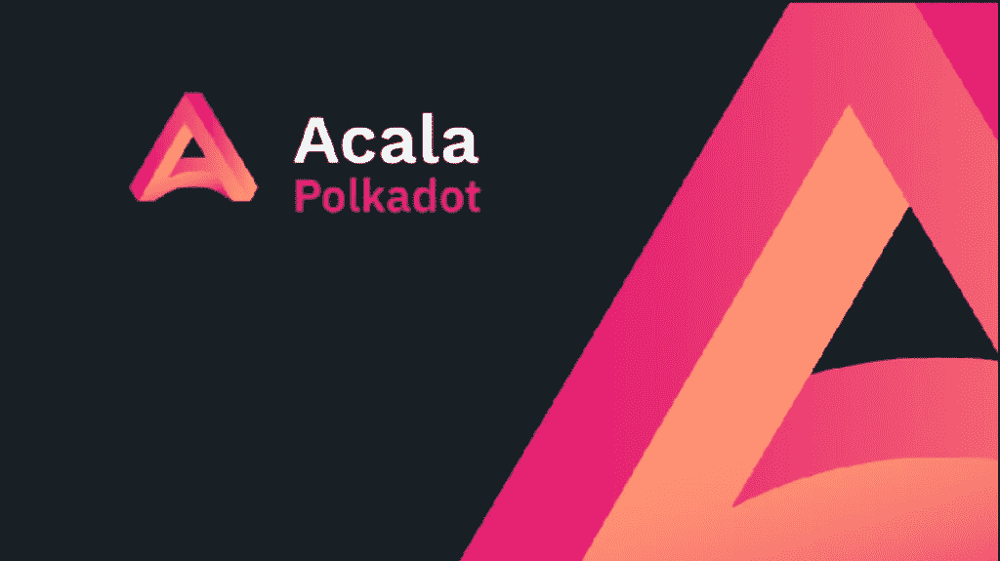

# 阿卡拉:企业道银行

> 原文：<https://medium.com/coinmonks/acala-the-corporate-dao-bank-e9855125e54d?source=collection_archive---------20----------------------->

~dwulf

Acala 开放平台已经有几个星期了，我一直在使用和试验它的系统。迄今为止，我已经引入了其他加密资源来“试验”Acala 的功能。

我想说有相当大的一笔投资。我认为 Acala 是未来 DAO 的一个创收银行系统。Acala 没有太多进展，但它确实拥有类似银行的核心功能。

**流动性对:**

资产类别配对，创建流动性池，保证交易的流动性。用户可以获得 ACA (Acala 的原生硬币/代币)奖励。利息收益率是不同的，取决于流动性对和流动性的数量。

**澳币铸造:**

啊，梦想中的梦想，拥有一台印钞机，除了 Acala 的印钞机有意义，用户必须在硬币/代币中放置抵押品来支持它。一些需要澳元的流动性对可能需要一个来铸造澳元。在我的例子中，由 DOT 支持，允许“贷款”发生。有了这些，你可以再投资或向资金池提供更多流动性，从而获得更大的股份，增加 ACA 的回报。

注意你的超额抵押贷款的阈值，如果它低于贷款的未偿价值，你的抵押品将被清算和出售，以弥补你的未偿贷款。

**定位点:**

这是一个大问题，因为 polkadot 链上的本地 polkadot.js 钱包的当前赌注要求有很多抱怨。启用此功能后，您的点数可以以更低的下注要求下注，目前最低 120 点即可获得奖励，退出时有 28 天的冷静期。

**流动性池还是赌注？**

我不太清楚奖励是如何与赌注和流动性池一起分配的一些细节，但我在 Reddit 上搜索了一位资深人士的话来描述这种情况:

> “你(在 Acala 应用中)看到的 APY 不是游泳池中的 APY，而是 ACA 奖金的 APY，这是你作为提供商所产生的费用之外的费用。目前这些信息还没有显示出来，估计起来有点困难，但它确实存在，所以它可能比标桩好，也可能不好，无论哪种方式，如果你想提供或者只是标桩，都由你决定。”

这让我意识到，并不是所有的数据点都反映在 AcalaApp 用户界面中。这是可以理解的，因为你不想一次给人太多的信息。

但这也告诉我，流动性池的回报可能与 DOT 的传统赌注回报相当。我将不得不深入研究这个问题。

**道法人银行**

Acala 和 Astar 共同拥有实现这一目标的工具。Acala 已经使流动性交易对在 ACA 中产生收益。Staking DOT 也是其中的一部分，将产生 LDOT，或可用于平台上其他投资的流动点。

由于汽油成本，我一直在引导一些 ETH 和 ADA 进入 DOT，以保值和优化我的 Acala 持股。在 XCM/XCMP 启用之前，Acala 处于自己的单向泡沫中。但它正在赚取回报，并产生 ACA 收益。

稳定的债务，创造澳元，以 DOT 抵押品来提供更多的流动性(和更大的回报)，似乎是一个可接受的债务，或任何产生收入的债务。

随着越来越多的工具建立在 Acala 上，财富创造的动力将会越来越大。

**其他选项？**

以太坊，也许，他们必须弄清楚分片和保持气体合理。多边形，似乎是一种选择，但仍然受到一定程度的天然气费。

许多其他项目都在朝着同样的目标努力，但我对 Polkadot 和 Acala 充满信心。我也大量投资 Acala。

**结论:**

现在，随着大多数功能的实现和流动性池的填充，等待忠诚度计划到期，以在 8 月领取应计的 ACA 和奖金，从现在起大约 6 个月正在进行中。

Acala 平台上更多 DOT 的缓慢滴注是为 DAO 业务项目(即 Greenwitch DAO)建立 DAO 银行系统的处方，通过 Acala 的 0 级和 0 级以下收入流是协调财富流动的适当方式。BTC、LTC、ETH、ADA 将紧随其后，并为他们在 Acala 内的互动搭建桥梁。

我肯定会更多地参与工程方面的工作，尽我所能提供帮助。Rust 对我来说越来越流畅，随着我对 Cosmos (Sifchain)和 Kusama (Picaso)的体验，我对 Github 的工作流程理解得更好了。

当然，症结在 DevOps。安西布尔、多克和 K8。啪的一声。

> *加入 Coinmonks* [*电报频道*](https://t.me/coincodecap) *和* [*Youtube 频道*](https://www.youtube.com/c/coinmonks/videos) *了解加密交易和投资*

# 另外，阅读

*   [3 商业评论](/coinmonks/3commas-review-an-excellent-crypto-trading-bot-2020-1313a58bec92) | [Pionex 评论](https://coincodecap.com/pionex-review-exchange-with-crypto-trading-bot) | [Coinrule 评论](/coinmonks/coinrule-review-2021-a-beginner-friendly-crypto-trading-bot-daf0504848ba)
*   [莱杰 vs Ngrave](/coinmonks/ledger-vs-ngrave-zero-7e40f0c1d694) | [莱杰 nano s vs x](/coinmonks/ledger-nano-s-vs-x-battery-hardware-price-storage-59a6663fe3b0) | [币安评论](/coinmonks/binance-review-ee10d3bf3b6e)
*   [Bybit Exchange 评论](/coinmonks/bybit-exchange-review-dbd570019b71) | [Bityard 评论](https://coincodecap.com/bityard-reivew) | [Jet-Bot 评论](https://coincodecap.com/jet-bot-review)
*   [3 commas vs crypto hopper](/coinmonks/3commas-vs-pionex-vs-cryptohopper-best-crypto-bot-6a98d2baa203)|[赚取加密利息](/coinmonks/earn-crypto-interest-b10b810fdda3)
*   最好的比特币[硬件钱包](/coinmonks/hardware-wallets-dfa1211730c6) | [BitBox02 回顾](/coinmonks/bitbox02-review-your-swiss-bitcoin-hardware-wallet-c36c88fff29)
*   [BlockFi vs 摄氏](/coinmonks/blockfi-vs-celsius-vs-hodlnaut-8a1cc8c26630) | [Hodlnaut 点评](/coinmonks/hodlnaut-review-best-way-to-hodl-is-to-earn-interest-on-your-bitcoin-6658a8c19edf) | [KuCoin 点评](https://coincodecap.com/kucoin-review)
*   [Bitsgap 审查](/coinmonks/bitsgap-review-a-crypto-trading-bot-that-makes-easy-money-a5d88a336df2) | [Quadency 审查](/coinmonks/quadency-review-a-crypto-trading-automation-platform-3068eaa374e1) | [Bitbns 审查](/coinmonks/bitbns-review-38256a07e161)