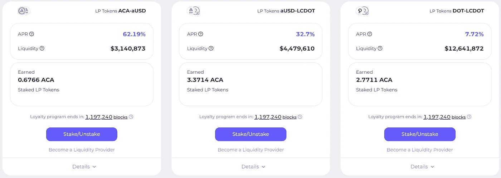

# Acala，Trifecta 使能

> 原文：<https://medium.com/coinmonks/acala-trifecta-enabled-5ccc8021a105?source=collection_archive---------14----------------------->

~dwulf

## **ACA-aUSD 启用**

今天早上醒来，发现又多了一双。ACA-aUSD，80% APR 开始奖励，ACA 奖励。因此，现在所有 3 个流动性池都是活跃的，并不断搅动，在 Acala 上赚取原生 ACA 硬币/代币。

我把多一点点通过单向门户，抵押，并能够铸造更多的澳元。我能够做到这一点，所以我会有一个相当大的贡献，最后的 3 对。

## **置之不理**

随着流动性池的消失，以及 ACA 奖励的混乱，我决定不去管它，让它们运行，直到忠诚度奖励计划结束，也就是 8 月份，大约 6 个月后。

在此期间，我当然会随着时间的推移增加更多的流动性，但我将加入该平台的大部分资金将专用于仍需启用的赌注元素。

## **在波尔卡多特上标记圆点**

对我来说，这是圣杯，也是我为 Acala 项目贡献如此大量 DOT 的决定性原因。点的标桩。

有很多选择可以入股 DOT、北海巨妖、币安，有几个不好的选择需要 KYC 的集中交易所对我来说是一个交易破坏者。我非常倾向于分散选项。所以，在我看来只有一个好的选择，那就是通过自我保管原生 Polkadot.js 钱包。

不，KYC，如果你选择了 16 个可靠的验证者来提名，你会得到大部分的赌注奖励。但是这并不是没有问题。

首先，你必须选择 16 个可靠的验证者，这些验证者很有可能成为活跃的验证者，这样你就可以赚点外快，而不是袖手旁观。

第二，最低门槛是 120 点，以赚取任何赌注奖励，并成为真正的你需要超过 120 点，以收集一个很好的点奖励份额，每天 1 点是很大的，但要产生这一水平取决于验证器的吞吐量，更大的点 10，000+。

第三，是 28 天的冷却期，即解封期。这一方面迫使你对你的点投资非常简洁，不要把你所有的财富都锁在点和赌注上，因为赌注不能被使用或移动，不能被贡献给大众贷款或投票。

## **Acala 上的定位点**

于是阿卡拉前来救援。允许用赌注点来交换 LDOT。我不认为获得 LDOT 的奖励有最低门槛。我看不到任何选项来选择你的 16 个验证器，我将假定这是由 Acala 的平台处理。此外，没有关于冷却期或解除绑定期的话，虽然，我在 UI 中看到有一个区域用于解除绑定，所以可能仍然在卡中，我只是不知道它是否会是完整的 28 天。

**多事之秋的桥梁**

到目前为止，我唯一的问题是将少量的点传送到平台需要相当长的时间。这已经锁定了一天中大部分时间的少量点。有一个外在的链接显示了转移的成功，我认为这更多的是网络用户界面的问题。因此，我将冻结所有的运动功能和任何更多的修补，直到我看到点反映在我的个人资料。

到目前为止，我能够毫无问题地将所有的点带入阿卡拉生态系统。现在，大多数功能，尤其是 3 个流动性池都已启动并启用，我将在此结束并等待。

**更新:**

最后，我的少量 DOT 出现了，用了一天的大部分时间，让我一直出汗。

## **结论**

除了那个打嗝，单向桥接传输。Acala 似乎工作正常。当这样的事情发生时，这很可怕，但我们是早期采用者，这就是这个新领域的风险。

就我个人而言，我是个瘾君子，我花了一年时间在 Polkadot 的 Polkadot.js wallet 上下注，收入来自 Uniswap 空投。这让我开始了这整件事。我致力于基质和学习更多的 Rust 成为 Polkadot 和 Acala 生态系统的可靠资源和贡献者。我也期待着加入阿斯塔学院，以更好地了解 EVM 和 WASM 的细微差别。

现在，由于 Acala 更加充实，我将寻求理解他们的 EVM+，他们把坚实的工程实践融入其中，这是从只理解坚固性和常规 EVM 向上迈出的一步。

现在就等着在阿卡拉下注。

> 加入 Coinmonks [电报频道](https://t.me/coincodecap)和 [Youtube 频道](https://www.youtube.com/c/coinmonks/videos)了解加密交易和投资

## 另外，阅读

*   [Stormgain 评论](https://coincodecap.com/stormgain-review) | [Probit 评论](https://coincodecap.com/probit-review) | [北海巨妖评论](/coinmonks/kraken-review-6165fc1056ac)
*   [如何在势不可挡的域名上购买域名？](https://coincodecap.com/buy-domain-on-unstoppable-domains)
*   [印度的秘密税](https://coincodecap.com/crypto-tax-india) | [altFINS 审查](https://coincodecap.com/altfins-review) | [Prokey 审查](/coinmonks/prokey-review-26611173c13c)
*   [Blockfi vs 比特币基地](https://coincodecap.com/blockfi-vs-coinbase) | [BitKan 点评](https://coincodecap.com/bitkan-review) | [期货交易机器人](/coinmonks/futures-trading-bots-5a282ccee3f5)
*   [南非的加密交易所](https://coincodecap.com/crypto-exchanges-in-south-africa) | [BitMEX 加密信号](https://coincodecap.com/bitmex-crypto-signals)
*   [如何在 WazirX 上购买柴犬(SHIB)币？](https://coincodecap.com/buy-shiba-wazirx)
*   [MoonXBT 副本交易](https://coincodecap.com/moonxbt-copy-trading) | [阿联酋的加密钱包](https://coincodecap.com/crypto-wallets-in-uae)
*   [MoonXBT vs Bybit vs 币安](https://coincodecap.com/bybit-binance-moonxbt) | [硬件钱包](/coinmonks/hardware-wallets-dfa1211730c6)
*   [雷米塔诺评论](https://coincodecap.com/remitano-review)|[1 英寸协议指南](https://coincodecap.com/1inch)
*   [十大最佳加密货币博客](https://coincodecap.com/best-cryptocurrency-blogs) | [YouHodler 评论](https://coincodecap.com/youhodler-review)
*   [KuCoin vs 币安](https://coincodecap.com/kucoin-vs-binance) | [Bitrue 点评](https://coincodecap.com/bitrue-review) | [Jet-Bot 点评](https://coincodecap.com/jet-bot-review)
*   [买 PancakeSwap(蛋糕)](https://coincodecap.com/buy-pancakeswap)|[matrix export Review](https://coincodecap.com/matrixport-review)