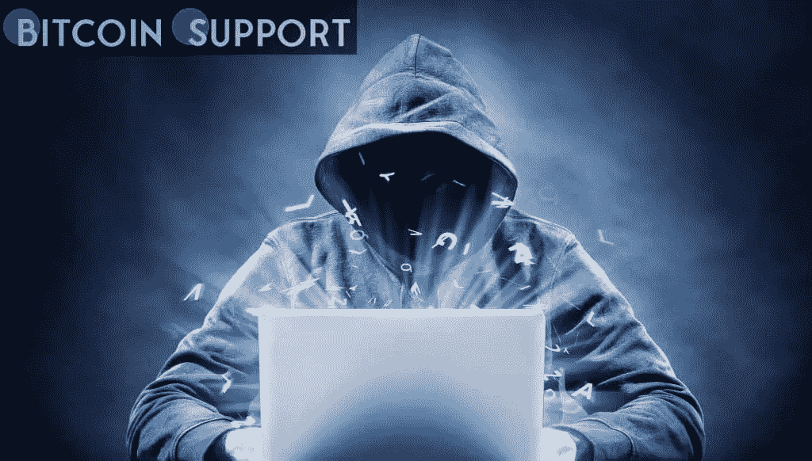

# 据一名比特币基地白帽黑客称，25 万美元的赏金“不至于低到侮辱人的地步”

> 原文：<https://medium.com/coinmonks/according-to-a-coinbase-white-hat-hacker-the-250k-bounty-is-not-too-low-to-be-insulting-8db4883bacc0?source=collection_archive---------38----------------------->

[https://bitcoinsupports.com/](https://bitcoinsupports.com/)

发现比特币基地 API 中一个关键缺陷的白帽黑客表示，25 万美元的赏金并不“太低”

2 月 11 日，在超级碗和比特币基地 1400 万美元的变色二维码广告前两天，一名工程师绝望地试图联系比特币基地管理层和开发团队。

[https://Twitter . com/Tree _ of _ Alpha/status/1492201011955519495](https://twitter.com/Tree_of_Alpha/status/1492201011955519495)

Tree of Alpha 发现了“新的高级交易功能中的一个缺陷，该缺陷将允许恶意用户在不拥有 BTC 或任何其他硬币的情况下出售它们。”代码中的缺陷有可能“摧毁”市场。阿尔法之树对该缺陷发表了评论，宣布“漏洞本身确实令人担忧”，并补充说“开发团队和 QA/测试团队都需要一些监督才能让这种情况发生。”

“虽然高级交易产品并不是每个人都可以使用，而且仍处于测试阶段，但大量用户可能已经使用了该漏洞。”然而，由于黑客的快速反应和“压倒性的社区反应”，危险得以避免，比特币基地避免了一场“可能的危机”

按照白帽黑客的惯例，会被授予赏金。比特币基地最初奖励了 25 万美元——对于这位硅谷出生的独角兽来说，这实在是杯水车薪。Twitter 很快将 25 万美元的奖励贴上了“熊市”赏金的标签，理由是黑客攻击的范围以及比特币基地高管每年赚这么多钱的事实。

Tree of Alpha 在接受采访时表示，这个数额“还不至于低到带有侮辱性。”

“虽然更高的奖金可能会阻止更多的灰帽子利用漏洞，但在加密领域，与金钱的价值脱节是很常见的。”对大多数工薪阶层来说，25 万美元是一笔很大的数目。最后，这些事件凸显了白帽黑客在一个仍在发展的行业中的重要性。美国国务院近日宣布，将向白帽黑客颁发高达 1000 万美元的加密货币奖励；然而，Tree of Alpha 表示,“白帽黑客行为至关重要，但却被企业忽视。

一言以蔽之，聪明人总结道:

“公司会毫不犹豫地在营销上花费数千万美元，但不会花其中的零头来确保有东西留给市场。比特币基地首席执行官布莱恩·阿姆斯特朗是最先感谢白帽黑客拯救了他的公司的人之一

**访问我们的网站:-**[**【https://bitcoinsupports.com/】**](https://bitcoinsupports.com/)

**免责声明:以上为作者观点，不应视为投资建议。读者应该自己做研究。**

> 加入 Coinmonks [电报频道](https://t.me/coincodecap)和 [Youtube 频道](https://www.youtube.com/c/coinmonks/videos)了解加密交易和投资

# 另外，阅读

*   [如何在印度购买比特币？](/coinmonks/buy-bitcoin-in-india-feb50ddfef94) | [瓦济克斯审查](/coinmonks/wazirx-review-5c811b074f5b)
*   [印度的加密交易所](/coinmonks/bitcoin-exchange-in-india-7f1fe79715c9) | [比特币储蓄账户](/coinmonks/bitcoin-savings-account-e65b13f92451)
*   [Cloudbet 赌场评论](https://coincodecap.com/cloudbet-casino-review) | [点火赌场评论](https://coincodecap.com/ignition-casino-review)
*   [币安收费](/coinmonks/binance-fees-8588ec17965) | [僵尸加密审查](/coinmonks/botcrypto-review-2021-build-your-own-trading-bot-coincodecap-6b8332d736c7) | [热点审查](/coinmonks/hotbit-review-cd5bec41dafb)
*   [my constant Review](https://coincodecap.com/myconstant-review)|[8 款最佳摇摆交易机器人](https://coincodecap.com/best-swing-trading-bots)
*   [我的加密副本交易经历](/coinmonks/my-experience-with-crypto-copy-trading-d6feb2ce3ac5) | [AAX 交易所评论](/coinmonks/aax-exchange-review-2021-67c5ea09330c)
*   [Bybit 融资融券交易](/coinmonks/bybit-margin-trading-e5071676244e) | [币安融资融券交易](/coinmonks/binance-margin-trading-c9eb5e9d2116) | [Overbit 审核](/coinmonks/overbit-review-9446ed4f2188)
*   [有哪些交易信号？](https://coincodecap.com/trading-signal) | [Bitstamp vs 比特币基地](https://coincodecap.com/bitstamp-coinbase)
*   [10 本关于加密的最佳书籍](https://coincodecap.com/best-crypto-books) | [英国 5 个最佳加密机器人](https://coincodecap.com/uk-trading-bots)