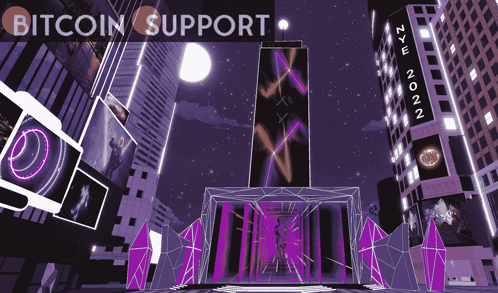

# 一项针对开发者的研究预测，加密货币交易将转移到元宇宙

> 原文：<https://medium.com/coinmonks/according-to-a-developer-focused-study-cryptocurrency-trade-will-migrate-to-the-metaverse-429d9ad10e2f?source=collection_archive---------78----------------------->

**Visit our website:-** [**https://bitcoinsupports.com/**](https://bitcoinsupports.com/)

大多数开发者认为，加密和区块链创新将“对塑造元宇宙的未来至关重要”

根据一项新的调查，开发者预计元宇宙最终将成为买卖加密货币的“最流行”方式。受 API 提供商 Agora 委托，这项研究收集了元宇宙 300 名开发者的观点和意见。Agora 的创始人兼首席执行官赵陈梁说:“因为他们将站在元宇宙几乎每一项进步的最前沿，他们的想法和意见最终将会产生巨大的影响力。”。

根据调查，57%的开发者预测元宇宙最终将成为最受欢迎的加密货币兑换方式。然而，三分之一的受访者认为数据隐私和安全将是元宇宙的一个重要问题。与此同时，调查人员询问开发商，不可兑换代币的作用是否会继续扩大，并最终成为元宇宙的主要货币形式。53%的受访者同意，24%的人不同意。此外，研究人员发现，大多数开发者认为加密货币和区块链创新将“对塑造元宇宙的未来至关重要”70%的受访者认为区块链和加密货币领域的改进将对元宇宙产生重大影响。

72%的受访者认为实时参与对于在元宇宙建立“互联体验”至关重要。此外，数据表明，55%的参与者认为元宇宙将最终取代现实世界的社会联系。2022 年 3 月，企业开始在元宇宙开店。企业已经开始或宣布向虚拟世界扩张的计划。这些公司打算将元宇宙作为商务会议的场所、创新中心和用户参与的平台。

**访问我们的网站:-**[**https://bitcoinsupports.com/**](https://bitcoinsupports.com/)

**免责声明:以上为作者观点，不应视为投资建议。读者应该自己做研究。**

> 加入 Coinmonks [电报频道](https://t.me/coincodecap)和 [Youtube 频道](https://www.youtube.com/c/coinmonks/videos)了解加密交易和投资

# 另外，阅读

*   [Exness 回顾](https://coincodecap.com/exness-review)|[moon xbt Vs bit get Vs Bingbon](https://coincodecap.com/bingbon-vs-bitget-vs-moonxbt)
*   [如何开始用加密贷款赚取被动收入](https://coincodecap.com/passive-income-crypto-lending)
*   [BigONE 交易所评论](/coinmonks/bigone-exchange-review-64705d85a1d4) | [电网交易机器人](https://coincodecap.com/grid-trading)
*   [氹欞侊贸易评论](https://coincodecap.com/anny-trade-review) | [CoinSpot 评论](https://coincodecap.com/coinspot-review)
*   [新加坡十大最佳加密交易所](https://coincodecap.com/crypto-exchange-in-singapore) | [购买 AXS](https://coincodecap.com/buy-axs-token)