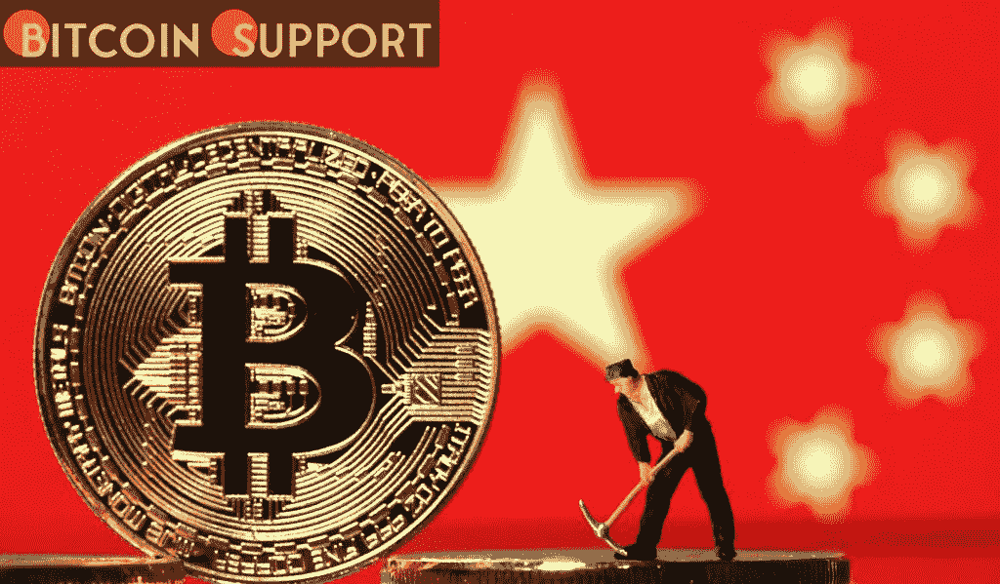

# 根据一项研究，中国的采矿禁令增加了比特币的碳足迹

> 原文：<https://medium.com/coinmonks/according-to-a-study-chinas-mining-ban-enhanced-bitcoin-s-carbon-footprint-414812eb41a5?source=collection_archive---------49----------------------->

**Visit our website:-** [**https://bitcoinsupports.com/**](https://bitcoinsupports.com/)

Researchers claim that Beijing’s crackdown on the crypto mining business has boosted Bitcoin’s carbon emissions, contrary to popular belief. Miners have left behind China’s environmentally benign hydropower and are increasingly relying on electricity generated by fossil fuels, according to them.

Since the exodus of Chinese miners, Bitcoin mining has allegedly become less environmentally friendly.

According to study published in the Joule magazine, cryptocurrency mining has become a dirtier process since the Chinese government officially banned bitcoin extraction in the People’s Republic. According to the survey, the share of renewable energy utilised to power mining activities has dropped from about 42% to around 25% in August.

Bitcoin is predicted to emit more than 65 megatons of carbon dioxide every year. The amount exceeds the total carbon emissions of a country like Greece, which had fewer than 57 megatons of CO2 emissions in 2019\. Alex de Vries, one of the writers, told the BBC:

The network is becoming less green than it has ever been.

According to Bloomberg, the movement of mining businesses to other nations such as the US and Kazakhstan has resulted in a decrease in the usage of renewable energy sources. This made bitcoin production less environmentally friendly, as it resulted in a 17 percent rise in carbon intensity.

De Vries is the founder of Digiconomist.net, which publishes the Bitcoin Electricity Consumption Index and claims to be “committed to revealing the unintended repercussions of digital developments.” He is a researcher at the Vrije Universiteit’s School of Business and Economics in Amsterdam, as well as a Dutch central bank employee. His estimations of Bitcoin’s energy consumption have been questioned by crypto media and community members, but he has been quoted in mainstream press.

According to the newest paper co-authored by De Vries, migration to the United States has increased the usage of fossil fuels, particularly natural gas, because renewables account for just a small share of the country’s electrical energy. Moving to Kazakhstan frequently means using electricity from power plants that burn “hard coal,” which pollutes the environment more than the Chinese facilities that miners worked with outside of the wet season.

China outlawed cryptocurrency-related activities such as trading in 2017, but mining was not affected until last spring. Following President Xi Jinping’s commitment to attain carbon neutrality in the next four decades, the State Council planned to crack down on the industry in May 2021\. Since then, the crackdown has moved to places like Sichuan, where miners had hydropower.

**According to a study, the Chinese mining ban has worsened Bitcoin’s carbon footprint.**

According to the BBC, industry groups were more hopeful about the employment of renewables in the minting of digital currency. According to an older estimate from the Bitcoin Mining Council, the “global mining industry’s sustainable electricity mix had expanded to around 58.5 percent.”

Meanwhile, in Europe, countries like Sweden, as well as regulators like the European Securities and Markets Authority (ESMA), have expressed worry about the expanding usage of renewable energy for bitcoin mining. They have called for a ban on energy-intensive mining technologies across the EU.

After a proposal to outlaw proof-of-work mining made its way into the draught Markets in Crypto Assets (MiCA) framework and provoked unfavourable reactions from the industry, the European Parliament scrapped a scheduled vote on the bloc’s new crypto legislation on Friday.

**Visit our website:-** [**https://bitcoinsupports.com/**](https://bitcoinsupports.com/)

**Disclaimer: These are the writer’s opinions and should not be considered investment advice. Readers should do their own research.**

> 加入 Coinmonks [电报频道](https://t.me/coincodecap)和 [Youtube 频道](https://www.youtube.com/c/coinmonks/videos)了解加密交易和投资

# 另外，阅读

*   [5 款最佳加密交易终端](https://coincodecap.com/crypto-trading-terminals) | [最佳 DeFi 应用](https://coincodecap.com/best-defi-apps)
*   [最佳网上赌场](https://coincodecap.com/best-online-casinos) | [币安评论](/coinmonks/binance-review-ee10d3bf3b6e) | [BitMEX 评论](https://coincodecap.com/bitmex-review)
*   [麻雀交换评论](https://coincodecap.com/sparrow-exchange-review) | [纳什交换评论](https://coincodecap.com/nash-exchange-review)
*   [美国最佳加密交易机器人](https://coincodecap.com/crypto-trading-bots-in-the-us) | [变化回顾](https://coincodecap.com/changelly-review)
*   [在印度利用加密套利赚取被动收入](https://coincodecap.com/crypto-arbitrage-in-india)
*   [Godex.io 审核](/coinmonks/godex-io-review-7366086519fb) | [邀请审核](/coinmonks/invity-review-70f3030c0502) | [BitForex 审核](https://coincodecap.com/bitforex-review)
*   [最佳比特币保证金交易](/coinmonks/bitcoin-margin-trading-exchange-bcbfcbf7b8e3) | [萝莉点评](/coinmonks/lolli-review-e6ddc7895ad8) | [比特币保证金交易](https://coincodecap.com/bityard-margin-trading)
*   [创造并出售你的第一个 NFT](https://coincodecap.com/create-nft) | [密码交易机器人](https://coincodecap.com/best-crypto-trading-bots)
*   [如何在 CoinDCX 上购买柴犬(SHIB)币？](https://coincodecap.com/buy-shiba-coindcx)
*   [CBET 回顾](https://coincodecap.com/cbet-casino-review) | [库科恩 vs 比特币基地](https://coincodecap.com/kucoin-vs-coinbase)