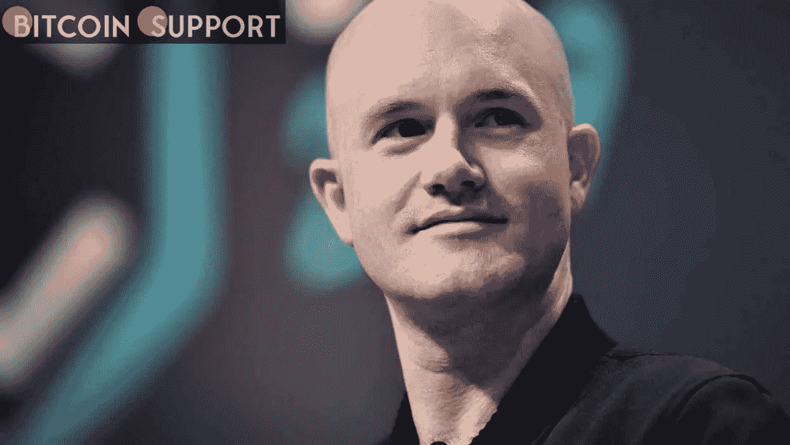

# 据比特币基地首席执行官 Brian Armstrong 称，该公司不会禁止所有俄罗斯用户

> 原文：<https://medium.com/coinmonks/according-to-coinbase-ceo-brian-armstrong-the-company-will-not-ban-all-russian-users-c9b76b588ec6?source=collection_archive---------56----------------------->

**Visit our website:-** [**https://bitcoinsupports.com/**](https://bitcoinsupports.com/)

比特币基地决定效仿币安和北海巨妖，拒绝对俄罗斯用户实施全面禁令。比特币基地首席执行官 Brian Armstrong 一小时前表示，该公司不考虑从其平台上移除所有俄罗斯用户。继俄罗斯可能利用加密货币规避美国制裁的指控之后，美国的加密交易所受到了政客们的抨击。

[https://Twitter . com/Brian _ Armstrong/status/1499622634367062016](https://twitter.com/brian_armstrong/status/1499622634367062016)

另一方面，这位比特币基地首席执行官采取谨慎的方式，以免惹恼美国监管机构。他接着说，无论资产类别是黄金、股票还是加密货币，每家美国公司都必须遵守该计划的法律。

因此，比特币基地也会遵守法律！声明称，比特币基地将“阻止来自可能属于受制裁个人或实体的 IP 地址的交易，就像任何其他受监管的金融服务企业一样”，而不是全面禁止。

## **俄罗斯寡头不太可能使用加密货币来规避制裁。**

比特币基地首席执行官表示，俄罗斯寡头利用加密货币规避制裁的可能性很小。他声称，因为加密是一个开放的分类账，所以它比货币、艺术品、黄金或其他商品更容易追踪。他接着说，就连美国财政部和国家安全委员会也同意这一点。阿姆斯特朗在他的最后一条推文中写道:“制裁是一个困难的话题，形势变化很快。“我们将继续与执法部门和政府保持接触，并将根据需要采取更多措施。”当然，我们将继续努力，让乌克兰有需要的人能够获得加密服务。关于俄罗斯利用加密技术规避制裁的报道并不完全准确。另一方面，像 OpenSea 这样的 NFT 市场已经开始限制来自制裁区的用户访问。

**访问我们的网站:-**[**https://bitcoinsupports.com/**](https://bitcoinsupports.com/)

**免责声明:以上为作者观点，不应视为投资建议。读者应该自己做研究。**

> 加入 Coinmonks [电报频道](https://t.me/coincodecap)和 [Youtube 频道](https://www.youtube.com/c/coinmonks/videos)了解加密交易和投资

# 另外，阅读

*   [最佳期货交易信号](https://coincodecap.com/futures-trading-signals) | [流动性交易回顾](https://coincodecap.com/liquid-exchange-review)
*   【Huobi 的加密交易信号 | [Swapzone 审查](/coinmonks/swapzone-review-crypto-exchange-data-aggregator-e0ad78e55ed7)
*   最佳[密码交易机器人](https://coincodecap.com/best-crypto-trading-bots) | [购买索拉纳](https://coincodecap.com/buy-solana) | [矩阵导出评论](https://coincodecap.com/matrixport-review)
*   [Coldcard 评论](https://coincodecap.com/coldcard-review) | [BOXtradEX 评论](https://coincodecap.com/boxtradex-review)|[uni swap 指南](https://coincodecap.com/uniswap)
*   [比特币基地评论](/coinmonks/coinbase-review-6ef4e0f56064) | [德里比特评论](/coinmonks/deribit-review-options-fees-apis-and-testnet-2ca16c4bbdb2) | [FTX 评论](/coinmonks/ftx-crypto-exchange-review-53664ac1198f)
*   [n 零审核](/coinmonks/ngrave-zero-review-c465cf8307fc) | [Phemex 审核](/coinmonks/phemex-review-4cfba0b49e28) | [PrimeXBT 审核](/coinmonks/primexbt-review-88e0815be858)
*   最佳[区块链分析](https://bitquery.io/blog/best-blockchain-analysis-tools-and-software)工具| [赚比特币](/coinmonks/earn-bitcoin-6e8bd3c592d9)
*   [Cloudbet 赌场评论](https://coincodecap.com/cloudbet-casino-review) | [点火赌场评论](https://coincodecap.com/ignition-casino-review)
*   [加密套利](/coinmonks/crypto-arbitrage-guide-how-to-make-money-as-a-beginner-62bfe5c868f6)指南| [如何做空比特币](/coinmonks/how-to-short-bitcoin-568a2d0b4ae5)