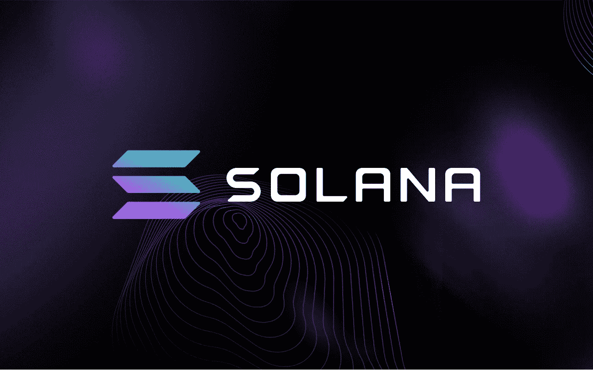

# 根据 CryptoDep 的数据，按社会活动分类，排名前三的索拉纳生态系统硬币如下:

> 原文：<https://medium.com/coinmonks/according-to-cryptodep-the-top-3-solana-ecosystem-coins-by-social-activity-are-as-follows-2e541e975c3e?source=collection_archive---------30----------------------->

Source photo [solana — Bing images](https://www.bing.com/images/search?view=detailV2&ccid=j%2bunIi8%2b&id=56EE16B9FD58E9A3A7D98C187063531D09D5BA6C&thid=OIP.j-unIi8-PvZHDf-trryc0AHaEo&mediaurl=https%3a%2f%2fth.bing.com%2fth%2fid%2fR.8feba7222f3e3ef6470dffadaebc9cd0%3frik%3dbLrVCR1TY3AYjA%26riu%3dhttp%253a%252f%252fcrypto-wikipedia.com%252fwp-content%252fuploads%252f2021%252f06%252fsolana.png%26ehk%3dqnXf4JtiHVSs0XKLGT%252fnCC1SIXGsrSL2KzERKb44434%253d%26risl%3d%26pid%3dImgRaw%26r%3d0&exph=811&expw=1296&q=solana&simid=608008464205947218&FORM=IRPRST&ck=A747DDC29DB163050D621B0395343B7F&selectedIndex=0&ajaxhist=0&ajaxserp=0)

# 茄属植物

今年 3 月首次突破重要技术水平后，索拉纳(SOL)被评为主要货币中表现最佳的加密货币资产。与上个月相比，本月索拉纳的价格上涨了 23.2%。为了…