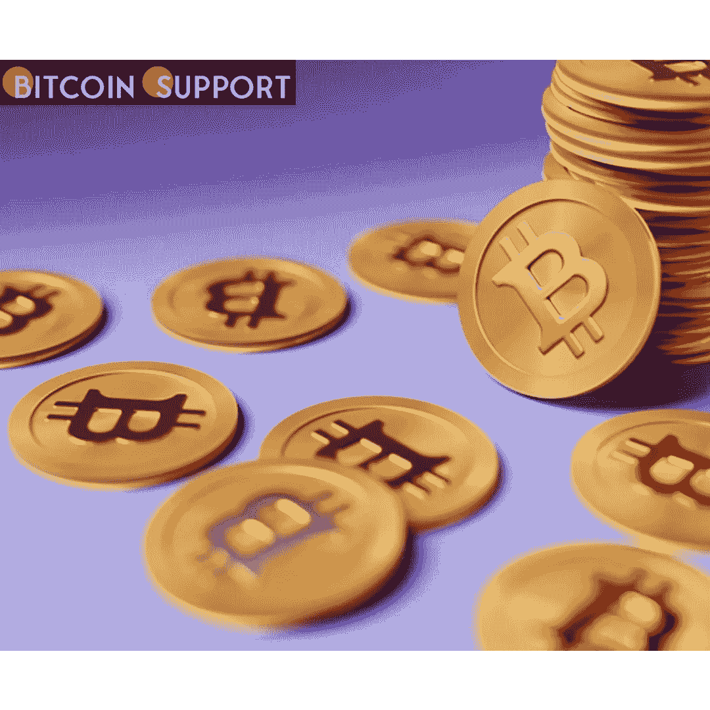
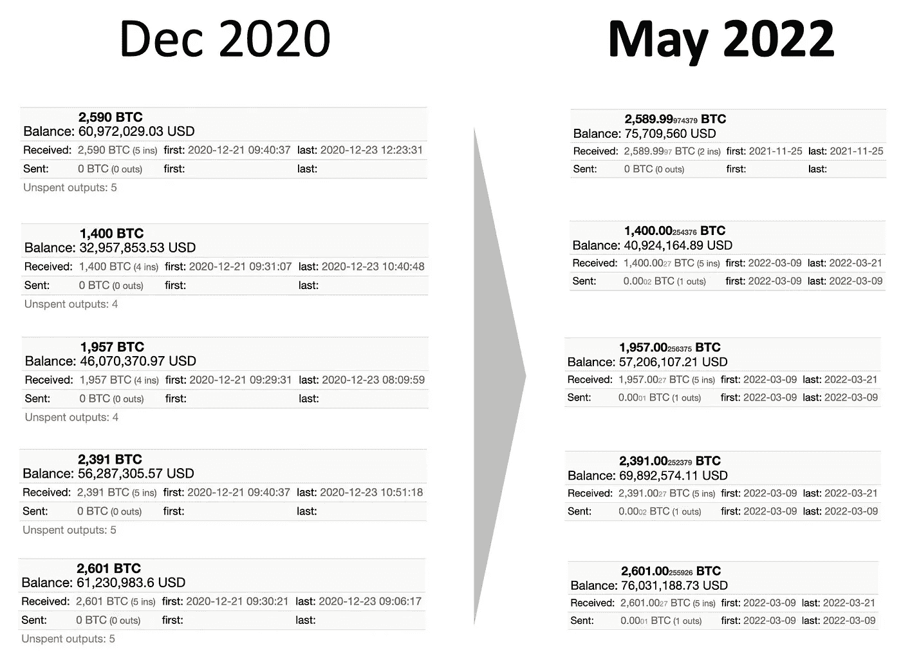
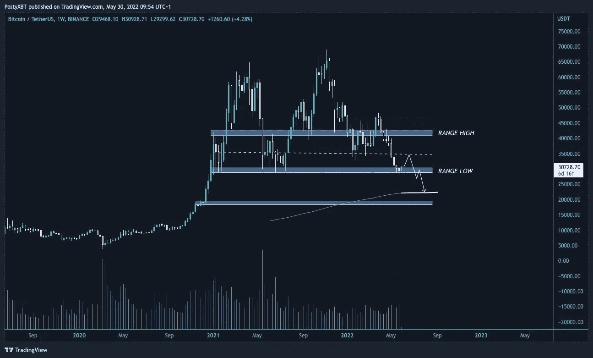

# 根据现有信息，自 2020 年 12 月以来，富有的比特币基地客户一直在“追逐”比特币

> 原文：<https://medium.com/coinmonks/according-to-data-wealthy-coinbase-customers-have-been-hodling-bitcoin-since-december-2020-259cedfa0eb3?source=collection_archive---------38----------------------->

据报道，2020 年 12 月从比特币基地购买了 10，939 枚比特币的机构尚未出售。

比特币(BTC)的价格自 6 个月前达到 6.9 万美元的峰值以来下跌逾 50%，但这一下跌并未阻止该货币一些最富有的投资者抛售。值得注意的是，自 2020 年第四季度以来，比特币基地监管机构为机构客户持有的比特币数量增加了 296%，这表明，尽管比特币价格从历史高点下跌了一半以上，但大多数投资者仍决定“持有”他们的比特币。

CryptoQuant 的首席执行官 Ki Young Ju 指出:

**“在大多数情况下，2020 年 12 月流出比特币基地用于极有可能的机构购买的相同数量的 BTC 仍在(托管人)钱包里。”**

如果是这样的话，这些机构现在正从他们在 BTC 的投资中获得 30%的利润。与此同时，尽管 BTC/美元已经下跌了一半以上，他们仍拒绝平仓，这表明了他们强烈的“hodling”态度。

这也表明，机构将能够承受比特币价格的进一步下跌，至少在价格跌破投资者 2.3 万美元的盈亏平衡点之前是如此。

## **比特币熊市还在继续吗？**

自 5 月 12 日以来，比特币的价格一直在 2.95 万至 3.05 万美元之间波动，突显出市场在利率上升面前的犹豫不决。然而，一些技术分析师认为，比特币的价格将继续下跌。

例如，如下图所示，独立市场分析师 PostyXBT 认为，下一个令牌将下跌至 200 周移动平均线(2 万至 2.2 万美元)。

与此同时，广受欢迎的分析师 Rekt Capital 认为，向 200 周并购市场的下跌可能会导致比特币形成熊市，将其价格降至 15500-19000 美元。

**免责声明:以上均为作者观点，不应视为投资建议。读者应该做自己的研究。**