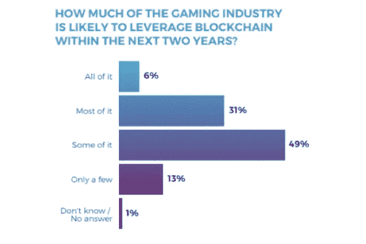

# 据电影公司高管称，游戏产业将会有一个“与区块链相连”的未来

> 原文：<https://medium.com/coinmonks/according-to-studio-executives-the-gaming-industry-will-have-a-blockchain-connected-future-60162606bb9?source=collection_archive---------121----------------------->

**Visit our website:-** [**https://bitcoinsupports.com/**](https://bitcoinsupports.com/)

“在接下来的几年里，我们预计大多数游戏都将有一些玩赚或玩赚的元素，”WAX 高管迈克尔·鲁宾内利说。随着区块链进军视频游戏业务，业内人士和 NFT 区块链蜡像公司的高管预测，在未来，游戏和区块链网络之间将会有更多的联系。

WAX 出版负责人大卫·金和 WAX 工作室游戏工作室负责人迈克尔·鲁比内利讨论了 NFTs、元宇宙和区块链游戏。尽管谷歌搜索兴趣降低，金声称与游戏、元宇宙和 NFTs 的联系并未消失。“我们注意到，在 2021 年第四季度初，区块链蜡像的销售交易数量翻了一番，此后一直保持高位，”他说。

**“我不确定‘炒作’是否会卷土重来，但我们相信，从长远来看，随着有用性的增长和安全问题的消退，对 metaverses 和 NFT 的兴趣和互动将会不可阻挡地增长。”另一方面，当被问及 P2E 的未来时，Rubinelli 将 P2E 游戏模式的部署等同于在游戏中接受免费游戏和微交易。这位在该行业工作了 20 多年的游戏高管认为，类似的模式正在出现。

**“在接下来的几年里，我们预计大多数游戏都将有某种形式的即玩即赚或即玩即赚。”其中大部分将与区块链有关，但不完全以区块链为基地。根据区块链博彩联盟 2021 年发布的一项调查，当被问及未来两年区块链行业可能对区块链产生多大影响时，许多受访者同意 WAX 高管的观点。****

Blockchain Gaming Alliance 2021 Survey Report

Rubinelli 指出，在讨论区块链游戏面临的挑战时，可扩展性仍然是一个大问题。“现在，主要的困难是大多数区块链没有能力扩展，”他说。

游戏老手称，第二层解决方案无法扩展，除非它们“100%致力于某个特定游戏，如 Axie Infinity 的 Ronin。他还强调了随着游戏《向日葵农民》越来越受欢迎，“它让 Polygon 陷入了停滞”。

在电子竞技方面，大卫·金(David Kim)表示，大多数蜡像游戏“过于简单，无法转移到电子竞技中。“然而，根据 WAX 首席执行官的说法，有一些正在开发的游戏可能会变成电子竞技。

**“许多与区块链有关的游戏目前正在开发中，重点是电子竞技。像 Skyweaver 这样受炉石启发的卡牌战斗者，Hodlgod 这样的战斗皇室，以及 Forge Arena 这样的团队第一人称射击游戏都在其中。”**

电子竞技游戏，据金说，需要更多的时间来开发。据金说，自从《异形世界》、《夹板地》和《Axie Infinity》证明区块链游戏可以吸引大量玩家以来，才过去了 9 个月在这么长的时间里，你不可能设计出电子竞技所需的那种复杂的游戏机制，”他指出。

**访问我们的网站:-**[**https://bitcoinsupports.com/**](https://bitcoinsupports.com/)

**免责声明:以上为作者观点，不应视为投资建议。读者应该自己做研究。**

> 加入 Coinmonks [电报频道](https://t.me/coincodecap)和 [Youtube 频道](https://www.youtube.com/c/coinmonks/videos)了解加密交易和投资

# 另外，阅读

*   [有哪些交易信号？](https://coincodecap.com/trading-signal) | [Bitstamp vs 比特币基地](https://coincodecap.com/bitstamp-coinbase) | [买索拉纳](https://coincodecap.com/buy-solana)
*   [ProfitFarmers 回顾](https://coincodecap.com/profitfarmers-review) | [如何使用 Cornix Trading Bot](https://coincodecap.com/cornix-trading-bot)
*   [十大最佳加密货币博客](https://coincodecap.com/best-cryptocurrency-blogs) | [YouHodler 评论](https://coincodecap.com/youhodler-review)
*   [MyConstant 点评](https://coincodecap.com/myconstant-review) | [8 款最佳摇摆交易机器人](https://coincodecap.com/best-swing-trading-bots)
*   [MXC 交易所评论](/coinmonks/mxc-exchange-review-3af0ec1cba8c) | [Pionex vs 币安](https://coincodecap.com/pionex-vs-binance) | [Pionex 套利机器人](https://coincodecap.com/pionex-arbitrage-bot)