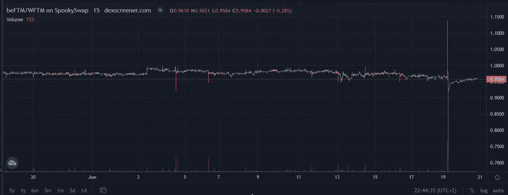
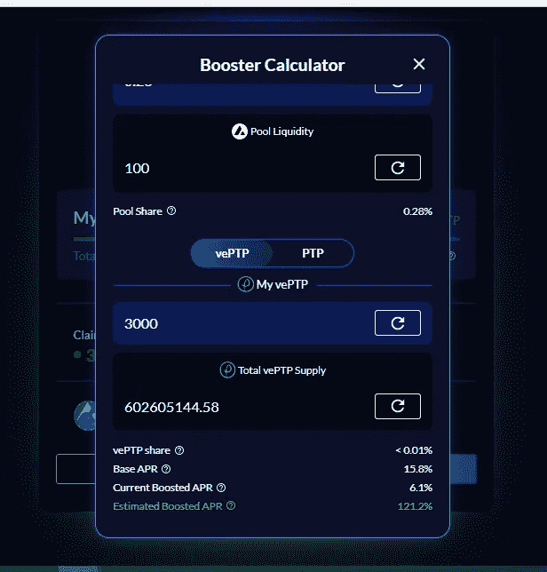
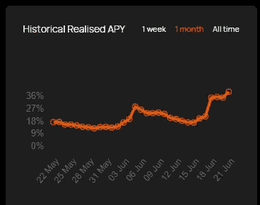
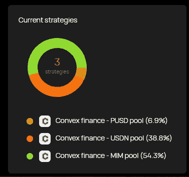
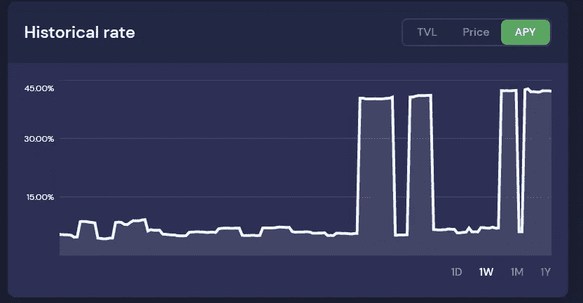

# 积累阶段——在熊市期间，一些最好的 DeFi 收益率低于 LP

> 原文：<https://medium.com/coinmonks/accumulation-phase-some-of-the-best-defi-yields-off-lps-during-the-bear-market-9814e2f3482?source=collection_archive---------14----------------------->

是的，这是一个熊市，但这并不意味着当我们等待走出熊市时，你不应该使用你的代币。

# 为什么要积累？

如果你完全被一个项目说服了，并且 100%地相信他们会熬过这个加密的冬天，或者如果你只是被一大堆已经损失了 85% ATH 价值的备用包困住，并且你拒绝出售，那么让你的加密人员尽可能努力地工作直到冬天结束是有意义的。在这一季中，我们看到了 stETH 的脱标，即使是赌注也有风险，但在我寻找一些最高收益率(几乎没有非永久性损失)的过程中，我想我会分享一些我目前拥有的最高收益率的代币。

一个附加的警告是，随着最近 Celsius 崩溃的恐慌，以下方法都是基于 DeFi 方法而不是 CeFi。因此，主要的安全风险理论上仅基于智能合约，允许您保持对密钥和密码的控制。还有其他 CeFi 平台可能会提供更好的回报，但像 Celsius 一样，其中许多都在使用杠杆头寸，这涉及到很大的风险。

事不宜迟…

# $FTM (20~40% APY)

我寻找高产农场的第一个地方通常是 beefy.finance。他们已经建立了他们的农场，这样你就可以通过自动复利获得本地 LP 令牌，至于不干涉，beefy 通常会拿走蛋糕。有了$FTM，他们目前有了一张$beFTM 的 LP，代表 Beefy escredented Fantom。你可以在这里阅读令牌组学，但本质上，每 1 FTM 通过他们强大的代理库存入，就会产生 1 beFTM。挂钩安全吗？在过去一个月的大部分时间里，人民币汇率似乎的确如此，但话虽如此，也确实有几个例子表明，人民币汇率已经失去了联系汇率制:

也就是说，$beFTM 完全是由$ FTM 1:1 支持的，所以我怀疑只有在有大量快速买入/卖出压力的情况下，它才会依赖。因此，从理论上讲，假设$beFTM 保持其钉住汇率，这种 LP 应该几乎没有非永久性损失的机会。

# 美元平均年利率(至少 15.7%)

这张 LP 可以在 [app.platypus.finance](https://app.platypus.finance/stake) 上找到，我说“至少”15.7%的年利率，因为这是赌注的基础利率。如果你不熟悉鸭嘴兽，它基本上类似于凸/曲线，如果你下注他们的本地$PTP 代币，并随后赚取$vePTP，你可以获得更大的收益。$PTP 现在的价格低得离谱(目前约为 0.12 美元，与超过 7 美元的 ATH 相去甚远)，因此能够积累大量的$vePTP 从未如此容易。如果你对你的收益率能增长到多高感到好奇，他们在这里[详细说明了如何最大化你提高的 4 月份收益率的公式](/platypus-finance/platypus-staking-guide-94f5fb3d0c7a)，或者你可以在他们的应用程序上查看他们的助推器计算器，在那里你可以输入多少美元 AVAX 和/或多少美元 vePTP 可以影响你提高的 4 月份收益率:

A sample calculation that shows a boosted APR of 121.2% APY

主要风险:与 beefy.finance 不同，Platypus 不会以原生的$ AVAX 支付，而是以$PTP 和$QI 支付。因此，如果$PTP 或$QI 的价格下降，您的费率可能会大幅下降。此外，他们在 4 月而不是在 APY 公布费率的原因是因为这些都不是自动复合的，这意味着每次你要求你的奖励，你都要为汽油费买单。

# 稳定加入战略#1(戴/和各占 20~39%的股份)

在之前，我已经写过关于 Zunami [的文章，但是从那以后，](/p/42b45ee9058) [Zunami](https://www.zunami.io/) 协议变得更加有吸引力，因为在我写这篇文章的时候，他们目前提供 39.03%的 APY，而且看起来这个比率还在不断攀升:

Zunami 的快速浏览—在整个 DeFI 中，您可以通过 ERC20 存入 DAI、funds 或 funds，您的资金主要通过 3 种不同的凸策略进行使用，具体细分如下:

现在，我们从和 LUNA 的惨败以及最近所有其他的 depeg 恐慌中知道，没有什么能打败戴和这样的人，所以这带来了一些风险，因为像$UST 一样，$USDN 是一种有算法支持的稳定币，而$MIM，就像$戴是一种过度抵押的稳定币。这三种货币中最新的稳定币是$PUSD 或多边形美元，在多边形网络上每下注 1 美元，就铸造 1 美元 PUSD。如果你有兴趣了解更多关于$PUSD 的信息，你可以点击这里查看他们的白皮书。从 2022 年初才出现，在我看来，它仍有待考验。但尽管如此，它只占 Zunami 使用的三种策略的 6.9%。

# 稳定加入战略#2 (MIM-USDC ~42% APY)

随着最近$MIM 的波动，我怀疑这是这个强大的金融金库的 APY 暴涨的主要原因之一，但现在你可以在 [MIM-USDC LP 金库](https://app.beefy.com/vault/sushi-usdc-mim)赚取大约 42%的 APY:

正如我之前提到的$FTM，Beefy 的金库是伟大的，因为你在本地 MIM-USDC 赚取你的收益，它是自动复合的。$MIM 在过去的一周里确实经历了一场恐慌，但我真的认为，在经历了 Sifu 的惨败和过去一周我们看到的疯狂价格下跌后，它表现出了自己的干预。如果你有兴趣继续阅读，我推荐你看一看他们最近的一篇关于阿布拉卡布拉破产索赔的文章，这篇文章是关于 [FUD 的。](/@abracadabramoney/abracadabra-addresses-insolvency-claims-364eb3313812)

结论:

正如你所知，虽然这些策略都有一定的风险，但如果你担心你的资金被锁定在 CeFi，担心资不抵债，那么这些可能是你更好的选择。

你还发现了其他值得一看的金库吗？如果是这样，我很乐意在评论中听到。再次感谢您的阅读，请务必在 twitter 上关注我，获取我所有的更新:【https://twitter.com/CryptosWith

免责声明:嘿，伙计们，所以我必须再次声明，我们已经看到了很多代币 depeg，死亡螺旋，或者只是绝对的价值，所以请不要认为这是任何金融建议，而是简单的信息，仅供教育目的。

> 加入 Coinmonks [电报频道](https://t.me/coincodecap)和 [Youtube 频道](https://www.youtube.com/c/coinmonks/videos)了解加密交易和投资

# 另外，阅读

*   [用信用卡购买密码的 10 个最佳地点](https://coincodecap.com/buy-crypto-with-credit-card)
*   [加拿大最佳加密交易机器人](https://coincodecap.com/5-best-crypto-trading-bots-in-canada) | [Bybit vs 币安](https://coincodecap.com/bybit-binance-moonxbt)
*   [阿联酋 5 大最佳加密交易所](https://coincodecap.com/best-crypto-exchanges-in-uae) | [SimpleSwap 评论](https://coincodecap.com/simpleswap-review)
*   购买 Dogecoin 的 7 种最佳方式 | [ZebPay 评论](https://coincodecap.com/zebpay-review)
*   [最佳期货交易信号](https://coincodecap.com/futures-trading-signals) | [流动性交易回顾](https://coincodecap.com/liquid-exchange-review)
*   【Huobi 的加密交易信号 | [Swapzone 审查](/coinmonks/swapzone-review-crypto-exchange-data-aggregator-e0ad78e55ed7)