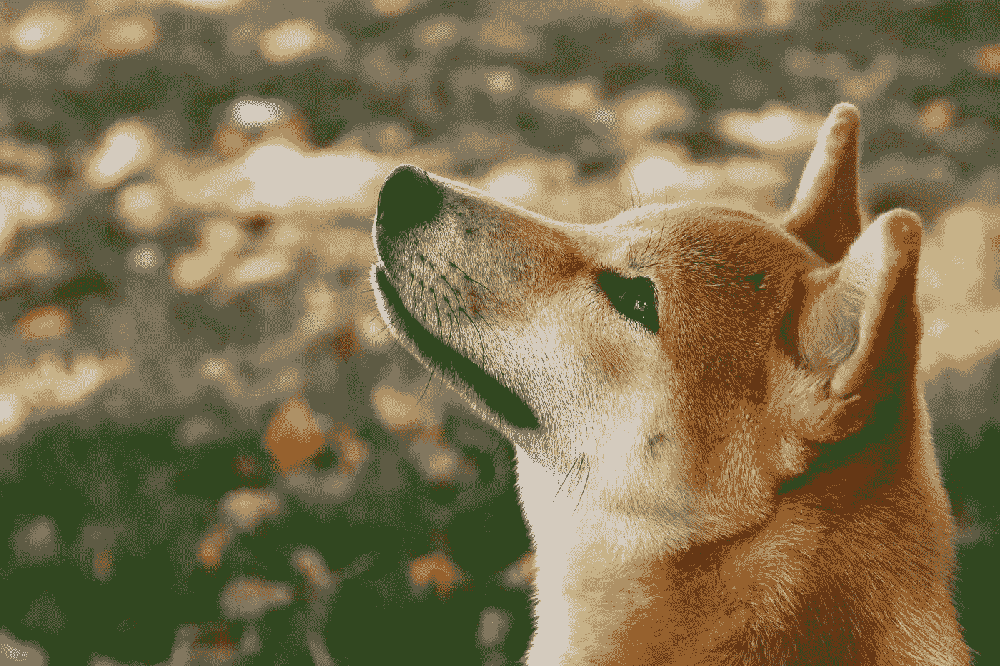

# 我在水龙头上从 0 开始实现 100k 加密的可怕经历

> 原文：<https://medium.com/coinmonks/achieve-100k-in-crypto-starting-from-0-dogecoin-shiba-inu-4a60cdfdea62?source=collection_archive---------16----------------------->

## 从荒谬到神话，一个大胆的故事！

Photo by [Patrícia Hellinger](https://unsplash.com/@newleonin?utm_source=unsplash&utm_medium=referral&utm_content=creditCopyText) on [Unsplash](https://unsplash.com/?utm_source=unsplash&utm_medium=referral&utm_content=creditCopyText)

一开始你们都会说我是个失败者。

我不好意思承认我在我的电脑上收集一美分的零头。

但最终我还是通过这种疯狂的行动实现了财务自由！

# 不投入一毛钱就收获加密货币！

2019 年，和很多加密货币市场预算不多的新手一样，我在追逐免费制作 crypto 和 tokens 的不同方式。

对低价代币的特殊嗜好吸引了我。

但是，不幸的是，我摔在了几个水龙头上。有些很糟糕，有些很有趣。

## 其中一个是免费的狗食。

那是在 2019 年期间。该网站每半小时奖励我们 4 多一点的 DOGE，或者不到 0.008 美元。

之后，我们不得不使用广告拦截器来验证验证码。我为此使用了[勇者](https://brave.com/lac925)，顺便说一下，这也给我带来了一个基本的注意力标志。

我确信这个带有狗头标志的信物有一天会流行起来，尤其是在日本女性中。他们会接受它有趣、不严肃和可爱的一面。还有，在日本逗留期间，我目睹了“卡哇伊”的威力。

对我来说，这枚硬币总有一天会不可避免地与美元平价，或者至少 10 美分。

所以我不得不在不购买的情况下积累更多的 Dogecoin，因为我更喜欢把我的预算投入到比特币中！

我每天在电脑上工作的时候都在做这件事。它几乎不需要任何努力，只需要组织，以优化我的表现。

我可以看到它会在短时间内给我带来多少钱，有时对自己微笑。

准确地说，就回报而言，我们可以赌这些狗赢。一种轮盘赌允许我们冒着失去一切的风险把赌注翻倍。

你必须赌会出现一个偶数还是奇数。赢了一点，输了很多。

你必须达到 60 多吉的金额才能从网站上提取代币。我小心翼翼地尽快将它们转移到我的[分类账键](https://shop.ledger.com/pages/ledger-nano-x?r=86feb94cc7be)。

通过这种方式，我可以填充我的密码收集，这在当时相当于大约 4 或 5 个不同的令牌。

临近 2019 年底，这个网站宣布即将关闭。

我没有看到 Dogecoin 起飞，也没有更多的事情要做，我决定继续索赔，同时以前所未有的方式在轮盘赌上下注。

我使用的下注技巧是，如果我输了，每次都加倍下注，直到我赢为止。结果，几个月后我的[账本](https://shop.ledger.com/pages/ledger-nano-x?r=86feb94cc7be)上就累计了[1569.2 元](https://dogechain.info/tx/e14b2b83b104f84c00d7269081f62483a750349d6333e5825125cc4b0cf96143)。当时是 3.92 美元。

# 我很同情另一只狗，柴犬。

一年后。2021 年 2 月，令人惊讶的时刻来自埃隆·马斯克，他在推特上推广 Dogecoin。

加密市场处于牛市阶段，根据他的说法，这种加密货币可能是火星上使用的货币。

就这么多了！我认为这是极好的，我可以看到我的 DOGE 包涨到 110 美元。

此时，我既不想买也不想卖。尽管如此，我还是很高兴地看到，我对 Dogecoin 成功的推测正在成形。

2021 年 3 月 30 日晚上，在[不和谐](https://discord.gg/JMXBQrqcCc)的一次会议上，我和我的朋友们一起分享我们最喜欢的狗屎硬币，玩得很开心。

我第一次听说柴犬。这个令牌是由一个匿名团队在对 Dogecoin 进行合理的批评后创建的。

它不够分散。八个地址拥有 40%的供应，特别是其中一个，拥有 27%的代币。

那次会议上我们大约有六七个人，我决定那天晚上就去买。

然而，我对这枚硬币感到不舒服，因为它的价值在短短几天内几乎翻了一番。

我对抽水和倾倒陷阱很警惕。

然后我有了一个想法，最终用我的 Dogecoin 换 USDT 去买 Shib，在 [Hotbit](https://www.hotbit.io/register?ref=1460542) 刚刚上市。

我在柴犬上花了 69 USDT，净得 12.3 亿币。

在当时，它只是一个有人道主义后盾的象征。

该项目随后扩大了整个生态系统——皮带、骨头、Shibaswap。他们的区块链宣布成立。

它的共同创始人 Ryoshi 模仿了中本聪(比特币的发明者)的某些方面。

他很少说话，而且总是匿名。柴犬社区很强大，几乎从不出售。

很快，我的包在 2021 年 5 月到了 4452.60 美元才纠正过来。

Vitalik Butterin(以太坊创造者)向印度提供了超过 80 亿美元的柴犬。这个国家正在对抗一种新的 Covid 变种。社区对这一决定的看法很糟糕。

值得注意的是，当代币出现时，他已经免费得到了一半的供应。

接着，维塔利科·巴特林烧掉了他在柴犬剩下的东西，这更加增加了这件象征物的稀有性。

## 2021 年夏天过去了，市场恢复正常。

我对这些熟睡的柴犬无所事事的前景感到恼火。

我告诉自己，也许这个项目会到此为止，我必须和他们一起做点什么。

然后，我发现了一个机会，利用 HECO 链上的 Makiswap 应用程序，以 800%的 APR 来培养他们。

然后我把我的柴犬和我在 [Makiswap](https://app.makiswap.com/farms) 赢得的 MAKI 结合起来。

2021 年 10 月，柴犬的 ATH 为 0.0008190 美元。当时我的 LP 代币价值超过 10 万美元，每天收入 421 美元。

此后，柴犬大幅回调，市场也是如此。

## 柴犬是改变生活的标志之一。

这个年轻的市场将为我们提供更多的机会来充实我们的钱包。我相信会的！我很快会分享更多类似的故事。

在写这篇文章的时候，我注意到[的水龙头](https://free-doge.com/?ref=165741)已经重新打开了。

此外，它还是具有相同操作的 [15 个水龙头](https://www.lacircum.com/index.php/fr/la-crypto-monnaie-pour-les-nuls-debutants/38-astuce-tuto-crypto-bitcoin-gratuit-faucet)的一部分。

无论你的计划是什么，坚持到底。智慧和耐心会完成剩下的工作。

> 加入 Coinmonks [电报频道](https://t.me/coincodecap)和 [Youtube 频道](https://www.youtube.com/c/coinmonks/videos)了解加密交易和投资

# 另外，阅读

*   [7 个最佳零费用加密交易平台](https://coincodecap.com/zero-fee-crypto-exchanges)
*   [氹欞侊贸易评论](https://coincodecap.com/anny-trade-review) | [霍比保证金交易](/coinmonks/huobi-margin-trading-b3b06cdc1519)
*   [分散交易所](https://coincodecap.com/what-are-decentralized-exchanges) | [比特 FIP](https://coincodecap.com/bitbns-fip) | [Pionex 评论](https://coincodecap.com/pionex-review-exchange-with-crypto-trading-bot)
*   [用信用卡购买密码的 10 个最佳地点](https://coincodecap.com/buy-crypto-with-credit-card)
*   [最好的卡达诺钱包](https://coincodecap.com/best-cardano-wallets) | [Bingbon 副本交易](https://coincodecap.com/bingbon-copy-trading)
*   [印度最佳 P2P 加密交易所](https://coincodecap.com/p2p-crypto-exchanges-in-india) | [柴犬钱包](https://coincodecap.com/baby-shiba-inu-wallets)
*   [8 大加密联盟项目](https://coincodecap.com/crypto-affiliate-programs) | [eToro vs 比特币基地](https://coincodecap.com/etoro-vs-coinbase)
*   [最佳以太坊钱包](https://coincodecap.com/best-ethereum-wallets) | [电报上的加密货币机器人](https://coincodecap.com/telegram-crypto-bots)