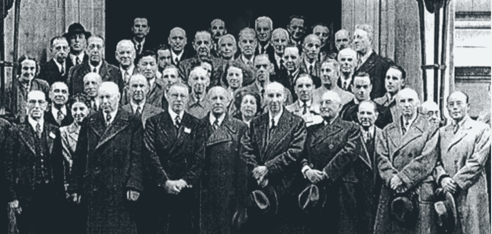

# ACTUS —标准化智能合同

> 原文：<https://medium.com/coinmonks/actus-standardising-smart-contracts-3ee968531caf?source=collection_archive---------24----------------------->

达沃斯上周举办了世界经济论坛，区块链中心邀请了极具影响力的人士与其一起讨论此事。

没有闪亮的 APY 或新 NFT 系列的 DeFi 项目。我们谈论的是地球上最懂经济的人，他们在思考如何在深层程序层面优化我们的社会。

想象一下，一位中国学者和他的团队一起集思广益，提出了第一张钞票的想法，并在七世纪发行。相同但不同。

## 标准

Rayyu Maldives —[https://unsplash.com/@rayyu](https://unsplash.com/@rayyu)

在日益全球化的世界里，标准是必须的。

拥有不同的电源插座已经是一件令人头疼的事情，因此我们无法想象一个金融业不使用 SWIFT(环球银行间金融电信协会)这样的标准的世界。

> 加入 Coinmonks [Telegram group](https://t.me/joinchat/Trz8jaxd6xEsBI4p) 并了解加密交易和投资

我们今天使用的一些标准被广泛采用，以至于我们忘记了它们是标准，而不是做事情的唯一自然方式。

**例如，SIM 卡**让我们的世界共享和使用全球移动电话的相同技术。这当然不仅加快了采用，也加快了创新。

**集装箱**也是一个很好的例子:一个全球化的文明需要全球标准化的运输方式。为此，一组工程师设想并优化了一个具有特殊功能形状的盒子。

Teng Yuhong — [https://unsplash.com/@live_for_photo](https://unsplash.com/@live_for_photo)

## 国际标准化组织

国际标准化组织是一个最好的例子来说明一个高峰文明活动是什么样子的。他们的目的是把来自世界各地的专家聚集在一起，为他们所能想到的一切事物制定最佳标准。

通过这样做，人类作为一个整体可以建立更强大的基础，并有助于为每个人带来更安全和更有效的产品。

Founders of ISO, London 1946 — taken from [https://www.iso.org/about-us.html](https://www.iso.org/about-us.html)

创建于 1946 年，他们的第一个总部设在瑞士日内瓦的一个小房子里。

例如，在 1960 年，他们出版了关于国际单位制的 ISO 31 标准。他们把米标为距离单位，秒标为时间单位等。

这些标准允许人类在他们最擅长的方面做得更好:大规模协作。

## 回到我们身边

如果你认为区块链和智能合约在我们金融机构的未来中扮演着核心角色，那么接下来的内容可能会让你感兴趣。

众所周知，黑客攻击和漏洞利用是 web3 常见问题。原因是整个生态系统是数字化的，因此是基于代码的。人类编写的代码，有时会有错误，因此容易受到攻击。

所有这些问题的原因是深刻理解代码的少数人和其他人之间极度的信息不对称。这反过来导致一些非常有知识的人虐待我们这些对此一无所知的人。

很自然地，由于明显的实际原因导致了标准的使用。其中一些已经被广泛采用，如令牌标准 [ERC20](https://www.investopedia.com/news/what-erc20-and-what-does-it-mean-ethereum/) 和 [ERC721a](https://www.erc721a.org/) ，以及它们在不同区块链的等效标准。

这个想法是通过安全使用经过测试和认可的标准，更容易和更民主地获取技术。

## 行为

ACTUS 金融研究基金会主席 Allan Mendelowitz 在达沃斯的演讲中，就当今的金融生态系统、其无法预测巨大危机以及随后对标准化基础层的需求提出了自己的观点。

他在发言中指出的情况如下

*   总会有另一场金融危机
*   下一次危机的原因将不同于导致上次危机的原因
*   危机演变的“传导机制”将永远是预期现金流

这意味着追寻上一次危机的根源不会帮助我们应对下一次危机——尽管它仍然需要修复。

> 控制现金流→控制危机

他接着解释了在 2008 年危机期间，最接近数据的人是如何忘记正在发生的事情的。我们谈论的是摩根大通的首席执行官杰米·戴蒙，当时的美联储主席本·贝南克，以及所有其他的首席执行官和监管者。

一切都分崩离析，该系统的飞行员“盲目飞行”。

**问题**——至少是其中之一——是监管者拥有向后看的数据

*   由于收集数据的方式，当他们访问这些数据时，这些数据已经存在了几个月
*   描述性数据是静态的
*   数据高度聚合，丢失了太多的粒度

**解决方案**可能在于了解哪些数据可以优化前瞻性分析

*   财务分析始于对单个合同产生的预期现金流的检查
*   量化危机的影响需要评估这些单个合同仍未得到支付的风险
*   有效的监管始于粒度数据的收集
*   从而产生更好的风险评估模型

与此同时，区块链的出现改变了一切，大多数人都接受了这一观点，即这种技术对于支持金融生态系统来说自然是完美的。然而，通过区块链支付不是金融。当区块链用于管理和托管“合同双方之间的长期、多重支付合同”时，它将成为全球金融的工具。

我们还没有到那一步，这并不奇怪，但为未来做准备是确保新的世界秩序顺利和最佳实施的最佳方式——我指的是新的和更好的做事方式。

不用说，全球金融生态系统不可能建立在脆弱和异质的智能合约基础上。因此，再次需要标准。

> “可行的智能金融合约的计算核心必须是一个经过验证、测试和广泛接受的算法金融合约标准，即 ACTUS 标准。”艾伦·门德尔罗威茨，2022 年

目标是转变金融监管机构的数据收集能力。

## 赢赢赢

该系统是建立在这样一个理念上的，即它对各方都有利，并且不会比它节省的成本更多，以确保无摩擦的采用。

*   最终客户从交易对手那里获得了更多的透明度，并通过更完整的数据增加了他们的金融知识
*   银行大幅降低了运营和审计成本，从而提高了银行间机构的效率
*   监管者可以获得总体上更好的数据，在数量、质量和时间方面

## 总结想法

这样一个系统将能够通过许多不同的指标，如偿付能力、流动性覆盖率、抗压能力等，评估一个组织的财务健康状况。

第一次，我们可以想象评估系统风险和失败的预期连锁反应。这可以帮助我们在危机前保护和管理重要的金融节点，而不是把钱扔给 2B2F 有问题的银行，这些银行一开始就把自己置于糟糕的境地。

不言而喻，监管者和政府都不应该接触到这么多的数据，如果没有在个人层面上匿名的话。数据对于系统的有效控制是必不可少的，但是人们的身份**永远不应该成为信息技术的一个方面。**

我们离在全球范围内实施这样的标准还很远，区块链认为，世界仍然需要找到什么样的基础协议来构建未来的金融，不管是公共的还是私人的。

一如既往，时间会证明一切。

## 为了更深的潜水

*   【https://www.actusfrf.org/ 
*   [https://www . actusfrf . org/_ files/ugd/3 df5e 2 _ c3fa 23 B2 f 63 B4 D1 ebc 41 a 36 e 5367 f 912 . pdf](https://www.actusfrf.org/_files/ugd/3df5e2_c3fa23b2f63b4d1ebc41a36e5367f912.pdf)
*   [https://github.com/actusfrf](https://github.com/actusfrf)
*   [https://www.youtube.com/watch?v=n1pTeUns7AE&t = 2185s](https://www.youtube.com/watch?v=n1pTeUns7AE&t=2185s)在 32:50 开始