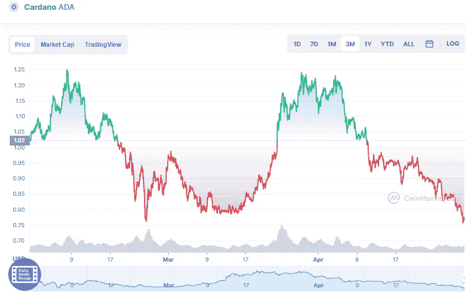

# ADA Cardano 月 1 日技术分析

> 原文：<https://medium.com/coinmonks/ada-cardano-technical-analyse-1st-of-may-550616ddc92e?source=collection_archive---------38----------------------->

Source photo [Cardano price today, ADA to USD live, marketcap and chart | CoinMarketCap](https://coinmarketcap.com/currencies/cardano/)

今天大部分时间，ADA/USD 一直在头肩形态下交易。如果跌破颈线支撑位，价格可能会跌至下一个支撑位 0.75 美元。格局是看跌的。此外，100 天简单移动平均线(SMA)指向南方，表明向下移动是最合理的移动。