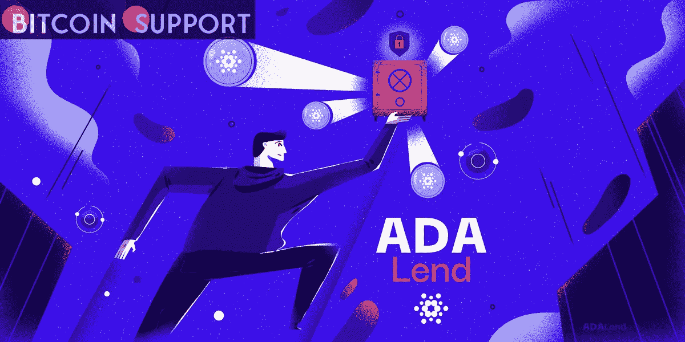

# AdaLend 是世界上使用最广泛的基于 Cardano 的借贷协议

> 原文：<https://medium.com/coinmonks/adalend-is-the-most-widely-used-cardano-based-lending-protocol-in-the-world-7e769f168d72?source=collection_archive---------38----------------------->

**Visit our website:-** [**https://bitcoinsupports.com/**](https://bitcoinsupports.com/)

On March 14th, BSCPad and ADAPad will go on sale to the general public.

**Cryptocurrencies and DeFi are witnessing explosive growth at the moment:**

Across all blockchains, the total value locked (TVL) of tokens in DeFi protocols increased 357 percent to $255.39 billion.

In January 2022, almost $2.5 trillion in cryptocurrencies were traded.

The total value of all crypto assets has now surpassed $2 trillion.

Crypto financing has emerged as the most dynamic segment of the market. DeFi lending protocols account for about $35 billion TVL, with Ethereum dominating the market with a 54 percent share of TVL as of January 2022\. The issue is that Ethereum is slow, costly, and unable to scale:

Because Ethereum can only process 10 to 15 transactions per second, orders pile up quicker than they can be processed, causing delays.

Gas prices can be extravagant when demand is high, hitting over $50 per transaction on average in January 2022.

After peaking at 97 percent in January 2021, Ethereum’s market share is rapidly decreasing as developers and crypto investors migrate to more flexible and versatile blockchains.

AdaLend has created a user-friendly, scalable, and fully decentralised Layer-1 platform for quick loan approval, automatic collateral, trustless custody, and increased lending liquidity to permanently solve DeFi’s difficulties. AdaLend intends to unleash the next generation of seamless, fast, and secure crypto lending by utilising the leading proof-of-stake (POS) Cardano network.

AdaLend has a number of unique and powerful features:

**A Spectacular Structure** — The AdaLend protocol attempts to increase capital flow efficiency by managing multiple lending pools using the native $ADAL coin. The liquidation model, usage ratio, and borrowing/lending interest rate are all important components of each pool. The system enables tokenization for deposited assets, allowing users to automatically transfer ownership of lending positions between them.

**Liquidity Providers (LPs) Must Be Incentivised** — To facilitate lending, DeFi lending protocols must encourage Liquidity Providers (LPs) to stake assets in pools. AdaLend accomplishes this by providing LPs with attractive incentives and a high annual percentage yield (APY) to deposit assets and increase lending liquidity.

**Flexible Lending Options** — In AdaLend, all lending is permissionless, trustless, and possible with any token pairing. The protocol’s governance ensures that only the safest oracles are utilised to set pricing and rates, ensuring that the best offers are offered.

**Decentralized and democratic governance** — All $ADAL token holders can actively engage in AdaLend’s governance, voting on ideas and influencing the platform’s future progress. The AdaLend DAO aims to build a worldwide financial ecosystem that is democratised, open to everybody, and fully transparent.

**Idle Asset Optimisation** — AdaLend reduces the usage ratio for non-stable currencies while increasing token circulation, achieving a dual purpose of keeping protocol users’ liquidity levels high while also providing borrowers with competitive lending rates. AdaLend also reduces the amount of idle assets on the platform by transferring them to stable swap platforms. As a result, users who have tokens in cold storage can now utilise them to promote the AdaLend protocol and gain additional benefits.

The Cardano blockchain’s capabilities are the magic gasoline that drives AdaLend’s long-term business strategy.

What’s the deal with Cardano? The Competitive Advantage of AdaLend

Cardano is a flexible, scalable, and cost-effective Blockchain platform that is suited for developing a next-generation crypto lending platform. It is a Proof of Stake (PoS) chain where code modifications are carefully peer-reviewed, and it was created by Ethereum Co-Founder Charles Hoskinson in 2017\. The benefits of Cardano are obvious:

Cardano is 47,000 times more energy efficient than Bitcoin, making it the most environmentally friendly blockchain in the world.

**Scalability** — Cardano can process 250 TPS and is expected to be able to process 1 million TPS in the future.

Cardano’s fees are presently under $0.35 per transaction, which is almost 100 times less than Ethereum’s.

Growing Interest and Investment in Cardano — Interest and investment in Cardano has been steadily increasing, with TVL reaching a new all-time high of $133.39 million on March 2nd, and the number of wallets holding Cardano’s native currency ADA recently topping the three million mark.

Until date, DeFi lending has been dominated by Ethereum-based services like Aave. This is rapidly changing, as the DeFi market seeks solutions that are faster, cheaper, and more scalable.

AdaLend is this answer, and it is being recognised by investors. In less than an hour, the September 2021 private sale sold out of 1.8 million ADAL tokens, raising $540,000\. AdaLend will hold a public sale on March 14th on five launchpads (BSCPad, VelasPad, PulsePad, ADAPad, and ETHPad) to fund its expansion objectives. These are the most popular launchpads among investors, and they allow you to purchase $ADAL tokens before they go on sale. Once listed, the $ADAL token will trade on the major crypto exchanges linked to the launchpads, giving it rapid liquidity and visibility. AdaLend is set to usher in a new age of DeFi lending with its unique features, unrivalled capabilities, and built-in scalability.

**Visit our website:-** [**https://bitcoinsupports.com/**](https://bitcoinsupports.com/)

**Disclaimer: These are the writer’s opinions and should not be considered investment advice. Readers should do their own research.**