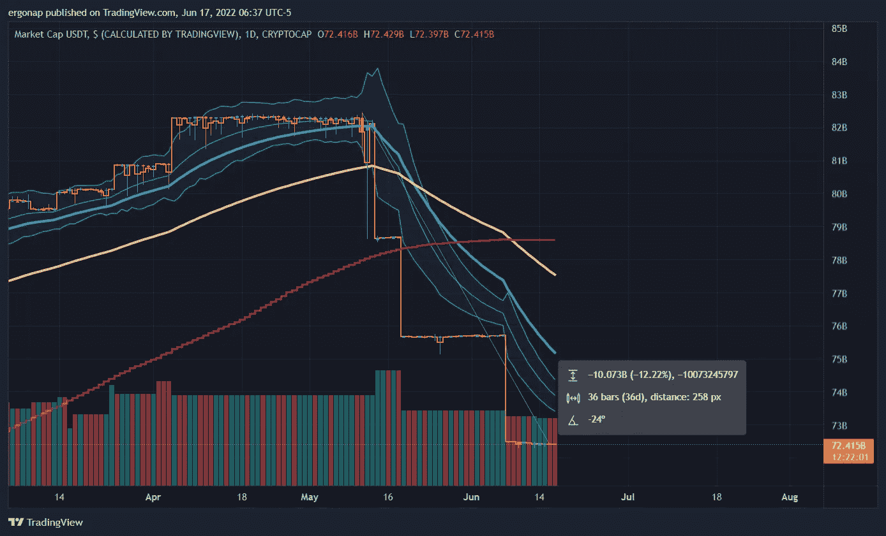
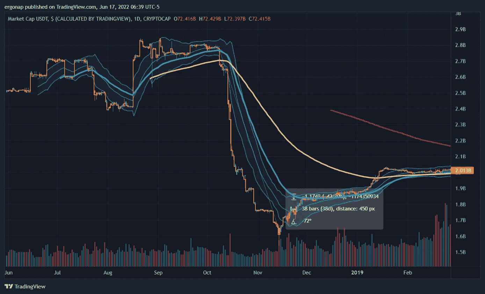
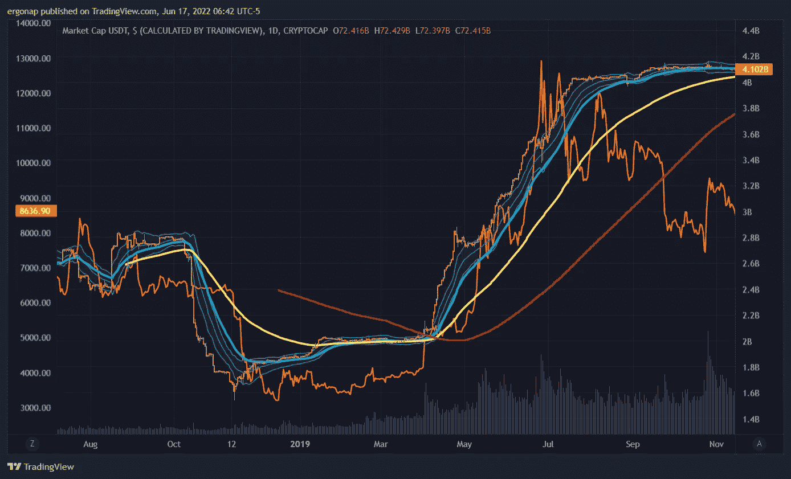
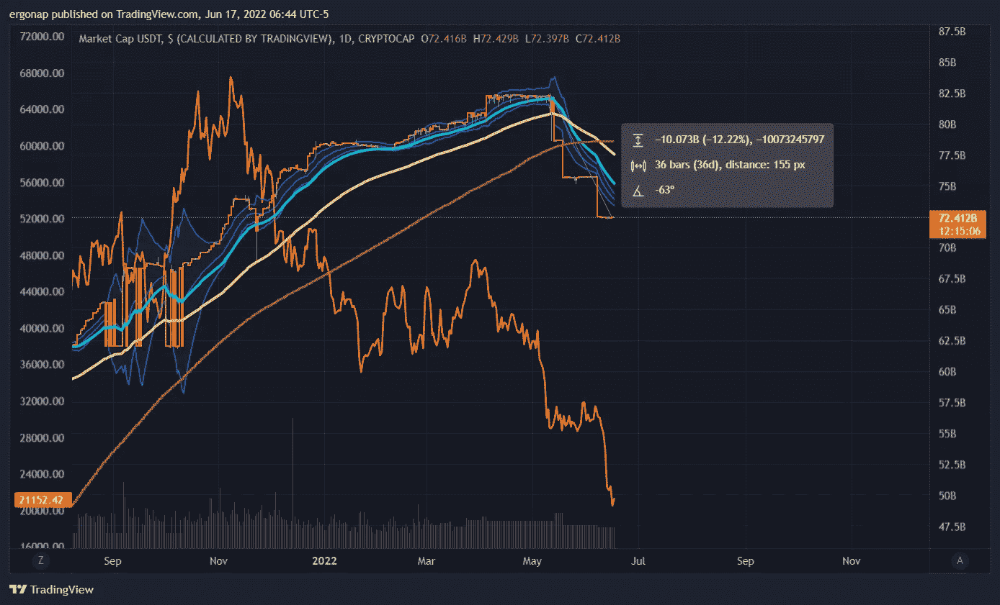

# 其他加密市场分析——USDT

> 原文：<https://medium.com/coinmonks/additional-crypto-market-risk-a5e35b9dae4e?source=collection_archive---------68----------------------->

现在城里还有另一个风险，那就是 USDT。不是从“输钱”的角度，而是从“人在套现”的角度。上个月，100 亿美元的 tether 已兑换成美元。

tether cashout is a significant danger

在此之前，USDT 最近一次进行重大赎回是在 2017 年牛市之后，即 2018 年。

looks like 40% ish

让我们在 2018 年的上面覆盖一些 btc。

looks like market bottomed out after the usdt redemption, as that was the historical low

如果我们看看现在呢？同样的船，同样的丑陋，同样的担忧，我们可以放弃得更远。如果我们将 12%的赎回率降低 50%**并且**看到另一个 30%的赎回率，我们可能会看到低于 4000 美元的 BTC——即 Microstrategy 清算。

overlaying btc drop amounts with USDT looks dangerous

所以，我主要是在比特币从这里流出哪怕一点点的时候去兑现，直到方向改变。

> 加入 Coinmonks [电报频道](https://t.me/coincodecap)和 [Youtube 频道](https://www.youtube.com/c/coinmonks/videos)了解加密交易和投资

# 另外，阅读

*   [如何使用 Solidity 在以太坊上创建 DApp？](https://coincodecap.com/create-a-dapp-on-ethereum-using-solidity)
*   [币安 vs FTX](https://coincodecap.com/binance-vs-ftx) | [最佳(SOL)索拉纳钱包](https://coincodecap.com/solana-wallets)
*   [如何在 Uniswap 上交换加密？](https://coincodecap.com/swap-crypto-on-uniswap) | [A-Ads 审查](https://coincodecap.com/a-ads-review)
*   [加密货币储蓄账户](/coinmonks/cryptocurrency-savings-accounts-be3bc0feffbf) | [YoBit 审核](/coinmonks/yobit-review-175464162c62)
*   [Botsfolio vs nap bots vs Mudrex](/coinmonks/botsfolio-vs-napbots-vs-mudrex-c81344970c02)|[gate . io 交流回顾](/coinmonks/gate-io-exchange-review-61bf87b7078f)
*   [CoinFLEX 评论](https://coincodecap.com/coinflex-review) | [AEX 交易所评论](https://coincodecap.com/aex-exchange-review) | [UPbit 评论](https://coincodecap.com/upbit-review)