# 在 Twitter 上解决比特币的常见批评。

> 原文：<https://medium.com/coinmonks/addressing-bitcoins-common-criticisms-on-twitter-855684bf01c4?source=collection_archive---------11----------------------->

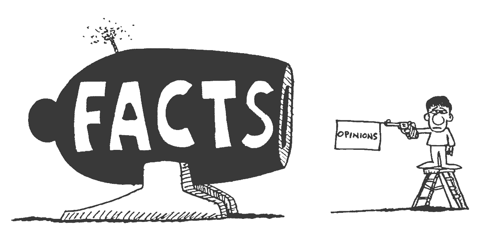

source: themillennialpastor.com

## 介绍

互联网上充斥着关于比特币的老一套不准确的说法，我们将以推文为例来解决这个问题。

# 比特币是一个郁金香泡沫

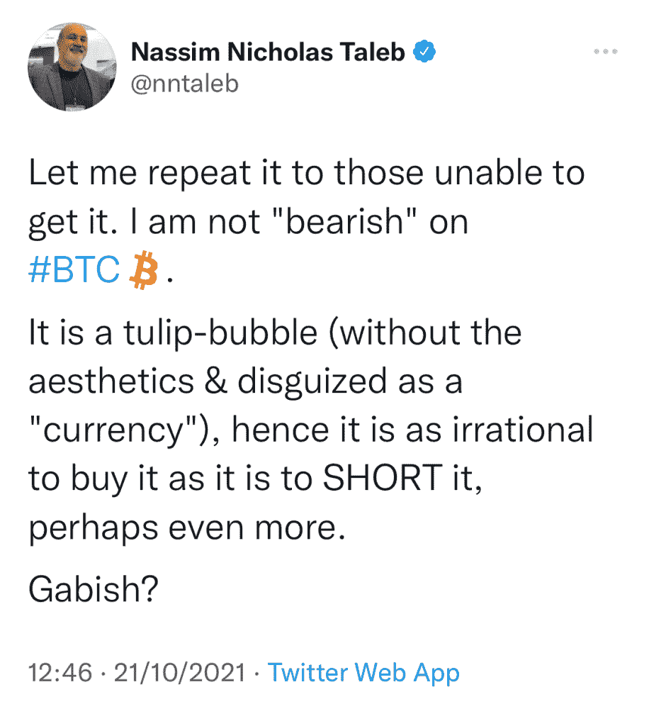

source: twitter

我们选择添加它，因为仍然在寿命短、突变多的花朵和由强大的加密技术保护的全球数字对等网络之间进行比较。

郁金香狂热是荷兰黄金时代的一个时期，在此期间，新引进和流行的郁金香的特定球茎的合同价格达到了异常高的水平，最大的加速始于 1634 年，然后在 1637 年 2 月迅速崩溃。

***那么究竟发生了什么？***

《郁金香狂热:荷兰黄金时代的金钱、荣誉和知识》一书的作者安妮·戈尔德加尔认为，真实的故事远没有这么戏剧化。这位历史学教授花了数年时间研究荷兰的记录，以找出发生了什么，Goldgar 发现的是一个相对较小且短暂的异国奢侈品市场，而不是一场非理性和广泛的郁金香狂热。

以下是她研究的一些亮点:

没有人破产，荷兰经济也没有受到影响。

极端的价格非常罕见，只有 37 个人花了 300 多荷兰盾(一个工匠的年薪)买了一个郁金香球茎。

3) **崩盘不是因为不知情的买家猜测价格上涨，而是由于担心供应过剩导致价格下跌。**

不是每个人都买郁金香，但相对来说，只有一小部分人会买，他们大多数是富有的商人，而不是扫烟囱的。

# 比特币是庞氏骗局

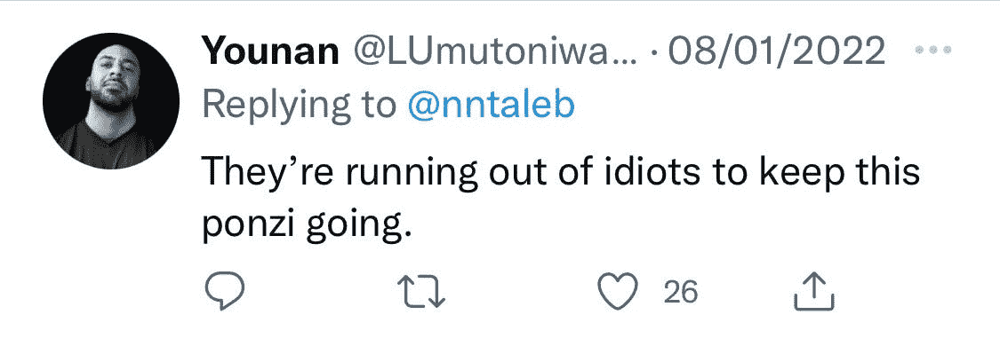

source: twitter

**庞氏骗局**，以查尔斯·庞兹的名字命名，是一种欺诈形式，它引诱投资者，用近期投资者的资金向早期投资者支付利润。

下面是美国证券交易委员会如何识别庞氏骗局:

*   **有保证的投资机会**

在比特币白皮书中，Satoshi 从未承诺任何投资回报。Satoshi 在网上的文章仍然存在，他几乎从来没有谈论过财务收益。他主要写的是技术方面、自由、现代银行系统的问题等等。

Satoshi 在软件公开的时候开采了几乎所有的硬币，任何人都可以开采它们。他没有给自己比别人更快或更容易获得硬币的独特优势。

*   **过度一致的回报**

在最初的一年半时间里，比特币没有可报价的价格，之后价格波动很大。

此外，由于价格持续下跌，比特币的回报永远不会被描述为“过于一致”。价格在 2011 年 6 月见顶，随后暴跌，直到 2013 年 2 月反弹至 2011 年的高点。然后 2013 年 11 月见顶，暴跌，直到 2017 年 2 月才恢复，以此类推。

*   **神秘兮兮的**

比特币的一个根本前提是验证而不是信任。比特币是一种开源货币，全世界都在使用。区块链是公开的、透明的、可核查的、可审计的，并且有能力被分析。公司可以使用区块链分析来确定比特币是在移动还是留在不同的地址。一个开源的全节点，可以审计比特币的整个货币供应量和其他数据，可以在基本的家用电脑上操作。

*   **未注册**

适用于比特币的唯一标准是它是未注册的。然而，这并不意味着这是一个庞氏骗局，因为比特币被设计成无需许可，可以在现有的金融系统之外运行。

重要的是，美国证券交易委员会已经声明，根据豪威测试，比特币不是一种证券，从逻辑上讲，比特币没有犯下任何证券欺诈行为。

# 如果你停止开采比特币，它将不复存在。

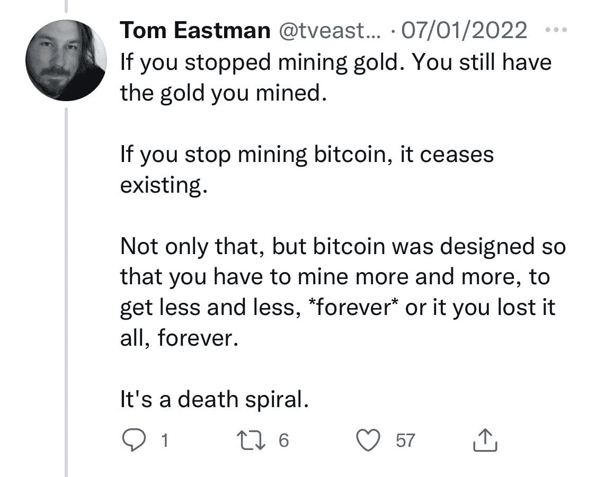

source: twitter

如果你学过经济学，你可能听说过“博弈论”，它认为游戏中的玩家是理性的，会试图在游戏中最大化他们的收益。

即使所有矿工突然关闭设备，比特币交易也将继续正常进行。然而，它们将不再有效，这意味着网络可能会受到攻击，从而允许攻击者发起虚假的交易，以赚取适度的利润。

然而，其他人很快就会发现，只要第一个按下比特币钱包应用程序上的“开始挖掘”按钮，他们就可以每小时赚 150 万美元(以今天的 BTC 价格计算)。你也不需要大型的采矿设备，因为采矿的难度会降低，这样你就可以在你的家用电脑上完成了。

事实上，即使是攻击者也会很快意识到挖掘网络会比伪造网络赚更多的钱。

因此，为网络做贡献比破坏网络更有利可图。

为了彻底‘擦除’比特币网络，所有比特币节点(电脑遍布世界各地，存储着整个区块链。任何人都可以通过简单地在 PC 上运行比特币核心客户端而成为比特币节点)。如果区块链的单个副本存活下来，则有可能再次重建网络并继续正常运行。

如今，全球有超过 47000 个运行中的比特币节点——祝你好运。

# 关于能源浪费的争论

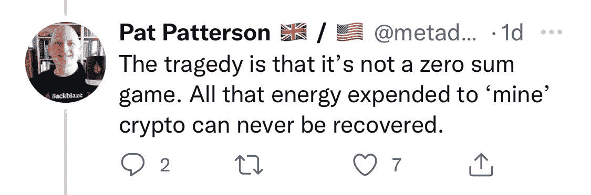

source: twitter

首先,**能量守恒定律**指出能量既不能被创造也不能被消灭——只能从一种能量形式转换成另一种。

第二，根据剑桥大学 2020 年全球加密资产基准研究，绝大多数比特币矿工(76%)将可再生能源作为其能源组合的一部分。水力发电是最受欢迎的能源，62%的矿工利用水力发电为他们的活动提供动力。

最后，根据华盛顿特区非营利智库的数据，挂在美国树上、屋顶和草坪上的圣诞灯每年消耗 66.3 亿千瓦时的电力，超过某些国家和整个比特币网络的总和。

# 比特币 vs 金矿开采

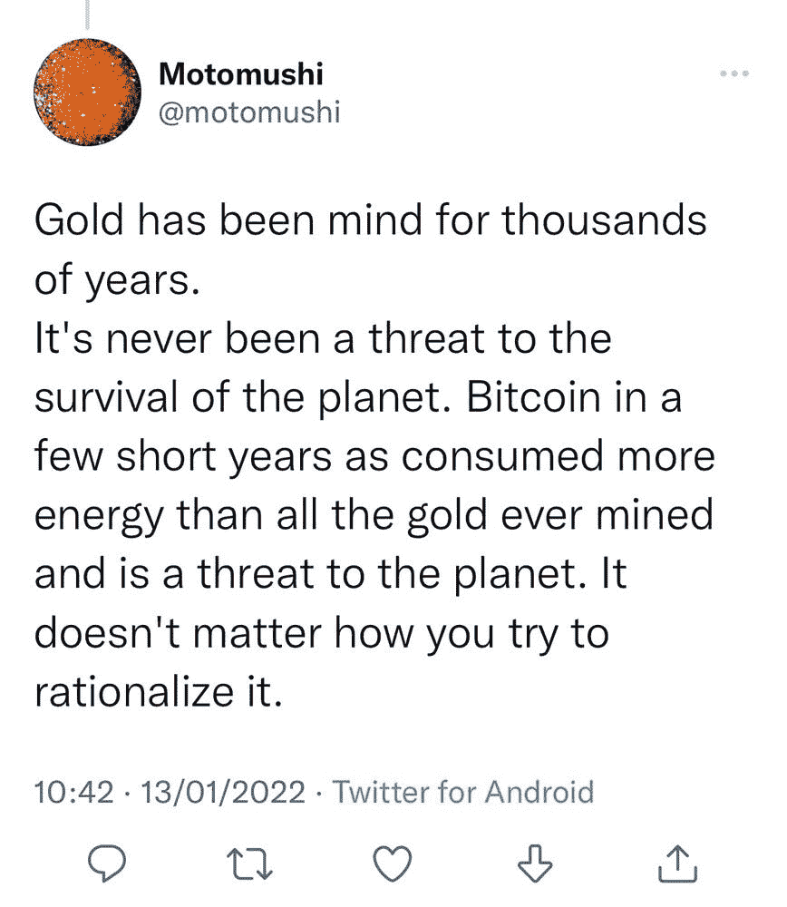

source: twitter

最近对黄金和比特币的能源消耗进行了几项研究。根据 Galaxy Digital 在 2021 年 5 月发表的一项分析，比特币的年用电量现在估计约为 113.89 太瓦时。相比之下，黄金行业的年总能耗约为 240.61 TWh。

然而，金矿开采以比特币永远不会的方式破坏环境。开采黄金的原因:

*   **受污染的水域**——根据非营利环境组织 Earthworks research 的数据，世界各地的矿业公司经常向河流、湖泊、溪流和海洋倾倒有毒废物——研究表明，每年有 1.8 亿吨这样的废物。
*   **固体废物**——根据土方工程研究，许多矿工采用一种被称为堆浸的工艺，其中包括通过大堆矿石滴入氰化物溶液。这种溶液剥离黄金，收集在一个池塘里，然后通过电化学过程提取黄金。这种方法非常浪费，99.99%的堆都变成了废物。为了降低成本，这些废料堆经常被废弃，这污染了地下水，毒害了邻近的社区，如哥斯达黎加的米拉马尔。
*   **汞污染**——根据国际可持续发展研究所的数据，有 132 个金矿开采点造成汞污染，影响了超过 350 万人，特别是在非洲和东南亚。汞对人体健康危害极大。
*   **摧毁亚马逊**——根据两党非营利政策研究组织 CSIS 的说法，采金者正在砍伐森林以获取地下丰富的金矿。一项研究发现，由于金矿开采，秘鲁亚马逊马德雷德迪奥斯地区的森林砍伐率增加了 6 倍。

时间不是一个有效的参数。某样东西已经存在了“几千年”这一事实并不能说明它是正确的。奴隶制也存在了几千年。下一个。

# 比特币 vs 黄金效用论

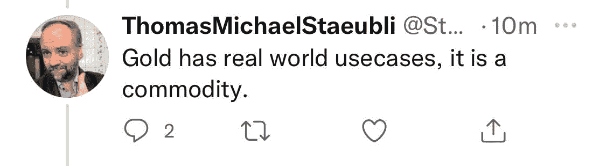

source: twitter

根据 Statista 的数据，黄金的实际使用量占其总分配量的 7.95%，其余部分被用作价值储存手段，即真实世界的最小使用量。

与黄金不同，比特币的底层技术区块链被全世界数百万人测试并用作支付系统。其最有效的使用案例之一是低成本跨境汇款，一小时内没有第三方责任风险。

比特币的区块链是去中心化的，无法被黑客攻击、控制、误操作、破坏或停止。迄今为止，它从未被关闭或遭到黑客攻击。

# 区块链没用

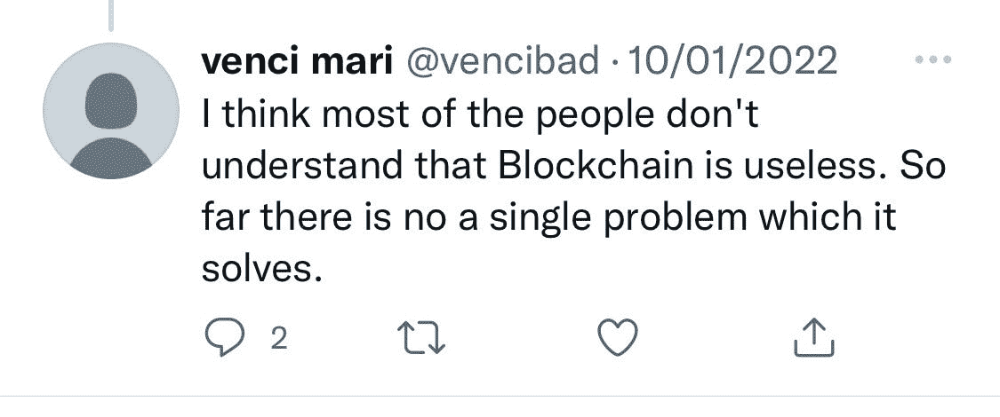

source: twitter

区块链的使用案例:

*   医疗数据的安全共享
*   没有中间人的跨境支付
*   实时物联网操作系统
*   个人身份安全
*   反洗钱跟踪系统
*   供应链和物流监控
*   投票机制
*   原创内容创作，如音乐、艺术无需中间人
*   一种安全存储和拥有独一无二的数字资产的方式(NFT 科技)

# 法定货币由税收/信托/政府支持

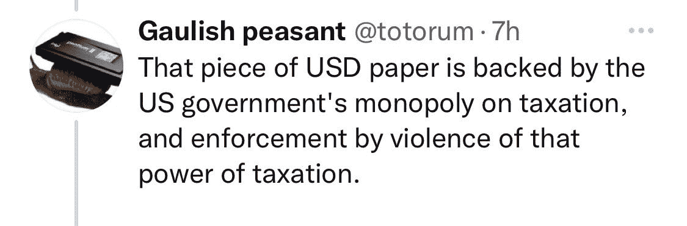

source: twitter

历史上强大的帝国都曾因纸币的恶性通货膨胀而遭受损失，不管是税收、信托还是其他什么。

明朝(1368 年至 1644 年的中国统治王朝)于 1374 年创造了第一张纸币，被称为“大明朝珍贵纸币”。这些纸币不能兑换成金币或银币。

这些纸币的价值很快下降，到 15 世纪初，纸币与硬币的比率超过了 300:1。伟大的明朝珍贵纸币很快就从贸易中消失了，并且没有关于 1455 年后纸币流通的记录，因此结束了中国第一个 650 年的纸币。

在接下来的 500 年里，中国在白银经济下运转。

然后是古罗马(三世纪危机)、神圣罗马帝国、魏玛共和国等等。

# 当比特币被比作早期的互联网时

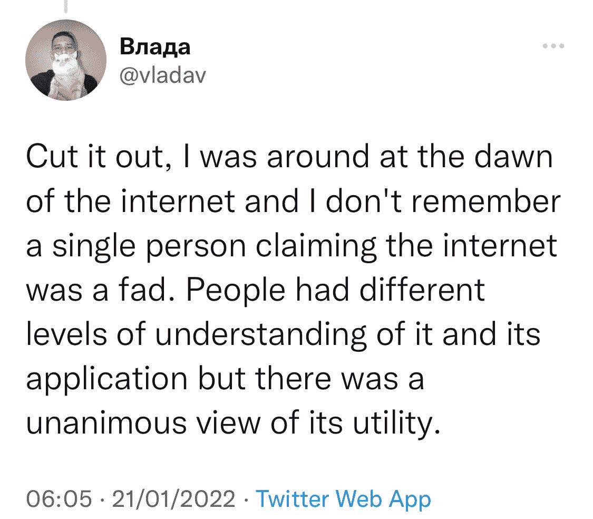

source: twitter

关于互联网的有记录的“时尚”:

1) *纽约时报*，1992 年:

“我们得到承诺，可以即时购买商品目录，只需点击鼠标，就能买到物美价廉的商品。我们将通过网络订购机票、预订餐厅和谈判销售合同。为什么我当地的商场一个下午的生意比整个互联网一个月的生意还多？”

2) *新闻周刊*，1995 年:

“他们谈到了电子城镇会议和虚拟社区。商业将从办公室和商场转向网络和调制解调器。数字网络的自由将使政府更加民主。胡扯！”

3)韦林·帕特里奇，在*连线*，1995 年:

“大多数成功的事情不需要再培训 2.5 亿人。”

4)罗伯特·梅特卡夫，在 1995 年的信息世界中:

"我预测互联网将很快成为壮观的超新星，并在 1996 年灾难性地崩溃."

5)保罗·克鲁格曼，著名经济学家，1998:

“互联网会逐渐消失，因为大多数人彼此无话可说。到 2005 年，很明显，互联网对全球经济的影响还没有传真机大。”

还有很多，但我们不会继续扭刀。

# 没人使用比特币

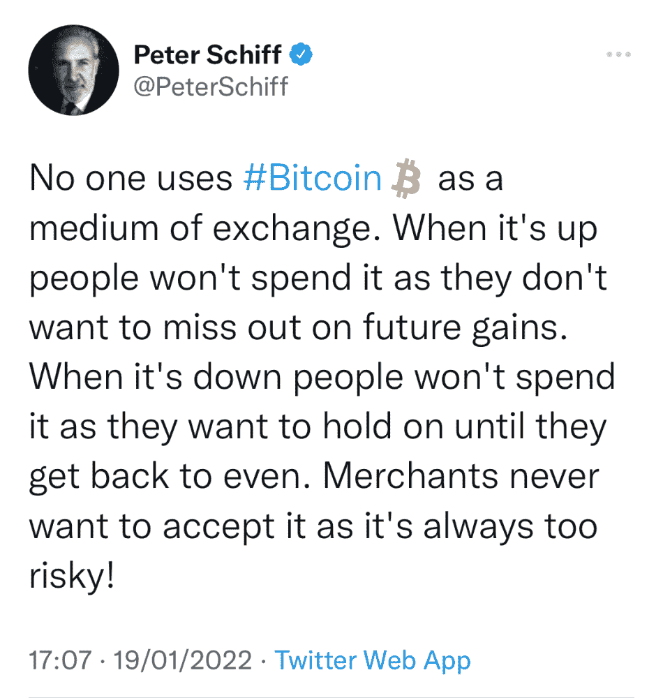

source: twitter

比特币日均活跃用户 70 万，日均完成交易总数 27 万笔，日交易额至少 60 亿美元。这些数字正在稳步增长。

接受比特币的商家包括:

AMC、Regal Cinemas、美国电话电报公司、Phillip Plein、Shopify、Lush、微软、Pavilion Hotels、AXA Switzerland、LOT Airlines、Expedia 和全美 30，000 家零售点，包括全食超市、贝德柏士比昂公司、GameStop、Office Depot、Petco、Ulta Beauty 和咖啡豆和茶叶。

最终，这取决于我们每一个人。如果你不喜欢比特币所代表的东西，那也没关系。但是，科学和数据必须优先于情绪和头条。不管你对比特币和它的区块链有什么感觉，让我们坚持事实。

*免责声明:本文包含的信息仅用于教育目的，并不构成 Wheatstones 的任何形式的建议或推荐，用户在做出(或避免做出)任何投资决定时也不打算依赖这些信息。*

> 加入 Coinmonks [电报频道](https://t.me/coincodecap)和 [Youtube 频道](https://www.youtube.com/c/coinmonks/videos)了解加密交易和投资

## 也阅读

 [## 杠杆代币[多头代币]终极指南

### 杠杆化令牌是具有杠杆化风险敞口的 ERC20 令牌，不考虑保证金、要求、管理…

medium.com](/coinmonks/leveraged-token-3f5257808b22)  [## 最佳加密交易所| 2021 年十大加密货币交易所

### 编辑描述

blog.coincodecap.com](https://blog.coincodecap.com/crypto-exchange)  [## 2022 年最佳加密交换平台| CoinCodeCap

### 如果我们看看今天的场景，许多加密货币交换平台提供了广泛的功能和深度…

blog.coincodecap.com](https://blog.coincodecap.com/best-swap-platforms)  [## 10 大最佳在线赌场|赢得并赢取免费 BTC 2022 | CoinCodeCap

### 编辑描述

blog.coincodecap.com](https://blog.coincodecap.com/best-online-casinos)  [## 2021 年最佳加密借贷平台| 6 大比特币借贷平台

### 获得比特币和其他加密货币的最佳贷款利率

medium.com](/coinmonks/top-5-crypto-lending-platforms-in-2020-that-you-need-to-know-a1b675cec3fa)  [## 2021 年 6 大最佳硬件钱包|顶级加密硬件钱包[更新]

### 最好的加密货币硬件钱包是绝对必要的。我们将在 NGRAVE、Ledger Nano X 和…

medium.com](/coinmonks/the-best-cryptocurrency-hardware-wallets-of-2020-e28b1c124069)  [## 2021 年最佳免费加密交易机器人

### 2021 年币安、比特币基地、库币和其他密码交易所的最佳密码交易机器人。四进制，位间隙…

medium.com](/coinmonks/crypto-trading-bot-c2ffce8acb2a)  [## 最佳 4 个加密交易信号电报通道

### 这是乏味的找到正确的加密交易信号提供商。因此，在本文中，我们将讨论最好的…

medium.com](/coinmonks/best-crypto-signals-telegram-5785cdbc4b2b)  [## Bitsgap 评论-交易机器人加密信号和套利 2022

### 在本文中，我们将讨论 bits gap——一个满足您所有交易需求的一站式加密交易平台…

blog.coincodecap.com](https://blog.coincodecap.com/bitsgap-review)  [## 40 个最佳电报频道，用于加密、电影、表演和演讲| CoinCodeCap

### 编辑描述

blog.coincodecap.com](https://blog.coincodecap.com/best-telegram-channels)