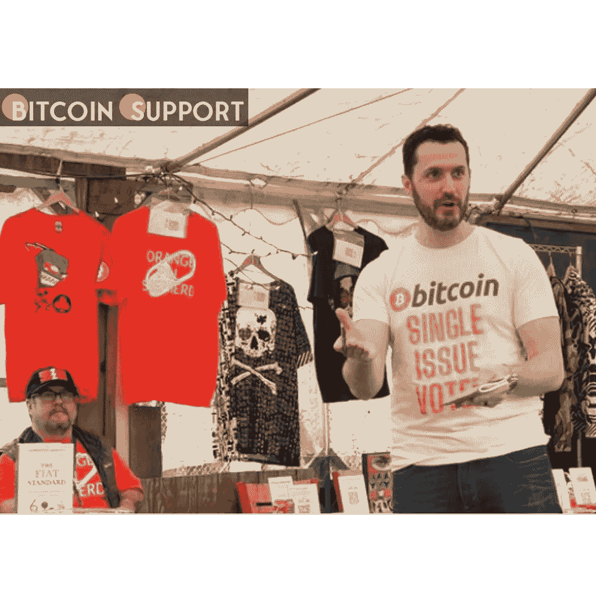
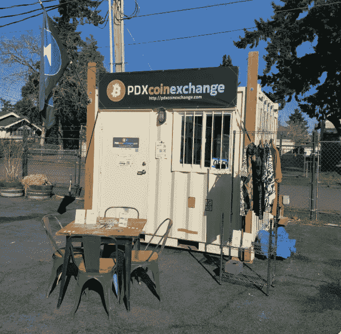
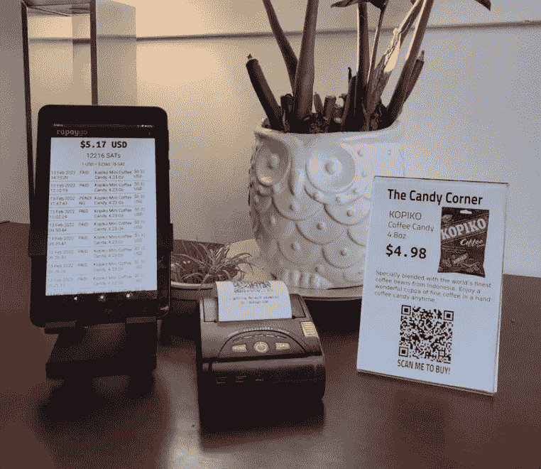
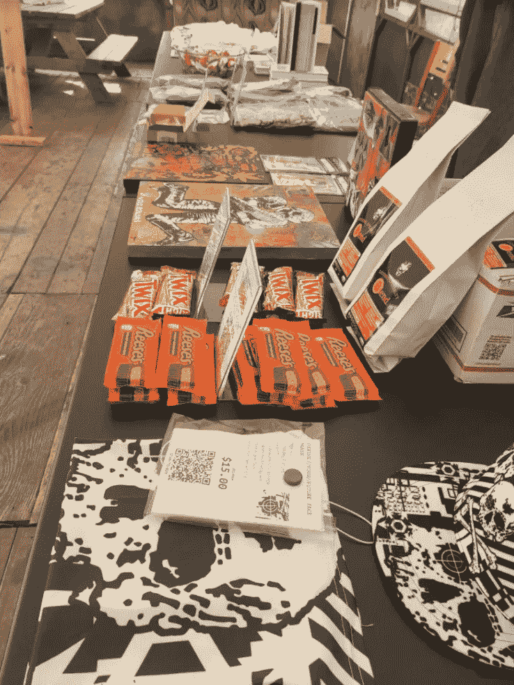

# 美国基层的采用:波特兰的比特币闪电派对

> 原文：<https://medium.com/coinmonks/adoption-at-the-grassroots-level-in-the-united-states-portlands-bitcoin-lightning-party-b3568d0c4d4f?source=collection_archive---------45----------------------->

**Visit our website:-** [**https://bitcoinsupports.com/**](https://bitcoinsupports.com/)

在俄勒冈州波特兰市，一个草根比特币闪电节揭示了闪电网络是理想的支付伴侣。

根据 Rapaygo 首席执行官、比特币闪电网络(LN)爱好者克雷·格雷厄姆(Clay Graham)的说法，有“草根证据”表明“美国正在采用比特币”。

上周末，在俄勒冈州波特兰市的比特币闪电节上，比特币 LN 在短短三个小时内就超过了 200 美元(400 万 sat)。

波特兰的比特币派对被称为“闪电铁轨上的水坑镇”，是一个“小贩、食品车和艺术家都接受比特币”的地方格雷厄姆补充说，还有一个“食品车舱”，作为“寻求比特币海滩般体验的比特币爱好者的目的地。”

**Visit our website:-** [**https://bitcoinsupports.com/**](https://bitcoinsupports.com/)

自然，法定货币是不被允许的，这个节日的主持人是著名的比特币制造者丹尼斯·波特。他在这条推文中展示了使用 LN 支付产品是多么简单:

[https://Twitter . com/Dennis _ Porter _/status/1508579497850773506](https://twitter.com/Dennis_Porter_/status/1508579497850773506)

格雷厄姆表示，如果“人们可以像对待货币一样自由地花费比特币”，那么这个活动将被视为成功有:

**“50 个人在三个小时内消费超过 400 万 sat，三辆食品车，七个供应商出售他们想要的任何东西，同时仍然支持诸如‘给 DJ 小费’之类的用例。”格雷厄姆在派对上表示，LN 简化了支付方式:它“比现金容易，比信用卡便宜，在阳光明媚的日子里充满乐趣。”**

**Visit our website:-** [**https://bitcoinsupports.com/**](https://bitcoinsupports.com/)

LN 是建立在比特币基础链上的近即时二层支付网络。它非常适合在聚会气氛中使用。Pubinno 是 Lightning pour a pint 应用程序背后的业务，创建时考虑到了节日，而 LNBits 开发了开源支付工具，如拆分支付和离线解决方案，以进一步简化支付技术。

阿西塔比特币公司(Aceita Bitcoin)的联合创始人、LNBits 自由/开源软件项目的贡献者蒂亚戈·赛洛斯说:

**“你只需要一个互联网连接就能使用 LN！”不需要刷卡技术，不需要现金，如果场地是国际化的，有大量外国人居住，也不需要货币兑换。"**

LNBits 基于 LN 的免费开源解决方案，直接与 Visa 和 Mastercard 竞争。赛洛斯继续说，“网络费用几乎为零，如果不是零的话，而且最终是由客户承担，而不是商家！”此外，“使用 LN 降低了与 Visa 或 Mastercard 相关的费用和风险。”

最后，一些比特币创造者渴望骗子知道 LN，格雷厄姆:

**“因为 LN 速度如此之快，交易可以像卡一样快速结算，所以无论是买方还是卖方都不会在阳光明媚的日子里体验到'我的钱去哪里了'的感觉。”**

**Visit our website:-** [**https://bitcoinsupports.com/**](https://bitcoinsupports.com/)

此外，这是一个有利于“艺术家、亲手创造东西的个人和小企业”的支付网络此外，本地与金钱的联系更强——主权也更大——因为根据波特兰比特币党的说法，“为 LN 路由支付的节点主要在波特兰清算。”Graham 表示，由于波特兰的成功，“堪萨斯城已经开始考虑如何使用他公司的技术复制这个派对”。

**“还记得萨尔瓦多在比特币海滩一年内宣布法定货币。现在，任何社区都可以拥有比特币海滩。”**

**访问我们的网站:-**[**https://bitcoinsupports.com/**](https://bitcoinsupports.com/)

**免责声明:以上为作者观点，不应视为投资建议。读者应该自己做研究。**

> 加入 Coinmonks [电报频道](https://t.me/coincodecap)和 [Youtube 频道](https://www.youtube.com/c/coinmonks/videos)了解加密交易和投资

# 另外，阅读

*   [CoinDCX 评论](/coinmonks/coindcx-review-8444db3621a2) | [加密保证金交易交易所](https://coincodecap.com/crypto-margin-trading-exchanges)
*   [红狗赌场评论](https://coincodecap.com/red-dog-casino-review) | [Swyftx 评论](https://coincodecap.com/swyftx-review) | [CoinGate 评论](https://coincodecap.com/coingate-review)
*   [Bookmap 评论](https://coincodecap.com/bookmap-review-2021-best-trading-software) | [美国 5 大最佳加密交易所](https://coincodecap.com/crypto-exchange-usa)
*   [如何在 FTX 交易所交易期货](https://coincodecap.com/ftx-futures-trading) | [OKEx vs 币安](https://coincodecap.com/okex-vs-binance)
*   [CoinLoan 评论](https://coincodecap.com/coinloan-review) | [YouHodler 评论](/coinmonks/youhodler-4-easy-ways-to-make-money-98969b9689f2) | [BlockFi 评论](https://coincodecap.com/blockfi-review)
*   [XT.COM 评论](https://coincodecap.com/profittradingapp-for-binance)币安评论 |