# DeFi 项目分析的高级指标

> 原文：<https://medium.com/coinmonks/advanced-metrics-for-defi-project-analysis-3af77625eb51?source=collection_archive---------42----------------------->

开发人员和投资者需要有意义的指标和更好的工具来分析项目并做出决策。

2022 年 2 月

数据来源:[足迹分析](https://www.footprint.network/)

数据是我们了解过去、现在和未来的最佳途径。

在传统金融中，获取数据相对困难。另一方面，区块链打破了数据壁垒，让每个人都可以访问庞大的信息分类账。然而，可用数据的数量产生了另一个问题:找到有价值的信息是复杂的。

有几十种工具可以帮助人们用各种指标分析 [DeFi](https://www.footprint.network/guest/dashboard/de-fi-data-analytics-footprint-network-fp-102523be-d937-4133-bf2d-71b1c6c8886f?days=past30days&name=sushiswap&channel=u-K8wXVP#secret=9DE4C2DBE2CF8005EF752DE3F20CE2B3) 数据。然而，这些指标大多是非常基本的。在本文中，我们将介绍 Footprint Analytics 即将推出的工具 DeFi 360 中最有用的指标以及更高级的数据。

# 原始数据

1.TVL

TVL 通常是人们关注的第一个指标，它反映了用户锁定的所有资产的总价值。TVL 增长经常被用来判断项目是否处于上升趋势。

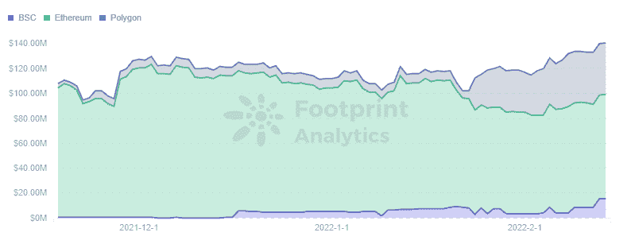

*Footprint Analytics — TVL Trend*

TVL 是用美元来衡量的。由于加密货币的价格变化很快，很难看出 TVL 的上涨或下跌是由于价格变化还是更多投资的增加。因此，除了 TVL，还需要关注调整后的 TVL。

例如，来自 [Footprint Analytics](https://www.footprint.network/) 的统计数据显示， [Liquity](https://www.footprint.network/guest/dashboard/liquity-dashboard-fp-008802de-e388-43d1-99fa-cf85928fbbdc?days=past3months~&name=liquity&channel=u-K8wXVP#secret=500CC586E554189EFFA21705990A5DEC) 的 ETH(一个只能锁定 ETH 借出 stablecoins 的贷款项目)的 TVL 在下图的黑色框中略有下降，而以美元计算的 TVL 则在上升。这是由于 ETH 的价格上涨，造成了该项目处于上升趋势的假象。

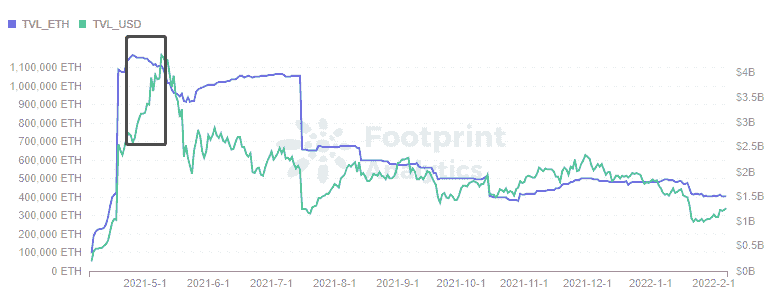

*Footprint Analytics — TVL in ETH vs USD*

像 Aave 和 earn 这样提供锁和借功能的复杂项目，使 TVL 作为一种度量标准的使用变得复杂，并且需要将它与其他度量标准结合使用。

2.净流动性

净流动性是指从前一天或前一个月流入和流出的变化。可以从流入和流出两方面进一步分析这些变化，以及主要来源是用户进入还是流失。

3.收入

基于 DEX 的协议不能由 TVL 单独衡量，因为掉期交易也产生收入。这类项目的最终目标是盈利能力最大化，收入反映了其经营成果。

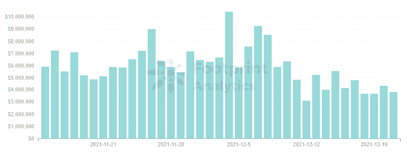

*Footprint Analytics — Revenue*

令牌数据

大多数平台发布治理令牌，一些平台使用双[令牌](https://www.footprint.network/guest/dashboard/top-tokens-fp-91119560-59b8-4082-a600-8df23556e1cd?channel=u-K8wXVP#secret=47BE3F06FE1EBB20B55B11CEBD4C9FDC)模型。令牌数据在一定程度上反映了市场对平台的接受程度。

1.基本信息

价格是最直观的度量，涨跌与市场供求关系密切。当重大事件发生时，价格也是受影响最快的指标。例如，10 月 27 日，Cream 遭遇了第二次重大攻击，损失了 1.3 亿英镑。这使得奶油的价格一落千丈。

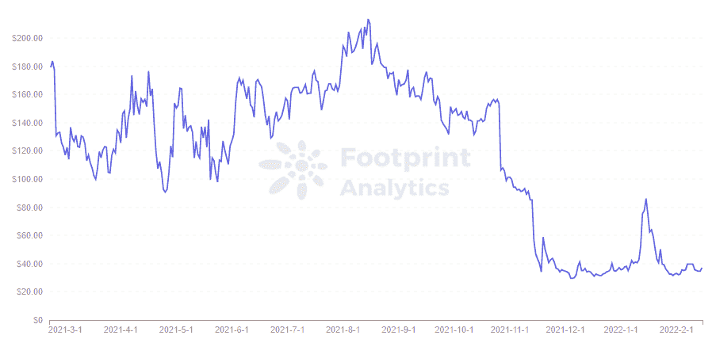

*Footprint Analytics — Token Price — CREAM*

对于那些发行[马克尔道](https://www.footprint.network/guest/dashboard/maker-dao-dashboard-fp-6f1c3dfc-2a95-41a6-aca5-d621340de540?date_filter=past6months~&channel=u-K8wXVP#secret=BC0CE61686995CA62E4B305D871D755A)和 [Liquity](https://www.footprint.network/guest/dashboard/liquity-dashboard-fp-008802de-e388-43d1-99fa-cf85928fbbdc?days=past3months~&name=liquity&channel=u-K8wXVP#secret=500CC586E554189EFFA21705990A5DEC) 等双重代币的，监测 Dai 和 LUSDs 的铸造数量也能反映出用户的参与程度。

代币的市值是价格和流通供应量的乘积，反映了 DeFi 行业中一个项目的市场价值。

2.令牌持有者的数量和持有时间

令牌持有者的数量反映了有多少用户认可平台的令牌模型。尤其重要的是获得治理权的令牌数量，这反映了平台的 DAO 情况。

持有时间显示了相对于投机者，项目是否吸引了更多相信项目长期价值的用户。

3.效用

交易量反映了市场中某个令牌的活跃度，其与市值的比率类似于换手率。较高的循环反映了具有较高关注度的令牌，而较低的循环是具有较低关注度的令牌。

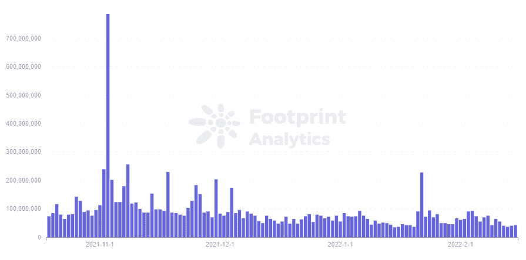

*Footprint Analytics — MKR Volume*

令牌的效用也值得注意，即所挖掘的令牌是被押在平台上以利用治理令牌，还是被存放在其他外部协议中以获取收入。

例如，Liquity 的稳定币 LUSD 的 61%存放在自己平台的稳定池中。与戴的效用相比，在流通中起不到稳定货币的作用。

# 高级指标

**一、池数据**

所有 DeFi 项目的 tvl 都是由池组成的，因此找到度量背后的原因意味着检查给定项目的池结构。例如:池大小、tvl 和卷变化。

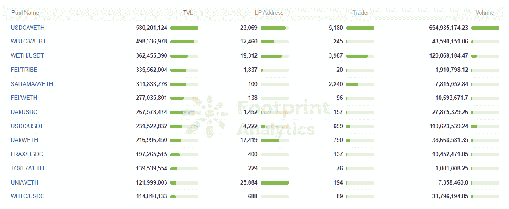

*Footprint Analytics — Pools Overview*

**二。用户指标**

项目始终围绕用户展开，精准捕捉目标用户是项目开发的核心。对用户进行数据分类和分层分析，可以更快的锁定优质用户。

1.用户画像

总体用户可以细分为新用户和活跃用户。新用户反映了市场扩张，而活跃用户反映了项目持续增长的潜力。

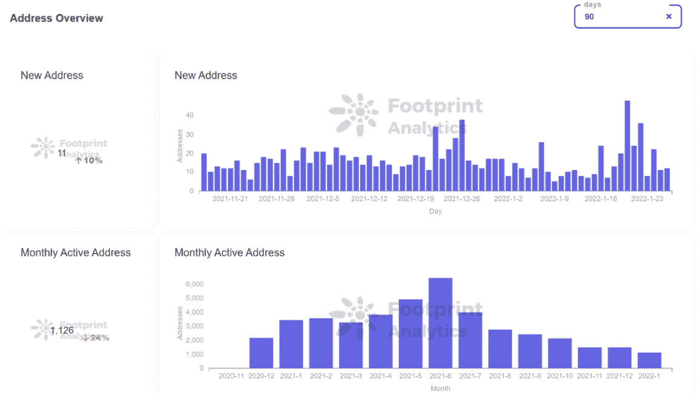

*Footprint Analytics — Address Overview*

对每个用户的交易金额、持有金额和持续时间变化的分析，使我们能够了解平均用户质量。

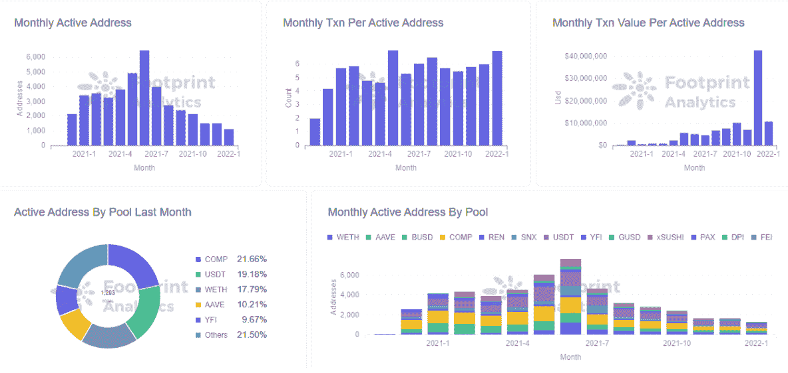

*Footprint Analytics — Active Address*

虽然平均值可以提供对用户行为一般趋势的观察，但它仍然缺乏作为项目实施的基础。平均值通常会稀释重要数据，需要更深入的用户分层才能发现真正的问题并制定正确的行动计划。

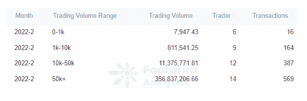

*Footprint Analytics — Trading Volume Distribution*

2.用户流失

鲸鱼为平台创造了最大的价值，开发者需要阻止这些用户的搅动。通过对用户进行排序，可以创建用户画像，聚焦大账号。

洞察用户的投资偏好，可以更深入地了解用户，通过分析目标用户投资过的所有 DeFi 平台，发掘潜在用户群体。

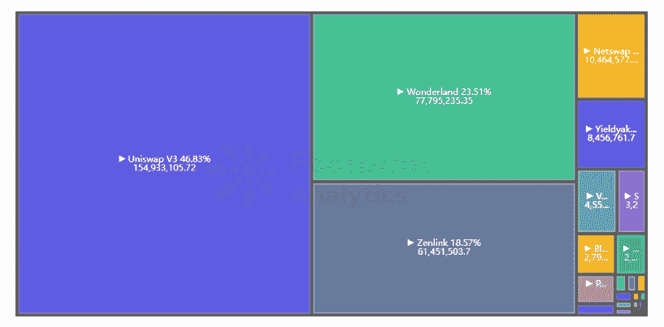

*Footprint Analytics — Address Investment Protocols Distribution*

**三世。交叉分析**

交叉分析是指将多个指标放在一起进行比较分析**。**分析师和开发人员可以使用它来发现指标之间的相关性，并创建业务假设。

例如，如果我们将 APY 与用户数量或 TVL 进行比较，我们可以分析结果，看看 APY 的增长是否吸引了更多的用户。

在另一个例子中，分析师可以将项目的价格与 BTC 的价格进行比较，以确定价格变动是由项目内在价值的变化还是更大的市场力量引起的。

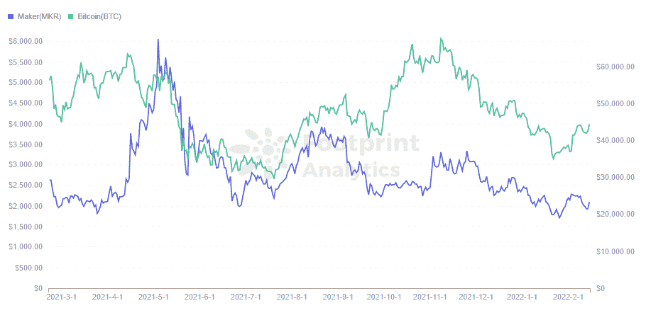

*Footprint Analytics — Token Price (MKR vs BTC)*

DeFi 的乐高属性也不应该被忽视，密切相关的项目的指标通常是运动中的一个重要因素。例如，Convex 帮助刺激了 Curve 的 TVL 的增长。

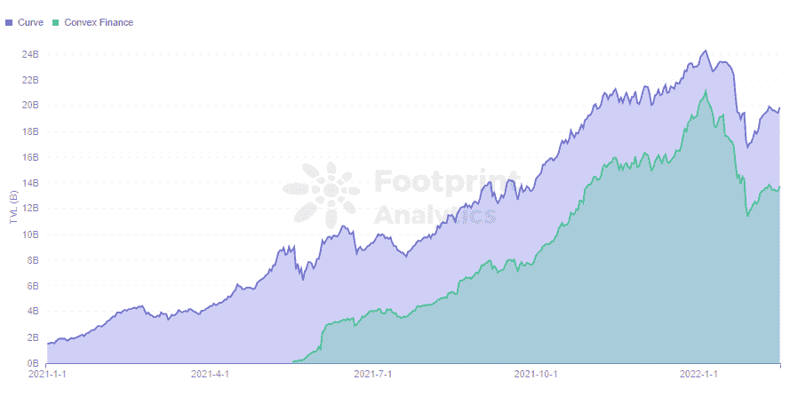

*Footprint Analytics — Curve VS Convex in TVL*

摘要

市场上有许多分析工具，但它们通常停留在表面水平的指标上。

利益相关方要做出数据驱动的决策，深入挖掘并对区块链数据应用高级分析至关重要。

**什么是足迹分析**

足迹分析是一个一体化的分析平台，用于可视化区块链数据和发现见解。它清理和整合链上数据，因此任何经验水平的用户都可以快速开始研究令牌，项目和协议。凭借一千多个仪表板模板和一个拖放界面，任何人都可以在几分钟内构建自己的定制图表。发掘区块链数据，利用足迹进行更明智的投资。

*足迹网址:*[*https://www . Footprint . network*](https://www.footprint.network/)

*不和:*[*https://discord.gg/3HYaR6USM7*](https://discord.gg/3HYaR6USM7)

*推特:*[*https://twitter.com/Footprint_DeFi*](https://twitter.com/Footprint_DeFi)

*电报:*[【https://t.me/joinchat/4-ocuURAr2thODFh】T21](https://t.me/joinchat/4-ocuURAr2thODFh)

*Youtube:*[*https://www.youtube.com/channel/UCKwZbKyuhWveetGhZcNtSTg*](https://www.youtube.com/channel/UCKwZbKyuhWveetGhZcNtSTg)

> 加入 Coinmonks [电报频道](https://t.me/coincodecap)和 [Youtube 频道](https://www.youtube.com/c/coinmonks/videos)了解加密交易和投资

# 另外，阅读

*   [Blockfi vs 比特币基地](https://coincodecap.com/blockfi-vs-coinbase) | [BitKan 点评](https://coincodecap.com/bitkan-review) | [Bexplus 点评](https://coincodecap.com/bexplus-review)
*   [南非的加密交易所](https://coincodecap.com/crypto-exchanges-in-south-africa) | [BitMEX 加密信号](https://coincodecap.com/bitmex-crypto-signals)
*   [MoonXBT 副本交易](https://coincodecap.com/moonxbt-copy-trading) | [阿联酋的加密钱包](https://coincodecap.com/crypto-wallets-in-uae)
*   [雷米塔诺评论](https://coincodecap.com/remitano-review)|[1 英寸协议指南](https://coincodecap.com/1inch)
*   [iTop VPN 审查](https://coincodecap.com/itop-vpn-review) | [曼陀罗交易所审查](https://coincodecap.com/mandala-exchange-review)