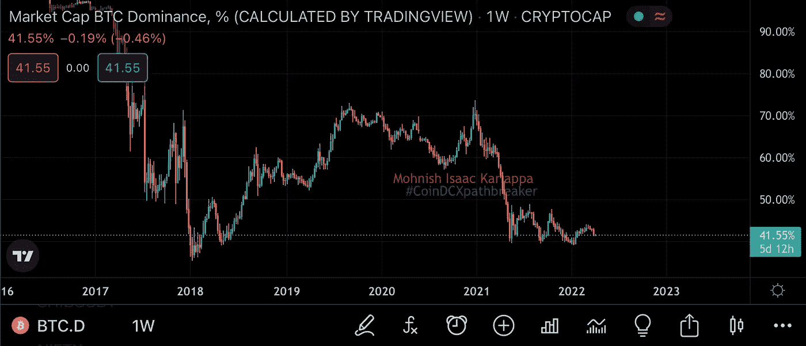

# 分析加密市场的高级指标

> 原文：<https://medium.com/coinmonks/advanced-metrics-to-analyse-crypto-market-dc1de3017d59?source=collection_archive---------29----------------------->

# CoinDCXpathbreaker

有许多方法可以分析一个给定的市场，但是有一些指标不一定对交易你的投资组合有效，但是会帮助你获得关于资金流动的高级知识。

在整个加密市场中，新交易者通常认为比特币和所有其他加密技术都是在各自的基础上运行的。这是完全错误的，与传统股票不同，加密市场非常依赖彼此。让我解释一下…

在传统的股票市场中，我们有许多部门，每个部门都有各自的股票。因此，在新冠肺炎疫情期间，航空公司、酒店、旅游等行业由于运营受限或关闭而遭受重大打击……我们看到医疗行业等行业即使在艰难时期也在蓬勃发展。在传统的股票市场，部门和他们各自的股票表现根据他们的表现，而不仅仅是生命周期。

说到加密，性能就不一样了。加密中的资金流动完全基于比特币，在本文中，我们将更深入地研究不同种类的市值图表，以更好地理解这些资金流入流出。

## 比特币的统治地位(BTC。d)

到目前为止，我最喜欢的研究现金流入流出的指标是比特币的统治地位(BTC。d)图表。

## 什么是 BTC。D

比特币优势显示了流入或流出比特币的货币总量与市场上所有替代币的比率。

如果你参考上面的图表，我们可以看到 BTC。d 处于 41.55%的水平。这意味着加密市场中的每 1000 美元中，有 415.50 美元流入 BTC，剩下的 584.50 美元流入替代硬币。

当试图研究 BTC 时，有多种情况。d 图表，我将它们列在下面:

**BTC。d 上升**——当 BTC。d 呈上升趋势，这意味着大部分资金正在流入比特币，而不是替代币。这是一个不利于低价竞标的情况。

**如果 BTC。d 上升**

*   ALT/BTC 对趋势向下流血，而 ALT/USDT 对卡在枢轴上。
*   BTC 加油，ALT/BTC 再次出血，ALT/USDT 组合可能会上升，但只是少数
*   BTC 转储，ALT/BTC 对转储更严重，ALT/USDT 对也急剧下降

**如果 BTC。d 向下**

*   奥尔特/BTC 货币对的表现优于 BTC 货币和更多的资本流动。这是用代用币为自己定位的更好时机
*   BTC 高跟鞋和奥尔特/BTC 鞋更难上涨
*   BTC 转储，它并不真正影响 ALT/BTC 或 ALT/USDT 对。这又是一个玩替代硬币的好时机

上图是 2022 年 4 月 4 日的数据，显示了总资产占总加密市值的比例对 BTC 的优势。

记住以上因素，当 BTC 时，和比特币在一起总是明智的。d 在一个更高的时间框架内上升，在 BTC 时建立长期仓位。d 下降了。

BTC。如果你想用更深入的方法分析市场，不仅要理解技术，还要了解市场趋势的情绪，那么 d 是一个非常强的指标。

## 加密总市值

上图显示了整个加密市场的资本总额。它包括所有加密资产的总估价，也包括所有的稳定资产。

作为交易者，研究这张图表可以帮助你确定牛市中市场的过度扩张程度。此外，如果你用烛台作为一个正常的资产图表总加密上限，你将能够采取你的决定基于技术模式以及图表支持:阻力水平，以进一步巩固你的信念。

上图显示了不包括比特币的加密市场总市值。目前，所有替代硬币+稳定硬币的市值正面临 1.3 万亿美元水平的阻力，突破这一水平将导致大多数替代硬币走向 ATH 水平。

这张图表也可以帮助你衡量价格趋势和流入另类硬币市场的现金。许多人忽略了这一信息，但这是整个加密市场的宏观图表。

## 链上分析

链上数据是相当先进的，但是即使你是一个拥有中级加密知识的交易者，这些数据也会对你的分析有很大的帮助。

链上数据可以帮助您确定以下指标:

*   比特币活跃地址-该数据有助于识别持有比特币的活跃地址的数量，并显示与比特币价格的水平相关性。确定在不同价格水平下卖出/买入数量的好方法
*   期货未平仓合约-未平仓合约越多，交易者的未平仓杠杆头寸就越高，反之亦然
*   交易所平衡-另一个超级强大的链上指标，显示交易所的总流入和/或流出。外汇余额越低，资产就越看涨，因为霍德尔的增加。
*   未实现净损益(NUPL)-NUPL 指标向我们展示了坐在桌子上的利润数额。NUPL 越高，市场出现回调的可能性就越大，因为交易者表现出贪婪的心态。

以上我强调的指标只是非常基本的数据，你可以从这些数据开始你的上链之旅。在 Glassnode 上有多个级别的数据供您处理，这需要高级别的数据解释。

非常感谢 [CoinDCX](https://medium.com/u/a30fa2b03c2f?source=post_page-----dc1de3017d59--------------------------------) 给我这个机会来撰写如此详细的报告，并成为# CoinDCXpathbreaker 计划的一部分，使我能够与加密领域的每个人分享这些知识。

> *加入 Coinmonks* [*电报频道*](https://t.me/coincodecap) *和* [*Youtube 频道*](https://www.youtube.com/c/coinmonks/videos) *了解加密交易和投资*

# 另外，阅读

*   [有哪些交易信号？](https://coincodecap.com/trading-signal) | [Bitstamp vs 比特币基地](https://coincodecap.com/bitstamp-coinbase) | [买索拉纳](https://coincodecap.com/buy-solana)
*   [ProfitFarmers 点评](https://coincodecap.com/profitfarmers-review) | [如何使用 Cornix 交易机器人](https://coincodecap.com/cornix-trading-bot)
*   [十大最佳加密货币博客](https://coincodecap.com/best-cryptocurrency-blogs) | [YouHodler 评论](https://coincodecap.com/youhodler-review)
*   [my constant Review](https://coincodecap.com/myconstant-review)|[8 款最佳摇摆交易机器人](https://coincodecap.com/best-swing-trading-bots)
*   [MXC 交易所评论](/coinmonks/mxc-exchange-review-3af0ec1cba8c) | [Pionex vs 币安](https://coincodecap.com/pionex-vs-binance) | [Pionex 套利机器人](https://coincodecap.com/pionex-arbitrage-bot)