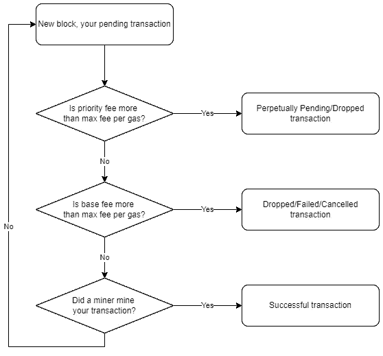

# 高级 NFT-我如何设置我的气体？

> 原文：<https://medium.com/coinmonks/advanced-nft-how-do-i-set-my-gas-318b7a9d3fa7?source=collection_archive---------35----------------------->

如果你一直在关注我之前的系列文章，你应该已经了解了通过 NFTs 赚钱的基本知识。在这个系列中，我希望能更深入地探讨一些小的技术细节，这些细节能让你在 NFT 市场的交易中获得优势。

今天，我们将从天然气开始。你可能会想，为什么在区块链做一件事要花费一些钱，不管是交易、购买、出售、铸造、转让。你可能还会听说在一次失败的交易中花费了巨额油费的故事。我们将揭示技术细节，这样你就知道该怎么做，因为你开始自己控制天然气。

**Gas 是以太坊区块链网络中**交易的组成部分。它就像一种允许交易运行的燃料，就像汽车需要汽油才能运行一样。

**Gas 是对以太坊区块链网络上执行**特定操作**所需的计算工作量**的度量。

# 气体为什么存在？

想一想，如果交易都是免费的，为什么网络要计算和指定一个任意的计算工作量或 gas？

当我们谈论计算工作时，我们本质上是在谈论解决加密散列，或者简单地说，解决难题。密码术，或解谜，是一个随处可见的概念，最传统的是来自钥匙和锁——将正确的钥匙放入正确的锁中，以获得对某物/某处的访问。通常，如果你要回家，我们不会指出找到正确锁的正确钥匙所需的工作。但是，如果你是一名锁匠，帮助别人进入他们的房子，你会指出所需的工作，因为这种指示将指向费用。

这意味着计算天然气是有原因的，而**计算天然气是为了付款**。在汽车加油时，泵入的汽油量会显示出来，这样我们就知道每升汽油要付多少钱。同样，汽油也有显示，这样我们就知道每份汽油要付多少钱。简单来说，这就是所谓的燃气费。**天然气费是支付计算工作所需的货币成本** —通常用 gwei 或 eth 表示。

不要混淆煤气和煤气费。虽然它们听起来和看起来相似，但它们是不同的。 **Gas 是对功的简单度量，用数字定义，通常由网络自动导出，不建议用户修改。燃气费是为燃气支付的价格，以 gwei 或 eth 定义，也由网络得出，但建议由用户修改。**

# 为什么会有气费？

**燃气费的设计考虑了以太坊区块链网络**的安全性。当每笔交易都需要付费时，可以防止无聊和恶意的垃圾邮件。如果不收取费用，发送恶意交易将是免费的，因此网络将充满恶意交易，这将使网络的使用风险很高。

**为了打击潜在的恶意交易，网络征收汽油费——这就是为什么汽油必须计算，汽油费必须支付的原因。**

# 谁得到油费？

现在，如果爱丽丝想把第一笔钱转给鲍勃，并且产生了 0.0001 笔汽油费，那么从爱丽丝的钱包中扣除的总额将是 1.0001 笔。但是随着鲍勃得到第一笔钱，谁得到 0.0001 笔钱呢？

**介绍矿工，也称为采矿节点，也是那些将要求天然气费用**。他们的许多角色之一是挖掘发送到网络中的事务。挖掘事务就是处理和执行事务。然而，采矿交易并不那么简单。

当事务第一次被发送到网络中时，它们不会立即得到处理。它们仍处于“待定阶段”。

*简单地说:“挂起阶段”在技术术语中也称为内存池。mempool 保存所有挂起的事务。*

当“新的交易期”准备好时，整个以太坊区块链网络将会知道所有新的未决交易。这些矿工将把所有这些未决事务复制到他们的本地系统中，并系统地选择一些要处理的事务。所谓系统化，是指根据最高的油费进行优先排序和选择。**矿工被激励优先考虑最高的天然气费用，因为他们可以保留费用**——这就像拍卖招标。

*一个简短的引子:“新交易期”在技术术语中也被称为块。每个块包含准备处理的事务和在加入区块链之前随后处理的事务。巧合的是，它也是区块链背后的名字——一连串的交易。*

这个挖掘概念非常重要，因为它解释了用户在使用以太坊区块链网络时将经历的交易现象。这些现象是永久未决事务、失败事务、丢弃事务和取消事务。我们将在交易文章中讨论这些。

# 对用户意味着什么？

作为用户，唯一重要的思考过程是围绕成本的。每个用户都希望获得最具成本效益的解决方案。

以 NFT 造币厂为例。当你有一个等待和潜在不成功的交易，你应该怎么做？

正如我们所了解的，gas 是事务所需的计算工作。如果运行一个非常复杂的函数，比如 minting，那么开销会很高，如果函数写得不好，开销会高得不合理，这一点我们很快就会在合同文章中了解到。您可以做两件事之一，等待事务失败或取消它。哪种行为更具成本效益？

## 失败交易与取消交易

令人欣慰的是，取消交易的一个特性是将函数重新定位为一个简单的传递函数——这意味着更少的计算工作——从而减少了消耗。然而，取消一项交易将花费略多的汽油费。再次注意汽油和汽油费的区别！

*简单介绍一下:之前，我们混淆了汽油费的计算。但是，公式简化为气费=气 x 气价。由用户控制的部分是气价，因此气价控制气费，因为气是固定的，取决于事务调用的函数。*

因此，取消交易可能更具成本效益的唯一方法是，交易功能的重新调整比增加的汽油费节省更多的钱。因此，只剩下一个问题——汽油价格的下降更多地是汽油费用的增加吗？

# DevCandy

这部分是给有抱负的开发者的。到目前为止，我们已经简单地解释了天然气和天然气费用，这是天然气过去的工作方式。它更容易理解，而且它为理解现在气体的工作原理打下了相当坚实的基础，因为它有 70%的相似性。**我们看到，主要的钱包提供商都顺应了新的天然气变化**，因为它使天然气更可预测，并具有精细的天然气控制粒度，尤其是在高峰期。

2021 年 8 月 5 日，以太坊伦敦硬分叉，也被称为 EIP1559，开始生效。

以前，我们将燃气费的计算简单地理解为:

`gas fees = gas x gas price`

现在，代替汽油价格，它被分解成 3 个新值:

`gas fees = gas x (base fee + priority fee)`

作为用户，你不必担心基本费用，因为你没有办法看到或调整它。但是，您可以调整优先费用。

还记得过去更高的天然气费是如何激励矿工开采交易的吗？现在换成了优先费。矿工将根据优先费用进行优先排序。

此外，我们还设立了一个新的限额，名为“每气最高费用”，用于计算我们愿意为每气支付的最高价格:

`max fee per gas = (2 x base fee) + priority fee`

最高费用每气可以调整，以设定上限，什么是最高价格，你愿意支付每气。只有在交通流量低的时候，你的最高费用才能帮你节省油费。在高流量时期，由于高基本费用，如果矿工不挖掘你的交易由于低优先费用，它将等待下一个区块和基本费用可能会增加。

这里有一个流程图来帮助理解优先费和每气最高费之间的动态关系。

从逻辑上讲，没有一个头脑正常的人会设置比每气最高费用更高的优先费用，因为它永远不会成功，但它仍然可以做到。

*快速续:如果你想了解基本费用是如何计算的，你可以在这里* *找到更多信息* [*。*](https://ethereum.org/en/developers/docs/gas/#base-fee)

# 总结想法

选择的核心是，在极其快速的数学运算和对交易数据的理解之间。做一个粗略的估计通常可以帮助你做出决定，从而节省一些汽油。

然而，值得注意的是，一旦你在 NFT 造币厂的公开竞争中设定了极高的天然气价格，无论是失败还是取消，都将是昂贵的。所以，一定要小心！

> 加入 Coinmonks [电报频道](https://t.me/coincodecap)和 [Youtube 频道](https://www.youtube.com/c/coinmonks/videos)了解加密交易和投资

# 另外，阅读

*   [CoinFLEX 评论](https://coincodecap.com/coinflex-review) | [AEX 交易所评论](https://coincodecap.com/aex-exchange-review) | [UPbit 评论](https://coincodecap.com/upbit-review)
*   [AscendEx 保证金交易](https://coincodecap.com/ascendex-margin-trading) | [Bitfinex 赌注](https://coincodecap.com/bitfinex-staking) | [bitFlyer 点评](https://coincodecap.com/bitflyer-review)
*   [麻雀交换评论](https://coincodecap.com/sparrow-exchange-review) | [纳什交换评论](https://coincodecap.com/nash-exchange-review)
*   [支持卡审核](https://coincodecap.com/uphold-card-review) | [信任钱包 vs MetaMask](https://coincodecap.com/trust-wallet-vs-metamask)
*   [Exness 回顾](https://coincodecap.com/exness-review)|[moon xbt Vs bit get Vs Bingbon](https://coincodecap.com/bingbon-vs-bitget-vs-moonxbt)