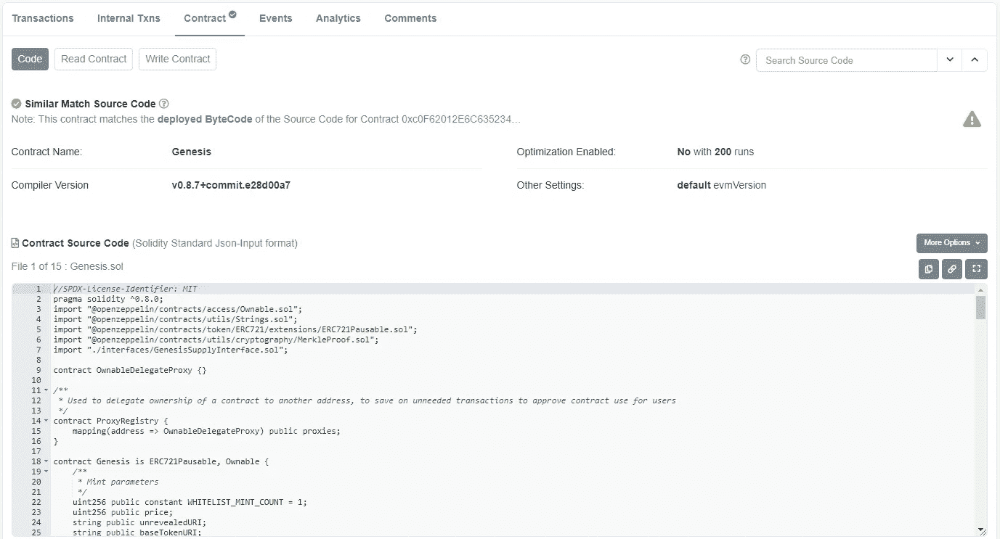
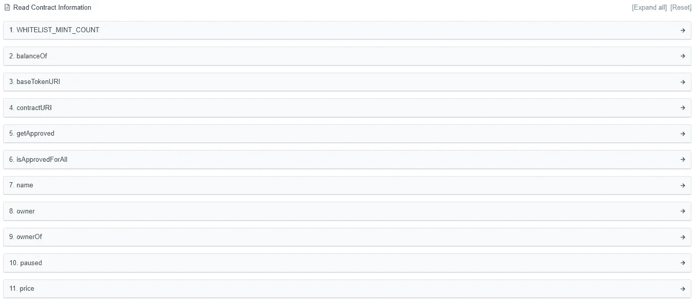
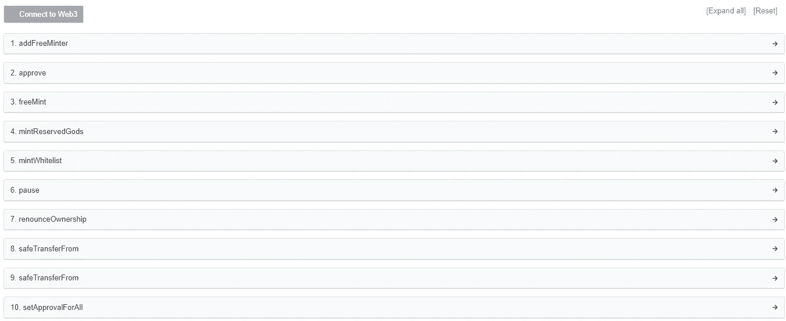
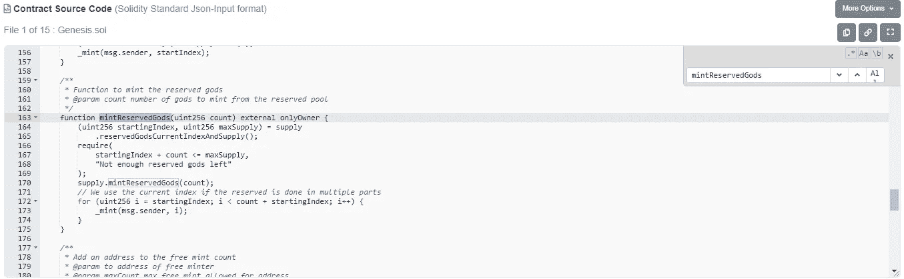
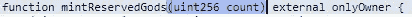
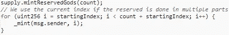
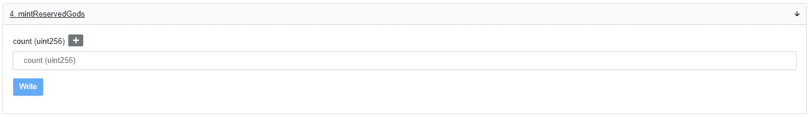
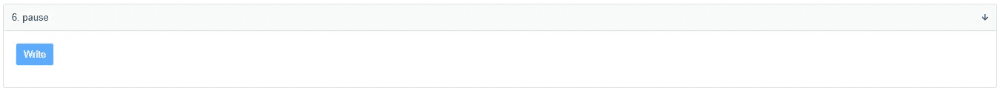

# 高级 NFT —学习阅读合同并与之互动

> 原文：<https://medium.com/coinmonks/advanced-nft-learn-to-read-and-interact-with-contracts-ff8fffbc96b6?source=collection_archive---------33----------------------->

上周，我们学习了[事务及其不同的状态](/coinmonks/advanced-nft-knowing-transactions-7a03f7ae80e0)。我们甚至深入研究了取消的交易中发生了什么，以及与失败或放弃的交易相比，它如何产生要支付的汽油费的差异。交易是描述以太坊从一方到另一方交换的简单方式。然而，以太坊中的交易要比仅仅是货币交换复杂得多。当 Vitalik 第一次考虑比特币的区块链时，他的以太坊梦想之一是，它应该不仅仅是一个金融交易所。

“如果交易有办法与应用程序交互，在数字货币的基础上存储和操作其他类型的数据，那会怎么样？”——他的梦想在区块链以太坊实现了，进入智能合同。**智能合约是存储在区块链上的程序，当条件满足时，它将运行其程序功能。**智能合约也是比特币和以太坊的决定性区别。比特币并不具备在区块链中存储程序的能力。

在以太坊区块链中，应用程序的几乎每个动作都是与智能合约的交互。还记得铸造 NFT 吗？或者在 OpenSea 上列出一个 NFT？或者赌一个 NFT？所有这些都是与智能合约的交互。也许是眼见为实。

# 完整视图中的智能合同

初学者开始寻找和阅读合同的最佳地点是去[以太扫描](https://etherscan.io/)。该网站会返回您拥有的任何以太坊地址的信息。你可以在搜索栏中输入你自己的钱包地址，你会看到你所互动和交易的一切。是啊，一切。如果我需要跟踪某人的交易或了解项目进展情况，我会经常去那里。

有点可怕，不是吗？这是因为公共区块链的本质是允许每个人在伪匿名的水平上看到一切。这意味着，如果有人根据你的地址知道你是谁，他们可以知道你所有的交易，透明的审查。然而，如果人们不能把你和你的地址联系起来，那么你仍然是匿名的。这就是为什么 NFT 有影响力的人有多个钱包地址，有些没有公开，因为大多数人可能已经知道主要的钱包地址，并跟随他们的买入/卖出，导致市场非常投机，所以当他们想不受自己的影响进行私下交易时，这很困难。

因此，当你提交一个合同的地址时也是有意义的，它会返回关于合同的一切——代码、与之交互的交易、*一切*。

对于 NFT 的项目，你可以很容易地从 icy.tools 找到合同地址。有许多更高级的方法来搜索地址，但这是目前最简单明了的方法。

我冒昧地[选择了一份合同](https://etherscan.io/address/0xe36e14e54d39e492f81261e54cdc879fbb5190fd)让我们一起研究，这就是一份合同的样子，完全暴露在世人面前。

输入合同地址后，您将能够导航至“合同”选项卡。在那里，您将看到最原始的代码形式的合同。事务与此交互。

# 与智能合同的交互

它看起来可能有点吓人，但是我们将向您展示它如何与一个更友好的界面交互。在合同选项卡上，您可以看到 3 个子选项卡，分别称为“代码”、“阅读合同”和“编写合同”。

你看到的令人作呕的神秘文字是原始代码，因此在“代码”部分。相信我，即使对那些不知道如何编码的人来说，它仍然是可读的。Etherscan 通过提取代码中最重要的部分，并将其制作成存储在“阅读合同”和“编写合同”中的可交互按钮，为用户简化了操作。

## 阅读合同

“阅读合同”中的可交互按钮只是从合同中读取，这些按钮不需要更改合同中的数据，因此您不必发送交易——这也意味着**“阅读合同”功能不需要付费使用**。

请注意这些函数是如何用几乎可以理解的英语阅读的——名称、所有者、价格等。此外，“阅读合同”中的大多数功能只是从合同中读取一些内容，没有数据被更改，这就是为什么它不需要您发送交易，因此没有成本。

## 写合同

另一方面,“写合同”上的可交互按钮是有成本的，因为当你在合同上写数据时，它需要改变数据。

现在，看看这些函数是如何与写相关的——approve、addFreeMinter、mintReservedGods 等。所有这些都需要某种添加或修改，这就是为什么您需要发送一个事务来与契约及其数据进行交互，因此会产生发送事务的成本。

那么，铸造是读还是写？如果你选择了写作，那么你是对的。虽然铸造的行为是为了发现或在更广的范围内“阅读”我们得到的 NFT，但本质上它是“写入”数字产品的新所有者，无论是 jpegs 还是 gif，并将其转让给新所有者。因此，它不可避免地是一个写函数。

## 这个方法是做什么的？

好吧，知道那些难以理解的名字并不会让你更容易理解它到底是做什么的。我会教你一种帮助我理解合同的方法。

作为一名开发人员，从“阅读合同”和“编写合同”中，我几乎可以立即理解交互按钮名称是对代码中使用的名称的直接引用，因为它是以这种方式编写的。以 mintReservedGods 为例，它没有空格，它遵循驼峰式大小写，以小写字母开头，然后将后面单词的第一个字母大写。这告诉我，代码可能使用了完全相同的名称，如果我试图理解这个特定函数的代码，我将能够理解它是如何工作的。这里是你需要理解的重要一点:**你不需要理解整个合同来了解合同。**你只需要知道你需要知道的。

所以我们以 mintReservedGods 为例。让我们回到“代码”子选项卡，从代码中查找函数。

我所做的是对合同代码进行搜索(ctrl+f，cmd+f ),并输入我感兴趣的函数以了解更多信息——在本例中，是 mintReservedGods。

您在函数名旁边看到的最接近的括号通常称为参数——简单来说，就是输入。在我们的示例中，为了调用 mintReservedGods，我们需要输入一个计数。

这是什么意思？我怀疑这是用户想要创造的保留商品的数量。但是您可以阅读剩余的代码，看看这个计数在哪里被再次调用。

即使你不懂代码，你也会看到计数被用来造币。有了这些信息，您就可以返回“编写合同”并使用该功能了。

现在，你知道为计数输入什么了。

如果这是一项人们想学的有趣的研究，我会更深入。就本文而言，我将只做简单的演示，并对代码有基本的理解。

当您想知道在您发送一个事务之后以及当它被成功挖掘时到底发生了什么时，理解代码是有用的。我的建议是通过一个初学者课程来学习 JavaScript 和 Solidity 的基础知识。你甚至不需要写，只需观察和倾听一些代码关键字是如何工作的。否则，你将永远依赖人们对代码的解释。

# 智能合约最重要的属性

现在你已经看到了它是如何工作的，也学会了如何操作它，我想回过头来，通过提出智能合约最重要的属性——**不变性**来结束这一课。

智能合约是不可变的，不可变意味着它不能被更改。如果它是不可变的，那么我们为什么能够写入合同？这是因为**合同是不可变的，但合同中的数据不是。**

这意味着以代码形式编写的合同一旦提交，将永远无法更改。没有人能从内部改变代码，它不能被重新设计。

让我们用一个简单的函数 pause 来演示一下。

这个暂停功能是一个写功能。这意味着在代码的某个地方，有一个暂停开关，可能是为了暂停什么。当提交合同时，意味着暂停开关现在永久存在于合同中。但是暂停开关的数据仍然可以修改。在这种情况下，无论某个东西是否暂停。

我们总是可以扳动暂停开关，但我们不能再添加新的开关或完全移除暂停开关。这就是能够在契约的设计范围内操作，但不能修改契约本身的含义。

这是什么意思？合同成为法律，或者更广为人知的是，法典就是法律。一旦到了区块链，没人能指望修改合同。它成为法律。每个人都必须遵守它。这就是区块链成为一个不可信系统的原因，因为一旦有了什么东西，没人能改变它。

它致力于维护信任体系。一旦法规规定资金不能提取，只能返还给一系列铸币商，就会是这种方式。然而，它也将使粗心的代码编写和利用无法阻止，因为..法典就是法律。当无意中暴露漏洞时，漏洞也变成了被利用的法律。

它要求开发人员在编写合同时非常小心，这可能也是它被称为合同的原因——要小心开发。

这里有一个发人深省的问题需要考虑，我希望它能解释为什么诈骗在 NFT 猖獗:当项目所有者承诺从 NFT 造币厂获得的资金将如何分配(慈善、发展等)时，代码中的取款功能只将所有资金指向一个帐户，这份合同真的是为了增强信任而写的吗？

> 加入 Coinmonks [电报频道](https://t.me/coincodecap)和 [Youtube 频道](https://www.youtube.com/c/coinmonks/videos)了解加密交易和投资

# 另外，阅读

*   [SmithBot 评论](https://coincodecap.com/smithbot-review) | [4 款最佳免费开源交易机器人](https://coincodecap.com/free-open-source-trading-bots)
*   [杠杆代币](/coinmonks/leveraged-token-3f5257808b22) | [最佳密码交易所](/coinmonks/crypto-exchange-dd2f9d6f3769) | [Paxful 点评](/coinmonks/paxful-review-4daf2354ab70)
*   [加密套利](/coinmonks/crypto-arbitrage-guide-how-to-make-money-as-a-beginner-62bfe5c868f6)指南| [如何做空比特币](/coinmonks/how-to-short-bitcoin-568a2d0b4ae5)
*   [币安期货交易](https://coincodecap.com/binance-futures-trading)|[3 commas vs Mudrex vs eToro](https://coincodecap.com/mudrex-3commas-etoro)
*   [如何购买 Monero](https://coincodecap.com/buy-monero) | [IDEX 评论](https://coincodecap.com/idex-review) | [BitKan 交易机器人](https://coincodecap.com/bitkan-trading-bot)
*   [尤霍德勒 vs 科恩洛 vs 霍德诺特](/coinmonks/youhodler-vs-coinloan-vs-hodlnaut-b1050acde55a) | [Cryptohopper vs 哈斯博特](https://coincodecap.com/cryptohopper-vs-haasbot)