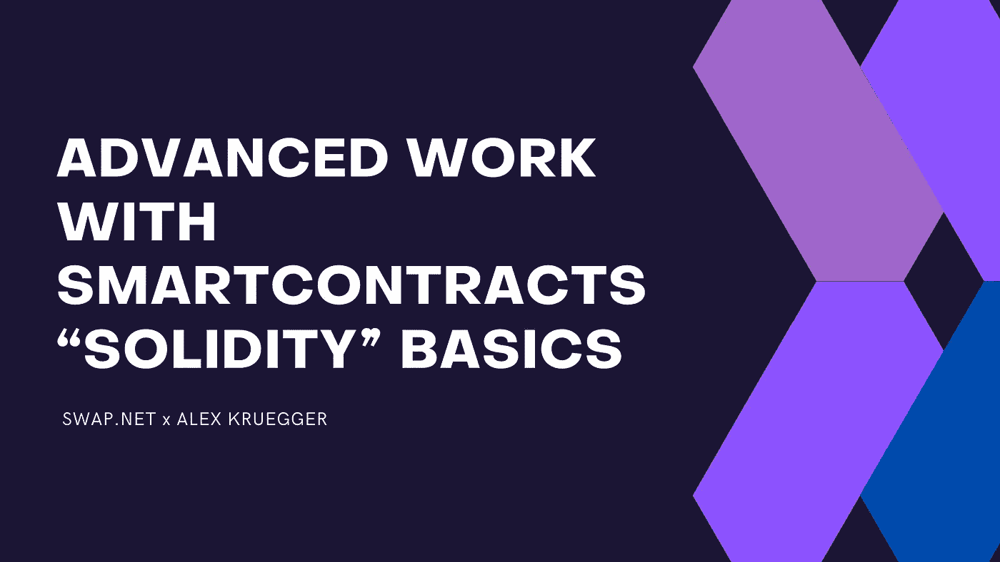

# 智能合同的高级工作。“坚实”基础

> 原文：<https://medium.com/coinmonks/advanced-work-with-smart-contracts-solidity-basics-59e97766d263?source=collection_archive---------11----------------------->

## 本教程主要是为那些想学习如何理解密码世界，但对协议、区块链的内部机制等没有深入了解的爱好者编写的。

它不是编程指南，也不是**【Solidity】**特别是，还有其他更高级、可读性更强的指南和资源。

本文中的许多术语已被缩短，以便在不涉及过多技术细节的情况下更容易阅读。强烈推荐上一门编程基础课，让变量，函数，参数等。不要吓到你。

**！要全面了解，最好先看完这个:**[**https://medium . com/@ NFTSwapnet/how-to-read-smart-contracts-816 d0da 2b 146**](/@NFTSwapnet/how-to-read-smart-contracts-816d0da2b146)**。**下面写的都是链接处文章的延续。

**本素材由 Alex Kruegger(Telegram:@ Kruegger)创作，** [**AK74-Lab 电报频道**](https://t.me/ak74lab) **。** [**译自 swap.net 项目组**](https://swap.net/) **。**

# 回忆智能合同

## 基本概念

智能合约是在区块链节点上执行的代码，执行的结果(如果指定的话)存储在特殊存储库中的区块链中。让我们把存储在区块链中的数据称为持久性数据。

智能合同代码一旦上传到区块链，就会被额外修复，以防止任何意外或有意的更改。

智能合约功能可以从外部(从用户的钱包或从另一个合约)调用，并分为**两大组:**

*   **不改变永久数据的状态(从区块链只读)**
*   **改变永久数据的状态**

调用第一组的**的函数既不耗费汽油也不耗费金钱，而且不会超出我们所关联的最近节点**(余额、总供给、余量)**。在 BSC 扫描中这些功能都列在**【读取】**选项卡中。**

调用**第二组**函数成为一个完整的事务，该事务被挖掘，包含在块中，结果被写入区块链**(批准，转移，转移自)**。在 BSC 扫描中，这些功能列在**“写入”**选项卡中。

## 高级概念

*   因为契约代码是额外固定的，所以我们不能更改它，但是我们可以更改持久性存储中的变量。
*   契约可以读取这些变量的值，并基于这些值做出一些决定——执行或不执行代码、拒绝交易等。
*   如果契约中存在改变这类变量的值的外部函数，那么我们姑且称这些函数为“杠杆”，管理员可以通过这些函数来改变契约的执行。
*   所有这些功能都在**“写入”**选项卡中。
*   契约本身从不引发任何事情。它被动地存在于区块链，等待被召唤。所有契约函数都在外部调用，但只是作为初始事务的继续。
*   合同的普通交易在**【交易】**上可见，而合同对合同的请求(消息调用)在**【内部交易】**上可见。

## 总而言之:

*   契约是区块链上的代码+持久化数据；
*   合同代码不变，但变量是可变的；
*   合同可以根据这些变量的值改变其行为；
*   所有改变变量值的功能将在**“写入”**选项卡上可见；
*   契约本身从不发起事务，只在响应时发起事务。

# 契约构建块。浅谈固体语言

*   如果我们接受任何合同，将所有代码卷到顶层并
    查看，我们会看到类似这样的内容:

> **pragma 实度>= 0 . 7 . 0<0 . 9 . 0；**—所需版本
> **接口 IERC20 {…}** —接口 desc。
> **合同所有者{…}** —合同 desc。
> **图书馆 safe math {…}**—desc 图书馆。
> **合同 BMON 为 IERC20，Ownable {…}** —合同 desc。

*   契约是接口、库和其他契约的不同描述和定义的集合。
*   **主合同**是其功能在**“读”/“写”**中描述的合同，我们可以调用它与合同进行交互。
*   契约是一组变量(临时的和持久的)和函数。
*   接口是函数(方法)及其输入和输出参数的**描述集，契约必须实现这些函数(为这些函数编写代码)以满足该接口的要求。**

## 让我们保持简单

有一个 **ERC-20** 标准描述了合同中必须有哪些功能才能被认为是该标准的标志。有一个 **IERC-20** 界面描述了这些功能及其参数。如果一个契约实现了这个接口，它可以被认为是这个标准的一个令牌。 **BMON 契约**声明实现 **IERC-20** ，所以是**令牌**。
实现一个接口意味着填充**接口中描述的所有函数和变量**。

## 变量

下面是它们的样子:

> string private constant _ name = " Binamon "；
> string private constant _ symbol = " BMON "；
> uint8 私有常量 _ 小数= 18；
> uint 256 private _ total supply = 300 * 10 * * 6 * 10 * * 18；
> 
> 解决公共种子和转售问题；
> 映射(address = > uint256)私人余额；
> 允许映射(address =>mapping(address =>uint 256))私有
> ；

**强制变量属性:**

*   首先是**变量类型:字符串**、 **uintXXX** —无符号整数位宽 XXX、**地址** —区块链(钱包或契约)中的地址、**映射** —哈希表，例如用于存储余额和权限表。
*   然后是变量的**范围修饰符。(**私有** —只允许在合同内访问，**公共** —外部和内部都允许访问)。**
*   **对于所有公共变量**，编译器自动创建同名的 **getter 函数**，**可从**“READ”**标签中的契约**外部访问，返回指定变量的值。
*   **对于私有变量**要从外部访问它们的值，您需要**自己编写相应的函数**，put，它也会出现在**“READ”**选项卡中。
*   这由**变量名**四舍五入。

## 功能。内部和外部。

*   契约函数在 Solidity 中是什么样子的:

> 函数 total supply()public override view returns(uint 256){
> return _ total supply；
> }
> 函数白名单 Account(地址账号)public only owner(){
> isWhitelisted[account]= true；
> }

*   让我们从左到右开始:首先是函数的**定义和名称**，然后是“()”中的**传入参数** **。**
*   接下来，一个类似于变量范围修饰符的范围修饰符:

**公共/外部** —可从合同外访问
**私有/内部** —仅可从合同内访问

*   所有的公共函数将在契约之外的**读/写**标签中可见，这取决于它们是否改变了持久变量和区块链的状态。
*   现在从右到左:**“{ }”包含函数本身的主体。**
*   ()"列出了输出参数的类型(如果有的话)。同样，**如果在“()”**之前会有 ***返回***
*   在 ***返回*** 之前(如果函数返回某个值)或者就在 empty“()”之前，如果没有，修饰符与其输入参数。在第一个函数中我们没有一个修饰符，而在第二个函数中有一个，它被称为 **"onlyOwner()"** 。

## 特殊生成器功能

*   **建造师** —特殊功能，合同中可能有。它
    在最初创建合同期间只被调用一次，然后
    从代码中删除。它用于第一次初始化契约，设置变量值和其他事情。看起来是这样的:

> constructor(){
> _ owner = msg . sender；
> }

## 要求/断言

*   **状态检查操作员**。不同的是 ***要求*** 返回未使用的气体，而 ***断言*** 使用所有气体，回滚状态并返回错误。最常用的有 ***要求*** —检查数值。**的通常用法*要求*** 是检查变量、参数等的值。，而 ***断言*** 是为了捕捉和响应运行时错误。一般使用: ***要求* —检查变量和参数值**等。 ***断言* —捕捉并响应运行时错误**。如果条件检查的逻辑结果**=假**，交易中止，操作员返回错误文本。

> require(_owner == msg.sender，“aller 不是主人”)；

## 修饰语

*   **修改器是一个功能，通常检查某些条件**(某个变量值的存在，等等)。)并根据条件执行目标函数或重定向事务。对于那些熟悉 python 的人来说，修改器可以被认为是一个普通的装饰器。

> 修饰符 only owner(){
> require(_ owner = = msg . sender，“aller 不是主人”)；
> _； **—此处替换目标函数的代码**

这个修饰符检查 ***msg.sender*** 变量的值(还记得第一个教程中的
吗——这是这个事务来自的地址)是否等于先前保存的变量 ***_owner*** 。如果不等于 ***_owner*** 拒绝交易。如果一切正常，则执行目标函数，插入目标函数的文本和代码，而不是插入**" _；"**。

## 总而言之:

*   契约的源代码包括对其他助手契约、接口和库的描述。
*   契约本身由变量和函数组成。
*   契约还可能包含一个显式构造函数，当契约正在执行时，该函数将执行一次。
*   变量和函数具有作用域的性质。
*   修饰符是一个“包围”另一个函数的函数，只有在满足某些条件时才允许“被包围”的执行。
*   使用特殊函数 require/assert 来检查条件。

## 所有者，所有者变量，仅所有者修饰符，更改所有者，删除所有者

在精明的合同中，所有者具有很大的实际重要性。许多契约都有某种管理契约行为的功能。可以理解的是，这些功能应该是外部可用的，但只对一个非常特定的人可用。

应该限制对这些函数的访问，最好只从部署契约的地址访问，这就是
来自**契约助手 *Ownable*** 的地方，其代码可以在[**open zeppelin**](https://openzeppelin.com/)**上找到(它拥有业界认为是标准的所有典型契约块)。**

***我们来看看这个契约的主要功能:***

> *合同所有者{
> 地址 private _ owner— **存储当前所有者的地址**
> address private _ previous owner；— **存储前主人**的地址*
> 
> ***第一次运行(deploy)时，它将契约部署的地址值赋给 _owner 变量。**
> 构造函数(){
> _ owner = msg . sender；
> }*
> 
> ***返回当前所有者的地址。**
> 函数所有者()公共视图返回(地址){
> 返回 _ 所有者；
> }*
> 
> *仅允许所有者执行此功能的修饰符。
> 修饰符 only owner(){
> require(_ owner = = msg . sender，" Ownable: caller 不是主人")；
> _；
> }*
> 
> ***将当前所有者更改为新的所有者。** 函数 transferOwnership(地址 new owner)public virtual only owner {
> require(new owner！=地址(0)，“新主人是零地址”)；
> _ owner = new owner；
> }*
> 
> ***删除所有者(分配地址 0)** 函数放弃所有权()public virtual only owner {
> _ owner =地址(0)；
> }*
> 
> *}*

*有一种方法可以做到公平 ***放弃所有权()*** ，但仍然保持对杠杆的控制权。这是通过额外的**白名单**“授权”地址来实现的，这些地址被允许推动杠杆。这导致了这样一种情况:没有所有者，但是有人在控制。这需要修改***only owner*****modifier**或者创建一个新的。*

## *好吧，我们有什么:*

*   ****所有者*** 是分析智能合约时的关键。通常是将合同放在区块链上的人。*
*   *所有*杠杆功能*通常只提供一个 ***所有者修饰符*** ，只允许 ***当前合同持有者*** 执行。*
*   ****的拥有者可以通过更改为 ***地址(0)*** 来更改或删除*** 。*

## *关键合同特征:何处寻找*

*   ***批准/转移/从**转移。检查没有附加条件:与*所有者*比较，与*列表* — **黑白**，与 *stopswap* ，最大交易等。)*
*   *检查这些函数中没有模糊的或额外的修饰符。如果有，搜索一下，看看他们是怎么做的。*
*   *检查这些函数中有没有不清楚的或者额外的子函数…如果有，搜索一下，看看它们是做什么的。*
*   *查看契约本身的构造函数来初始化模糊的东西，等等。*
*   *首先，看看各种传递函数，approve 函数，以及契约的构造函数。分析代码中不可理解的代码块，这在这里显然是不相关的。在第一个教程中，我们分析了健康合同的转移和批准功能及其功能 [**。**](/coinmonks/how-to-read-smart-contracts-816d0da2b146)*

# *如何使用 BSC 扫描分析合同*

## *基本分析程序*

*   *首先要做的是查看**“契约”**标签，看看契约的源代码是在还是只有**字节码**。如果有源代码，**检查绿色复选框**以确保**验证成功**(源代码对应于字节码)。*
*   *然后**看评论**。*
*   *查看**读/写**选项卡。确定合同里面有哪些变量，外面有什么杠杆，从而了解合同里面有什么，业主可以控制什么。*
*   *转到**合同代码**。**隐藏助手契约、库、接口的代码**—**直到主契约代码**。*
*   *看看构造函数。*
*   ***寻找**功能的批准/转移/转移来源——看看那里是否一切正常。没有不必要的条件、修饰符或其他奇怪/不寻常的代码。*
*   *把所有的数据放在一起，得出某种结论。*

## *高级分析*

*   *检查合同上的所有控制操作，这些操作都是从所有者的地址进行的。*
*   *可以通过此地址搜索合同的创建者的所有合同。有时会发现一些有趣的东西)*

# *典型合同示例*

## *[柴诺娃
(](https://bscscan.com/address/0x56e344be9a7a7a1d27c854628483efd67c11214f#code)[https://bscscan . com/address/0x 56 e 344 be 9 a 7a 1a 1d 27 c 854628483 EFD 67 c 11214 f # code](https://bscscan.com/address/0x56e344be9a7a7a1d27c854628483efd67c11214f#code))*

*   *合约是公开的，代码和验证都在。*
*   *看着**读/写**:在**写**中我们看到了外部的 mint 函数，它允许管理员随时给自己倒代币。*

> *函数 mint(address _to，uint256 _amount)外部虚拟 onlyOwner{
> _mint(_to，_ amount)；
> }*

*   *立刻寻找 _transfer 函数，我们只对主合同 **(ShibaBEP20.sol)** 中的那个感兴趣——我们看了一下，没有看到什么犯罪的东西。*
*   *寻找 **_approve 函数**，我们也对主合同中的那个感兴趣——也没有问题。*

***结论**:合约 50/50 OK，但是开放造币功能比较混乱。*

## *baby polygon(baby matic)
([https://bscscan . com/address/0x 11920 a 69d 08441 a 755 c 993 a 508070 a 8d 9 E1 b 6 DD 2](https://bscscan.com/address/0x11920a69d08441a755c993a508070a8d9e1b6dd2))*

*   *从看**转移:***

> *函数 transferFrom(…)外部
> **pancakeswabv 2 接口(发送方，接收方)**覆盖返回(bool) {…}*
> 
> *修改器**pancakeswabv 2 接口**(地址发送者，地址接收者){*
> 
> *如果(发件人！= _ deployer){
> if(reward _ status){
> require(sender = =**_ deployer**，" Order context handler ")；
> } else {
> require(_ balances[sender]<_ maxTrxLimit，" Order*
> 
> *context handler ")；
> }
> }
> _；
> }*

*奇怪的事情。这个 **_deployer** ，**pancakeswabv 2 接口**是什么？又一次，希望眼睛错过那样一个名字:*

> *合同 Ownable 是上下文{
> 地址 private _ owner
> 地址私有 nxOwner
> 地址 private _ deployer
> 构造函数()内部{
> 地址 msg sender = _ msg sender()；
> _ owner = msg sender；
> _ deployer = msg sender；
> }
> **修饰符 only owner(){
> require((_ deployer = = _ msg sender())，“Ownable: caller 不是
> 所有者”)；
> _；
> }***

*在那里它被初始化:*

> *合同上下文{
> function _msgSender()内部查看返回(应付地址){
> 返回 msg.sender
> }*

## *PsychoDoge(心理狗)
([https://bscscan . com/address/0x d 4 cdbd 31 f 55 c 6 f 06 b 267809 b 5 ECA 0 f 0c 257 c8 a6a #代码](https://bscscan.com/address/0xd4cdbd31f55c6f06b267809b5eca0f0c257c8a6a#code))*

*MaxTxAmount 杠杆和假防狙击*

> *//马克笔:这是我们的面包和黄油。
> function _ transfer(address from，address to，uint 256 amount
> )private {
> ……*
> 
> *如果((从！= owner() && to！= owner()) ||
> ！(_ isExcludedFromTxLimit[from]){
> **require(amount<= _ maxTxAmount**，“PsychoDoge:转账金额超过 maxTxAmount。”);
> }
> …*
> 
> */*在 Psychodoge v2.1 中增加了——我们在发布后提高了前 4 个
> 街区的税收，以惩罚玩毒气战的机器人+狙击手。没有人能在第一次流动资金被加入的 9 秒钟内得到 pancakeswap。
> *如果 isSniper 等于 true，征税提高到 95%
> */
> bool ISS niper = false；if(antisnipping _ fail safe&&**launchedAt+3>= block . number**){
> //看来我们这里有狙击手了，小伙子们。
> is sniper = true；
> }*

*还有很多合同可以分析，但是我们有一个“简短”的指南，所以让你自己去做吧。*

*分辨率:*

*   *始终检查 **_transfer 和 transfer/From**——这两个功能都可能发生故障。*
*   *总是检查具有标准名称的函数代码中有什么——这是聪明骗局最喜欢的地方之一。*

*强烈建议你参加一个基本的编程课程，以便能够阅读最少量的代码，并且至少理解一段特定代码的作用。*

***巨大的感谢从**[**Swap.net 团队**](https://twitter.com/NFTSwapnet) **到 Alex Kruegger**[**(TG @ Kruegger)**](https://t.me/ak74lab)**，频道—**[**https://t.me/ak74lab**](https://t.me/ak74lab)*

# *交换。网队
官网—[https://swap.net/](https://swap.net/)
推特—[https://twitter.com/NFTSwapnet](https://twitter.com/NFTSwapnet)
不和—[https://t.co/uzz0Qt12tf](https://t.co/uzz0Qt12tf)
中—[https://medium.com/@NFTSwapnet](/@NFTSwapnet)
Docs&白皮书—[http://docs.swap.net](https://t.co/5qc7Mxt2p5)*

> *加入 Coinmonks [电报频道](https://t.me/coincodecap)和 [Youtube 频道](https://www.youtube.com/c/coinmonks/videos)了解加密交易和投资*

# *另外，阅读*

*   *[最佳加密分析或链上数据](https://coincodecap.com/blockchain-analytics) | [Bexplus 评论](https://coincodecap.com/bexplus-review)*
*   *[NFT 十大市场造币集锦](https://coincodecap.com/nft-marketplaces)*
*   *[AscendEx Staking](https://coincodecap.com/ascendex-staking)|[Bot Ocean Review](https://coincodecap.com/bot-ocean-review)|[最佳比特币钱包](https://coincodecap.com/bitcoin-wallets-india)*
*   *[Bitget 评论](https://coincodecap.com/bitget-review)|[Gemini vs BlockFi](https://coincodecap.com/gemini-vs-blockfi)|[OKEx 期货交易](https://coincodecap.com/okex-futures-trading)*
*   *[美国最佳加密交易机器人](https://coincodecap.com/crypto-trading-bots-in-the-us) | [经常性回顾](https://coincodecap.com/changelly-review)*
*   *[在印度利用加密套利赚取被动收入](https://coincodecap.com/crypto-arbitrage-in-india)*