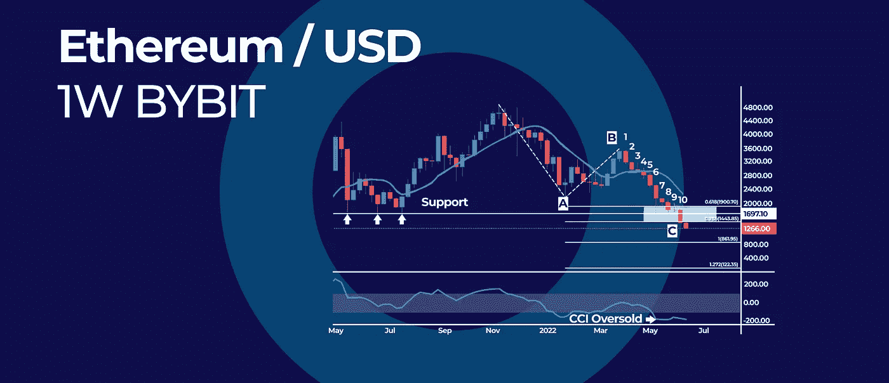

# 趋势跟踪的优点和缺点|以及本周的加密更新。

> 原文：<https://medium.com/coinmonks/advantages-and-disadvantages-of-trend-following-and-more-in-this-weeks-crypto-update-5e7c9e32cb9b?source=collection_archive---------22----------------------->

*   以太坊的 CCI 极端超卖后，最长的一周连跌
*   比特币什么时候能找到底部？查看这张长期图表
*   趋势跟踪的优点和缺点

## 以太坊的 CCI 极端超卖后，最长的一周连跌

以太坊(ETH)在连续 10 周抛售后，刚刚经历了历史上最长的周连跌。之前的连败纪录是在 2016 年 11 月以太坊连续 9 周抛售时创下的。

# CCI 过度推销阅读

商品通道指数(CCI)已跌至历史上最超卖的读数，这在历史上预示着加密货币价格的反转。此外，ETH 价格徘徊在 1672 美元的关键支撑位附近。

虽然我们有多个看涨信号，但我们还没有走出困境。短期来看，极度超卖的读数可能会减缓抛售压力。因此，围绕这一支撑区域的反弹有可能出现。

为了跟踪当前 10 周抛售的平均价格，我们可以绘制 10 周移动平均线，以评估上涨的潜在目标。目前，10 周移动平均线位于 2179 美元。

# ABC 校正

从技术角度来看，从 2021 年 11 月创下的历史高点的抛售正在作为美国广播公司的调整展开。ABC 模式的“反弹区”通常可以在 0.618 和 0.786 斐波纳奇延伸水平之间找到，从 A 波到 b 波的高点测量。

ETH 价格已经进入了 1，900 美元到 1，443 美元之间的“反弹区间”。

# 展望未来

由于我们仍处于熊市，触底过程可能比预期的要长。在广泛的 C 浪的情况下，ETH 价格可以下降到 1 斐波纳契扩展水平。

## 比特币什么时候能找到底部？查看这张长期图表

比特币(BTC)的下滑似乎看不到尽头，投资者情绪显示出极度恐惧。然而，隧道的尽头有一盏灯，为了理解比特币从这里走向何方，我们需要后退一步，看看更大的图景。

# 比特币日志长期图表

根据我们的深入分析，比特币的长期对数回归通道仍在运行。在最坏的情况下，BTC 价格可以重新测试通道的下限，这可以在 10，000 美元的心理数字附近找到。

短期来看，20，000 美元的支撑位将发挥重要作用，因为它位于跟踪 4 年减半周期的简单移动平均线 50 附近。此外，20，000 美元也代表了前一轮牛市的历史高点。

# 4 年减半周期

当前的抛售遵循 4 年减半周期。在第一次和第二次减半事件后，比特币创下了历史新高，随后两次都出现了 13 个月的熊市。隐性熊市通常平均持续 9.6 个月。

从时间上看，如果目前从 2021 年 11 月历史高点的抛售继续遵循 4 年减半周期，我们可以预计比特币将在 2022 年 12 月左右找到最终底部。

此外，RSI 振荡器已经跌破前两个谷底，达到 41.96 的最低月度读数，这表明我们仍然处于熊市。

# 展望未来

短期来看，我们可以预期抛售将在 20，000 美元支撑位附近放缓，但分析显示底部要到年底才会出现。

## 趋势跟踪的优点和缺点

在技术分析中，趋势跟踪是一种用来捕捉整体趋势的交易策略。在这个策略中，你本质上是一个追随者，而不是领导者。这意味着你跟随当前的市场方向。如果市场上涨，你会买入，如果市场下跌，你会卖出。

# 趋势跟踪优势

趋势跟踪策略有很多优点，包括:

*   最低交易成本
*   与其他方法不同，大规模获胜的可能性
*   随着趋势的加强，你可以在当前的头寸上增加更多，最大化你的利润潜力
*   你不需要有完美的出场和出场时间

# 趋势跟随劣势

趋势跟踪也有一些缺点，其中最常见的是:

*   相对于亏损交易的数量，盈利交易的数量较少(胜率)
*   你会错过趋势的开始，因为趋势跟踪要求趋势已经开始
*   驾驭这种趋势可能在精神上具有挑战性

趋势跟踪最突出的陷阱与人类的本性有关。我们都天生乐于看到利润，当利润消失在空气中时，我们往往会感到恐惧。作为趋势跟踪交易者，你应该坚持交易，希望获得更大的利润。

简而言之，跟风者需要学会止损，让赢家跑。否则，你可能会在大赚一笔之前放弃这个策略。

订阅我们的媒体每周博客和更新。
在[推特上关注我们](https://twitter.com/cryptohopper) | [脸书](https://www.facebook.com/cryptohopper)|[Reddit](https://www.reddit.com/r/CryptoHopper/)|[insta gram](https://www.instagram.com/cryptohopper/?hl=nl)

在 [Cryptohopper](https://www.cryptohopper.com/) 开始交易！

> 加入 Coinmonks [电报频道](https://t.me/coincodecap)和 [Youtube 频道](https://www.youtube.com/c/coinmonks/videos)了解加密交易和投资

# 另外，阅读

*   [Bookmap 点评](https://coincodecap.com/bookmap-review-2021-best-trading-software) | [美国 5 大最佳加密交易所](https://coincodecap.com/crypto-exchange-usa)
*   最佳加密[硬件钱包](/coinmonks/hardware-wallets-dfa1211730c6) | [Bitbns 评论](/coinmonks/bitbns-review-38256a07e161)
*   [新加坡十大最佳加密交易所](https://coincodecap.com/crypto-exchange-in-singapore) | [购买 AXS](https://coincodecap.com/buy-axs-token)
*   [红狗赌场评论](https://coincodecap.com/red-dog-casino-review) | [Swyftx 评论](https://coincodecap.com/swyftx-review) | [CoinGate 评论](https://coincodecap.com/coingate-review)
*   [投资印度的最佳密码](https://coincodecap.com/best-crypto-to-invest-in-india-in-2021)|[WazirX P2P](https://coincodecap.com/wazirx-p2p)|[Hi Dollar Review](https://coincodecap.com/hi-dollar-review)