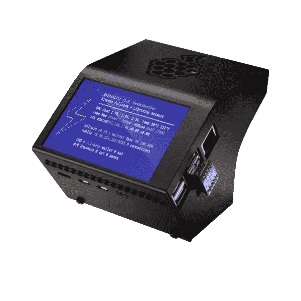

# 运行比特币闪电节点的冒险——第 1 部分:觉醒…

> 原文：<https://medium.com/coinmonks/adventures-in-running-a-bitcoin-lightning-node-part-1-the-awakening-61345585acc3?source=collection_archive---------0----------------------->

Photo by [Nick Owuor (astro.nic.visuals)](https://unsplash.com/@astro_nic25?utm_source=medium&utm_medium=referral) on [Unsplash](https://unsplash.com?utm_source=medium&utm_medium=referral)

R *运行比特币闪电节点..*。自 2019 年以来，我一直在考虑这个想法，但由于各种原因，我多次放弃了它。直到 2022 年 3 月底，那次雷击终于把我抓住了！

在下面的文章中(可能还会有更多)，我想分享学习的心得和经验。相信我，几周后我可以告诉你:**操作一个闪电节点是另一个全新的兔子洞！**

# 但是首先要做的是:一些免责声明

*   以上都是我的个人观点！
*   这绝对不是投资建议！做你自己的研究，只投资你能努力在闪电中失去的东西！这项技术仍处于早期和试验阶段。
*   我假设你对比特币和闪电网络有基本的了解。外面有大量的好材料。研究一下！
*   运行闪电节点有许多不同的目标，根据不同的目标，某些方面可能比其他方面更有趣。阅读时要牢记这一点。

# 我决定摆弄闪电节点的五个理由？

1.  [闪电网络](https://en.wikipedia.org/wiki/Lightning_Network)作为在[比特币](https://en.wikipedia.org/wiki/Bitcoin)之上的第二层技术，从第一天起就让我着迷:提高可扩展性的潜力&隐私、支付渠道背后优雅的博弈论以及支付渠道网络的新兴效应。一个神奇的汤，一个数学，优化&支付书呆子渴望的所有成分！
2.  Rene Pickhardt 和 Stefan Richter 撰写的研究论文[最优可靠&闪电网络上的廉价支付流](https://arxiv.org/abs/2107.05322)向我展示了解决具有挑战性的网络流问题可以带来更可靠的支付，并激励我更好地理解闪电网络上的支付流。
3.  直到几周前，我对 lightning 背后的理论有了一个比较好的了解，并非常松散地跟踪了代码和实现中的实际实现。关注并参与 [lightning dev 邮件列表](https://lists.linuxfoundation.org/pipermail/lightning-dev/)上的讨论让我了解到，我在实践中几乎不了解 lightning。这需要改变！
4.  我是 Raspberry Pi 的超级粉丝，多年来一直在玩和操作它们，用于各种用例。在它上面运行一个闪电节点看起来非常合适！在网上商店的货架上有一个 [Raspiblitz](https://shop.fulmo.org/) ,只需点击几下鼠标，这实在是太诱人了…
5.  最后，当然…我也很好奇运行一个闪电节点是否可以盈利(至少在硬件成本、电力、学习和维护时间之后)。

# 好了，介绍够了…让我们来看看本质吧！

# 1.装置

事情比我想象的要顺利得多，只用了几个小时！是的，我已经有一些 Pis 和 Raspiblitz 的经验，设置是绝对容易的，特别是因为硬件已经准备好了，SDD 有一个预同步的区块链(否则计划几天/几周同步…)。

Raspiblitz v1.7.2 from FULMOShop

安装非常符合官方的 Raspiblitz 指南。对于说德语的人，我也强烈推荐以下两个 Raspiblitz 设置视频(第 1 部分和第 2 部分):

通常但重要的提醒:**确保安全存储 lightning wallet 的种子短语和管理您的 lightning node 和 Raspberry Pi 的密码！**

# 2.配置

配置相当简单，也就几个小时的事情。我花了一些时间来熟悉 Raspiblitz 菜单和可用选项。基本组件包括:

1.  比特币节点:不需要特定的配置，默认设置就可以了。
2.  lightning node:与 lightning 网络守护进程`lnd`一起运行绝对值得关注和配置。定义你的别名，也许重新定义你的节点的颜色，设置默认的费用设置等等都在文件`/mnt/hdd/lnd/lnd.conf`中完成
3.  Tor:如果你没有一个静态的 IP 地址，你的 lightning 节点是可以到达的，那么这非常方便。此外，对 OpSec 的总体建议也不错。没有做任何自定义设置，只是用默认值滚动。

Raspiblitz 附带了一组有用的工具，可以额外安装，值得探索，以后会变得必不可少:

1.  [ThunderHub](https://thunderhub.io/) :这个应用成为我最喜欢的管理和监控我的 lightning node 的工具。特别是用于观察信道状态、手动管理信道费用以及用于分析路由转发和获得的 sat。唯一恼人的事情:它只显示短频道 id，至少我还没有找到一种方法来显示完整的频道 id(下面需要另一个重新平衡工具)。
2.  [乘坐闪电](https://github.com/Ride-The-Lightning/RTL) (RTL):另一个用于管理和监控的有用应用，但与 ThunderHub 相比感觉更笨重。但是在那里你可以找到完整的频道 id。
3.  [Mempool](https://mempool.space/de/) :一个直接附加到你的比特币满节点的比特币浏览器！非常方便地观察新闪电通道的资金交易的链上交易费用，而不依赖于互联网上的外部来源。
4.  非常有用的命令行来管理 lnd 和重新平衡你的通道。对于打开与另一个节点的双资助通道也非常有用(尚未尝试)。
5.  当然，在你启动之前，**确保备份你的渠道**并确保你的流动资金部署到他们那里！Raspiblitz 的一个非常好的功能是，你可以[在 nextcloud 上激活自动加密的 LND StaticChannelBackup，](https://github.com/rootzoll/raspiblitz#lnd-staticchannelbackup-on-nextcloud)它将保护你的`channel.backup` of `lnd`，这是你的种子短语旁边需要的，以收回你的渠道资金。因为我有一个运行在另一个 Raspberry Pi 上的 nextcloud，所以这种配置是轻而易举的！

# 3.新生节点和第一个通道

所以，现在变得非常有趣了。我原本以为安装和配置将是最重要的，但我完全错了！一旦我完成了安装和配置设置，我意识到，我没有真正的线索，如何引导我的闪电节点，并把它带到我想要的目的:路由闪电支付！

现在我做了一件事后后悔的事情:我发现了`lnd`自动驾驶功能并激活了它**，而没有在`lnd.conf`内**正确检查它的相关配置参数。它立即采取行动，打开了几个大通道，分配了我可用的境外流动性的很大一部分。**所以，我建议你在摆弄它之前，先好好检查一下自动驾驶仪的配置！我打算以后再来看这个特性，但是现在我放弃了它。**

在那之后，我打开了一些我支持并想与之交易的个人和企业节点的渠道。然而，在那之后的 2-3 天没有发生任何事情，我意识到一个相当明显的教训，但其意义你只有在实践中才能体会到:**没有任何流入的流动性(或你通过它支付)，你的渠道上永远不会发生任何事情**！

好了，现在是时候对如何让闪电节点发挥作用进行更详细的研究了！

# 4.探索闪电宇宙的入站流动性以及如何互联

我的研究首先集中在如何建立通道上，但是我意识到有一整个宇宙的工具和方法在那里来构造混乱和定位你自己。我完全是空白的，被已经存在的东西吹走了:

1.  首先，我偶然发现了[Y ' all](https://yalls.org/network/)，你可以听到一些发生在闪电宇宙中的重要八卦信号。
2.  接下来，我遇到了[闪电终端](https://terminal.lightning.engineering/#/)，并用它作为宇宙中心的方位点，用什么样的度量来测量它，以及我的节点位于哪里(远在宇宙的外缘，没有任何分类)
3.  我用 [LnRouter](https://lnrouter.app/graph) 的图形渲染来观察网络
4.  并且了解到有很牛逼的工具可以获得对你或者其他节点的洞察: [Amboss Space](https://amboss.space) 和 [1ML](https://1ml.com/) 。
5.  是的:获得流入流动性的方法多种多样:

*   请你的闪电社区的人来连接
*   通过你的渠道用你的 sat 买点东西，把流出的转化成流入的流动性
*   打开到节点的信道，然后打开信道。
*   从各种渠道购买渠道和流入的流动性:LNBig、Yalls、Amboss Magma 等
*   与[闪电网络+](https://lightningnetwork.plus/) 和[火圈](https://satoshiradio.nl/ringoffire/)上的其他节点(三角形或更大的“环”，如 A->B->C->A)一起参与循环通道设置。我真的很喜欢这个想法，以获得入站流动性，并获得“翻倍”的容量。
*   与其他节点的双基金渠道(也是您的节点容量的“两倍”)

我尝试了上面的大部分方法，并用新收集的知识组合了建立有意义的联系的第一个策略:

1.  使用[闪电终端](https://terminal.lightning.engineering/#/)和 [Amboss 空间](https://amboss.space)来识别一个节点是否是好节点，是否是 sink/source/router 类型。
2.  使用 [LNnodeinsight](https://lnnodeinsight.com/) 及其信道模拟器来确定该节点是否适合您的节点。

# 5.保持平衡

同样，对我来说，关于路由、渠道平衡和费用收入的最重要的教训之一是(从字面上看，你的 sat 就像上面摆着的荷马的甜甜圈):

1.  你只能为即将离任的前锋赢得 sat！
2.  因此，对于外向远期交易，你需要在外向渠道中有足够的 sat 流动性
3.  进入渠道的同行方有足够的流动性。
4.  因此，为了以任何可能的方向进行支付，需要在渠道双方之间充分平衡流动性，例如 50:50。

现在，在第一个通道建立后给一些时间(耐心点！)，首先路由/转发最终会发生。当你在 ThunderHub 中得到你的第一个转发通知的惊人时刻！

但是最近，你需要制定一个策略来平衡你的渠道。当你对自己的渠道行为、活跃程度以及同行的收费策略有所了解时，像 [rebalance-lnd](https://github.com/C-Otto/rebalance-lnd) 这样的再平衡工具是一个很好的平衡渠道的方法，不需要付出什么，只需要回报自己(减去交易费)。

[Carsten Otto](https://c-otto.de/) (运营十大路由节点之一)开发了 [rebalance-lnd](https://github.com/C-Otto/rebalance-lnd) ，这是一个复杂的 Python 脚本，用于重新平衡闪电通道，同时也考虑了重新平衡的经济权衡。它允许您将一个具有高流出流动性的渠道 A 重新平衡到一个具有高流入流动性的渠道 B，并确保它仅在您可以预期未来净利润时执行重新平衡(这意味着 B 上的额外流出流动性在未来转发时赚取的金额大于 A 上减去的流出流动性减去重新平衡的交易费！).**小心:这是假设您在重新平衡的渠道上设定的费用是现实的，并且您将来不会改变它们，否则您的重新平衡也会给您带来一些损失。**

在学会手动使用重新平衡脚本之后，您可以通过定义一个`cron`作业来轻松地自动执行它。小心:有时重新平衡会尝试大量的潜在路径(在我的例子中多达 200 个),这需要一些时间。所以，应用脚本自动化要小心，比如一天不要超过一次！

# 6.收费什么？

对于您的渠道，您可以收取以下费用:

1.  您可以设定交易的基本费用，与远期交易的金额无关。通常的基本费用是 0-3 sat。
2.  您以 ppm 为单位设置比例费用，即百万分之一。通常是高达 1000ppm 的零费用。1000 ppm 意味着对于 100 万 satoshi 的交易金额，您将收取 1000 sats，即 0.1%。

您可以在 RTL 或 ThunderHub 中使用`lnd`手动设置费用。取决于你打算如何为你的频道收费，这是完全足够的。

然而，如果你想根据渠道平衡调整你的费用，像 [charge-lnd](https://github.com/accumulator/charge-lnd) 这样的工具是非常方便的，并且可以再次自动化。它允许您根据各种标准定义复杂的渠道费用政策。

一开始，我为每个渠道制定了一个非常简单的政策，根据渠道平衡按比例收费，当我对渠道行为有了更多了解后，我对特定渠道的策略进行了优化。

**警告:你的收费-lnd 和再平衡-lnd 策略需要一致，否则你会降低这些工具的有效性，破坏再平衡-lnd 的净利润特征！**

# 7.接受侧面挑战:永远不要用 UPS 断电！

当你运行一个路由节点时，你最好是 24/7 在线转发闪电支付！这意味着你的电源也应该如此。尤其是当你在一个树莓 Pi 上运行你的节点的时候，他不太喜欢电源中断。我过去在 Pis 上经历过 SD 卡故障，所以当“sat 上线”时，我决定玩 save 并让我的节点连接到某个[不间断电源](https://en.wikipedia.org/wiki/Uninterruptible_power_supply) (UPS)。

我完全可以推荐下面的视频(德语)，它会指导你完成所有必要的步骤:

# 8.还有耐心！！！

现在我试着练习耐心，让节点进化…相信我，这对我来说是另一个巨大的挑战！

# 结论

经过最初的几周，我可以得出以下结论:

1.  启动并运行 lightning node 很容易。我高估了那里的复杂性。
2.  让 lightning 节点自举来真正充当网络中的路由节点不应该被低估。定义您预期的潜在策略，研究成功路由节点的策略，并提前进行规划。调整您想要应用的工具并支持您的目标。
3.  闪电支付很快，但操作闪电节点需要大量的观察和耐心。
4.  不要排除在“爱好模式”下的实际盈利能力，就像我到目前为止所做的那样:在迄今为止的几周内，我完成了大约 3000 万次 sat，赚回了我的 20 个发起渠道的投资承诺费的大约 6%。鉴于目前渠道的平均年龄为 315.8 天，我很有信心我会赚回渠道加盟费，但真正的利润还没有出现。

希望你能从我的经历中得到一些启示。有问题就 Ping 我！

不够？？？然后直接看后续文章 [**运行比特币闪电节点的冒险——第二部分:成长……**](/coinmonks/adventures-in-running-a-bitcoin-lightning-node-part-2-growing-up-430c6efcd40)

> 加入 Coinmonks [电报频道](https://t.me/coincodecap)和 [Youtube 频道](https://www.youtube.com/c/coinmonks/videos)了解加密交易和投资

# 另外，阅读

*   [用信用卡购买密码的 10 个最佳地点](https://coincodecap.com/buy-crypto-with-credit-card)
*   [加拿大最佳加密交易机器人](https://coincodecap.com/5-best-crypto-trading-bots-in-canada) | [Bybit vs 币安](https://coincodecap.com/bybit-binance-moonxbt)
*   [阿联酋 5 大最佳加密交易所](https://coincodecap.com/best-crypto-exchanges-in-uae) | [SimpleSwap 评论](https://coincodecap.com/simpleswap-review)
*   购买 Dogecoin 的 7 种最佳方式
*   [最佳期货交易信号](https://coincodecap.com/futures-trading-signals) | [流动性交易所评论](https://coincodecap.com/liquid-exchange-review)
*   [用于 Huobi 的加密交易信号](https://coincodecap.com/huobi-crypto-trading-signals) | [Swapzone 审查](/coinmonks/swapzone-review-crypto-exchange-data-aggregator-e0ad78e55ed7)